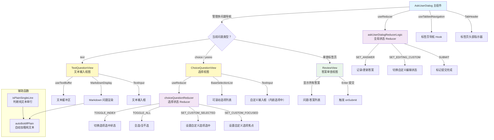

# AskUserDialog.tsx

## 概述

`AskUserDialog.tsx` 是 Gemini CLI 中最复杂的交互组件之一，实现了一个功能完整的多问题对话框系统。当 AI 需要向用户提问时（例如确认操作、选择选项、输入自定义内容等），该组件负责渲染问题、处理用户输入并收集答案。

该文件包含以下主要部分：

1. **`AskUserDialog`**（主组件）：顶层对话框控制器，管理多问题间的标签导航、全局状态和提交流程。
2. **`TextQuestionView`**：文本输入类型问题的视图，提供自由文本输入框。
3. **`ChoiceQuestionView`**：选择类型问题的视图，支持单选、多选、是/否问题，以及自定义输入选项。
4. **`ReviewView`**：多问题场景下的答案审查视图，用户可以在提交前检查所有答案。
5. **辅助函数和 Reducer**：`isPlainSingleLine`、`autoBoldIfPlain` 文本处理函数，以及 `askUserDialogReducerLogic`、`choiceQuestionReducer` 状态管理 reducer。

支持的问题类型包括：
- **text**：自由文本输入
- **choice**：从预定义选项中选择（单选/多选），支持自定义输入
- **yesno**：是/否二选一（自动转为 "Yes"/"No" 两个选项的 choice）

## 架构图（Mermaid）



## 核心组件

### 1. `AskUserDialog`（主组件，导出）

**类型**：`React.FC<AskUserDialogProps>`

**Props 接口定义**：

| 属性 | 类型 | 必需 | 默认值 | 说明 |
|------|------|------|--------|------|
| `questions` | `Question[]` | 是 | - | 要向用户提问的问题列表 |
| `onSubmit` | `(answers: { [questionIndex: string]: string }) => void` | 是 | - | 用户提交所有答案时的回调，参数为问题索引到答案字符串的映射 |
| `onCancel` | `() => void` | 是 | - | 用户取消对话框时的回调（Escape 或 Ctrl+C） |
| `onActiveTextInputChange` | `(active: boolean) => void` | 否 | `undefined` | 通知父组件文本输入是否处于活动状态，用于管理全局快捷键 |
| `width` | `number` | 是 | - | 对话框宽度 |
| `availableHeight` | `number` | 否 | `undefined` | 可用高度约束，用于可滚动内容 |
| `extraParts` | `string[]` | 否 | `undefined` | 额外的键盘快捷键提示（显示在底部） |

**核心逻辑**：

- 使用 `useReducer` + `askUserDialogReducerLogic` 管理全局状态（答案集合、编辑状态、提交状态）。
- 使用 `useTabbedNavigation` 实现多问题间的标签页导航。
- 当只有一个问题时，回答后直接提交；多个问题时，回答后自动切换到下一题。
- 多问题场景下，最后一个标签页是 "Review" 审查页。
- Escape 键取消整个对话框；Ctrl+C 在非自定义编辑状态时也取消。
- `yesno` 类型问题会被自动转换为包含 "Yes" 和 "No" 选项的 choice 类型。

### 2. `TextQuestionView`（内部组件）

**类型**：`React.FC<TextQuestionViewProps>`

渲染自由文本输入类型的问题。

**关键特性**：
- 使用 `useTextBuffer` 管理多行文本缓冲区，支持粘贴占位符扩展。
- 问题文本通过 `autoBoldIfPlain` 处理后，使用 `MarkdownDisplay` 渲染（支持 Markdown 格式）。
- 使用 `MaxSizedBox` 约束问题区域高度，避免超长问题挤压输入区域。
- Ctrl+C 在有文本时清空文本，无文本时冒泡给上层处理取消。
- 输入框前有绿色的 `> ` 提示符。
- 自动计算可用高度，考虑进度头部、输入框和底部提示的开销。

**Props 接口**：

| 属性 | 类型 | 说明 |
|------|------|------|
| `question` | `Question` | 当前问题数据 |
| `onAnswer` | `(answer: string) => void` | 提交答案回调 |
| `onSelectionChange` | `(answer: string) => void` | 输入变化时实时通知 |
| `onEditingCustomOption` | `(editing: boolean) => void` | 编辑状态变化通知 |
| `availableWidth` | `number` | 可用宽度 |
| `availableHeight` | `number` | 可用高度 |
| `initialAnswer` | `string` | 初始答案（回到已回答问题时） |
| `progressHeader` | `React.ReactNode` | 进度标签头部 |
| `keyboardHints` | `React.ReactNode` | 键盘操作提示 |

### 3. `ChoiceQuestionView`（内部组件）

**类型**：`React.FC<ChoiceQuestionViewProps>`

渲染选择类型问题（单选、多选、是/否）。这是最复杂的子组件。

**关键特性**：
- 使用独立的 `useReducer` + `choiceQuestionReducer` 管理选择状态。
- 使用 `BaseSelectionList` 渲染可滚动的选项列表。
- 支持自定义输入选项（"Other"），内嵌 `TextInput` 在选项列表中。
- 多选模式下额外显示 "All of the above" 和 "Done" 选项。
- 支持 "Type-to-Jump"：用户输入可打印字符时自动跳转到自定义输入框。
- 支持数字快速选择（按数字键选择对应选项）。
- `yesno` 类型不显示自定义选项。
- 选中状态用 checkbox（多选 `[x]`）或 checkmark（单选 `✓`）表示。
- 选项描述使用 `RenderInline` 渲染行内 Markdown。

**选项列表结构**（以多选为例）：

```
[x] 1. 选项 A
    选项 A 的描述
[ ] 2. 选项 B
    选项 B 的描述
[ ] 3. All of the above
[ ] 4. 自定义输入框...
    Done
```

**`choiceQuestionReducer` Action 类型**：

| Action | 说明 |
|--------|------|
| `TOGGLE_INDEX` | 切换指定选项的选中状态。单选模式下同时取消自定义选项 |
| `TOGGLE_ALL` | 全选或全不选所有预定义选项 |
| `SET_CUSTOM_SELECTED` | 设置自定义选项的选中状态。单选模式下同时取消其他选项 |
| `TOGGLE_CUSTOM_SELECTED` | 切换自定义选项选中状态（仅多选模式） |
| `SET_CUSTOM_FOCUSED` | 设置自定义选项是否获得焦点 |

### 4. `ReviewView`（内部组件）

**类型**：`React.FC<ReviewViewProps>`

多问题场景下的答案审查视图。

**渲染内容**：
- 标题 "Review your answers:"
- 未回答问题的警告（黄色，显示数量）
- 所有问题及其答案列表（问题标题 -> 答案，未回答显示灰色的 "(not answered)"）
- 底部 `DialogFooter`，显示 "Enter to submit" 和导航快捷键

### 5. 辅助函数

#### `isPlainSingleLine(text: string): boolean`

判断文本是否为不含 Markdown 标识的单行纯文本。检测的 Markdown 模式包括：
- 标题（`# `）
- 代码围栏（`` ``` ``）
- 无序列表（`- `、`* `、`+ `）
- 有序列表（`1. `）
- 水平分割线（`---`）
- 表格（`|`）
- 粗体（`**`、`__`）
- 斜体（单个 `*` 或 `_`）
- 行内代码（`` ` ``）
- 链接（`[text](url)`）
- 图片（`![`）

#### `autoBoldIfPlain(text: string): string`

如果文本是纯单行文本（通过 `isPlainSingleLine` 检测），自动用 `**` 包裹使其粗体显示。已含 Markdown 格式的文本原样返回。这确保简单的问题文本能以粗体突出显示。

### 6. 状态管理

#### `AskUserDialogState`（全局状态）

```typescript
interface AskUserDialogState {
  answers: { [key: string]: string };     // 问题索引 -> 答案
  isEditingCustomOption: boolean;          // 是否正在编辑自定义选项
  submitted: boolean;                      // 是否已提交
}
```

#### `askUserDialogReducerLogic`（全局 Reducer）

| Action | 行为 |
|--------|------|
| `SET_ANSWER` | 设置/更新指定问题的答案。空答案会从映射中删除。可选带 `submit: true` 同时标记提交 |
| `SET_EDITING_CUSTOM` | 更新自定义选项编辑状态 |
| `SUBMIT` | 标记为已提交 |

**不可变性保证**：当 `submitted` 为 `true` 后，所有 action 都被忽略，防止提交后的状态变化。

### 7. 常量

| 常量 | 值 | 说明 |
|------|-----|------|
| `DIALOG_PADDING` | `4` | 对话框内容的内边距，防止文本触碰边缘 |

## 依赖关系

### 内部依赖

| 依赖模块 | 导入内容 | 说明 |
|----------|----------|------|
| `../semantic-colors.js` | `theme` | 语义化颜色主题（`text.primary`、`text.secondary`、`status.success`、`status.warning` 等） |
| `./shared/BaseSelectionList.js` | `BaseSelectionList` | 通用可滚动选择列表组件 |
| `../hooks/useSelectionList.js` | `SelectionListItem`（类型） | 选择列表项类型定义 |
| `./shared/TabHeader.js` | `TabHeader`、`Tab`（类型） | 标签页头部导航组件和标签类型 |
| `../hooks/useKeypress.js` | `useKeypress`、`Key`（类型） | 键盘按键监听 Hook 和键值类型 |
| `../key/keyMatchers.js` | `Command` | 命令枚举（`RETURN`、`ESCAPE`、`QUIT`、`DIALOG_NEXT`、`DIALOG_PREV` 等） |
| `./shared/TextInput.js` | `TextInput` | 文本输入框组件 |
| `../key/keybindingUtils.js` | `formatCommand` | 格式化命令为可读快捷键字符串 |
| `./shared/text-buffer.js` | `useTextBuffer`、`expandPastePlaceholders` | 文本缓冲区 Hook 和粘贴占位符扩展函数 |
| `../utils/textUtils.js` | `getCachedStringWidth` | 缓存的字符串宽度计算（处理全角字符等） |
| `../hooks/useTabbedNavigation.js` | `useTabbedNavigation` | 标签页导航 Hook |
| `./shared/DialogFooter.js` | `DialogFooter` | 对话框底部键盘操作提示组件 |
| `../utils/MarkdownDisplay.js` | `MarkdownDisplay` | Markdown 文本渲染组件 |
| `../utils/InlineMarkdownRenderer.js` | `RenderInline` | 行内 Markdown 渲染组件 |
| `./shared/MaxSizedBox.js` | `MaxSizedBox` | 最大尺寸约束容器组件 |
| `../contexts/UIStateContext.js` | `UIStateContext` | UI 状态上下文（获取终端高度等） |
| `../hooks/useAlternateBuffer.js` | `useAlternateBuffer` | 备用缓冲区检测 Hook |
| `../hooks/useKeyMatchers.js` | `useKeyMatchers` | 键盘匹配器 Hook |

### 外部依赖

| 依赖包 | 导入内容 | 说明 |
|--------|----------|------|
| `react` | `React`（类型）、`useCallback`、`useMemo`、`useRef`、`useEffect`、`useReducer`、`useContext` | React 核心 Hooks |
| `ink` | `Box`、`Text` | Ink 框架的布局和文本组件 |
| `@google/gemini-cli-core` | `checkExhaustive`、`Question`（类型） | 穷举检查工具函数和问题类型定义 |

## 关键实现细节

1. **Reducer 驱动的状态管理**：该组件使用了两层 `useReducer`——外层的 `askUserDialogReducerLogic` 管理跨问题的全局状态（答案集合、提交状态），内层的 `choiceQuestionReducer` 管理单个选择题的选中状态。这种分层设计保证了状态变更的可预测性和可调试性。

2. **提交后状态冻结**：`askUserDialogReducerLogic` 在 `submitted` 为 `true` 后拒绝所有 action，这是一个重要的安全机制，防止在异步回调到达之前出现竞态状态变更。

3. **单选与多选的统一处理**：`choiceQuestionReducer` 通过 `multiSelect` 参数在同一套 action 中区分单选和多选行为。单选时选择一个选项会自动取消其他选项和自定义选项；多选时各选项独立切换。

4. **Type-to-Jump 机制**：在 `ChoiceQuestionView` 中，当用户在非自定义选项上输入可打印字符时，会自动跳转到自定义输入框并开始输入。这提供了一种无需手动导航到 "Other" 选项就能开始输入自定义内容的快捷方式。同时排除了数字键（用于快速选择编号选项）和导航键。

5. **自动加粗纯文本问题**：`autoBoldIfPlain` 函数对不含 Markdown 格式的简单问题文本自动加粗，确保问题标题在视觉上突出。包含 Markdown 的复杂问题则保持原始格式，避免双重加粗。

6. **粘贴占位符系统**：通过 `useTextBuffer` 和 `expandPastePlaceholders`，组件支持在文本缓冲区中使用占位符代替大量粘贴文本，在最终提交时才展开为真实内容。这优化了编辑大量粘贴文本时的性能。

7. **响应式高度管理**：组件精确计算各部分的固定开销（进度头、输入框、底部提示等），从可用高度中扣除后分配给问题显示区域和选项列表区域。在备用缓冲区（alternate buffer）模式下跳过部分高度约束，因为备用缓冲区通常拥有全屏高度。

8. **yesno 类型的统一转换**：`yesno` 类型问题被统一转换为包含 "Yes" 和 "No" 两个选项的 choice 类型，且不显示自定义输入选项。这使得所有问题类型都能复用同一套选择渲染逻辑。

9. **`checkExhaustive` 穷举检查**：两个 reducer 的 `default` 分支都调用了 `checkExhaustive(action)`，这是 TypeScript 的穷举性检查模式——如果新增了 action 类型但未在 switch 中处理，编译时会报错。

10. **Ctrl+C 的双重语义**：Ctrl+C 在不同上下文有不同行为——在自定义输入框中有文本时清空文本，在没有文本或非编辑状态时触发取消对话框。`handleCancel` 中的 `isEditingCustomOption` 检查确保编辑状态下 Ctrl+C 不会意外取消整个对话框。

11. **多问题自动导航**：单问题直接提交；多问题回答后自动跳转到下一题（`goToNextTab`），最终跳转到审查页。用户可以通过 Tab 或箭头键在问题间自由切换回顾和修改。

12. **无障碍访问**：外层 `Box` 设置了 `aria-label`，包含当前问题的编号和内容，支持屏幕阅读器识别。
