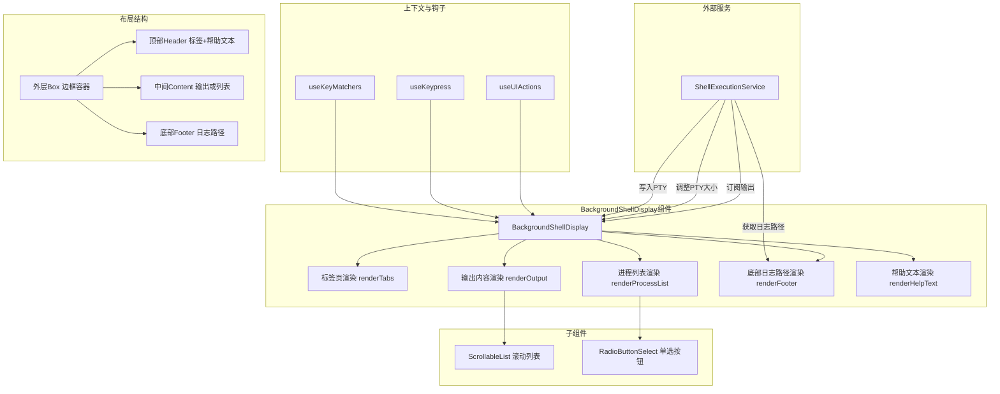

# BackgroundShellDisplay.tsx

## 概述

`BackgroundShellDisplay` 是一个 React (Ink) 组件，用于在 CLI 终端界面中展示和管理后台 Shell 进程。它提供了一个带有标签页（Tabs）、输出内容滚动显示、进程列表选择和底部日志路径信息的完整 Shell 面板。用户可以在多个后台 Shell 之间切换、查看实时输出、终止进程等。

该组件是 Gemini CLI 后台任务系统的核心 UI 部分，支持：
- 多个后台 Shell 进程的标签页式切换
- 实时订阅 Shell 输出（支持纯文本和 ANSI 富文本）
- PTY（伪终端）大小自适应
- 键盘快捷键操作（关闭、终止、列表切换、输入转发）
- 进程列表的 RadioButton 选择界面

## 架构图（Mermaid）



## 核心组件

### 1. Props 接口 `BackgroundShellDisplayProps`

| 属性 | 类型 | 说明 |
|------|------|------|
| `shells` | `Map<number, BackgroundShell>` | 所有后台 Shell 进程的映射，key 为 PID |
| `activePid` | `number` | 当前激活（选中）的 Shell PID |
| `width` | `number` | 组件可用宽度 |
| `height` | `number` | 组件可用高度 |
| `isFocused` | `boolean` | 组件是否获得焦点 |
| `isListOpenProp` | `boolean` | 进程列表是否展开 |

### 2. 布局常量

| 常量 | 值 | 说明 |
|------|---|------|
| `CONTENT_PADDING_X` | 1 | 内容水平内边距 |
| `BORDER_WIDTH` | 2 | 左右边框总宽度 |
| `MAIN_BORDER_HEIGHT` | 2 | 上下边框总高度 |
| `HEADER_HEIGHT` | 1 | 头部标签栏高度 |
| `FOOTER_HEIGHT` | 1 | 底部日志路径栏高度 |
| `TOTAL_OVERHEAD_HEIGHT` | 4 | 所有非内容区的高度之和 |
| `PROCESS_LIST_HEADER_HEIGHT` | 3 | 进程列表头部占用高度 |
| `TAB_DISPLAY_HORIZONTAL_PADDING` | 4 | 标签显示区水平内边距 |
| `LOG_PATH_OVERHEAD` | 7 | 日志路径前缀 "Log: " + paddingX 占用宽度 |

### 3. 辅助函数 `formatShellCommandForDisplay`

将 Shell 命令格式化为单行显示，如果超出最大宽度则截断并添加 `...` 后缀。仅取命令的第一行。

### 4. 状态管理

| 状态 | 类型 | 说明 |
|------|------|------|
| `output` | `string \| AnsiOutput` | 当前活动 Shell 的输出内容 |
| `highlightedPid` | `number \| null` | 进程列表中当前高亮的 PID |
| `outputRef` | `ScrollableListRef` | 滚动列表的引用 |
| `subscribedRef` | `boolean` | 是否已完成初始订阅标记 |

### 5. 核心 Effects

#### PTY 大小调整 Effect
当 `activePid`、`width`、`height` 变化时，自动计算可用的 PTY 尺寸并调用 `ShellExecutionService.resizePty()` 进行调整。PTY 宽度 = 总宽度 - 边框 - 内边距，PTY 高度 = 总高度 - 非内容区高度。

#### 输出订阅 Effect
- 当 `activePid` 变化时，先设置初始输出（从 `shells` Map 获取）
- 通过 `ShellExecutionService.subscribe()` 订阅实时更新
- 区分字符串输出（`child_process` 模式）和 `AnsiOutput`（PTY 模式）
- 对于字符串模式：首次同步更新替换全部内容，后续更新追加 delta
- 对于 PTY 模式：每次都是完整的 `AnsiOutput` 替换
- 组件卸载或 PID 变化时取消订阅

#### 高亮同步 Effect
当进程列表打开时，将 `highlightedPid` 同步为 `activePid`。

### 6. 键盘事件处理

使用 `useKeypress` 钩子处理键盘输入，分两种模式：

#### 列表模式（`isListOpenProp = true`）
| 按键命令 | 行为 |
|----------|------|
| `BACKGROUND_SHELL_ESCAPE` | 关闭进程列表 |
| `KILL_BACKGROUND_SHELL` | 终止高亮的进程 |
| `TOGGLE_BACKGROUND_SHELL_LIST` | 选中高亮进程并关闭列表 |

#### 输出模式（`isListOpenProp = false`）
| 按键命令 | 行为 |
|----------|------|
| `TOGGLE_BACKGROUND_SHELL` | 透传（不处理） |
| `KILL_BACKGROUND_SHELL` | 终止当前活动进程 |
| `TOGGLE_BACKGROUND_SHELL_LIST` | 打开进程列表 |
| `BACKGROUND_SHELL_SELECT` | 向 PTY 写入回车 `\r` |
| `DELETE_CHAR_LEFT` | 向 PTY 写入退格 `\b` |
| 其他按键 | 将 `key.sequence` 透传到 PTY |

### 7. 渲染方法

#### `renderHelpText()`
渲染底部帮助文本，格式为 `Close (快捷键) | Kill (快捷键) | List (快捷键)`。快捷键部分使用主题色高亮。

#### `renderTabs()`
- 从 `shells` 中筛选 `status === 'running'` 的进程
- 动态计算每个标签的可用宽度（总宽度减去帮助文本、PID 信息等）
- 如果标签超出可用宽度，显示溢出提示 `... (快捷键)`
- 当前激活的标签使用粗体和主色调高亮

#### `renderProcessList()`
- 将所有 Shell 进程转换为 `RadioSelectItem` 列表
- 显示命令、PID，已退出的进程额外显示退出码（成功=绿色，失败=红色）
- 使用 `RadioButtonSelect` 组件实现选择交互
- 列表最大显示行数 = 总高度 - 头部 - 进程列表头部

#### `renderOutput()`
- 支持两种输出格式：纯字符串（按 `\n` 分割）和 `AnsiOutput`（带 ANSI Token 的富文本）
- 使用 `ScrollableList` 实现虚拟化滚动
- ANSI Token 支持前景色、背景色、反转、暗淡、粗体、斜体、下划线等样式
- 初始滚动位置设为末尾（`SCROLL_TO_ITEM_END`）

#### `renderFooter()`
- 显示当前（或高亮）进程的日志文件路径
- 路径经过 `tildeifyPath`（用 `~` 替代 home 目录）和 `shortenPath`（截断过长路径）处理

### 8. 整体布局

```
+--[边框]------------------------------------------+
| [标签1] [标签2] ... (PID: xxx) | Close | Kill | List |  <- Header
+--------------------------------------------------+
|                                                    |
|   Shell 输出内容（滚动）/ 进程选择列表              |  <- Content
|                                                    |
+--------------------------------------------------+
| Log: ~/.gemini/logs/xxx.log                        |  <- Footer
+--------------------------------------------------+
```

- 外层 `Box`：单线边框，聚焦时边框变色
- Header 行：左侧标签页 + PID 信息，右侧帮助文本
- Content 区：根据 `isListOpenProp` 切换显示输出或进程列表
- Footer 行：日志文件路径

## 依赖关系

### 内部依赖

| 模块 | 导入内容 | 用途 |
|------|---------|------|
| `../contexts/UIActionsContext.js` | `useUIActions` | 获取 UI 操作方法（关闭Shell、设置活动PID、切换列表） |
| `../semantic-colors.js` | `theme` | 语义化颜色主题 |
| `../utils/textUtils.js` | `cpLen`, `cpSlice`, `getCachedStringWidth` | 码点级别的字符串长度计算和截断，带缓存的字符宽度计算 |
| `../hooks/shellCommandProcessor.js` | `BackgroundShell`（类型） | 后台 Shell 数据结构类型 |
| `../key/keyMatchers.js` | `Command` | 键盘命令枚举 |
| `../hooks/useKeypress.js` | `useKeypress` | 键盘事件监听钩子 |
| `../key/keybindingUtils.js` | `formatCommand` | 将命令枚举格式化为可读快捷键字符串 |
| `./shared/ScrollableList.js` | `ScrollableList`, `ScrollableListRef` | 可滚动虚拟化列表组件 |
| `./shared/VirtualizedList.js` | `SCROLL_TO_ITEM_END` | 滚动到列表末尾的常量 |
| `./shared/RadioButtonSelect.js` | `RadioButtonSelect`, `RadioSelectItem` | 单选按钮列表选择组件 |
| `../hooks/useKeyMatchers.js` | `useKeyMatchers` | 获取键盘命令匹配器 |

### 外部依赖

| 包 | 导入内容 | 用途 |
|---|---------|------|
| `ink` | `Box`, `Text` | Ink 终端 UI 框架的布局和文本组件 |
| `react` | `useEffect`, `useState`, `useRef` | React 核心钩子 |
| `@google/gemini-cli-core` | `ShellExecutionService`, `shortenPath`, `tildeifyPath`, `AnsiOutput`, `AnsiLine`, `AnsiToken` | 核心 Shell 执行服务和路径工具 |

## 关键实现细节

1. **PTY 与 child_process 双模式支持**：组件通过判断 `event.chunk` 的类型（`string` vs `AnsiOutput`）来区分两种 Shell 执行模式。child_process 模式下输出为纯文本增量追加；PTY 模式下每次都是完整的 ANSI 解析结果替换。

2. **初始输出与增量更新的区分**：使用 `subscribedRef` 标记来区分首次同步回调（包含完整历史）和后续的增量更新。这避免了在订阅时丢失或重复输出。

3. **自适应 PTY 尺寸**：每当组件尺寸或活动 PID 变化时，会重新计算并通知 Shell 服务调整 PTY 的列数和行数，确保输出在终端中正确换行。

4. **标签页溢出处理**：`renderTabs` 动态计算每个标签的可用空间，当标签总宽度超出可用区域时截断并显示溢出提示。即使只有一个 Shell，也保证至少显示它（可能被截断）。

5. **键盘输入透传**：在输出模式下，除了几个保留的快捷键外，所有键盘输入（包括 Enter、Backspace 和其他字符序列）都直接写入到 PTY，实现真正的交互式 Shell 体验。

6. **虚拟化滚动**：使用 `ScrollableList` 组件实现输出的虚拟化渲染，默认滚动到末尾，支持大量输出行而不影响性能。

7. **ANSI 富文本渲染**：对于 PTY 输出，每一行由多个 `AnsiToken` 组成，每个 token 携带独立的前景色、背景色、粗体、斜体、下划线、反转、暗淡等样式属性，通过 Ink 的 `Text` 组件逐一渲染。

8. **进程列表的自定义渲染**：`RadioButtonSelect` 使用自定义 `renderItem` 函数，对已退出的进程根据退出码（0=成功绿色，非0=失败红色）进行差异化着色。

9. **路径显示优化**：日志路径先通过 `tildeifyPath` 将 home 目录替换为 `~`，再通过 `shortenPath` 在可用宽度内截断，确保不溢出。
