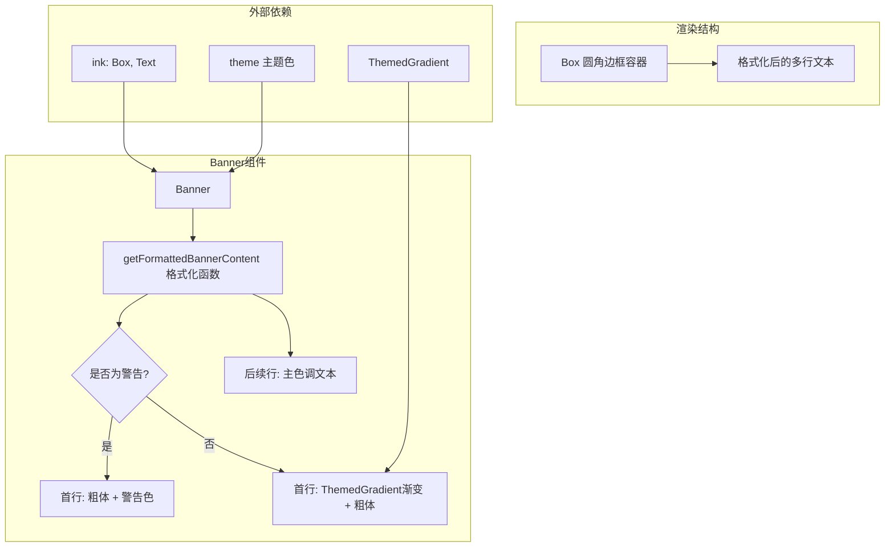

# Banner.tsx

## 概述

`Banner` 是一个 React (Ink) 组件，用于在 CLI 终端界面中渲染带边框的横幅通知。它支持两种模式：普通信息横幅（首行使用渐变主题色）和警告横幅（首行使用警告色）。横幅文本支持多行显示，首行与后续行使用不同的颜色样式。

该文件同时导出了辅助函数 `getFormattedBannerContent`，用于将原始文本解析为带样式的 React 节点数组，可在其他场景复用。

## 架构图（Mermaid）



## 核心组件

### 1. `getFormattedBannerContent` 函数

**签名：**
```typescript
function getFormattedBannerContent(
  rawText: string,
  isWarning: boolean,
  subsequentLineColor: string,
): ReactNode
```

**功能：** 将原始横幅文本转换为带样式的 React 节点数组。

**处理逻辑：**
1. 将文本中的字面 `\n` 转义序列替换为真正的换行符
2. 按换行符分割为多行
3. **首行**（`index === 0`）：
   - 警告模式：使用 `theme.status.warning` 颜色 + 粗体
   - 普通模式：使用 `ThemedGradient` 渐变效果 + 粗体
4. **后续行**（`index > 0`）：使用传入的 `subsequentLineColor` 颜色

**参数说明：**

| 参数 | 类型 | 说明 |
|------|------|------|
| `rawText` | `string` | 原始横幅文本，可包含 `\n` 表示换行 |
| `isWarning` | `boolean` | 是否为警告样式 |
| `subsequentLineColor` | `string` | 非首行文本的颜色 |

### 2. `BannerProps` 接口

| 属性 | 类型 | 说明 |
|------|------|------|
| `bannerText` | `string` | 横幅显示的文本内容 |
| `isWarning` | `boolean` | 是否以警告样式展示 |
| `width` | `number` | 横幅的宽度 |

### 3. `Banner` 组件

**功能：** 渲染带圆角边框的横幅 UI。

**渲染结构：**
```
╭─────────────────────────────╮
│ 首行文本（渐变/警告色 + 粗体）  │
│ 后续行文本（主色调）            │
│ ...                           │
╰─────────────────────────────╯
```

**布局细节：**
- 使用 Ink `Box` 组件，`borderStyle="round"`（圆角边框）
- 边框颜色：警告模式用 `theme.status.warning`，普通模式用 `theme.border.default`
- 水平内边距：左右各 1
- 布局方向：纵向（`flexDirection="column"`）
- 宽度由外部 `width` prop 控制

## 依赖关系

### 内部依赖

| 模块 | 导入内容 | 用途 |
|------|---------|------|
| `./ThemedGradient.js` | `ThemedGradient` | 提供渐变色效果的包装组件，用于普通横幅首行 |
| `../semantic-colors.js` | `theme` | 语义化颜色主题对象，提供各种状态和文本颜色 |

### 外部依赖

| 包 | 导入内容 | 用途 |
|---|---------|------|
| `ink` | `Box`, `Text` | Ink 终端 UI 框架的布局容器和文本渲染组件 |
| `react` | `ReactNode`（类型） | React 节点类型定义 |

## 关键实现细节

1. **转义序列处理**：`getFormattedBannerContent` 函数首先将字符串中的字面 `\\n`（两个字符）替换为真正的换行符 `\n`。这允许后端或配置文件以字面字符串形式传入多行文本。

2. **首行差异化渲染**：首行作为标题，使用更醒目的样式。普通模式下使用 `ThemedGradient` 组件产生渐变色彩效果，而警告模式下使用纯色警告色。这种视觉层级帮助用户快速识别信息的重要性。

3. **函数与组件分离导出**：`getFormattedBannerContent` 作为独立函数导出，不依赖 `Box` 容器，可以在不需要边框的场景下单独使用格式化后的文本内容。

4. **圆角边框样式**：使用 `borderStyle="round"` 而非默认的直角边框，提供更柔和的视觉效果，与 CLI 的整体设计语言保持一致。

5. **响应式宽度**：组件宽度完全由外部传入的 `width` prop 控制，不进行内部计算，这使得横幅可以灵活适配不同的终端宽度和布局需求。
