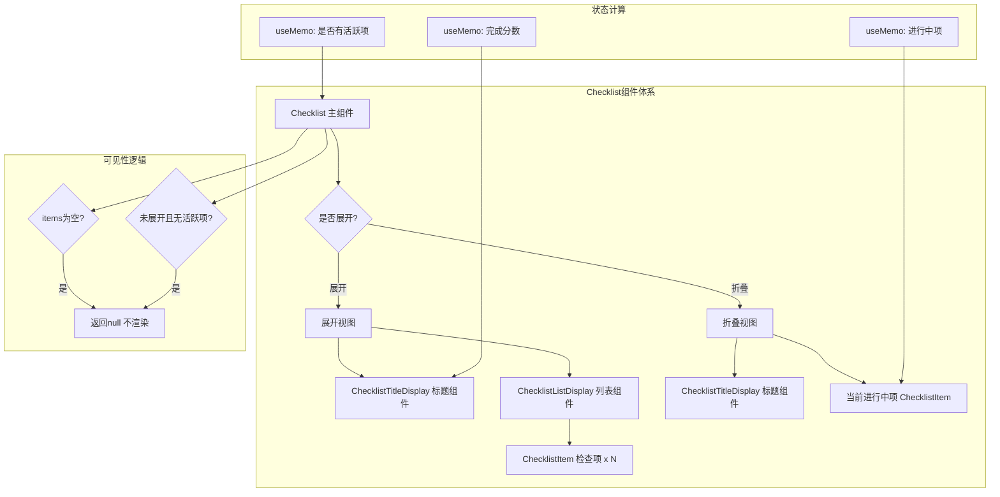

# Checklist.tsx

## 概述

`Checklist` 是一个 React (Ink) 组件，用于在 CLI 终端界面中渲染一个待办事项/检查清单。它支持展开和折叠两种视图模式：展开时显示标题和所有检查项的完整列表，折叠时仅显示标题摘要和当前正在进行的项。

该组件主要用于展示 Gemini CLI 在执行多步骤任务时的进度状态，如工具调用链、验证步骤等。每个检查项具有 `pending`（待处理）、`in_progress`（进行中）、`completed`（已完成）、`cancelled`（已取消）四种状态。

## 架构图（Mermaid）



## 核心组件

### 1. `ChecklistProps` 接口

| 属性 | 类型 | 必填 | 说明 |
|------|------|------|------|
| `title` | `string` | 是 | 清单标题文本 |
| `items` | `ChecklistItemData[]` | 是 | 检查项数据数组 |
| `isExpanded` | `boolean` | 是 | 是否展开显示完整列表 |
| `toggleHint` | `string` | 否 | 展开/折叠操作的提示文本（如快捷键） |

### 2. `ChecklistTitleDisplay` 内部组件

一个仅用于标题行渲染的内部函数组件。

**Props：**
- `title: string` - 标题文本
- `items: ChecklistItemData[]` - 检查项数据，用于计算完成分数
- `toggleHint?: string` - 可选的操作提示

**功能：**
- 使用 `useMemo` 计算完成分数：遍历所有项，排除 `cancelled` 状态，统计 `completed` 数量，生成格式为 `"X/Y completed"` 的摘要
- 渲染结构：标题（粗体、主色调）+ 分数和提示（次要色调），水平排列，列间距为 2
- 带有 `aria-label` 无障碍标签

**渲染效果示例：**
```
任务清单  3/5 completed (按 T 切换)
```

### 3. `ChecklistListDisplay` 内部组件

一个仅用于列表渲染的内部函数组件。

**Props：**
- `items: ChecklistItemData[]` - 检查项数据

**功能：**
- 将每个检查项映射为 `ChecklistItem` 组件进行渲染
- 使用 `index-label` 作为 key
- 纵向排列（`flexDirection="column"`）
- 带有 `aria-role="list"` 和每项 `role="listitem"` 的无障碍属性

### 4. `Checklist` 主组件

**核心逻辑：**

1. **inProgress 计算**（`useMemo`）：从 items 中找到第一个 `status === 'in_progress'` 的项目
2. **hasActiveItems 计算**（`useMemo`）：判断是否存在 `pending` 或 `in_progress` 状态的项目
3. **可见性判断**：
   - 如果 `items` 为空，返回 `null`
   - 如果未展开且没有活跃项（全部已完成或已取消），返回 `null`

**两种视图模式：**

#### 展开模式（`isExpanded = true`）
```
───────────────────────
 标题  X/Y completed (提示)

 [ ] 项目1
 [*] 项目2（进行中）
 [v] 项目3（已完成）
 ...
```
- 纵向布局，标题与列表之间有行间距 1
- 显示标题 + 完整列表

#### 折叠模式（`isExpanded = false`）
```
───────────────────────
 标题  X/Y completed (提示)  [*] 当前进行中项...
```
- 横向布局，标题固定不缩放，进行中项可缩放截断
- 仅显示标题 + 当前 `in_progress` 项（如果有）
- `inProgress` 项使用 `wrap="truncate"` 防止溢出

**外层容器样式：**
- 仅有顶部单线边框（`borderStyle="single"`，底/左/右边框关闭）
- 边框颜色使用 `theme.border.default`
- 左右内边距各 1

## 依赖关系

### 内部依赖

| 模块 | 导入内容 | 用途 |
|------|---------|------|
| `../semantic-colors.js` | `theme` | 语义化颜色主题对象 |
| `./ChecklistItem.js` | `ChecklistItem`, `ChecklistItemData`（类型） | 单个检查项的渲染组件和数据类型 |

### 外部依赖

| 包 | 导入内容 | 用途 |
|---|---------|------|
| `react` | `useMemo`, `React`（类型） | 性能优化钩子和类型引用 |
| `ink` | `Box`, `Text` | Ink 终端 UI 框架的布局和文本组件 |

## 关键实现细节

1. **智能可见性控制**：组件不仅在无数据时隐藏，还在折叠模式下所有任务都已完成/取消时自动隐藏。这确保了完成的清单不会占用宝贵的终端空间，同时进行中的任务始终可见。

2. **折叠模式的空间优化**：在折叠模式下，标题区域使用 `flexShrink={0} flexGrow={0}` 固定不变，而当前进行中项使用 `flexShrink={1} flexGrow={1}` 占据剩余空间并支持截断，实现了紧凑而信息丰富的单行显示。

3. **完成分数的精确计算**：分数计算排除了 `cancelled` 状态的项目，只统计非取消项作为总数、已完成项作为分子。这样 "3/5 completed" 的含义是"5个有效任务中完成了3个"，不计入被取消的任务。

4. **useMemo 性能优化**：完成分数、当前进行中项、是否有活跃项三个计算均使用 `useMemo` 缓存，依赖 `items` 数组引用。这避免了每次渲染时重复遍历数组。

5. **仅顶部边框设计**：组件只使用顶部单线边框作为视觉分隔线，而非完整的边框包围。这种设计使清单在垂直排列时显得更加紧凑，与 CLI 的整体界面风格一致。

6. **无障碍支持**：标题使用 `aria-label`，列表使用 `aria-role="list"`，列表项使用 `role="listitem"`，确保屏幕阅读器等辅助工具能正确解读组件结构。
