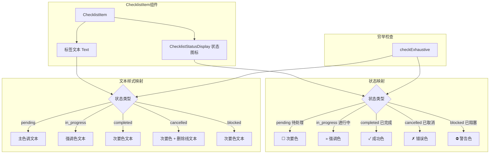

# ChecklistItem.tsx

## 概述

`ChecklistItem` 是一个 React (Ink) 组件，用于渲染单个检查清单项。每个检查项由一个状态图标和标签文本组成，支持五种状态：待处理（pending）、进行中（in_progress）、已完成（completed）、已取消（cancelled）、已阻塞（blocked），每种状态有不同的图标和颜色样式。

该文件同时导出了类型定义 `ChecklistStatus` 和 `ChecklistItemData`，作为检查清单系统的基础数据类型，被 `Checklist` 等上层组件引用。

## 架构图（Mermaid）



## 核心组件

### 1. `ChecklistStatus` 类型

```typescript
type ChecklistStatus = 'pending' | 'in_progress' | 'completed' | 'cancelled' | 'blocked';
```

定义了检查项的五种可能状态：

| 状态 | 含义 | 图标 | 图标颜色 | 文本颜色 | 特殊样式 |
|------|------|------|---------|---------|---------|
| `pending` | 待处理 | ☐ | `theme.text.secondary` | `theme.text.primary` | 无 |
| `in_progress` | 进行中 | » | `theme.text.accent` | `theme.text.accent` | 无 |
| `completed` | 已完成 | ✓ | `theme.status.success` | `theme.text.secondary` | 无 |
| `cancelled` | 已取消 | ✗ | `theme.status.error` | `theme.text.secondary` | 删除线 |
| `blocked` | 已阻塞 | ⛔ | `theme.status.warning` | `theme.text.secondary` | 无 |

### 2. `ChecklistItemData` 接口

| 属性 | 类型 | 说明 |
|------|------|------|
| `status` | `ChecklistStatus` | 检查项当前状态 |
| `label` | `string` | 检查项显示文本 |

### 3. `ChecklistStatusDisplay` 内部组件

一个纯展示组件，根据状态值渲染对应的 Unicode 符号图标。

**Props：**
- `status: ChecklistStatus` - 当前状态

**每种状态的渲染：**
- `completed` → 绿色 ✓（成功色），aria-label: "Completed"
- `in_progress` → 蓝色 »（强调色），aria-label: "In Progress"
- `pending` → 灰色 ☐（次要色），aria-label: "Pending"
- `cancelled` → 红色 ✗（错误色），aria-label: "Cancelled"
- `blocked` → 黄色 ⛔（警告色），aria-label: "Blocked"

使用 `checkExhaustive(status)` 确保 switch 语句覆盖所有可能的状态值。

### 4. `ChecklistItemProps` 接口

| 属性 | 类型 | 必填 | 说明 |
|------|------|------|------|
| `item` | `ChecklistItemData` | 是 | 检查项数据 |
| `wrap` | `'truncate'` | 否 | 文本溢出时截断模式 |
| `role` | `'listitem'` | 否 | 无障碍角色 |

### 5. `ChecklistItem` 主组件

**渲染结构：**
```
[状态图标] 标签文本
```

**文本颜色逻辑（通过 IIFE 计算）：**
- `in_progress` → `theme.text.accent`（强调色，最醒目）
- `pending` → `theme.text.primary`（主色调，正常可见）
- `completed` / `cancelled` / `blocked` → `theme.text.secondary`（次要色，淡化显示）

**删除线逻辑：**
- 仅 `cancelled` 状态的标签文本添加删除线样式（`strikethrough={true}`）

**布局细节：**
- 水平排列（`flexDirection="row"`），列间距 1
- 标签文本区域设置 `flexShrink={1}`，允许在空间不足时缩小
- 可选传入 `wrap="truncate"` 控制文本溢出截断
- 可选传入 `role="listitem"` 作为无障碍角色

## 依赖关系

### 内部依赖

| 模块 | 导入内容 | 用途 |
|------|---------|------|
| `../semantic-colors.js` | `theme` | 语义化颜色主题对象，提供状态色和文本色 |

### 外部依赖

| 包 | 导入内容 | 用途 |
|---|---------|------|
| `react` | `React`（类型） | React 组件类型定义 |
| `ink` | `Box`, `Text` | Ink 终端 UI 框架的布局和文本组件 |
| `@google/gemini-cli-core` | `checkExhaustive` | TypeScript 穷举检查工具函数 |

## 关键实现细节

1. **穷举类型安全**：两个 switch 语句（`ChecklistStatusDisplay` 和 `ChecklistItem` 的文本颜色）都在 `default` 分支调用 `checkExhaustive(status)`。这是 TypeScript 的穷举检查模式——如果未来向 `ChecklistStatus` 联合类型添加新状态但忘记处理，编译器会报错。这确保了所有状态都被显式处理。

2. **IIFE 模式计算颜色**：`textColor` 使用了立即调用函数表达式 `(() => { ... })()` 在组件内部计算。这种模式允许在 JSX 之外使用 switch 语句，同时保持变量为 `const`，避免了 `let` 的可变性问题。

3. **视觉层级设计**：
   - `in_progress`（进行中）使用强调色，图标和文本颜色一致，最为醒目
   - `pending`（待处理）图标用次要色但文本用主色调，表示"尚未开始但重要"
   - `completed`/`cancelled`/`blocked` 的文本都用次要色淡化，表示"不需要关注"
   - `cancelled` 额外添加删除线，从视觉上明确表示"已取消"

4. **弹性布局支持**：标签文本区域使用 `flexShrink={1}`，当父容器空间不足时文本区域会自动收缩。配合 `wrap="truncate"` prop，可以在折叠模式的 Checklist 中优雅地截断过长的标签。

5. **Unicode 符号选择**：使用 ☐（空方框）、»（双右箭头）、✓（对勾）、✗（叉号）、⛔（禁止符号）作为状态图标，这些 Unicode 符号在大多数终端字体中都能正确渲染，无需额外依赖。

6. **无障碍属性**：每个状态图标都带有 `aria-label`，整个项目支持 `aria-role="listitem"`，确保辅助技术能正确理解组件的语义。
