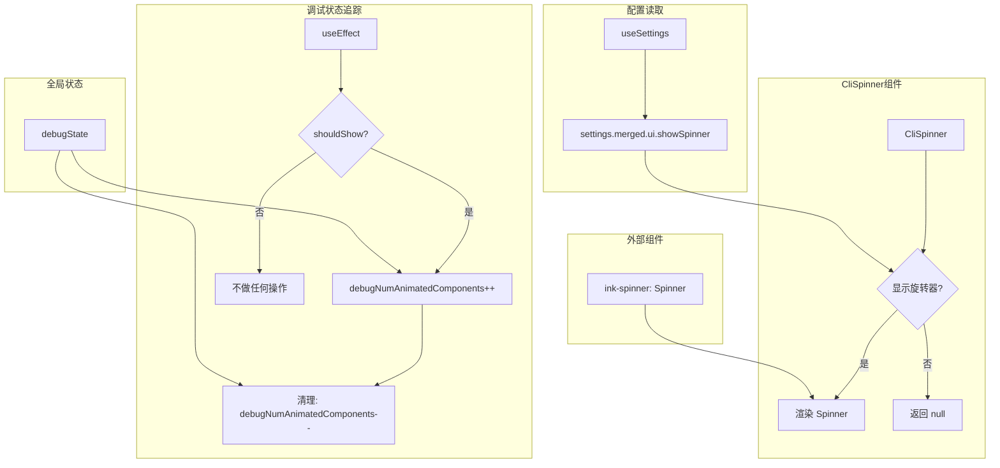

# CliSpinner.tsx

## 概述

`CliSpinner` 是一个 React (Ink) 包装组件，对 `ink-spinner` 库的 `Spinner` 组件进行了封装增强。它在原始旋转动画组件的基础上增加了两项功能：

1. **可配置的显示/隐藏**：通过用户设置（`settings.merged.ui.showSpinner`）控制是否渲染旋转动画，允许用户在不需要动画的场景（如 CI 环境、屏幕录制等）中关闭旋转器。
2. **动画组件计数追踪**：通过全局 `debugState` 追踪当前活跃的动画组件数量，用于调试和性能监控。

## 架构图（Mermaid）



## 核心组件

### 1. `SpinnerProps` 类型

```typescript
type SpinnerProps = ComponentProps<typeof Spinner>;
```

直接从 `ink-spinner` 的 `Spinner` 组件提取 Props 类型。这样 `CliSpinner` 与底层 `Spinner` 保持完全相同的 API 接口，所有 `ink-spinner` 支持的属性（如 `type` 旋转样式）都可以透传使用。

### 2. `CliSpinner` 组件

**Props：** 与 `ink-spinner` 的 `Spinner` 完全相同（通过 `SpinnerProps` 透传）。

**核心逻辑：**

1. **读取设置**：通过 `useSettings()` 钩子获取用户配置，检查 `settings.merged.ui?.showSpinner` 值
   - 默认行为：`showSpinner` 未设置或为 `true` 时显示旋转器
   - 仅当 `showSpinner` 明确设置为 `false` 时隐藏（`!== false` 判断）

2. **调试计数 Effect**：
   - 当 `shouldShow` 为 `true` 时，挂载时将 `debugState.debugNumAnimatedComponents` 加 1
   - 卸载时（或 `shouldShow` 变为 `false` 时）减 1
   - 当 `shouldShow` 为 `false` 时，不进行任何操作

3. **条件渲染**：
   - `shouldShow` 为 `false` → 返回 `null`（不渲染任何内容）
   - `shouldShow` 为 `true` → 渲染 `<Spinner {...props} />`（透传所有 props）

## 依赖关系

### 内部依赖

| 模块 | 导入内容 | 用途 |
|------|---------|------|
| `../debug.js` | `debugState` | 全局调试状态对象，用于追踪动画组件数量 |
| `../contexts/SettingsContext.js` | `useSettings` | 获取用户配置的 React Context 钩子 |

### 外部依赖

| 包 | 导入内容 | 用途 |
|---|---------|------|
| `ink-spinner` | `Spinner`（默认导出） | 终端旋转动画组件，提供多种旋转样式 |
| `react` | `ComponentProps`（类型）, `useEffect` | React 组件属性类型提取和副作用钩子 |

## 关键实现细节

1. **默认启用策略**：`showSpinner !== false` 的判断方式意味着旋转器默认启用。只有用户在设置中明确设置 `showSpinner: false` 才会关闭。`undefined`、`null`、`true` 等值都会导致旋转器显示。这确保了默认体验的完整性。

2. **动画组件计数的调试价值**：`debugState.debugNumAnimatedComponents` 是一个全局可变计数器，跟踪当前渲染树中活跃的动画组件数量。这在调试中非常有用：
   - 可以检测动画组件的泄漏（计数应该在所有旋转器卸载后归零）
   - 可以监控同时活跃的动画数量对性能的影响
   - 在 CI/测试环境中可以验证动画是否被正确禁用

3. **Props 完全透传**：通过 `<Spinner {...props} />` 展开传递所有属性，`CliSpinner` 作为透明包装器不修改任何 `ink-spinner` 的行为。这意味着上层组件可以使用 `ink-spinner` 的所有功能（如不同的 spinner 类型 `dots`、`line`、`arc` 等）。

4. **Effect 的清理函数**：`useEffect` 仅在 `shouldShow` 为 `true` 时注册清理函数（`debugNumAnimatedComponents--`）。当 `shouldShow` 为 `false` 时返回 `undefined`，不注册清理逻辑。这避免了不必要的计数器操作。

5. **轻量级封装设计**：整个组件不到 20 行有效代码，仅添加了最小限度的包装逻辑。这种设计保持了与底层库的低耦合，如果将来需要替换 `ink-spinner` 或添加更多功能，改动范围很小。

6. **设置系统集成**：通过 `useSettings` 钩子接入 Gemini CLI 的统一设置系统。`settings.merged` 表示合并后的配置（可能来自配置文件、环境变量、命令行参数等多个来源），组件不需要关心配置的来源。
