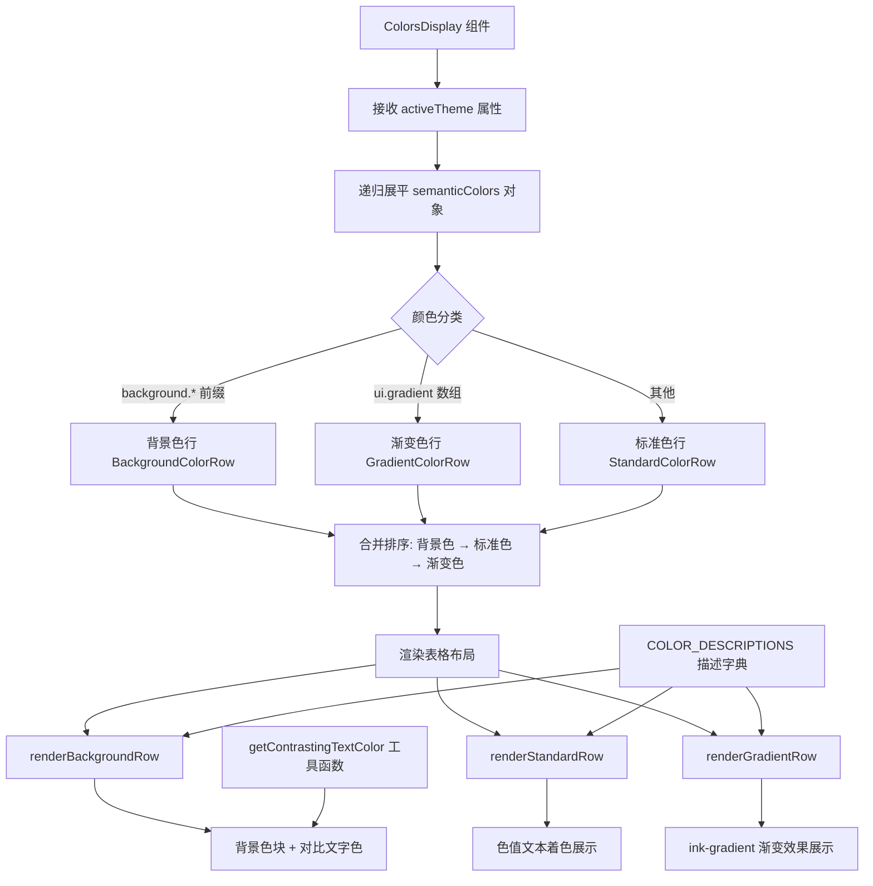

# ColorsDisplay.tsx

## 概述

`ColorsDisplay` 是一个 React（Ink）组件，用于在终端中以可视化方式展示当前活跃主题（Theme）的所有语义颜色（Semantic Colors）。它是一个**开发者工具**组件，不面向最终用户，主要目的是帮助开发者调试和预览主题配色方案。

该组件会将主题中嵌套的语义颜色对象递归展平，然后按照**背景色 -> 标准色 -> 渐变色**的顺序逐行渲染，每行展示颜色的色值、名称和描述信息。

文件路径：`packages/cli/src/ui/components/ColorsDisplay.tsx`

## 架构图（Mermaid）

## 核心组件

### 1. 类型定义

| 类型 | 说明 |
|------|------|
| `StandardColorRow` | 标准颜色行，`type: 'standard'`，`value` 为单个颜色字符串 |
| `GradientColorRow` | 渐变颜色行，`type: 'gradient'`，`value` 为颜色字符串数组 |
| `BackgroundColorRow` | 背景颜色行，`type: 'background'`，`value` 为单个颜色字符串 |
| `ColorRow` | 联合类型，为以上三种类型的联合 |
| `ColorsDisplayProps` | 组件 Props，包含 `activeTheme: Theme` |

### 2. 常量

| 常量 | 值 | 说明 |
|------|----|------|
| `VALUE_COLUMN_WIDTH` | `10` | 色值列的固定宽度 |
| `COLOR_DESCRIPTIONS` | `Record<string, string>` | 每个语义颜色键（如 `text.primary`）对应的文字描述字典，共 20 个条目 |

### 3. 工具函数 `getContrastingTextColor(hex: string): string`

根据背景色的亮度（luminance）自动选择黑色或白色作为前景文字颜色，确保文字在背景色块上可读。

- 使用 **YIQ 公式** 计算亮度：`yiq = (r * 299 + g * 587 + b * 114) / 1000`
- 亮度 >= 128 返回 `#000000`（黑色文字），否则返回 `#FFFFFF`（白色文字）
- 对非法 Hex 值进行容错处理，回退到 `theme.text.primary`

### 4. 主组件 `ColorsDisplay`

**功能流程：**

1. 从 `activeTheme.semanticColors` 提取语义颜色对象
2. 调用 `flattenColors` 递归展平嵌套对象，将颜色分类到：
   - `backgroundRows`：以 `background.` 开头的键
   - `standardRows`：其他字符串值的键
   - `gradientRow`：`ui.gradient` 数组（单独处理）
3. 按照 **背景色 -> 标准色 -> 渐变色** 的顺序合并为 `allRows`
4. 渲染一个带圆角边框的面板，包含：
   - 顶部说明区域（解释颜色的应用方式：Hex / Blank / Compatibility / ANSI Names）
   - 表头（Value / Name）
   - 按类型分发到对应的渲染函数

### 5. 渲染函数

#### `renderStandardRow({ name, value })`
- 使用色值本身对文字进行着色显示
- 非 Hex 色值回退到 `theme.text.primary`
- 空值显示为 `(blank)`
- 布局：色值列（固定宽度）| 名称列（30%）| 描述列（自适应）

#### `renderGradientRow({ name, value })`
- 色值列纵向逐个展示渐变色的每个颜色
- 名称使用 `ink-gradient` 的 `<Gradient>` 组件渲染出渐变文字效果
- 布局同标准行

#### `renderBackgroundRow({ name, value })`
- 色值列使用 `backgroundColor` 渲染实际背景色块
- 前景文字通过 `getContrastingTextColor` 自动选择黑白对比色
- 空值显示为 `default`
- 布局同标准行，但色值列有 `paddingX={1}` 和 `justifyContent="center"`

## 依赖关系

### 内部依赖

| 模块 | 导入内容 | 说明 |
|------|----------|------|
| `../semantic-colors.js` | `theme` | 当前全局语义颜色主题对象，用于组件自身的样式 |
| `../themes/theme.js` | `Theme`（类型） | 主题接口类型定义 |

### 外部依赖

| 包 | 导入内容 | 说明 |
|----|----------|------|
| `react` | `React`（类型） | React 类型支持 |
| `ink` | `Box`, `Text` | Ink 终端 UI 框架的布局和文本组件 |
| `ink-gradient` | `Gradient` | Ink 终端渐变文字渲染组件 |

## 关键实现细节

1. **递归展平算法**：`flattenColors` 使用递归深度优先遍历将嵌套的 `semanticColors` 对象展平为以点号分隔的路径（如 `background.diff.added`），同时跳过 `gradient` 数组（交由独立逻辑处理）。

2. **YIQ 亮度计算**：使用经典的 YIQ 色彩空间公式而非 WCAG 对比度标准，权重为 R:299 / G:587 / B:114，这是一个被广泛使用的简化亮度判定方法。

3. **三种颜色类型的渲染策略差异**：
   - 标准色：直接用色值着色文本
   - 背景色：渲染实际背景色块 + 自动对比前景色
   - 渐变色：使用 `ink-gradient` 渲染多色渐变文本效果

4. **排序策略**：背景色优先展示，因为背景色是主题的基础；标准色次之；渐变色放在最后，因为它是特殊的多值配色。

5. **容错处理**：
   - 空色值显示为 `(blank)` 或 `default`
   - 非 Hex 格式色值回退到主题默认主色
   - `getContrastingTextColor` 对无效 Hex 码做了防御性检查

6. **说明区域**：组件顶部包含一段关于颜色如何在终端中应用的开发者说明，解释了 Hex 精确渲染、空白使用终端默认色、老旧终端的 ANSI 近似映射、以及 ANSI 命名色的行为。
