# Composer.tsx

## 概述

`Composer` 是 Gemini CLI 终端界面的**核心布局编排组件**，负责将多个子组件按照正确的顺序和条件组合成完整的用户交互界面。它是整个 CLI 聊天界面的"主舞台"，协调了输入框、消息展示、状态栏、快捷键帮助、Toast 提示、待办托盘、底栏等多个 UI 区域的显示与隐藏逻辑。

该组件通过多个 Context 和 Hook 获取全局状态，并根据当前的 UI 状态（如是否正在流式输出、是否有待确认操作、是否在交替缓冲区等）动态控制各子组件的可见性。

文件路径：`packages/cli/src/ui/components/Composer.tsx`

## 架构图（Mermaid）

```mermaid
graph TD
    A[Composer 组件] --> B[Context 和 Hook 状态采集]

    B --> B1[useUIState - UI 全局状态]
    B --> B2[useUIActions - UI 操作方法]
    B --> B3[useSettings - 用户设置]
    B --> B4[useConfig - 配置信息]
    B --> B5[useVimMode - Vim 模式状态]
    B --> B6[useIsScreenReaderEnabled - 屏幕阅读器]
    B --> B7[useTerminalSize - 终端尺寸]
    B --> B8[useAlternateBuffer - 交替缓冲区检测]
    B --> B9[useComposerStatus - 组合状态]

    A --> C{条件渲染各区域}

    C -->|正在恢复会话| D[ConfigInitDisplay 恢复提示]
    C -->|showUiDetails| E[QueuedMessageDisplay 排队消息]
    C -->|showUiDetails| F[TodoTray 待办托盘]
    C -->|showShortcutsHelp| G[ShortcutsHelp 快捷键帮助]
    C -->|showUiDetails 或 hasToast| H[ToastDisplay 提示消息]
    C -->|始终| I[StatusRow 状态行]
    C -->|showErrorDetails| J[DetailedMessagesDisplay + ShowMoreLines 错误详情]
    C -->|isInputActive| K[InputPrompt 输入框]
    C -->|showUiDetails 且未隐藏| L[Footer 底栏]
```

## 核心组件

### 1. 组件 Props

| 属性 | 类型 | 默认值 | 说明 |
|------|------|--------|------|
| `isFocused` | `boolean` | `true` | 输入框是否获得焦点 |

### 2. 状态管理

组件不维护复杂的本地状态，主要通过多个 Context 和 Hook 获取全局状态：

| Hook / Context | 返回值 | 用途 |
|----------------|--------|------|
| `useUIState()` | `uiState` | 获取 UI 全局状态（输入是否活跃、流式状态、终端宽度、Shell 模式等） |
| `useUIActions()` | `uiActions` | 获取 UI 操作方法（提交、清屏、切换显示等） |
| `useSettings()` | `settings` | 获取用户合并后的设置项 |
| `useConfig()` | `config` | 获取应用配置 |
| `useVimMode()` | `{ vimEnabled, vimMode }` | 获取 Vim 模式状态 |
| `useIsScreenReaderEnabled()` | `boolean` | 检测是否启用了屏幕阅读器 |
| `useTerminalSize()` | `{ columns }` | 获取终端宽度 |
| `useAlternateBuffer()` | `boolean` | 检测是否处于交替缓冲区 |
| `useComposerStatus()` | `{ hasPendingActionRequired, shouldCollapseDuringApproval }` | 获取组合状态 |

本地状态仅一个：

| 状态 | 类型 | 说明 |
|------|------|------|
| `suggestionsVisible` | `boolean` | 自动补全建议面板是否可见 |

### 3. 关键派生状态

| 变量 | 含义 |
|------|------|
| `isNarrow` | 终端宽度是否为窄屏 |
| `debugConsoleMaxHeight` | 错误详情区域最大高度（终端宽度 * 0.2，最小 5） |
| `isAlternateBuffer` | 是否在交替缓冲区 |
| `suggestionsPosition` | 自动补全建议面板位置（交替缓冲区时在上方，否则在下方） |
| `hideContextSummary` | 当建议面板在上方且可见时，隐藏上下文摘要 |
| `isPassiveShortcutsHelpState` | 输入活跃 + 空闲 + 无待确认操作时为被动快捷键帮助状态 |
| `showShortcutsHelp` | 是否显示快捷键帮助面板 |
| `hasToast` | 是否有待显示的 Toast 消息 |

### 4. 渲染区域（从上到下）

| 顺序 | 组件 | 显示条件 | 说明 |
|------|------|----------|------|
| 1 | `ConfigInitDisplay` | `uiState.isResuming` | 会话恢复中的提示 |
| 2 | `QueuedMessageDisplay` | `showUiDetails` | 排队中的消息展示 |
| 3 | `TodoTray` | `showUiDetails` | 待办事项托盘 |
| 4 | `ShortcutsHelp` | `showShortcutsHelp` | 快捷键帮助面板 |
| 5 | `ToastDisplay` | `showUiDetails` 或 `hasToast` | Toast 提示消息 |
| 6 | `StatusRow` | 始终显示 | 状态行（上下文摘要、流式状态等） |
| 7 | `DetailedMessagesDisplay` + `ShowMoreLines` | `showUiDetails && showErrorDetails` | 错误/调试详情展示，包裹在 `OverflowProvider` 中 |
| 8 | `InputPrompt` | `uiState.isInputActive` | 用户输入框（核心交互区域） |
| 9 | `Footer` | `showUiDetails && !hideFooter && !screenReader` | 底部快捷键提示栏 |

### 5. `InputPrompt` 核心属性

`InputPrompt` 接收大量属性，是整个组件中最重要的子组件：

- `buffer` / `inputWidth` / `suggestionsWidth`：输入缓冲区和尺寸
- `onSubmit`：提交回调
- `userMessages`：历史用户消息（用于上下键翻阅）
- `slashCommands` / `commandContext`：斜杠命令和上下文
- `shellModeActive` / `setShellModeActive`：Shell 模式切换
- `approvalMode`：审批模式指示
- `vimHandleInput`：Vim 按键处理
- `placeholder`：输入框占位文本（根据 Vim 模式和 Shell 模式动态切换）
- `suggestionsPosition` / `onSuggestionsVisibilityChange`：建议面板位置和可见性回调
- `copyModeEnabled`：复制模式

## 依赖关系

### 内部依赖

| 模块 | 导入内容 | 说明 |
|------|----------|------|
| `../contexts/ConfigContext.js` | `useConfig` | 应用配置 Context |
| `../contexts/SettingsContext.js` | `useSettings` | 用户设置 Context |
| `../contexts/UIStateContext.js` | `useUIState` | UI 状态 Context |
| `../contexts/UIActionsContext.js` | `useUIActions` | UI 操作 Context |
| `../contexts/VimModeContext.js` | `useVimMode` | Vim 模式 Context |
| `../contexts/OverflowContext.js` | `OverflowProvider` | 溢出检测 Provider |
| `../hooks/useAlternateBuffer.js` | `useAlternateBuffer` | 交替缓冲区检测 Hook |
| `../hooks/useTerminalSize.js` | `useTerminalSize` | 终端尺寸 Hook |
| `../hooks/useComposerStatus.js` | `useComposerStatus` | 组合状态 Hook |
| `../utils/isNarrowWidth.js` | `isNarrowWidth` | 窄屏检测工具函数 |
| `./ToastDisplay.js` | `ToastDisplay`, `shouldShowToast` | Toast 提示组件及判断函数 |
| `./DetailedMessagesDisplay.js` | `DetailedMessagesDisplay` | 详细消息/错误展示组件 |
| `./ShortcutsHelp.js` | `ShortcutsHelp` | 快捷键帮助组件 |
| `./InputPrompt.js` | `InputPrompt` | 用户输入框组件 |
| `./Footer.js` | `Footer` | 底部栏组件 |
| `./StatusRow.js` | `StatusRow` | 状态行组件 |
| `./ShowMoreLines.js` | `ShowMoreLines` | "显示更多行"组件 |
| `./QueuedMessageDisplay.js` | `QueuedMessageDisplay` | 排队消息展示组件 |
| `./ConfigInitDisplay.js` | `ConfigInitDisplay` | 配置初始化/恢复提示组件 |
| `./messages/Todo.js` | `TodoTray` | 待办事项托盘组件 |

### 外部依赖

| 包 | 导入内容 | 说明 |
|----|----------|------|
| `ink` | `Box`, `useIsScreenReaderEnabled` | Ink 终端 UI 框架 |
| `react` | `useState`, `useEffect` | React 状态和副作用 Hook |

## 关键实现细节

1. **审批模式折叠**：当存在待确认操作（`hasPendingActionRequired`）且 `shouldCollapseDuringApproval` 为 true 时，整个 Composer 返回 `null`，完全隐藏输入区域，让审批对话框独占屏幕空间。

2. **快捷键帮助自动关闭**：通过 `useEffect` 监听，当 UI 状态从"被动快捷键帮助状态"切换出去时（如开始流式输出或出现审批弹窗），自动关闭快捷键帮助面板。

3. **建议面板位置策略**：在交替缓冲区模式下，自动补全建议面板显示在输入框上方（`above`），在正常缓冲区则在下方（`below`）。当建议面板在上方且可见时，会隐藏上下文摘要以避免视觉冲突。

4. **Vim 模式占位文本**：输入框的 placeholder 根据三种状态动态切换：
   - Vim INSERT 模式：提示按 Esc 切换到 NORMAL 模式
   - Vim NORMAL 模式：提示按 i 切换到 INSERT 模式
   - Shell 模式：提示输入 Shell 命令
   - 普通模式：提示输入消息或 @路径

5. **无障碍支持**：当检测到屏幕阅读器启用时，隐藏底部快捷键栏（Footer），避免对屏幕阅读器造成干扰。

6. **错误详情高度约束**：`debugConsoleMaxHeight` 基于终端宽度的 20% 计算（最小 5 行），在 `constrainHeight` 开启时限制错误详情区域高度，避免占据过多屏幕空间。

7. **宽度传递**：组件的整体宽度由 `uiState.terminalWidth` 决定，通过 `flexGrow={0}` 和 `flexShrink={0}` 保持固定，不参与 Flex 弹性分配。
