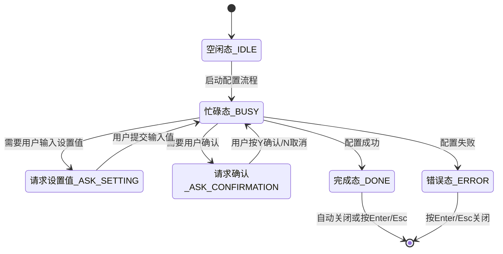
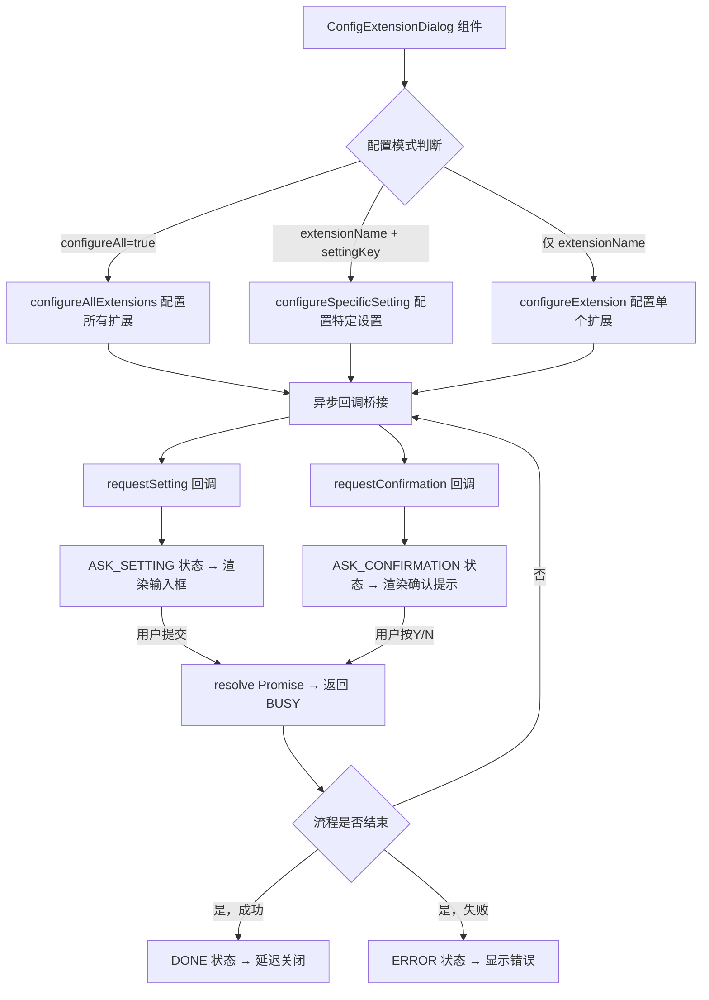

# ConfigExtensionDialog.tsx

## 概述

`ConfigExtensionDialog` 是一个有状态的对话框组件，用于在终端 UI 中引导用户完成**扩展（Extension）的配置流程**。它支持三种配置模式：配置所有扩展、配置指定扩展、配置扩展的特定设置项。

该组件实现了一个完整的**状态机驱动的异步交互流程**：从初始化 -> 等待用户输入设置值或确认 -> 处理完成/错误。整个对话过程通过 Promise 和回调机制将异步的用户交互桥接到命令行扩展配置逻辑中。

文件路径：`packages/cli/src/ui/components/ConfigExtensionDialog.tsx`

## 架构图（Mermaid）

## 核心组件

### 1. 组件 Props（`ConfigExtensionDialogProps`）

| 属性 | 类型 | 必需 | 默认值 | 说明 |
|------|------|------|--------|------|
| `extensionManager` | `ExtensionManager` | 是 | - | 扩展管理器实例 |
| `onClose` | `() => void` | 是 | - | 对话框关闭回调 |
| `extensionName` | `string` | 否 | - | 目标扩展名称 |
| `settingKey` | `string` | 否 | - | 目标设置项键名 |
| `scope` | `ExtensionSettingScope` | 否 | `USER` | 设置作用域（用户级/项目级） |
| `configureAll` | `boolean` | 否 | - | 是否配置所有扩展 |
| `loggerAdapter` | `ConfigLogger` | 是 | - | 日志适配器 |

### 2. 状态机（`DialogState`）

| 状态 | 类型 | 说明 | UI 表现 |
|------|------|------|---------|
| `IDLE` | 初始态 | 组件刚挂载，尚未开始 | 显示 "Starting..." |
| `BUSY` | 忙碌态 | 正在处理中 | 显示进度消息 + 日志 |
| `ASK_SETTING` | 请求输入 | 需要用户输入某个设置值 | 显示设置名称/描述 + 文本输入框 |
| `ASK_CONFIRMATION` | 请求确认 | 需要用户确认操作 | 显示确认消息 + Y/N 提示 |
| `DONE` | 完成 | 配置流程成功完成 | 显示成功消息，1秒后自动关闭 |
| `ERROR` | 错误 | 配置流程出错 | 显示错误消息，等待用户关闭 |

### 3. 核心回调函数

#### `requestSetting: RequestSettingCallback`
- 当配置流程需要用户输入设置值时调用
- 创建一个 Promise，将 `resolve` 函数存入 `ASK_SETTING` 状态
- 清空输入缓冲区以准备新输入
- 用户提交后调用 `resolve` 返回值，状态回到 `BUSY`

#### `requestConfirmation: RequestConfirmationCallback`
- 当配置流程需要用户确认时调用
- 创建一个 Promise，将 `resolve` 函数存入 `ASK_CONFIRMATION` 状态
- 用户按 Y/Enter 返回 `true`，按 N/Escape 返回 `false`

#### `addLog`
- 将日志消息追加到本地日志数组（最多保留最近 5 条）
- 同时转发到外部 `loggerAdapter.log`

### 4. 键盘事件处理

通过 `useKeypress` Hook 注册：

| 状态 | 按键 | 行为 |
|------|------|------|
| `ASK_CONFIRMATION` | `Y` / `Enter` | 确认（resolve true） |
| `ASK_CONFIRMATION` | `N` / `Escape` | 取消（resolve false） |
| `DONE` / `ERROR` | `Enter` / `Escape` | 关闭对话框 |

### 5. 渲染分支

根据 `state.type` 分为五个渲染分支，每个都包裹在带圆角边框的 Box 中：

| 状态 | 渲染内容 | 边框颜色 |
|------|----------|----------|
| `IDLE` / `BUSY` | 进度消息 + 最近日志 | `theme.border.default` |
| `ASK_SETTING` | 设置名 + 描述 + 文本输入框 + 底部操作提示 | `theme.border.default` |
| `ASK_CONFIRMATION` | 警告标题 + 确认消息 + Y/N 提示 | `theme.border.default` |
| `ERROR` | 红色错误标题 + 错误消息 + 关闭提示 | `theme.status.error` |
| `DONE` | 绿色成功标题 + 关闭提示 | `theme.status.success` |

## 依赖关系

### 内部依赖

| 模块 | 导入内容 | 说明 |
|------|----------|------|
| `../semantic-colors.js` | `theme` | 语义颜色主题对象 |
| `../../config/extension-manager.js` | `ExtensionManager`（类型） | 扩展管理器类型 |
| `../../commands/extensions/utils.js` | `configureExtension`, `configureSpecificSetting`, `configureAllExtensions`, `ConfigLogger`, `RequestSettingCallback`, `RequestConfirmationCallback` | 扩展配置核心逻辑函数及类型 |
| `../../config/extensions/extensionSettings.js` | `ExtensionSettingScope`, `ExtensionSetting` | 扩展设置枚举和类型 |
| `./shared/TextInput.js` | `TextInput` | 共享文本输入组件 |
| `./shared/text-buffer.js` | `useTextBuffer` | 文本缓冲区 Hook |
| `./shared/DialogFooter.js` | `DialogFooter` | 对话框底部操作提示组件 |
| `../hooks/useKeypress.js` | `Key`, `useKeypress` | 键盘按键监听 Hook |

### 外部依赖

| 包 | 导入内容 | 说明 |
|----|----------|------|
| `react` | `useEffect`, `useState`, `useRef`, `useCallback` | React Hooks |
| `ink` | `Box`, `Text` | Ink 终端 UI 框架 |

## 关键实现细节

1. **Promise 桥接模式**：这是该组件最核心的设计模式。异步的扩展配置函数（`configureExtension` 等）需要与用户交互来获取输入或确认。组件通过创建 Promise 并将其 `resolve` 函数存储到组件状态中来实现这一桥接——配置函数 `await` Promise 等待用户输入，用户在 UI 中交互后调用状态中存储的 `resolve` 函数来兑现 Promise，让配置流程继续。

2. **单次执行保护**：`useEffect` 中的 `run()` 函数仅在 `state.type === 'IDLE'` 时执行，确保配置流程只启动一次。

3. **组件卸载保护**：通过 `mounted` ref 追踪组件是否已卸载，避免在卸载后更新状态导致内存泄漏或 React 警告。所有状态更新前都检查 `mounted.current`。

4. **日志滚动窗口**：`addLog` 使用 `.slice(-5)` 只保留最近 5 条日志消息，避免在长配置流程中日志占满屏幕。

5. **自动关闭**：配置完成后（DONE 状态），通过 `setTimeout(onClose, 1000)` 延迟 1 秒自动关闭对话框，给用户短暂的成功反馈时间。

6. **三种配置模式的优先级**：
   - `configureAll` 最优先：配置所有扩展
   - `extensionName + settingKey`：配置指定扩展的特定设置项
   - 仅 `extensionName`：配置指定扩展的所有设置项

7. **输入缓冲区管理**：使用 `useTextBuffer` Hook 创建单行文本缓冲区（80 字符宽，1 行高），每次进入 `ASK_SETTING` 状态时通过 `settingBuffer.setText('')` 清空缓冲区，确保每次输入都从空白开始。
