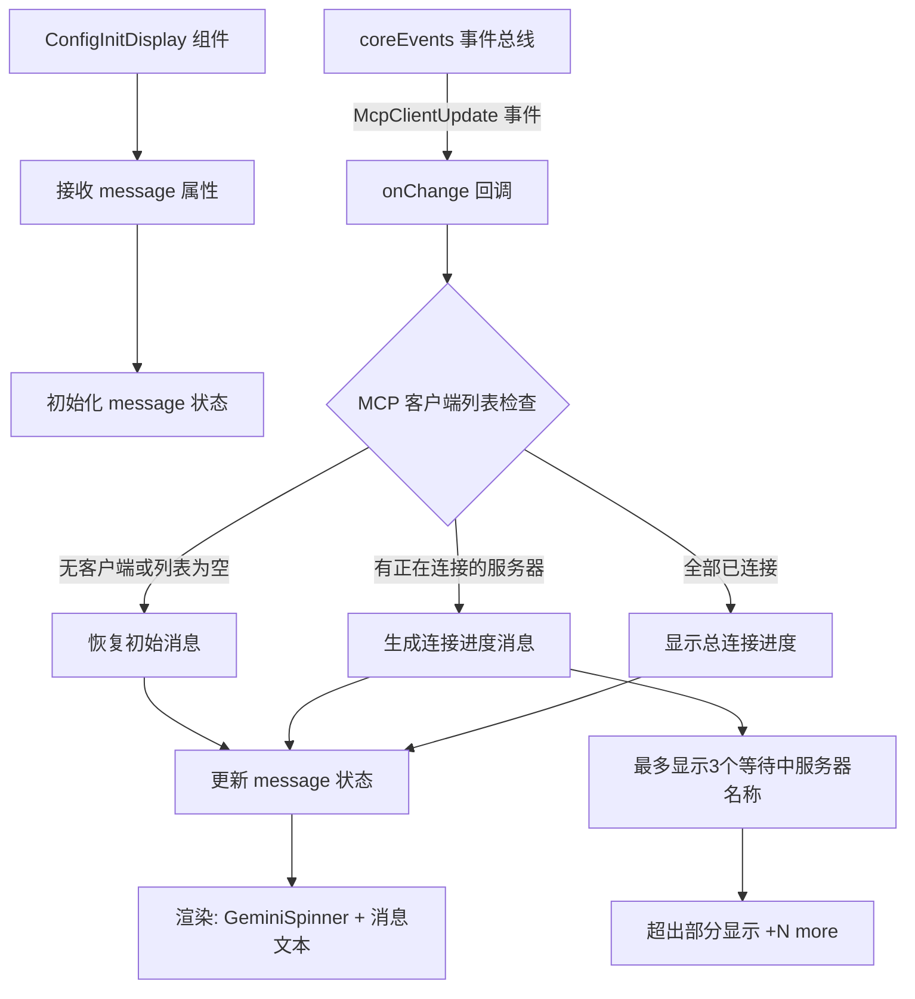

# ConfigInitDisplay.tsx

## 概述

`ConfigInitDisplay` 是一个轻量级的加载/初始化状态展示组件，用于在终端 UI 中显示一个带旋转动画的加载提示。它的核心功能是**监听 MCP（Model Context Protocol）服务器的连接状态变化**，并实时更新展示消息，向用户反馈当前有多少 MCP 服务器已连接、哪些还在等待连接。

该组件同时也被用作通用的加载提示（如会话恢复提示 "Resuming session..."）。

文件路径：`packages/cli/src/ui/components/ConfigInitDisplay.tsx`

## 架构图（Mermaid）

## 核心组件

### 1. 组件 Props

| 属性 | 类型 | 必需 | 默认值 | 说明 |
|------|------|------|--------|------|
| `message` | `string` | 否 | `'Working...'` | 初始显示的提示消息 |

### 2. 状态

| 状态 | 类型 | 说明 |
|------|------|------|
| `message` | `string` | 当前展示的消息内容，会根据 MCP 连接进度动态更新 |

### 3. MCP 连接状态监听逻辑

组件在 `useEffect` 中注册了对 `CoreEvent.McpClientUpdate` 事件的监听，回调函数 `onChange` 接收一个 `Map<string, McpClient>` 类型的客户端映射表，逻辑如下：

1. **无客户端**：恢复为初始消息（`initialMessage`）
2. **有客户端**：遍历所有客户端，统计已连接和正在连接的数量
   - **有正在连接的服务器**：构建详细消息，包含：
     - 连接进度：`(已连接数/总数)`
     - 等待中的服务器名称（最多展示 3 个）
     - 超出 3 个的显示 `+N more`
   - **全部已连接**：仅显示连接进度
3. **消息拼接**：如果 `initialMessage` 不是默认的 `'Working...'`，则将 MCP 消息附加在初始消息后面（用括号包裹），形成如 `"Resuming session... (Connecting to MCP servers... (2/5) - Waiting for: server-a, server-b)"` 的格式

### 4. 渲染

组件渲染非常简洁：
- 一个带 `marginTop={1}` 的 `Box` 容器
- 内部是 `GeminiSpinner`（旋转加载动画） + 消息文本
- 文本颜色使用 `theme.text.primary`

## 依赖关系

### 内部依赖

| 模块 | 导入内容 | 说明 |
|------|----------|------|
| `./GeminiSpinner.js` | `GeminiSpinner` | Gemini 品牌旋转加载动画组件 |
| `../semantic-colors.js` | `theme` | 语义颜色主题对象 |

### 外部依赖

| 包 | 导入内容 | 说明 |
|----|----------|------|
| `react` | `useEffect`, `useState` | React Hooks |
| `ink` | `Box`, `Text` | Ink 终端 UI 框架 |
| `@google/gemini-cli-core` | `CoreEvent`, `coreEvents`, `McpClient`（类型）, `MCPServerStatus` | 核心事件系统、MCP 客户端类型和状态枚举 |

## 关键实现细节

1. **事件驱动的实时更新**：组件通过订阅 `coreEvents` 事件总线的 `McpClientUpdate` 事件来响应 MCP 服务器连接状态的变化，无需轮询。这是一个典型的发布-订阅模式应用。

2. **服务器名称截断策略**：为避免过多服务器名称撑爆终端宽度，最多只显示 3 个正在等待连接的服务器名称，超出部分用 `+N more` 表示。`maxDisplay = 3` 为硬编码常量。

3. **消息叠加而非覆盖**：当 `initialMessage` 不是默认值 `'Working...'` 时，MCP 连接消息不会替换初始消息，而是以括号形式附加在其后。这使得组件在被用作通用加载提示时（如 `"Resuming session..."`），不会丢失原始上下文信息。

4. **清理函数**：`useEffect` 返回了清理函数 `coreEvents.off(CoreEvent.McpClientUpdate, onChange)`，确保组件卸载时移除事件监听器，防止内存泄漏。

5. **状态判断逻辑**：使用 `MCPServerStatus.CONNECTED` 枚举值判断服务器是否已连接，非此状态的一律视为"正在连接"，简化了状态分类逻辑。

6. **通用性**：该组件设计为通用的加载提示组件，不仅用于配置初始化场景，还被 `Composer` 组件复用于会话恢复提示（`message="Resuming session..."`）。
