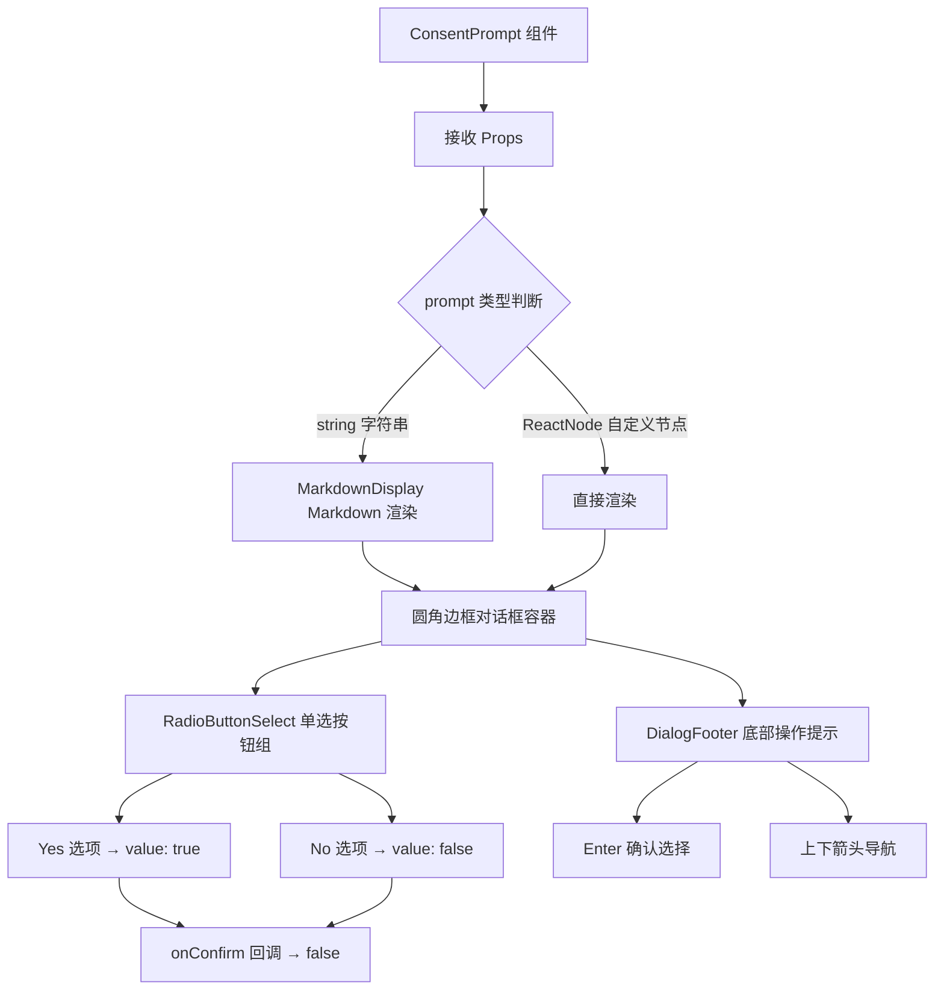

# ConsentPrompt.tsx

## 概述

`ConsentPrompt` 是一个通用的**用户同意/确认提示对话框**组件，用于在终端 UI 中向用户展示一段提示内容，并提供 "Yes" / "No" 两个单选选项供用户选择。它是一个纯展示型组件，不包含内部状态逻辑，通过回调函数将用户的选择结果传递给父组件。

该组件支持两种提示内容格式：纯字符串（自动以 Markdown 格式渲染）和自定义 ReactNode（直接渲染）。

文件路径：`packages/cli/src/ui/components/ConsentPrompt.tsx`

## 架构图（Mermaid）



## 核心组件

### 1. 组件 Props（`ConsentPromptProps`）

| 属性 | 类型 | 必需 | 说明 |
|------|------|------|------|
| `prompt` | `ReactNode` | 是 | 提示内容。如果是字符串，自动使用 `MarkdownDisplay` 渲染；如果是 ReactNode，直接渲染 |
| `onConfirm` | `(value: boolean) => void` | 是 | 用户选择后的回调。选择 "Yes" 回调 `true`，选择 "No" 回调 `false` |
| `terminalWidth` | `number` | 是 | 终端宽度，传递给 `MarkdownDisplay` 用于控制 Markdown 渲染宽度 |

### 2. 渲染结构

组件的渲染结构清晰分为三层：

```
Box (圆角边框容器, paddingTop=1, paddingX=2)
├── 提示内容区域
│   ├── MarkdownDisplay (当 prompt 为字符串时)
│   └── 直接渲染 prompt (当 prompt 为 ReactNode 时)
├── RadioButtonSelect (Yes/No 单选按钮)
│   ├── Yes → value: true
│   └── No → value: false
└── DialogFooter
    ├── 主操作: "Enter to select"
    └── 导航操作: "↑/↓ to navigate"
```

### 3. 子组件说明

#### `MarkdownDisplay`
- 当 `prompt` 为字符串类型时使用
- `isPending={true}` 表示当前处于等待用户操作的状态
- `terminalWidth` 控制渲染宽度以适配终端

#### `RadioButtonSelect`
- 渲染两个单选按钮选项：
  - `Yes`（`value: true`，`key: 'Yes'`）
  - `No`（`value: false`，`key: 'No'`）
- 用户通过上下箭头键导航，Enter 键确认选择
- 选择后触发 `onSelect`（即 `onConfirm`）回调

#### `DialogFooter`
- 展示操作提示：
  - 主操作：`"Enter to select"`
  - 导航操作：`"↑/↓ to navigate"`

## 依赖关系

### 内部依赖

| 模块 | 导入内容 | 说明 |
|------|----------|------|
| `../semantic-colors.js` | `theme` | 语义颜色主题对象，用于边框颜色 |
| `../utils/MarkdownDisplay.js` | `MarkdownDisplay` | Markdown 文本渲染组件 |
| `./shared/RadioButtonSelect.js` | `RadioButtonSelect` | 共享的单选按钮选择组件 |
| `./shared/DialogFooter.js` | `DialogFooter` | 共享的对话框底部操作提示组件 |

### 外部依赖

| 包 | 导入内容 | 说明 |
|----|----------|------|
| `ink` | `Box` | Ink 终端 UI 框架的布局组件 |
| `react` | `ReactNode`（类型） | React 节点类型 |

## 关键实现细节

1. **无状态设计**：组件本身不维护任何内部状态，是一个纯粹的受控组件。所有状态管理和业务逻辑由父组件负责，`ConsentPrompt` 仅负责展示和传递用户交互结果。

2. **Prompt 类型多态**：通过 `typeof prompt === 'string'` 进行运行时类型判断，实现两种渲染路径：
   - 字符串：通过 `MarkdownDisplay` 渲染，支持 Markdown 语法（如加粗、链接等），适合动态生成的提示文本
   - ReactNode：直接渲染，适合需要复杂自定义布局的提示内容

3. **布尔值映射**：`RadioButtonSelect` 的 `value` 直接使用 `boolean` 类型（`true` / `false`），与 `onConfirm` 回调签名 `(value: boolean) => void` 精准对应，无需额外的值转换。

4. **一致的对话框风格**：使用 `borderStyle="round"` 和 `borderColor={theme.border.default}` 保持与其他对话框组件（如 `ConfigExtensionDialog`）一致的视觉风格。

5. **可访问的导航提示**：`DialogFooter` 清晰地告知用户交互方式（上下键导航 + Enter 确认），降低终端交互的学习成本。

6. **组件复用性**：该组件被设计为通用的二元选择确认框，可用于任何需要用户同意/拒绝的场景（如隐私条款确认、危险操作确认等），不绑定特定业务逻辑。
