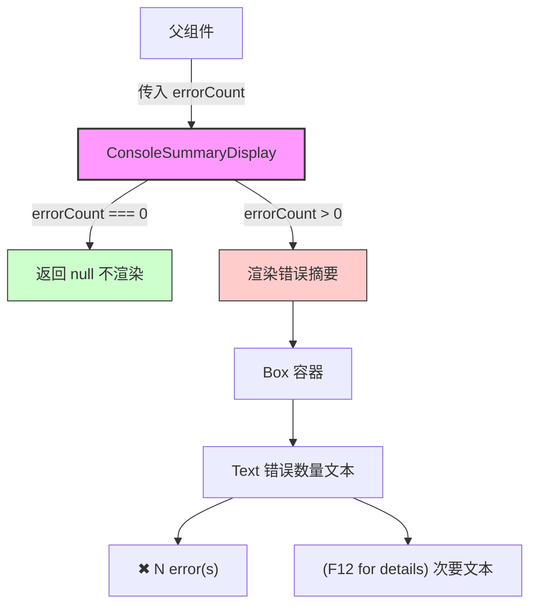

# ConsoleSummaryDisplay.tsx

## 概述

`ConsoleSummaryDisplay` 是一个 React 函数组件，用于在 CLI 终端界面中显示控制台错误摘要信息。该组件属于 Gemini CLI 项目的 UI 层，基于 [Ink](https://github.com/vadimdemedes/ink) 框架构建，专门在终端环境中渲染 React 组件。

该组件的核心职责非常单一：**当存在控制台错误时，以醒目的红色样式显示错误计数，并提示用户按 F12 查看详情**。当错误数为 0 时，组件不渲染任何内容（返回 `null`）。

## 架构图（Mermaid）



## 核心组件

### ConsoleSummaryDisplayProps 接口

| 属性 | 类型 | 必填 | 说明 |
|------|------|------|------|
| `errorCount` | `number` | 是 | 控制台错误数量 |

> **注意**: 接口中注释提到 `logCount` 目前不在摘要显示计划中，说明未来可能会扩展支持日志计数的显示。

### ConsoleSummaryDisplay 组件

```typescript
export const ConsoleSummaryDisplay: React.FC<ConsoleSummaryDisplayProps>
```

这是一个无状态的纯展示组件，其行为逻辑如下：

1. **零错误守卫**：如果 `errorCount === 0`，直接返回 `null`，不渲染任何 DOM 节点。
2. **错误图标**：使用 Unicode 字符 `\u2716`（Heavy Multiplication X，即 ✖）作为错误指示图标。
3. **文本渲染**：
   - 主文本：以 `theme.status.error` 颜色（红色系）渲染错误图标和计数，如 `✖ 3 errors`。
   - 复数处理：当 `errorCount > 1` 时自动添加 `s` 后缀（`error` → `errors`）。
   - 辅助文本：以 `theme.text.secondary` 颜色（次要色）渲染 `(F12 for details)` 提示。

### 渲染结构

```
<Box>
  <Text color={错误色}>
    ✖ {数量} error(s)
    <Text color={次要色}>(F12 for details)</Text>
  </Text>
</Box>
```

## 依赖关系

### 内部依赖

| 模块 | 导入内容 | 说明 |
|------|----------|------|
| `../semantic-colors.js` | `theme` | 语义化颜色主题对象，提供 `theme.status.error` 和 `theme.text.secondary` 等颜色定义 |

### 外部依赖

| 包名 | 导入内容 | 说明 |
|------|----------|------|
| `react` | `React`（类型导入） | React 类型定义，用于 `React.FC` 类型注解 |
| `ink` | `Box`, `Text` | Ink 框架的布局和文本组件，用于终端 UI 渲染 |

## 关键实现细节

1. **条件渲染策略**：组件采用"提前返回"模式（early return），当 `errorCount === 0` 时立即返回 `null`。这是 React 中常见的优化模式，避免不必要的 DOM 构建。

2. **双重条件检查**：值得注意的是，代码中存在两层条件判断——第一层是 `errorCount === 0` 的提前返回，第二层是 JSX 中的 `errorCount > 0 &&` 条件渲染。虽然第二层在逻辑上是冗余的（因为经过第一层过滤后 `errorCount` 必然 > 0），但这种写法增强了代码的防御性和可读性。

3. **嵌套 Text 组件**：辅助提示文本 `(F12 for details)` 使用嵌套的 `<Text>` 组件实现不同颜色的内联文本，这是 Ink 框架中实现富文本样式的标准方式。

4. **国际化局限**：当前复数处理采用简单的英文规则（添加 `s`），不支持其他语言的复数形态。

5. **Unicode 图标**：使用 `\u2716`（✖）而非 emoji，确保在各种终端环境下的兼容性和一致性。

6. **类型安全**：使用 `type` 关键字进行 React 类型导入（`import type React from 'react'`），确保类型信息在编译时被擦除，不会增加运行时包体积。
