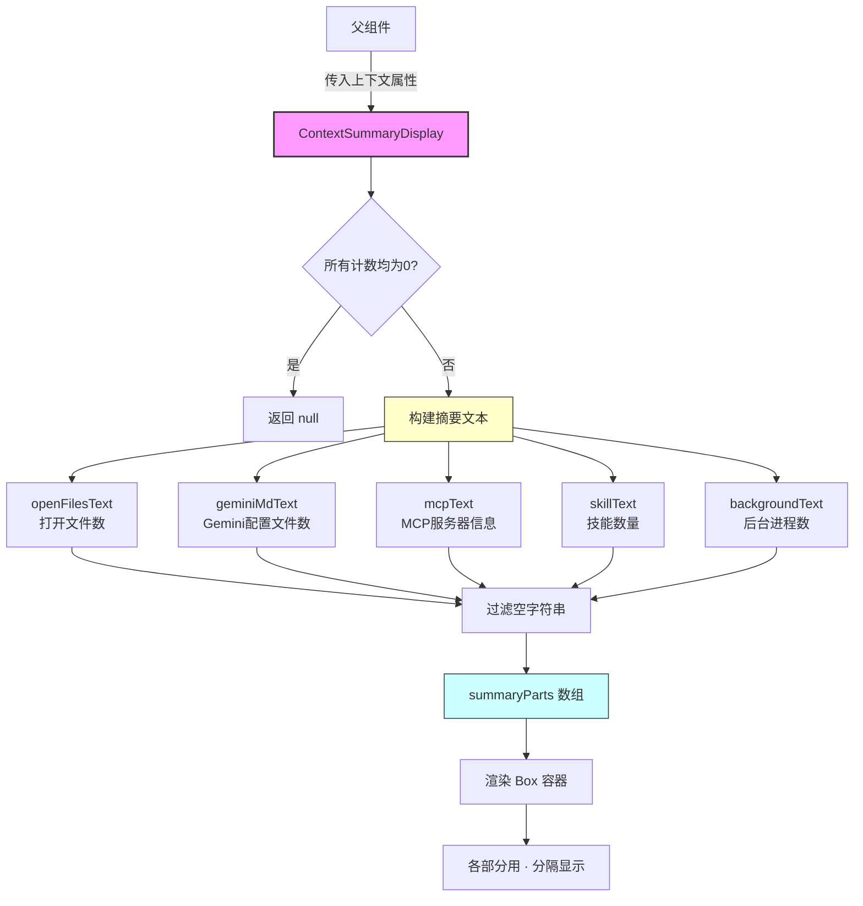
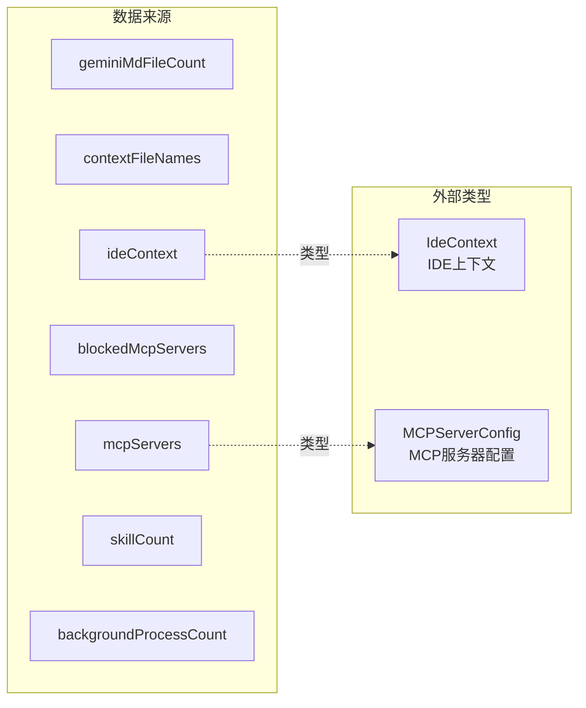

# ContextSummaryDisplay.tsx

## 概述

`ContextSummaryDisplay` 是一个 React 函数组件，用于在 Gemini CLI 终端界面中显示当前会话的上下文摘要信息。它汇总并展示多种上下文来源的状态，包括打开的文件数量、Gemini 配置文件数量、MCP 服务器连接状态、技能数量以及后台进程数量。

该组件是用户了解当前 CLI 工作环境状态的核心入口之一，以紧凑的单行格式展示所有活跃的上下文信息，各项之间用中点符号（`·`）分隔。当所有上下文项均为空时，组件不渲染任何内容。

## 架构图（Mermaid）





## 核心组件

### ContextSummaryDisplayProps 接口

| 属性 | 类型 | 必填 | 默认值 | 说明 |
|------|------|------|--------|------|
| `geminiMdFileCount` | `number` | 是 | - | Gemini 配置 Markdown 文件的数量 |
| `contextFileNames` | `string[]` | 是 | - | 上下文文件名列表，用于判断是否所有文件同名 |
| `mcpServers` | `Record<string, MCPServerConfig>` | 否 | - | MCP 服务器配置映射，键为服务器名 |
| `blockedMcpServers` | `Array<{ name: string; extensionName: string }>` | 否 | - | 被阻止的 MCP 服务器列表 |
| `ideContext` | `IdeContext` | 否 | - | IDE 上下文信息，包含工作区状态等 |
| `skillCount` | `number` | 是 | - | 已加载的技能数量 |
| `backgroundProcessCount` | `number` | 否 | `0` | 后台运行的进程数量 |

### ContextSummaryDisplay 组件

```typescript
export const ContextSummaryDisplay: React.FC<ContextSummaryDisplayProps>
```

#### 内部派生值计算

组件首先从 props 中计算三个派生值：

```typescript
const mcpServerCount = Object.keys(mcpServers || {}).length;        // MCP 服务器总数
const blockedMcpServerCount = blockedMcpServers?.length || 0;       // 被阻止的 MCP 服务器数
const openFileCount = ideContext?.workspaceState?.openFiles?.length ?? 0;  // IDE 中打开的文件数
```

#### 空状态守卫

当以下所有条件均满足时，返回 `null`：
- `geminiMdFileCount === 0`
- `mcpServerCount === 0`
- `blockedMcpServerCount === 0`
- `openFileCount === 0`
- `skillCount === 0`
- `backgroundProcessCount === 0`

#### 五个文本生成器（IIFE 模式）

每个摘要项使用立即调用函数表达式（IIFE）生成文本：

1. **`openFilesText`** - 打开文件摘要
   - 格式：`N open file(s) (ctrl+g to view)`
   - 附带快捷键提示

2. **`geminiMdText`** - Gemini 配置文件摘要
   - 智能名称判断：若所有文件名相同，使用该文件名；否则使用通用名 `context`
   - 格式：`N {name} file(s)`

3. **`mcpText`** - MCP 服务器摘要
   - 处理活跃和被阻止两类服务器
   - 活跃格式：`N MCP server(s)`
   - 阻止格式：`N Blocked` 或 `N Blocked MCP server(s)`（当无活跃服务器时补全完整描述）
   - 用逗号连接两部分

4. **`skillText`** - 技能摘要
   - 格式：`N skill(s)`

5. **`backgroundText`** - 后台进程摘要
   - 格式：`N Background process(es)`
   - 注意复数形式使用 `es` 而非 `s`

#### 渲染结构

```
<Box paddingX={1} flexDirection="row" flexWrap="wrap">
  {summaryParts.map((part, index) => (
    <Box key={index} flexDirection="row">
      {index > 0 && <Text color={次要色}> · </Text>}   // 中点分隔符
      <Text color={次要色}>{part}</Text>
    </Box>
  ))}
</Box>
```

输出示例：`2 open files (ctrl+g to view) · 3 GEMINI.md files · 2 MCP servers · 1 skill · 1 Background process`

## 依赖关系

### 内部依赖

| 模块 | 导入内容 | 说明 |
|------|----------|------|
| `../semantic-colors.js` | `theme` | 语义化颜色主题对象，使用 `theme.text.secondary` 次要文本颜色 |
| `@google/gemini-cli-core` | `IdeContext`, `MCPServerConfig`（类型导入） | 核心包中的 IDE 上下文类型和 MCP 服务器配置类型 |

### 外部依赖

| 包名 | 导入内容 | 说明 |
|------|----------|------|
| `react` | `React`（类型导入） | React 类型定义 |
| `ink` | `Box`, `Text` | Ink 框架的布局和文本组件 |

## 关键实现细节

1. **IIFE 文本生成模式**：每个摘要项的文本生成使用 IIFE（立即调用函数表达式）`(() => { ... })()`，这种模式将每段逻辑封装为独立作用域，避免变量污染，同时使得每个生成器可独立返回空字符串 `''` 以表示"无此项"。

2. **智能文件名聚合**：`geminiMdText` 生成器使用 `Set` 去重判断所有上下文文件名是否相同（`new Set(contextFileNames).size < 2`）。如果所有文件名一致（如都是 `GEMINI.md`），则使用具体文件名；否则使用通用术语 `context`。这为用户提供了更精确的上下文信息。

3. **MCP 服务器文本的智能合并**：当同时存在活跃和被阻止的 MCP 服务器时，文本会智能合并。如 `2 MCP servers, 1 Blocked`（省略重复的 "MCP server"）。但当没有活跃服务器时，被阻止文本会补全为 `1 Blocked MCP server`。

4. **防御性编程**：
   - `mcpServers` 使用 `|| {}` 兜底空对象
   - `blockedMcpServers` 使用可选链 `?.length || 0`
   - `ideContext` 深层访问使用可选链和空值合并 `?. ?? 0`
   - `backgroundProcessCount` 在解构时设置默认值 `= 0`

5. **flexWrap 布局**：外层 `Box` 使用 `flexWrap="wrap"`，当终端宽度不足时允许摘要项自动换行，保证在窄终端中也能正常显示。

6. **中点分隔符**：使用 ` · `（空格-中点-空格）作为各项之间的分隔符，通过 `index > 0` 条件确保第一项前不出现分隔符。

7. **filter(Boolean) 过滤技巧**：使用 `.filter(Boolean)` 过滤掉空字符串，确保只有非空的摘要项参与渲染，避免出现多余的分隔符。
