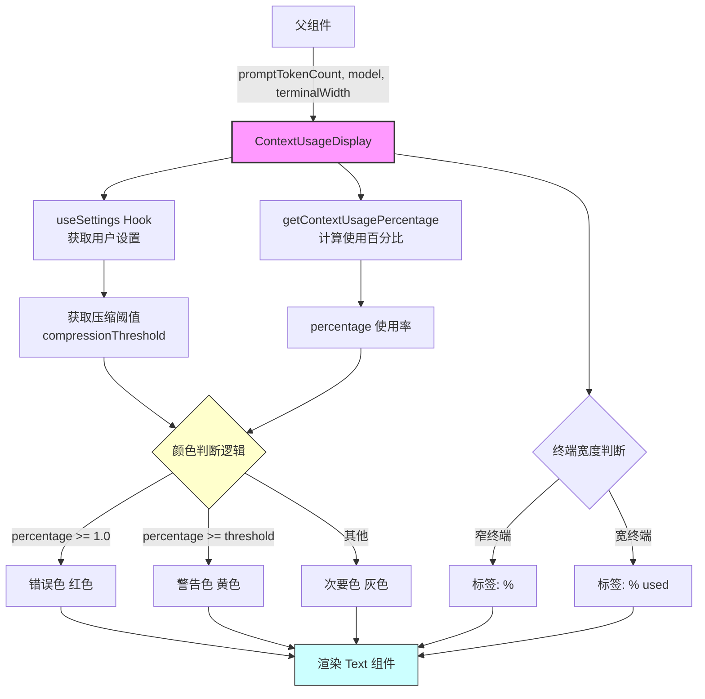
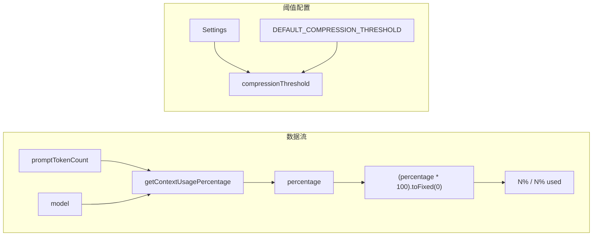

# ContextUsageDisplay.tsx

## 概述

`ContextUsageDisplay` 是一个 React 函数组件，用于在 Gemini CLI 终端界面中显示当前上下文（Context Window）的使用百分比。该组件根据上下文使用率的不同阈值，动态改变文本颜色以向用户发出视觉警告：

- **正常状态**（次要色）：使用率低于压缩阈值
- **警告状态**（黄色系）：使用率达到或超过压缩阈值
- **错误状态**（红色系）：使用率达到或超过 100%

此外，组件还根据终端宽度自适应调整标签文本的长度，在窄终端中使用缩写格式。

## 架构图（Mermaid）





## 核心组件

### 组件 Props（内联类型）

| 属性 | 类型 | 必填 | 说明 |
|------|------|------|------|
| `promptTokenCount` | `number` | 是 | 当前 prompt 使用的 token 数量 |
| `model` | `string \| undefined` | 是 | 当前使用的模型标识符，用于确定模型的上下文窗口大小 |
| `terminalWidth` | `number` | 是 | 当前终端的字符宽度，用于自适应标签显示 |

### ContextUsageDisplay 组件

```typescript
export const ContextUsageDisplay = ({
  promptTokenCount,
  model,
  terminalWidth,
}: { ... }) => { ... }
```

#### 逻辑流程

1. **获取设置**：通过 `useSettings()` Hook 获取用户配置。
2. **计算使用率**：调用 `getContextUsagePercentage(promptTokenCount, model)` 计算上下文使用百分比（0-1 之间的浮点数）。
3. **格式化百分比**：将浮点百分比转换为整数字符串，如 `0.756` → `"76"`。
4. **确定压缩阈值**：从用户设置中读取 `compressionThreshold`，若未设置则使用 `DEFAULT_COMPRESSION_THRESHOLD`。
5. **动态颜色选择**：
   - `percentage >= 1.0` → `theme.status.error`（红色系）
   - `percentage >= threshold` → `theme.status.warning`（黄色系）
   - 其他 → `theme.text.secondary`（灰色系）
6. **自适应标签**：
   - 终端宽度 < `MIN_TERMINAL_WIDTH_FOR_FULL_LABEL` → 显示 `%`
   - 终端宽度 >= `MIN_TERMINAL_WIDTH_FOR_FULL_LABEL` → 显示 `% used`

#### 渲染输出示例

- 宽终端正常状态：`42% used`（灰色）
- 宽终端警告状态：`85% used`（黄色）
- 窄终端错误状态：`100%`（红色）

## 依赖关系

### 内部依赖

| 模块 | 导入内容 | 说明 |
|------|----------|------|
| `../semantic-colors.js` | `theme` | 语义化颜色主题，提供 `text.secondary`、`status.warning`、`status.error` |
| `../utils/contextUsage.js` | `getContextUsagePercentage` | 根据 token 数和模型计算上下文使用百分比的工具函数 |
| `../contexts/SettingsContext.js` | `useSettings` | 设置上下文的 React Hook，获取用户/项目配置 |
| `../constants.js` | `MIN_TERMINAL_WIDTH_FOR_FULL_LABEL`, `DEFAULT_COMPRESSION_THRESHOLD` | UI 常量：最小终端宽度阈值和默认压缩阈值 |

### 外部依赖

| 包名 | 导入内容 | 说明 |
|------|----------|------|
| `ink` | `Text` | Ink 框架的文本组件，用于终端 UI 渲染 |

## 关键实现细节

1. **三级颜色警告系统**：组件实现了一个三级视觉反馈机制。颜色判断的优先级是严格的——首先检查是否 >= 100%（错误），然后检查是否 >= 压缩阈值（警告），最后回落到默认色。这确保了 100% 的错误状态不会被警告状态覆盖。

2. **压缩阈值的可配置性**：压缩阈值 `compressionThreshold` 支持用户自定义（通过 `settings.merged.model?.compressionThreshold`），若未配置则回落到 `DEFAULT_COMPRESSION_THRESHOLD` 常量。这个阈值不仅用于颜色警告，在系统其他部分也用于触发上下文压缩操作。

3. **响应式标签设计**：通过 `MIN_TERMINAL_WIDTH_FOR_FULL_LABEL` 常量，组件在窄终端中自动缩短标签（`%` 代替 `% used`），这是终端 UI 适配的常见模式，确保在各种终端尺寸下信息不会被截断。

4. **精度处理**：使用 `toFixed(0)` 将百分比四舍五入到整数，避免在紧凑的终端 UI 中显示过长的小数，同时保持信息的实用性。

5. **无状态计算**：组件本身不持有任何 state，所有数据要么来自 props，要么来自 Hook（`useSettings`）或纯函数计算（`getContextUsagePercentage`），使组件具有良好的可预测性和可测试性。

6. **Hook 的使用**：`useSettings()` 是组件中唯一的 Hook 调用，它连接到 React Context 系统，使组件能够响应设置变更并自动重新渲染。

7. **空值合并运算符**：`settings.merged.model?.compressionThreshold ?? DEFAULT_COMPRESSION_THRESHOLD` 使用可选链和空值合并运算符，安全地处理 settings 对象中可能缺失的嵌套属性。
