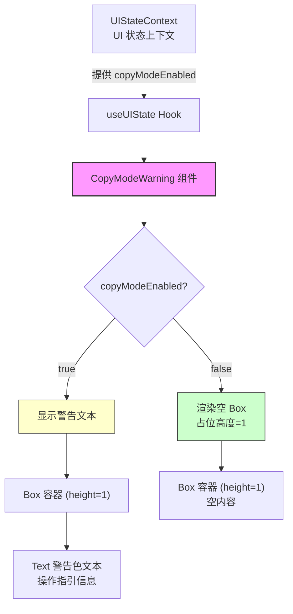
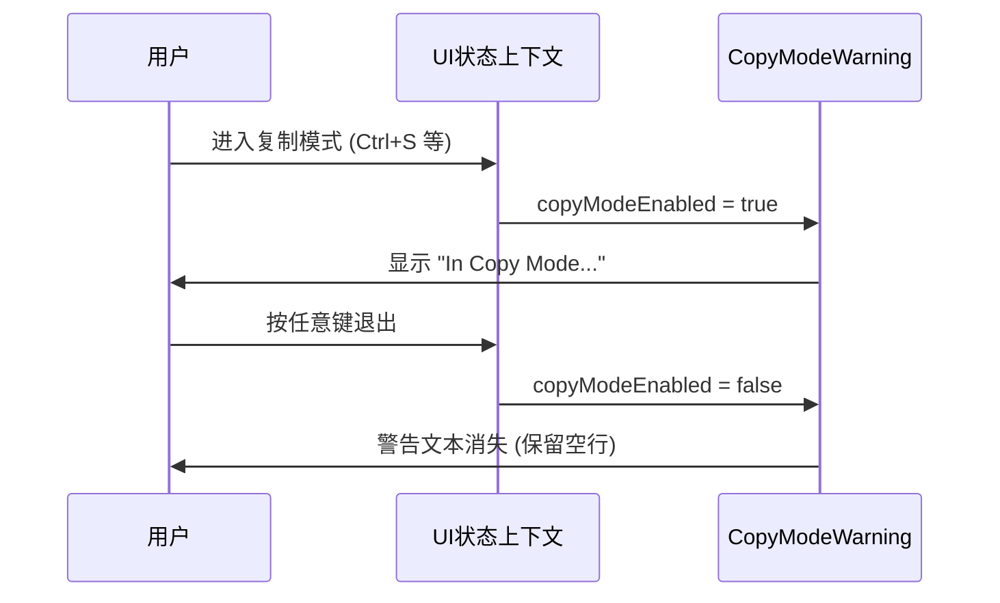

# CopyModeWarning.tsx

## 概述

`CopyModeWarning` 是一个 React 函数组件，用于在 Gemini CLI 终端界面中显示"复制模式"（Copy Mode）的状态提示条。当用户进入复制模式时，组件会以警告色显示操作指引文本，告知用户如何滚动查看内容以及如何退出复制模式。

复制模式是 Gemini CLI 的一种特殊交互模式，允许用户在终端中自由滚动和选择文本进行复制。该组件作为模式状态的视觉指示器，确保用户始终知道自己处于特殊模式中，并知道如何退出。

## 架构图（Mermaid）





## 核心组件

### CopyModeWarning 组件

```typescript
export const CopyModeWarning: React.FC = () => { ... }
```

该组件无 props 输入，完全依赖 `useUIState` Hook 从 Context 中获取状态。

#### 状态获取

```typescript
const { copyModeEnabled } = useUIState();
```

从 UI 状态上下文中解构获取 `copyModeEnabled` 布尔值。

#### 渲染逻辑

组件始终渲染一个固定高度为 1 行的 `Box` 容器：

- **`copyModeEnabled === true`**：在 Box 内渲染警告色文本：
  > In Copy Mode. Use Page Up/Down to scroll. Press Ctrl+S or any other key to exit.
- **`copyModeEnabled === false`**：Box 内为空，但仍然占据 1 行高度。

#### 渲染结构

```
<Box height={1}>
  {copyModeEnabled && (
    <Text color={警告色}>
      In Copy Mode. Use Page Up/Down to scroll. Press Ctrl+S or any other key to exit.
    </Text>
  )}
</Box>
```

## 依赖关系

### 内部依赖

| 模块 | 导入内容 | 说明 |
|------|----------|------|
| `../contexts/UIStateContext.js` | `useUIState` | UI 状态上下文 Hook，提供 `copyModeEnabled` 等 UI 模式状态 |
| `../semantic-colors.js` | `theme` | 语义化颜色主题，使用 `theme.status.warning` 警告色 |

### 外部依赖

| 包名 | 导入内容 | 说明 |
|------|----------|------|
| `react` | `React`（类型导入） | React 类型定义 |
| `ink` | `Box`, `Text` | Ink 框架的布局和文本组件 |

## 关键实现细节

1. **固定高度占位**：`Box` 组件始终设置 `height={1}`，无论复制模式是否激活。这是一个重要的布局设计决策——通过保持固定的占位空间，避免了模式切换时导致的界面跳动（layout shift）。当警告消失时，空的 1 行高度 Box 仍然存在，保持整体 UI 布局的稳定性。

2. **Context 驱动的状态管理**：组件不接受任何 props，完全通过 `useUIState` Hook 连接到 `UIStateContext`。这意味着复制模式的状态由全局 UI 状态管理，任何触发复制模式开关的操作（如快捷键）都会自动触发此组件的重新渲染。

3. **警告色彩语义**：使用 `theme.status.warning`（黄色系）而非错误色或信息色，因为复制模式是一种需要用户注意但非错误的临时状态。警告色在视觉上足够醒目，能引起用户注意。

4. **操作指引文本设计**：提示文本包含三个关键信息：
   - 当前状态确认："In Copy Mode"
   - 操作指引："Use Page Up/Down to scroll"
   - 退出方式："Press Ctrl+S or any other key to exit"
   这种"状态-操作-退出"三段式设计确保用户获得完整的操作指引。

5. **简洁的组件设计**：整个组件仅 14 行代码（不含许可证头），没有本地 state、没有副作用、没有复杂逻辑，是一个极其简洁的展示型组件。这种设计使其易于理解、测试和维护。

6. **条件渲染与短路求值**：使用 `{copyModeEnabled && <Text>...</Text>}` 短路求值模式进行条件渲染，这是 React 中最简洁的条件渲染方式之一。由于 `copyModeEnabled` 是布尔值，不会出现渲染 `0` 或 `""` 等 falsy 值的问题。
