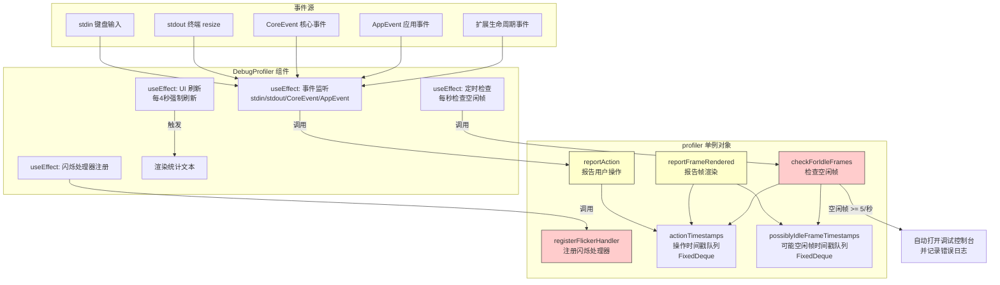
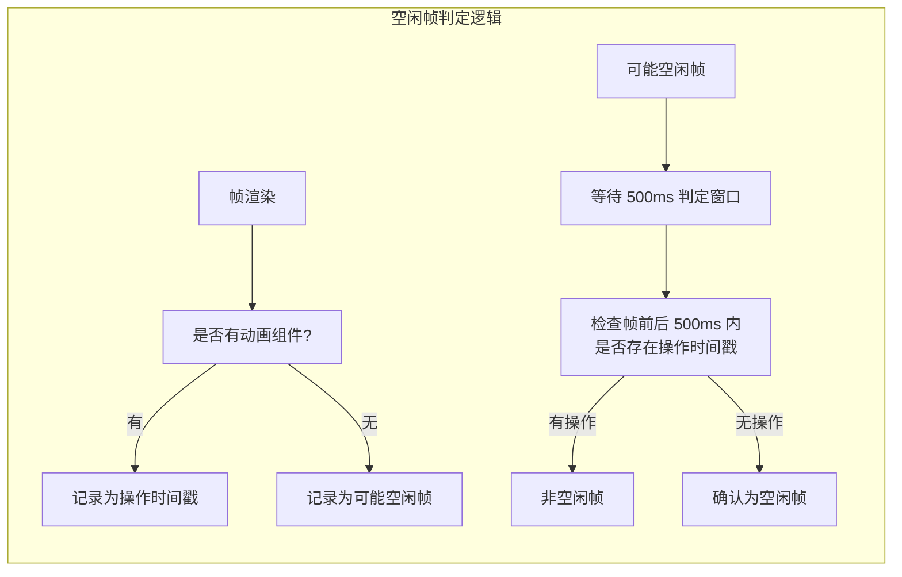
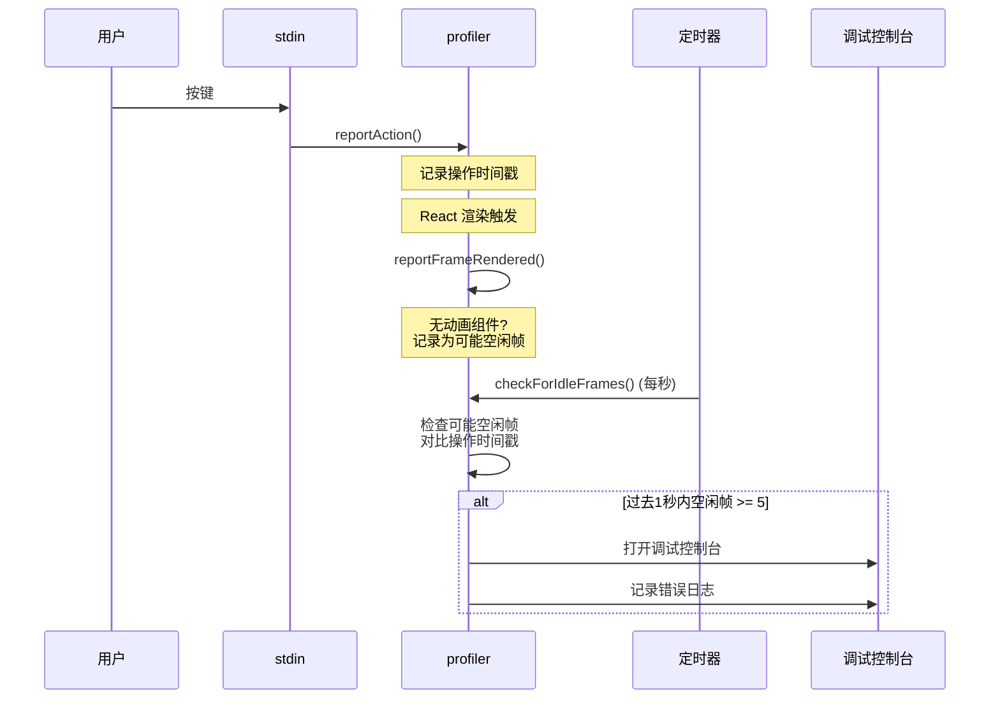

# DebugProfiler.tsx

## 概述

`DebugProfiler` 是 Gemini CLI 中的一个性能调试组件，用于监控和检测终端 UI 的渲染性能问题。它是整个项目中最复杂的调试工具之一，核心职责包括：

1. **帧计数追踪**：统计总渲染帧数、空闲帧数和闪烁帧数。
2. **空闲帧检测**：识别在没有用户操作或系统事件时仍然触发的渲染帧，这些通常暗示 React 状态管理中存在无限循环的 bug。
3. **闪烁检测**：检测 UI 闪烁（flicker）事件，这类事件会导致 UI 不稳定。
4. **自动告警**：当检测到严重的空闲帧问题时（过去一秒内 >= 5 个空闲帧），自动打开调试控制台并记录错误日志。
5. **可视化统计**：在启用调试模式时，在终端界面上显示实时的渲染统计信息。

该组件包含两大部分：一个导出的 `profiler` 单例对象（负责数据收集和分析逻辑），以及 `DebugProfiler` React 组件（负责事件监听和 UI 渲染）。

## 架构图（Mermaid）







## 核心组件

### 常量

| 常量 | 值 | 说明 |
|------|------|------|
| `MIN_TIME_FROM_ACTION_TO_BE_IDLE` | `500` | 帧渲染与最近操作之间的最小时间间隔（毫秒），超过此值才可能被判定为空闲帧 |
| `ACTION_TIMESTAMP_CAPACITY` | `2048` | 操作时间戳队列的最大容量 |
| `FRAME_TIMESTAMP_CAPACITY` | `2048` | 帧时间戳队列的最大容量 |

### profiler 单例对象

```typescript
export const profiler = { ... }
```

这是一个导出的可变单例对象，在组件外部定义，所有 `DebugProfiler` 实例共享同一份数据。

#### 状态属性

| 属性 | 类型 | 初始值 | 说明 |
|------|------|--------|------|
| `profilersActive` | `number` | `0` | 当前活跃的 Profiler 组件实例数 |
| `numFrames` | `number` | `0` | 总渲染帧数 |
| `totalIdleFrames` | `number` | `0` | 累计空闲帧数 |
| `totalFlickerFrames` | `number` | `0` | 累计闪烁帧数 |
| `hasLoggedFirstFlicker` | `boolean` | `false` | 是否已记录第一次闪烁日志 |
| `lastFrameStartTime` | `number` | `0` | 最近一帧的开始时间 |
| `openedDebugConsole` | `boolean` | `false` | 是否已自动打开调试控制台 |
| `lastActionTimestamp` | `number` | `0` | 最近一次操作的时间戳 |
| `possiblyIdleFrameTimestamps` | `FixedDeque<number>` | 空队列(2048) | 可能的空闲帧时间戳双端队列 |
| `actionTimestamps` | `FixedDeque<number>` | 空队列(2048) | 操作时间戳双端队列 |

#### 方法

##### `reportAction()`

报告一次用户操作或系统事件。将当前时间戳记录到 `actionTimestamps` 队列中。

- **防抖机制**：两次操作之间间隔不足 16ms 时会忽略（约 60fps 的一帧时间），避免频繁操作导致队列过快填满。
- **队列溢出处理**：当队列满时，移除最旧的时间戳（`shift()`）再插入新的。

##### `reportFrameRendered()`

报告一帧渲染完成。根据当前是否存在动画组件做不同处理：

- **无动画组件时**（`debugState.debugNumAnimatedComponents === 0`）：将帧时间戳记录到 `possiblyIdleFrameTimestamps` 队列，等待后续判定。
- **有动画组件时**：将帧时间戳记录到 `actionTimestamps` 队列（因为有动画组件旋转时渲染是预期行为）。
- **守卫条件**：如果没有活跃的 Profiler（`profilersActive === 0`），直接返回不做任何处理。

##### `checkForIdleFrames()`

核心检测算法，周期性调用（每秒一次），判定之前记录的"可能空闲帧"是否真的是空闲帧。

**判定逻辑**：
1. 计算判定截止时间：`当前时间 - 500ms`（确保帧后也有足够的观察窗口）。
2. 遍历所有时间戳 <= 截止时间的可能空闲帧。
3. 对每个帧，检查其前后 500ms 范围 `[帧时间 - 500ms, 帧时间 + 500ms]` 内是否存在操作时间戳。
4. 如果无操作，确认为空闲帧，计入 `totalIdleFrames`。
5. 如果过去一秒内空闲帧 >= 5 个，自动打开调试控制台并记录严重错误。

**操作时间戳清理**：在检查过程中，会移除已过时的操作时间戳（早于当前帧检查窗口起始时间的），保持队列的紧凑。

##### `registerFlickerHandler(constrainHeight: boolean)`

注册闪烁事件处理器。

- 仅在 `constrainHeight` 为 `true` 时生效（因为不约束高度时溢出屏幕是预期行为）。
- 每次闪烁事件：`totalFlickerFrames++`，调用 `reportAction()`。
- 首次闪烁时记录错误日志。
- 返回清理函数（用于移除事件监听器）。

### DebugProfiler 组件

```typescript
export const DebugProfiler = () => { ... }
```

#### 状态

| Hook | 说明 |
|------|------|
| `useUIState()` | 获取 `showDebugProfiler`（是否显示调试面板）和 `constrainHeight`（是否约束高度） |
| `useState(0)` | `forceRefresh` 计数器，用于强制组件重新渲染以更新统计数据 |

#### Effect 1：事件监听（行 151-202）

- **触发条件**：组件挂载时（空依赖数组 `[]`）
- **行为**：
  - 递增 `profiler.profilersActive`
  - 监听 `stdin` 的 `data` 事件（键盘输入）
  - 监听 `stdout` 的 `resize` 事件（终端大小变化）
  - 监听所有 `CoreEvent` 枚举值对应的事件
  - 监听所有 `AppEvent` 枚举值对应的事件
  - 监听扩展生命周期事件：`extensionsStarting`、`extensionsStopping`
  - 所有事件统一触发 `profiler.reportAction()`
- **清理**：移除所有事件监听器，递减 `profilersActive`

#### Effect 2：定时空闲帧检查（行 204-209）

- **触发条件**：组件挂载时
- **行为**：每 1000ms 调用 `profiler.checkForIdleFrames()`
- **清理**：清除 interval

#### Effect 3：闪烁处理器注册（行 211-214）

- **触发条件**：`constrainHeight` 变化时
- **行为**：调用 `profiler.registerFlickerHandler(constrainHeight)`
- **清理**：由 `registerFlickerHandler` 返回的清理函数处理

#### Effect 4：UI 刷新定时器（行 217-228）

- **触发条件**：`showDebugProfiler` 变化时
- **行为**：
  - 仅在 `showDebugProfiler` 为 `true` 时激活
  - 每 4000ms 强制递增 `forceRefresh`，触发组件重新渲染以更新统计数据
  - 同时调用 `reportAction()`，避免自身刷新被计为空闲帧
- **设计考量**：4 秒的较长间隔是有意为之，因为更新 UI 本身会触发帧渲染，过于频繁会干扰测量结果

#### 渲染输出

```
Renders: 150 (total), 3 (idle), 0 (flicker)
```

- 总帧数：警告色（黄色）
- 空闲帧数：错误色（红色）
- 闪烁帧数：错误色（红色）
- 使用 `key={forceRefresh}` 确保 `forceRefresh` 变化时组件被完全重新创建（而非仅更新）

## 依赖关系

### 内部依赖

| 模块 | 导入内容 | 说明 |
|------|----------|------|
| `../semantic-colors.js` | `theme` | 语义化颜色主题，使用 `status.warning` 和 `status.error` |
| `../contexts/UIStateContext.js` | `useUIState` | UI 状态上下文 Hook，获取 `showDebugProfiler` 和 `constrainHeight` |
| `../debug.js` | `debugState` | 调试状态单例，提供 `debugNumAnimatedComponents` 等指标 |
| `../../utils/events.js` | `appEvents`, `AppEvent` | 应用级事件发射器和事件枚举 |
| `@google/gemini-cli-core` | `coreEvents`, `CoreEvent`, `debugLogger` | 核心事件发射器、核心事件枚举和调试日志记录器 |

### 外部依赖

| 包名 | 导入内容 | 说明 |
|------|----------|------|
| `ink` | `Text` | Ink 框架的文本组件 |
| `react` | `useEffect`, `useState` | React Hook |
| `mnemonist` | `FixedDeque` | 固定容量双端队列数据结构，用于高效管理时间戳缓冲区 |

## 关键实现细节

1. **FixedDeque 数据结构选择**：使用 `mnemonist` 库的 `FixedDeque`（固定容量双端队列）而非普通数组来存储时间戳。这提供了 O(1) 的头部/尾部插入和移除操作，且固定容量防止了内存无限增长。容量设置为 2048，足以覆盖几分钟的操作历史。

2. **空闲帧检测的双窗口算法**：空闲帧的判定采用对称的时间窗口——帧渲染时间前后各 500ms 内都不能有操作。这意味着一个帧需要在完全"安静"的 1 秒窗口中心才会被判定为空闲。这种保守的策略减少了误报。

3. **延迟判定机制**：帧渲染时不立即判定是否空闲，而是先记录到 `possiblyIdleFrameTimestamps` 队列中，等待至少 500ms 后再由 `checkForIdleFrames()` 回顾性判定。这是因为帧渲染后可能立即有操作发生，需要等待足够时间才能确认"帧后也无操作"。

4. **动画组件感知**：通过 `debugState.debugNumAnimatedComponents` 感知当前是否存在旋转加载器等动画组件。有动画组件时的帧渲染是预期行为，不应被误判为空闲帧。因此有动画时，帧渲染被视为"操作"而非"可能空闲帧"。

5. **操作报告的 16ms 防抖**：`reportAction()` 中的 16ms 阈值（约一帧时间）防止了同一帧内的多次事件被重复记录，在保持精度的同时控制了队列的增长速度。

6. **自动告警与调试控制台**：当过去一秒内检测到 >= 5 个空闲帧时，系统会：
   - 自动打开调试控制台（仅首次触发）
   - 通过 `debugLogger.error()` 记录包含具体帧数的错误信息
   这为开发者提供了即时的性能问题反馈。

7. **全事件覆盖策略**：Effect 1 中监听了所有 `CoreEvent`、`AppEvent` 以及扩展生命周期事件，确保任何"合法"的 UI 更新原因都被记录为操作。这种全覆盖策略极大地减少了空闲帧检测的误报率。

8. **观测者效应的缓解**：UI 刷新间隔设为 4 秒（远大于 1 秒的检测窗口），并在每次刷新时调用 `reportAction()`。这两个措施共同确保了调试器自身的渲染不会被误判为空闲帧（观测者效应）。

9. **key={forceRefresh} 的使用**：在 `<Text>` 上使用 `key={forceRefresh}` 是一个巧妙的技巧。由于 `profiler` 对象的属性变更不会触发 React 重新渲染（它不是 state 也不是 props），通过改变 `key` 强制 React 销毁旧组件并创建新组件，从而强制读取 `profiler` 的最新值。

10. **Profiler 实例计数**：`profilersActive` 计数器跟踪活跃的 Profiler 组件数量，`reportFrameRendered()` 在无活跃 Profiler 时直接返回。这确保了在 Profiler 未挂载时不会产生不必要的性能开销。

11. **闪烁检测与高度约束的关系**：闪烁处理器仅在 `constrainHeight` 为 `true` 时生效。当 UI 不约束高度时（如全屏滚动模式），内容溢出是正常行为而非闪烁，因此无需检测。

12. **扩展事件的特殊处理**：`extensionsStarting` 和 `extensionsStopping` 是不属于 `CoreEvent` 枚举的核心事件，需要单独注册。代码注释说明这是为了防止扩展加载/卸载期间的误报。
