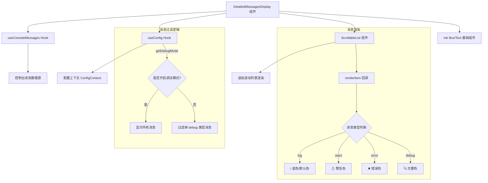

# DetailedMessagesDisplay.tsx

## 概述

`DetailedMessagesDisplay` 是一个 React（Ink）函数组件，用于在终端 CLI 界面中渲染**调试控制台面板**（Debug Console）。它以可滚动列表的形式显示系统产生的各类控制台消息（log、warn、error、debug），并根据消息类型以不同颜色和图标进行视觉区分。用户可以通过 **F12** 键关闭该面板。

该组件是 Gemini CLI 调试/诊断功能的核心 UI 部分，帮助开发者在使用 CLI 时实时查看内部日志输出。

## 架构图（Mermaid）



## 核心组件

### 1. Props 接口 `DetailedMessagesDisplayProps`

| 属性 | 类型 | 说明 |
|------|------|------|
| `maxHeight` | `number \| undefined` | 面板最大高度（终端行数），用于约束渲染区域 |
| `width` | `number` | 面板宽度（终端列数） |
| `hasFocus` | `boolean` | 是否获得焦点，传递给 `ScrollableList` 控制键盘滚动 |

### 2. 常量

| 常量 | 值 | 说明 |
|------|-----|------|
| `iconBoxWidth` | `3` | 消息类型图标列的固定宽度（字符数） |
| `borderAndPadding` | `3` | 边框和内边距占用的字符宽度 |

### 3. 消息过滤逻辑

组件使用 `useMemo` 对消息进行过滤：

```typescript
const messages = useMemo(() => {
  if (config.getDebugMode()) {
    return consoleMessages;        // 调试模式：显示所有消息
  }
  return consoleMessages.filter((msg) => msg.type !== 'debug'); // 普通模式：过滤 debug 消息
}, [consoleMessages, config]);
```

- 当 `config.getDebugMode()` 返回 `true` 时，所有消息（包括 debug 类型）都会被显示。
- 否则，`debug` 类型的消息将被过滤掉。

### 4. 行高估算函数 `estimatedItemHeight`

```typescript
const estimatedItemHeight = useCallback(
  (index: number) => {
    const textWidth = width - borderAndPadding - iconBoxWidth;
    const lines = Math.ceil((msg.content?.length || 1) / textWidth);
    return Math.max(1, lines);
  },
  [width, messages],
);
```

该回调根据消息内容长度和可用文本宽度，估算每条消息在终端中占据的行数，供 `ScrollableList` 进行虚拟滚动计算。公式为：`行数 = ceil(内容字符数 / 可用文本宽度)`。

### 5. 消息类型与视觉映射

| 消息类型 | 图标 | 文字颜色 |
|----------|------|----------|
| `log`（默认） | `ℹ` | `theme.text.primary`（主色） |
| `warn` | `⚠` | `theme.status.warning`（警告色） |
| `error` | `✖` | `theme.status.error`（错误色） |
| `debug` | `🔍` | `theme.text.secondary`（次要色） |

### 6. 重复消息计数

当消息的 `count` 属性大于 1 时，会在消息内容后追加显示 `(xN)` 标记，使用次要色文字，避免重复消息刷屏。

### 7. ScrollableList 配置

| 属性 | 值 | 说明 |
|------|-----|------|
| `data` | `messages` | 过滤后的消息数组 |
| `keyExtractor` | `(item, index) => \`${item.content}-${index}\`` | 列表项唯一键 |
| `estimatedItemHeight` | 动态计算函数 | 行高估算 |
| `hasFocus` | 外部传入 | 控制键盘滚动交互 |
| `initialScrollIndex` | `Number.MAX_SAFE_INTEGER` | 初始滚动到列表底部（最新消息） |

### 8. 空数据处理

当 `messages.length === 0` 时，组件返回 `null`，不渲染任何内容。

## 依赖关系

### 内部依赖

| 模块路径 | 导入内容 | 用途 |
|----------|----------|------|
| `../semantic-colors.js` | `theme` | 语义化颜色主题对象，提供 `text.primary`、`text.secondary`、`status.warning`、`status.error`、`border.default` 等颜色值 |
| `../types.js` | `ConsoleMessageItem`（类型） | 控制台消息项的类型定义，包含 `type`、`content`、`count` 等字段 |
| `./shared/ScrollableList.js` | `ScrollableList`、`ScrollableListRef`（类型） | 可滚动列表组件及其 ref 类型，提供虚拟滚动能力 |
| `../hooks/useConsoleMessages.js` | `useConsoleMessages` | 自定义 Hook，获取全局控制台消息列表 |
| `../contexts/ConfigContext.js` | `useConfig` | 自定义 Hook，获取配置上下文（用于判断调试模式） |

### 外部依赖

| 包名 | 导入内容 | 用途 |
|------|----------|------|
| `react` | `useRef`、`useCallback`、`useMemo`（及 `React` 类型） | React 核心 Hooks |
| `ink` | `Box`、`Text` | Ink 终端 UI 基础组件，用于布局和文本渲染 |

## 关键实现细节

1. **虚拟滚动与性能优化**：组件不直接渲染所有消息，而是通过 `ScrollableList` 组件实现虚拟滚动。`estimatedItemHeight` 回调使滚动组件能够高效估算不可见项的高度，从而在大量消息时保持流畅性能。

2. **自动滚动到底部**：`initialScrollIndex` 设为 `Number.MAX_SAFE_INTEGER`，确保组件首次渲染时自动定位到消息列表的最底部，让用户看到最新的消息输出。

3. **调试模式开关联动**：消息过滤依赖 `config.getDebugMode()` 的返回值。在非调试模式下，`debug` 类型消息被静默过滤，减少普通用户的信息干扰。切换调试模式后，`useMemo` 会因依赖变化自动重新计算。

4. **响应式宽度计算**：`estimatedItemHeight` 函数中使用 `width - borderAndPadding - iconBoxWidth` 计算实际可用文本宽度，确保行高估算能正确反映终端窗口大小的变化。

5. **圆角边框面板**：使用 `borderStyle="round"` 给面板添加圆角边框样式，配合 `theme.border.default` 颜色，在终端中呈现精致的 UI 效果。

6. **焦点控制**：`hasFocus` 属性向下传递给 `ScrollableList`，只有在获得焦点时才响应键盘滚动事件，避免与其他 UI 组件的键盘交互冲突。

7. **Ref 引用**：组件创建了 `scrollableListRef` 引用 `ScrollableList`，虽然当前代码中未直接使用该 ref 进行命令式操作，但为未来的扩展（如外部控制滚动位置）预留了接口。
