# DialogManager.tsx

## 概述

`DialogManager` 是 Gemini CLI 中的**对话框管理器**组件，充当整个应用 UI 层的**对话框路由中枢**。它根据全局 UI 状态（`UIState`）中各种标志位的优先级，决定当前应该渲染哪一个对话框/弹窗组件。在任意时刻，最多只会显示一个对话框，采用**优先级短路**模式：从高优先级状态到低优先级状态逐一检查，第一个满足条件的对话框即被渲染，后续条件不再检查。

该组件是 Gemini CLI 用户交互流程的核心调度器，管理着从认证、权限确认、配额处理到设置界面等几乎所有模态交互场景。

## 架构图（Mermaid）

```mermaid
graph TD
    DM[DialogManager 对话框管理器] --> US[useUIState 状态上下文]
    DM --> UA[useUIActions 操作上下文]
    DM --> CF[useConfig 配置上下文]
    DM --> ST[useSettings 设置上下文]

    DM --> |优先级 1| ASD[AdminSettingsChangedDialog<br/>管理员设置变更]
    DM --> |优先级 2| ITCD[IdeTrustChangeDialog<br/>IDE 信任变更]
    DM --> |优先级 3| NAN[NewAgentsNotification<br/>新代理通知]
    DM --> |优先级 4| PQD[ProQuotaDialog<br/>Pro 配额对话框]
    DM --> |优先级 5| VD[ValidationDialog<br/>验证对话框]
    DM --> |优先级 6| OMD[OverageMenuDialog<br/>超额菜单]
    DM --> |优先级 7| EWD[EmptyWalletDialog<br/>空钱包对话框]
    DM --> |优先级 8| IIN[IdeIntegrationNudge<br/>IDE 集成提示]
    DM --> |优先级 9| FTD[FolderTrustDialog<br/>文件夹信任对话框]
    DM --> |优先级 10| PUD[PolicyUpdateDialog<br/>策略更新对话框]
    DM --> |优先级 11| LDC[LoopDetectionConfirmation<br/>循环检测确认]
    DM --> |优先级 12| CP1[ConsentPrompt<br/>权限确认]
    DM --> |优先级 13| CP2[ConsentPrompt<br/>命令确认]
    DM --> |优先级 14| CP3[ConsentPrompt<br/>认证同意]
    DM --> |优先级 15| CP4[ConsentPrompt<br/>扩展更新确认]
    DM --> |优先级 16| TD[ThemeDialog<br/>主题选择]
    DM --> |优先级 17| SD[SettingsDialog<br/>设置对话框]
    DM --> |优先级 18| MD[ModelDialog<br/>模型选择]
    DM --> |优先级 19| ACD[AgentConfigDialog<br/>代理配置]
    DM --> |优先级 20| BAD[BannedAccountDialog<br/>账号封禁]
    DM --> |优先级 21| AIP[AuthInProgress<br/>认证进行中]
    DM --> |优先级 22| AAD[ApiAuthDialog<br/>API 密钥输入]
    DM --> |优先级 23| AD[AuthDialog<br/>认证对话框]
    DM --> |优先级 24| ESD[EditorSettingsDialog<br/>编辑器设置]
    DM --> |优先级 25| PN[PrivacyNotice<br/>隐私声明]
    DM --> |优先级 26| SB[SessionBrowser<br/>会话浏览器]
    DM --> |优先级 27| PMTD[PermissionsModifyTrustDialog<br/>权限信任修改]
```

## 核心组件

### 1. Props 接口 `DialogManagerProps`

| 属性 | 类型 | 说明 |
|------|------|------|
| `addItem` | `UseHistoryManagerReturn['addItem']` | 历史记录管理器的添加项方法，传递给需要记录操作的子对话框 |
| `terminalWidth` | `number` | 终端宽度，传递给需要宽度信息的对话框（如 `ConsentPrompt`） |

### 2. 对话框优先级顺序（从高到低）

以下是 `DialogManager` 中各对话框的检查顺序与触发条件：

| 优先级 | 触发条件 | 渲染组件 | 场景描述 |
|--------|----------|----------|----------|
| 1 | `uiState.adminSettingsChanged` | `AdminSettingsChangedDialog` | 管理员设置发生变更 |
| 2 | `uiState.showIdeRestartPrompt` | `IdeTrustChangeDialog` | IDE 信任设置变更需重启 |
| 3 | `uiState.newAgents` | `NewAgentsNotification` | 发现新的代理（Agent） |
| 4 | `uiState.quota.proQuotaRequest` | `ProQuotaDialog` | Pro 用户配额不足 |
| 5 | `uiState.quota.validationRequest` | `ValidationDialog` | 需要用户验证 |
| 6 | `uiState.quota.overageMenuRequest` | `OverageMenuDialog` | 使用量超额 |
| 7 | `uiState.quota.emptyWalletRequest` | `EmptyWalletDialog` | 钱包余额为零 |
| 8 | `uiState.shouldShowIdePrompt` | `IdeIntegrationNudge` | IDE 集成引导提示 |
| 9 | `uiState.isFolderTrustDialogOpen` | `FolderTrustDialog` | 文件夹信任确认 |
| 10 | `uiState.isPolicyUpdateDialogOpen` | `PolicyUpdateDialog` | 策略更新确认 |
| 11 | `uiState.loopDetectionConfirmationRequest` | `LoopDetectionConfirmation` | AI 循环检测确认 |
| 12 | `uiState.permissionConfirmationRequest` | `ConsentPrompt` | 工作区外文件读取权限确认 |
| 13 | `uiState.commandConfirmationRequest` | `ConsentPrompt` | 命令执行确认 |
| 14 | `uiState.authConsentRequest` | `ConsentPrompt` | 认证同意确认 |
| 15 | `confirmUpdateExtensionRequests.length > 0` | `ConsentPrompt` | 扩展更新确认 |
| 16 | `uiState.isThemeDialogOpen` | `ThemeDialog` | 主题选择对话框 |
| 17 | `uiState.isSettingsDialogOpen` | `SettingsDialog` | 设置对话框 |
| 18 | `uiState.isModelDialogOpen` | `ModelDialog` | 模型选择对话框 |
| 19 | `uiState.isAgentConfigDialogOpen` | `AgentConfigDialog` | 代理配置对话框 |
| 20 | `uiState.accountSuspensionInfo` | `BannedAccountDialog` | 账号被封禁 |
| 21 | `uiState.isAuthenticating` | `AuthInProgress` | 认证进行中（等待中） |
| 22 | `uiState.isAwaitingApiKeyInput` | `ApiAuthDialog` | API 密钥输入 |
| 23 | `uiState.isAuthDialogOpen` | `AuthDialog` | 认证方式选择 |
| 24 | `uiState.isEditorDialogOpen` | `EditorSettingsDialog` | 编辑器设置 |
| 25 | `uiState.showPrivacyNotice` | `PrivacyNotice` | 隐私声明展示 |
| 26 | `uiState.isSessionBrowserOpen` | `SessionBrowser` | 会话浏览器 |
| 27 | `uiState.isPermissionsDialogOpen` | `PermissionsModifyTrustDialog` | 权限信任修改 |

### 3. 特殊处理逻辑

#### ConsentPrompt 的多种用途

`ConsentPrompt` 被复用于四种不同的确认场景，通过不同的 `prompt` 和 `onConfirm` 回调区分：

- **权限确认**：当请求的文件路径在工作区外时，展示文件列表并请求用户授权。
- **命令确认**：AI 执行命令前的用户确认。
- **认证同意**：认证流程中的同意确认。
- **扩展更新确认**：从 `confirmUpdateExtensionRequests` 队列中取第一个请求进行确认。

代码注释特别说明了 `commandConfirmationRequest` 和 `authConsentRequest` 保持分离的原因：

> "kept separate to avoid focus deadlocks and state race conditions between the synchronous command loop and the asynchronous auth flow."

即为了避免同步命令循环与异步认证流之间的焦点死锁和状态竞争条件。

#### AgentConfigDialog 的多条件守卫

`AgentConfigDialog` 的渲染需要同时满足四个条件：
- `isAgentConfigDialogOpen` 为 true
- `selectedAgentName` 存在
- `selectedAgentDisplayName` 存在
- `selectedAgentDefinition` 存在

关闭后还会触发代理注册表的重新加载 (`agentRegistry.reload()`)。

#### BannedAccountDialog 的退出处理

当用户账号被封禁时，提供两个选项：
- **退出**：调用 `process.exit(1)` 终止进程
- **切换认证**：调用 `uiActions.clearAccountSuspension()` 清除封禁状态

#### SettingsDialog 的重启机制

设置对话框的 `onRestartRequest` 绑定到 `relaunchApp` 工具函数，允许在设置变更后重新启动应用。

## 依赖关系

### 内部依赖

| 模块路径 | 导入内容 | 用途 |
|----------|----------|------|
| `../IdeIntegrationNudge.js` | `IdeIntegrationNudge` | IDE 集成引导组件 |
| `./LoopDetectionConfirmation.js` | `LoopDetectionConfirmation` | 循环检测确认组件 |
| `./FolderTrustDialog.js` | `FolderTrustDialog` | 文件夹信任对话框 |
| `./ConsentPrompt.js` | `ConsentPrompt` | 通用同意确认组件 |
| `./ThemeDialog.js` | `ThemeDialog` | 主题选择对话框 |
| `./SettingsDialog.js` | `SettingsDialog` | 设置对话框 |
| `../auth/AuthInProgress.js` | `AuthInProgress` | 认证进行中指示器 |
| `../auth/AuthDialog.js` | `AuthDialog` | 认证对话框 |
| `../auth/BannedAccountDialog.js` | `BannedAccountDialog` | 账号封禁对话框 |
| `../auth/ApiAuthDialog.js` | `ApiAuthDialog` | API 密钥输入对话框 |
| `./EditorSettingsDialog.js` | `EditorSettingsDialog` | 编辑器设置对话框 |
| `../privacy/PrivacyNotice.js` | `PrivacyNotice` | 隐私声明组件 |
| `./ProQuotaDialog.js` | `ProQuotaDialog` | Pro 配额对话框 |
| `./ValidationDialog.js` | `ValidationDialog` | 验证对话框 |
| `./OverageMenuDialog.js` | `OverageMenuDialog` | 超额菜单对话框 |
| `./EmptyWalletDialog.js` | `EmptyWalletDialog` | 空钱包对话框 |
| `./SessionBrowser.js` | `SessionBrowser` | 会话浏览器 |
| `./PermissionsModifyTrustDialog.js` | `PermissionsModifyTrustDialog` | 权限信任修改对话框 |
| `./ModelDialog.js` | `ModelDialog` | 模型选择对话框 |
| `./AdminSettingsChangedDialog.js` | `AdminSettingsChangedDialog` | 管理员设置变更对话框 |
| `./IdeTrustChangeDialog.js` | `IdeTrustChangeDialog` | IDE 信任变更对话框 |
| `./NewAgentsNotification.js` | `NewAgentsNotification` | 新代理通知组件 |
| `./AgentConfigDialog.js` | `AgentConfigDialog` | 代理配置对话框 |
| `./PolicyUpdateDialog.js` | `PolicyUpdateDialog` | 策略更新对话框 |
| `../../utils/processUtils.js` | `relaunchApp` | 应用重启工具函数 |
| `../semantic-colors.js` | `theme` | 语义化颜色主题 |
| `../contexts/UIStateContext.js` | `useUIState` | UI 状态上下文 Hook |
| `../contexts/UIActionsContext.js` | `useUIActions` | UI 操作上下文 Hook |
| `../contexts/ConfigContext.js` | `useConfig` | 配置上下文 Hook |
| `../contexts/SettingsContext.js` | `useSettings` | 设置上下文 Hook |
| `../hooks/useHistoryManager.js` | `UseHistoryManagerReturn`（类型） | 历史管理器返回类型 |

### 外部依赖

| 包名 | 导入内容 | 用途 |
|------|----------|------|
| `ink` | `Box`、`Text` | Ink 终端 UI 基础组件 |
| `node:process` | `process` | Node.js 进程控制（用于 `process.exit`） |

## 关键实现细节

1. **优先级短路渲染模式**：`DialogManager` 使用一系列 `if-return` 语句实现优先级路由。每个条件检查对应一个 UI 状态标志，第一个为 `true` 的条件对应的对话框会被渲染，后续所有条件被跳过。如果没有任何条件满足，返回 `null`（不渲染对话框）。

2. **单一对话框原则**：在任何时刻，`DialogManager` 最多只渲染一个对话框。这确保了用户不会面对多个重叠的模态交互，同时简化了状态管理。

3. **状态与操作分离**：组件从 `useUIState()` 读取状态，从 `useUIActions()` 获取操作回调。状态驱动渲染决策，操作回调作为 props 传递给子对话框，形成清晰的单向数据流。

4. **配额系统分层**：配额相关对话框按严重程度排序：`proQuotaRequest` > `validationRequest` > `overageMenuRequest` > `emptyWalletRequest`，确保最关键的配额问题优先处理。

5. **终端高度自适应**：多个对话框接收 `availableTerminalHeight`（计算为 `terminalHeight - staticExtraHeight`），用于根据终端可用空间动态调整对话框高度。`constrainHeight` 标志控制是否启用高度约束。

6. **扩展更新确认队列**：`confirmUpdateExtensionRequests` 是一个数组，采用队列模式——每次只处理第一个请求 (`requests[0]`)，处理完成后该请求从队列中移除，下一个请求将在下次渲染时被处理。

7. **错误状态展示**：`ThemeDialog` 和 `EditorSettingsDialog` 在渲染前会检查对应的错误状态（`themeError`、`editorError`），如果存在错误则在对话框上方显示红色错误信息。
