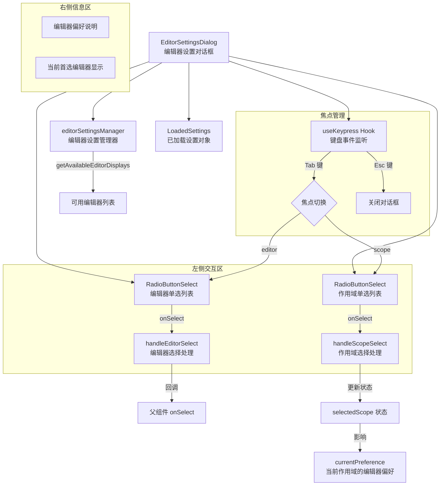

# EditorSettingsDialog.tsx

## 概述

`EditorSettingsDialog` 是一个 React（Ink）函数组件，提供**编辑器偏好设置对话框**界面。用户可以在该对话框中选择首选的代码编辑器，并指定设置的生效范围（用户级 User 或工作区级 Workspace）。该对话框以双栏布局呈现：左侧为编辑器选择和作用域切换的交互区，右侧为说明信息和当前编辑器偏好的展示区。

该组件支持 Tab 键在"编辑器选择"和"作用域选择"两个焦点区域之间切换，Esc 键关闭对话框，Enter 键确认选择。

## 架构图（Mermaid）



## 核心组件

### 1. Props 接口 `EditorDialogProps`

| 属性 | 类型 | 说明 |
|------|------|------|
| `onSelect` | `(editorType: EditorType \| undefined, scope: LoadableSettingScope) => void` | 编辑器选择回调。`editorType` 为 `undefined` 时表示清除偏好设置（"not_set"） |
| `settings` | `LoadedSettings` | 已加载的设置对象，包含各作用域的设置数据和合并后的设置 |
| `onExit` | `() => void` | 关闭对话框的回调 |

### 2. 内部状态

| 状态 | 类型 | 初始值 | 说明 |
|------|------|--------|------|
| `selectedScope` | `LoadableSettingScope` | `SettingScope.User` | 当前选择的设置作用域 |
| `focusedSection` | `'editor' \| 'scope'` | `'editor'` | 当前焦点所在的区域 |

### 3. 键盘交互

通过 `useKeypress` Hook 监听键盘事件：

| 按键 | 行为 |
|------|------|
| `Tab` | 在 `editor`（编辑器选择）和 `scope`（作用域选择）之间切换焦点 |
| `Escape` | 调用 `onExit()` 关闭对话框 |
| `Enter` | 由 `RadioButtonSelect` 内部处理，确认当前选中项 |

### 4. 编辑器列表获取

```typescript
const editorItems: EditorDisplay[] = editorSettingsManager.getAvailableEditorDisplays();
```

通过 `editorSettingsManager` 获取当前系统中可用的编辑器列表，每个编辑器包含 `name`（显示名称）、`type`（编辑器类型标识）和 `disabled`（是否不可用）属性。

### 5. 当前偏好定位

```typescript
const currentPreference = settings.forScope(selectedScope).settings.general?.preferredEditor;
let editorIndex = currentPreference
  ? editorItems.findIndex((item) => item.type === currentPreference)
  : 0;
```

根据当前选择的作用域（User/Workspace），查找该作用域下已设置的首选编辑器，并在编辑器列表中定位其索引。如果找不到（`editorIndex === -1`），则通过 `coreEvents.emitFeedback` 发出错误反馈并回退到索引 0。

### 6. 作用域选择项

| 选项 | 值 | 说明 |
|------|----|------|
| User Settings | `SettingScope.User` | 用户级设置，全局生效 |
| Workspace Settings | `SettingScope.Workspace` | 工作区级设置，仅当前工作区生效 |

### 7. 选择处理函数

#### `handleEditorSelect`
```typescript
const handleEditorSelect = (editorType: EditorType | 'not_set') => {
  if (editorType === 'not_set') {
    onSelect(undefined, selectedScope);  // 清除偏好
    return;
  }
  onSelect(editorType, selectedScope);   // 设置偏好
};
```

当编辑器类型为 `'not_set'` 时，传递 `undefined` 给父组件表示清除编辑器偏好。

#### `handleScopeSelect`
```typescript
const handleScopeSelect = (scope: LoadableSettingScope) => {
  setSelectedScope(scope);
  setFocusedSection('editor');  // 自动跳回编辑器选择区
};
```

选择作用域后自动将焦点跳回编辑器选择区域，便于用户继续操作。

### 8. 跨作用域提示

组件检测"另一个作用域"是否也修改了编辑器偏好，并生成相应提示信息：

- 若当前作用域和另一个作用域都设置了编辑器偏好：显示 `(Also modified in {otherScope})`
- 若仅另一个作用域设置了编辑器偏好：显示 `(Modified in {otherScope})`

### 9. 合并后的编辑器偏好显示

右侧信息区显示最终生效的编辑器偏好（合并了所有作用域后的结果）：

```typescript
let mergedEditorName = 'None';
if (settings.merged.general.preferredEditor && isEditorAvailable(...)) {
  mergedEditorName = EDITOR_DISPLAY_NAMES[...];
}
```

- 若有有效的首选编辑器：以链接色（`theme.text.link`）加粗显示编辑器名称
- 若无首选编辑器：以错误色（`theme.status.error`）加粗显示 "None"

### 10. 布局结构

```
┌──────────────────────────────────────────────────────────────┐
│ 左侧 (45%)                    │ 右侧 (55%)                  │
│                                │                              │
│ > Select Editor (提示)          │ Editor Preference            │
│   ○ Editor 1                   │                              │
│   ● Editor 2 (当前)            │ 这些编辑器目前受支持...       │
│   ○ Editor 3                   │                              │
│                                │ 您的首选编辑器是: xxx        │
│ > Apply To                     │                              │
│   ● User Settings              │                              │
│   ○ Workspace Settings         │                              │
│                                │                              │
│ (Use Enter to select, Tab ...) │                              │
└──────────────────────────────────────────────────────────────┘
```

## 依赖关系

### 内部依赖

| 模块路径 | 导入内容 | 用途 |
|----------|----------|------|
| `../semantic-colors.js` | `theme` | 语义化颜色主题，提供边框、文字、状态等颜色 |
| `../editors/editorSettingsManager.js` | `editorSettingsManager`、`EditorDisplay`（类型） | 编辑器设置管理器，获取可用编辑器列表 |
| `./shared/RadioButtonSelect.js` | `RadioButtonSelect` | 单选按钮列表组件，处理编辑器和作用域的选择交互 |
| `../../config/settings.js` | `SettingScope`、`LoadableSettingScope`（类型）、`LoadedSettings`（类型） | 设置作用域枚举和类型定义 |
| `../hooks/useKeypress.js` | `useKeypress` | 键盘事件监听 Hook |

### 外部依赖

| 包名 | 导入内容 | 用途 |
|------|----------|------|
| `react` | `useState`（及 `React` 类型） | React 状态管理 |
| `ink` | `Box`、`Text` | Ink 终端 UI 基础组件 |
| `@google/gemini-cli-core` | `EditorType`（类型）、`isEditorAvailable`、`EDITOR_DISPLAY_NAMES`、`coreEvents` | 编辑器类型定义、可用性检查、显示名称映射和核心事件系统 |

## 关键实现细节

1. **双焦点区域管理**：组件通过 `focusedSection` 状态管理两个 `RadioButtonSelect` 的焦点。`Tab` 键在两个区域之间切换，切换时使用 `>` 前缀和粗体文字视觉指示当前焦点区域。`isFocused` 属性传递给 `RadioButtonSelect`，确保只有获得焦点的列表才响应键盘上下方向键。

2. **作用域切换后自动聚焦回编辑器**：用户在作用域列表中确认选择后，`handleScopeSelect` 自动将焦点切回编辑器列表，这是一个贴心的 UX 设计——用户切换作用域通常是为了在该作用域下重新选择编辑器。

3. **`key={selectedScope}` 强制重新挂载**：编辑器 `RadioButtonSelect` 的 `key` 绑定到 `selectedScope`，这意味着当作用域切换时，组件会被强制卸载并重新挂载，从而重置内部状态（如选中索引），确保列表正确反映新作用域的当前偏好。

4. **不可用编辑器处理**：编辑器列表中可能包含 `disabled: true` 的项，这些编辑器在当前环境中不可用（如某些编辑器在沙箱模式下不可用），用户可以看到但无法选择。

5. **"not_set" 特殊值**：编辑器列表中包含一个特殊的 `'not_set'` 选项，允许用户清除该作用域的编辑器偏好设置。选择后传递 `undefined` 给父组件。

6. **跨作用域冲突提示**：组件检测另一个作用域是否也修改了编辑器偏好，并在标题旁显示提示文字，帮助用户理解设置的层级关系和可能的覆盖行为。

7. **编辑器不支持容错**：当已保存的首选编辑器类型在当前可用列表中找不到时（可能是编辑器已卸载或版本不兼容），组件通过 `coreEvents.emitFeedback` 发出错误级别的反馈事件，并回退到列表的第一个选项，避免因无效设置导致 UI 异常。
