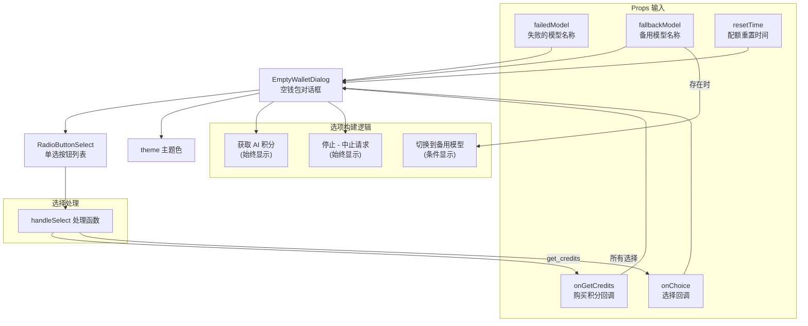

# EmptyWalletDialog.tsx

## 概述

`EmptyWalletDialog` 是一个 React（Ink）函数组件，用于在用户的 **AI 积分（Credits）余额耗尽**时显示一个交互式对话框。当用户请求的 AI 模型达到使用配额上限且钱包余额为零时，该对话框会弹出，引导用户选择后续操作：购买更多积分、切换到备用模型或中止请求。

该组件是 Gemini CLI 配额管理系统的一部分，处理"钱包为空"这一特定的配额耗尽场景。

## 架构图（Mermaid）



## 核心组件

### 1. 导出类型 `EmptyWalletChoice`

```typescript
export type EmptyWalletChoice = 'get_credits' | 'use_fallback' | 'stop';
```

定义了对话框中用户可选的三种操作：

| 值 | 含义 |
|----|------|
| `'get_credits'` | 获取 AI 积分 —— 打开浏览器购买积分 |
| `'use_fallback'` | 使用备用模型 —— 切换到更低配额要求的模型 |
| `'stop'` | 停止 —— 中止当前请求 |

### 2. Props 接口 `EmptyWalletDialogProps`

| 属性 | 类型 | 必填 | 说明 |
|------|------|------|------|
| `failedModel` | `string` | 是 | 达到配额限制的模型名称 |
| `fallbackModel` | `string` | 否 | 可供切换的备用模型名称，不提供则不显示"切换模型"选项 |
| `resetTime` | `string` | 否 | 配额重置的时间（人类可读格式），不提供则不显示重置时间信息 |
| `onGetCredits` | `() => void` | 否 | 购买积分时的回调（用于记录点击事件和打开浏览器） |
| `onChoice` | `(choice: EmptyWalletChoice) => void` | 是 | 用户做出选择后的回调 |

### 3. 选项动态构建

选项列表根据 `fallbackModel` 是否存在动态构建：

```typescript
const items = [
  { label: 'Get AI Credits - Open browser to purchase credits', value: 'get_credits' },
];

if (fallbackModel) {
  items.push({ label: `Switch to ${fallbackModel}`, value: 'use_fallback' });
}

items.push({ label: 'Stop - Abort request', value: 'stop' });
```

- **"Get AI Credits"** 始终作为第一个选项（默认选中）
- **"Switch to {fallbackModel}"** 仅在提供了备用模型时显示
- **"Stop"** 始终作为最后一个选项

### 4. 选择处理函数 `handleSelect`

```typescript
const handleSelect = (choice: EmptyWalletChoice) => {
  if (choice === 'get_credits') {
    onGetCredits?.();   // 先触发购买回调（打开浏览器等）
  }
  onChoice(choice);     // 再通知父组件处理选择结果
};
```

当选择 `'get_credits'` 时，会先调用 `onGetCredits`（如果提供了），然后再调用 `onChoice`。这确保了浏览器打开操作先于状态变更。

### 5. 信息展示区域

对话框上半部分展示以下信息：

| 内容 | 样式 | 条件 |
|------|------|------|
| `Usage limit reached for {failedModel}.` | 警告色（`theme.status.warning`） | 始终显示 |
| `Access resets at {resetTime}.` | 默认色 | 仅当 `resetTime` 存在时显示 |
| `/stats model for usage details` | `/stats` 以强调色加粗 | 始终显示 |
| `/model to switch models.` | `/model` 以强调色加粗 | 始终显示 |
| `/auth to switch to API key.` | `/auth` 以强调色加粗 | 始终显示 |
| `To continue using this model now, purchase more AI Credits.` | 默认色 | 始终显示 |
| `Newly purchased AI credits may take a few minutes to update.` | 暗淡色（`dimColor`） | 始终显示 |
| `How would you like to proceed?` | 默认色 | 始终显示 |

### 6. 布局结构

```
┌──────────────────────────────────────────────┐
│ Usage limit reached for gemini-2.0-flash.    │
│ Access resets at 2026-04-01 00:00 UTC.       │
│ /stats model for usage details               │
│ /model to switch models.                     │
│ /auth to switch to API key.                  │
│                                              │
│ To continue using this model now, purchase   │
│ more AI Credits.                             │
│                                              │
│ Newly purchased AI credits may take a few    │
│ minutes to update.                           │
│                                              │
│ How would you like to proceed?               │
│                                              │
│ ● Get AI Credits - Open browser to purchase  │
│ ○ Switch to gemini-1.5-flash                 │
│ ○ Stop - Abort request                       │
└──────────────────────────────────────────────┘
```

## 依赖关系

### 内部依赖

| 模块路径 | 导入内容 | 用途 |
|----------|----------|------|
| `./shared/RadioButtonSelect.js` | `RadioButtonSelect` | 单选按钮列表组件，处理用户的选择交互 |
| `../semantic-colors.js` | `theme` | 语义化颜色主题，提供 `status.warning`、`text.accent` 等颜色值 |

### 外部依赖

| 包名 | 导入内容 | 用途 |
|------|----------|------|
| `react` | `React` 类型 | React 类型支持 |
| `ink` | `Box`、`Text` | Ink 终端 UI 基础组件，用于布局和文本渲染 |

## 关键实现细节

1. **条件化选项列表**：`'use_fallback'` 选项仅在 `fallbackModel` 参数存在时才加入列表。这使得对话框在没有可用备用模型时仍能正常工作，只提供购买积分和中止两个选项。

2. **双回调触发机制**：选择 `'get_credits'` 时，`handleSelect` 先调用 `onGetCredits?.()` 处理副作用（如打开浏览器、记录分析事件），再调用 `onChoice()` 通知父组件更新状态。使用可选链操作符 `?.` 确保 `onGetCredits` 未提供时不会报错。

3. **斜杠命令提示**：对话框中嵌入了 `/stats`、`/model`、`/auth` 三个斜杠命令的提示，使用 `theme.text.accent` 强调色加粗显示，引导用户了解可用的替代操作路径。这些不是可点击的链接，而是文字提示。

4. **积分延迟提醒**：使用 `dimColor`（暗淡色）显示"新购买的积分可能需要几分钟才能更新"的提示，降低视觉权重但确保用户不会因为购买后立即使用而产生困惑。

5. **简洁的组件设计**：与同系列的 `OverageMenuDialog` 等配额对话框相比，`EmptyWalletDialog` 设计更为简洁——没有使用 `useState` 或 `useEffect` 等状态管理，是一个纯展示+选择的无状态组件（除了 `RadioButtonSelect` 内部的状态）。

6. **圆角边框容器**：使用 `borderStyle="round"` 提供视觉上的容器感，`padding={1}` 确保内容不紧贴边框，各段落之间通过 `marginBottom={1}` 保持间距。

7. **类型导出**：`EmptyWalletChoice` 类型被显式导出，供父组件（如 `DialogManager`）和 UI 状态管理层引用，确保类型安全的回调处理。
