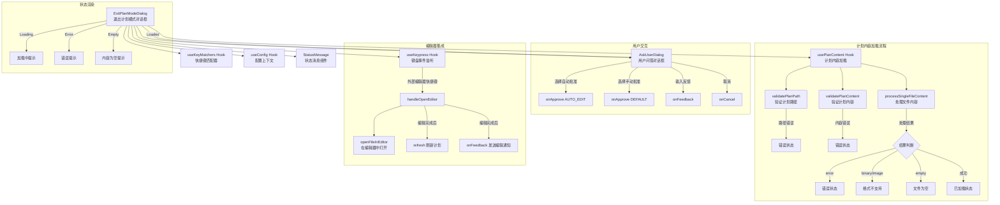

# ExitPlanModeDialog.tsx

## 概述

`ExitPlanModeDialog` 是一个 React（Ink）函数组件，用于在 AI 生成执行计划后呈现**计划审批对话框**。当 Gemini CLI 处于"计划模式"（Plan Mode）时，AI 会先生成一份执行计划文件，该对话框负责加载并展示计划内容，让用户选择批准（自动或手动模式）、提供反馈意见，或取消计划。用户还可以通过快捷键在外部编辑器中打开计划文件进行编辑。

该组件是 Gemini CLI **计划审批流程**的核心 UI 入口，连接了计划文件的读取/验证、用户交互决策和编辑器集成三大功能模块。

## 架构图（Mermaid）



## 核心组件

### 1. Props 接口 `ExitPlanModeDialogProps`

| 属性 | 类型 | 必填 | 说明 |
|------|------|------|------|
| `planPath` | `string` | 是 | 计划文件的路径 |
| `onApprove` | `(approvalMode: ApprovalMode) => void` | 是 | 用户批准计划时的回调，传递批准模式 |
| `onFeedback` | `(feedback: string) => void` | 是 | 用户提交反馈时的回调 |
| `onCancel` | `() => void` | 是 | 用户取消计划时的回调 |
| `getPreferredEditor` | `() => EditorType \| undefined` | 是 | 获取用户首选编辑器类型的函数 |
| `width` | `number` | 是 | 对话框宽度 |
| `availableHeight` | `number` | 否 | 可用高度 |

### 2. 枚举类型

#### `PlanStatus` — 计划加载状态

| 值 | 说明 |
|----|------|
| `Loading` | 正在加载计划文件 |
| `Loaded` | 计划文件已成功加载 |
| `Error` | 加载过程中发生错误 |

#### `ApprovalOption` — 批准选项

| 值 | 显示文本 | 说明 |
|----|----------|------|
| `Auto` | "Yes, automatically accept edits" | 批准计划并允许工具自动运行 |
| `Manual` | "Yes, manually accept edits" | 批准计划但每个工具需要手动确认 |

### 3. 内部接口 `PlanContentState`

| 属性 | 类型 | 说明 |
|------|------|------|
| `status` | `PlanStatus` | 当前加载状态 |
| `content` | `string` | 加载成功时的计划内容 |
| `error` | `string` | 加载失败时的错误信息 |
| `refresh` | `() => void` | 刷新函数，重新加载计划内容 |

### 4. 自定义 Hook：`usePlanContent`

```typescript
function usePlanContent(planPath: string, config: Config): PlanContentState
```

这是一个**关键的自定义 Hook**，负责异步加载和验证计划文件内容。加载流程分为三个阶段：

1. **路径验证**：调用 `validatePlanPath()` 检查计划文件路径是否合法且在允许的目录内
2. **内容验证**：调用 `validatePlanContent()` 检查文件内容是否有效
3. **内容处理**：调用 `processSingleFileContent()` 读取并处理文件内容

#### 错误处理场景

| 错误场景 | 处理方式 |
|----------|----------|
| 路径验证失败 | 设置 `Error` 状态，显示路径错误信息 |
| 内容验证失败 | 设置 `Error` 状态，显示内容错误信息 |
| 处理结果包含 `error` | 设置 `Error` 状态，显示处理错误信息 |
| 内容为二进制或图片 | 设置 `Error` 状态，显示"格式不支持"提示 |
| 内容为空 | 设置 `Error` 状态，显示"文件为空"提示 |
| 异常抛出 | 捕获异常，设置 `Error` 状态，显示异常信息 |

#### 刷新机制

通过 `version` 状态变量实现刷新：`refresh()` 函数递增 `version`，触发 `useEffect` 重新执行加载流程。

#### 竞态条件防护

使用 `ignore` 标志变量防止组件卸载后的状态更新：

```typescript
useEffect(() => {
  let ignore = false;
  // ... 异步操作中检查 if (ignore) return;
  return () => { ignore = true; };
}, [planPath, config, version]);
```

### 5. `StatusMessage` 辅助组件

```typescript
const StatusMessage: React.FC<{ children: React.ReactNode }> = ({ children }) => (
  <Box paddingX={1}>{children}</Box>
);
```

一个极简的包装组件，为加载中和错误状态消息提供统一的水平内边距样式。

### 6. 编辑器集成：`handleOpenEditor`

```typescript
const handleOpenEditor = useCallback(async () => {
  await openFileInEditor(planPath, stdin, setRawMode, getPreferredEditor());
  onFeedback('I have edited the plan or annotated it with feedback...');
  refresh();
}, [...]);
```

编辑器打开流程：
1. 调用 `openFileInEditor` 在外部编辑器中打开计划文件
2. 编辑器关闭后，自动发送反馈消息通知 AI 计划已被编辑
3. 调用 `refresh()` 重新加载计划内容以反映编辑后的变更

### 7. 快捷键监听

通过 `useKeypress` 和 `useKeyMatchers` 实现外部编辑器快捷键：

```typescript
useKeypress((key) => {
  if (keyMatchers[Command.OPEN_EXTERNAL_EDITOR](key)) {
    void handleOpenEditor();
    return true;
  }
  return false;
}, { isActive: true, priority: true });
```

`priority: true` 确保该快捷键处理器优先于其他键盘事件处理器。

### 8. 延迟加载指示器

```typescript
useEffect(() => {
  if (planState.status !== PlanStatus.Loading) {
    setShowLoading(false);
    return;
  }
  const timer = setTimeout(() => setShowLoading(true), 200);
  return () => clearTimeout(timer);
}, [planState.status]);
```

加载状态不会立即显示"Loading plan..."文字，而是延迟 200 毫秒后才显示。这避免了快速加载时的闪烁——如果计划文件在 200ms 内完成加载，用户不会看到任何加载提示。

### 9. AskUserDialog 集成

加载成功后，组件将计划内容传递给 `AskUserDialog` 进行展示：

```typescript
<AskUserDialog
  questions={[{
    type: QuestionType.CHOICE,
    header: 'Approval',
    question: planContent,          // 计划内容作为问题文本展示
    options: [
      { label: ApprovalOption.Auto, description: '...' },
      { label: ApprovalOption.Manual, description: '...' },
    ],
    placeholder: 'Type your feedback...',
    multiSelect: false,
    unconstrainedHeight: false,
  }]}
  onSubmit={(answers) => { /* 处理选择或反馈 */ }}
  onCancel={onCancel}
  extraParts={[`${editHint} to edit plan`]}
/>
```

`AskUserDialog` 的 `onSubmit` 回调根据用户的选择分三种情况处理：
- 选择了 `ApprovalOption.Auto`：调用 `onApprove(ApprovalMode.AUTO_EDIT)`
- 选择了 `ApprovalOption.Manual`：调用 `onApprove(ApprovalMode.DEFAULT)`
- 输入了文本反馈：调用 `onFeedback(answer)`

`extraParts` 属性传递了编辑器快捷键提示文本（如 `"Ctrl+E to edit plan"`）。

## 依赖关系

### 内部依赖

| 模块路径 | 导入内容 | 用途 |
|----------|----------|------|
| `../semantic-colors.js` | `theme` | 语义化颜色主题 |
| `../contexts/ConfigContext.js` | `useConfig` | 获取配置上下文 |
| `./AskUserDialog.js` | `AskUserDialog` | 用户问答对话框组件 |
| `../utils/editorUtils.js` | `openFileInEditor` | 在外部编辑器中打开文件的工具函数 |
| `../hooks/useKeypress.js` | `useKeypress` | 键盘事件监听 Hook |
| `../key/keyMatchers.js` | `Command` | 快捷键命令枚举 |
| `../key/keybindingUtils.js` | `formatCommand` | 格式化快捷键命令为可读字符串 |
| `../hooks/useKeyMatchers.js` | `useKeyMatchers` | 获取快捷键匹配器的 Hook |

### 外部依赖

| 包名 | 导入内容 | 用途 |
|------|----------|------|
| `react` | `useEffect`、`useState`、`useCallback`（及 `React` 类型） | React 核心 Hooks |
| `ink` | `Box`、`Text`、`useStdin` | Ink 终端 UI 组件和 stdin 访问 |
| `@google/gemini-cli-core` | `ApprovalMode`、`validatePlanPath`、`validatePlanContent`、`QuestionType`、`Config`（类型）、`EditorType`（类型）、`processSingleFileContent`、`debugLogger` | 核心业务逻辑：批准模式枚举、计划验证函数、问题类型枚举、配置类型、编辑器类型、文件内容处理、调试日志器 |

## 关键实现细节

1. **三阶段计划验证**：计划内容的加载分为路径验证、内容验证和内容处理三个阶段，每个阶段都有独立的错误处理。这种分层设计确保了不同类型的问题（路径错误、内容格式错误、处理错误）都能给出精确的错误提示。

2. **竞态条件防护（Race Condition Prevention）**：`usePlanContent` Hook 使用经典的 `ignore` 标志模式防止异步操作完成后更新已卸载的组件状态。每次 `useEffect` 清理函数都会设置 `ignore = true`，异步操作中在每个 `await` 之后检查该标志。

3. **延迟加载指示器（Debounced Loading）**：200ms 的延迟加载显示是一个细致的 UX 优化。对于快速完成的加载操作，用户不会看到闪烁的"Loading..."文字；只有在加载时间较长时才会出现加载提示。

4. **编辑器集成的完整闭环**：用户通过快捷键打开编辑器 -> 编辑计划文件 -> 编辑器关闭 -> 自动发送反馈告知 AI 已编辑 -> 自动刷新加载编辑后的计划内容。整个流程无需用户手动刷新。

5. **stdin 模式切换**：`openFileInEditor` 需要 `stdin` 和 `setRawMode` 参数，因为在打开外部编辑器时需要暂时释放终端的 raw 模式控制，让编辑器能正常接管终端输入。编辑器关闭后恢复 raw 模式。

6. **优先级键盘事件**：`useKeypress` 配置了 `priority: true`，确保外部编辑器快捷键在所有键盘事件处理器中具有最高优先级，不会被 `AskUserDialog` 等子组件的键盘处理所拦截。

7. **双批准模式**：组件提供两种批准模式的选择：
   - `ApprovalMode.AUTO_EDIT`（自动模式）：批准后 AI 可以自动执行所有工具操作
   - `ApprovalMode.DEFAULT`（手动模式）：批准后每个工具操作仍需用户逐一确认
   这给了用户在效率和控制力之间的灵活选择。

8. **反馈作为文本输入**：`AskUserDialog` 的 `placeholder: 'Type your feedback...'` 表明除了预定义的选项外，用户还可以直接输入文本反馈。`onSubmit` 回调中的第三个分支 (`else if (answer)`) 处理这种自由文本输入情况。

9. **版本号驱动刷新**：`usePlanContent` 使用 `version` 状态变量作为 `useEffect` 的依赖项。每次调用 `refresh()` 递增版本号，触发 effect 重新执行，从而实现不改变 `planPath` 的情况下强制重新加载。这是一种常见的 React 强制刷新模式。
