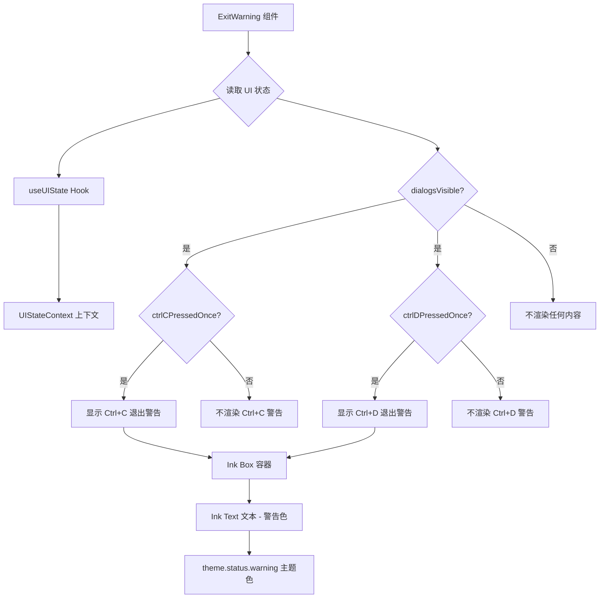

# ExitWarning.tsx

## 概述

`ExitWarning` 是一个 React 函数组件，用于在用户首次按下 `Ctrl+C` 或 `Ctrl+D` 时显示退出警告提示信息。该组件是 Gemini CLI 终端 UI 的一部分，采用"二次确认"模式防止用户误操作退出程序。当用户第一次按下退出快捷键时，组件会渲染一条黄色警告文本，提示用户再次按下相同快捷键才能真正退出。

## 架构图（Mermaid）

## 核心组件

### ExitWarning（函数组件）

| 属性 | 类型 | 说明 |
|------|------|------|
| 无 Props | - | 该组件不接收任何外部属性，完全依赖 UI 状态上下文 |

**渲染逻辑：**

组件通过 `useUIState()` Hook 获取全局 UI 状态，根据以下两个条件组合来决定是否显示警告：

1. **Ctrl+C 警告**：当 `uiState.dialogsVisible === true` 且 `uiState.ctrlCPressedOnce === true` 时，渲染文本 `"Press Ctrl+C again to exit."`
2. **Ctrl+D 警告**：当 `uiState.dialogsVisible === true` 且 `uiState.ctrlDPressedOnce === true` 时，渲染文本 `"Press Ctrl+D again to exit."`

两个警告可以同时显示（理论上），但通常只会有一个处于激活状态。

**样式细节：**

- 外层 `<Box>` 容器设置了 `marginTop={1}`，使警告文本与上方内容之间留有一行间距。
- `<Text>` 组件使用 `theme.status.warning` 颜色（通常为黄色），以视觉方式强调这是一条警告信息。

## 依赖关系

### 内部依赖

| 模块路径 | 导入内容 | 用途 |
|----------|----------|------|
| `../contexts/UIStateContext.js` | `useUIState` | 获取全局 UI 状态（dialogsVisible、ctrlCPressedOnce、ctrlDPressedOnce） |
| `../semantic-colors.js` | `theme` | 获取语义化主题颜色配置，用于警告文本着色 |

### 外部依赖

| 包名 | 导入内容 | 用途 |
|------|----------|------|
| `react` | `React`（类型导入） | 提供 `React.FC` 类型定义 |
| `ink` | `Box`, `Text` | Ink 终端 UI 框架的布局容器和文本渲染组件 |

## 关键实现细节

1. **二次确认退出机制**：该组件是"二次确认退出"交互模式的视觉反馈部分。当用户首次按下 `Ctrl+C` 或 `Ctrl+D` 时，外部逻辑（可能在 UIStateContext 或更上层组件中）会将 `ctrlCPressedOnce` 或 `ctrlDPressedOnce` 设为 `true`，此时本组件显示警告。用户再次按下时才真正退出程序。

2. **dialogsVisible 守卫条件**：所有警告的显示都额外受 `dialogsVisible` 状态控制。当有其他对话框（如信任对话框、配置对话框等）处于显示状态时，`dialogsVisible` 可能为 `false`，此时退出警告不会显示，避免 UI 元素冲突。

3. **Fragment 包裹**：组件使用 React Fragment (`<>...</>`) 作为根元素，避免引入额外的 DOM（终端渲染）节点，保持终端输出的简洁性。

4. **Ctrl+C 与 Ctrl+D 的区别**：
   - `Ctrl+C`：传统的 SIGINT 信号，通常用于中断当前进程。
   - `Ctrl+D`：传统的 EOF（End-of-File）信号，通常用于关闭输入流。
   - 两者在 CLI 工具中都可以用于退出，但语义略有不同。该组件对两种退出方式都提供了相同的二次确认体验。

5. **纯展示组件**：`ExitWarning` 是一个纯展示组件，不包含任何状态管理或副作用逻辑。所有状态均来自 `UIStateContext`，组件仅负责根据状态条件性地渲染 UI。
