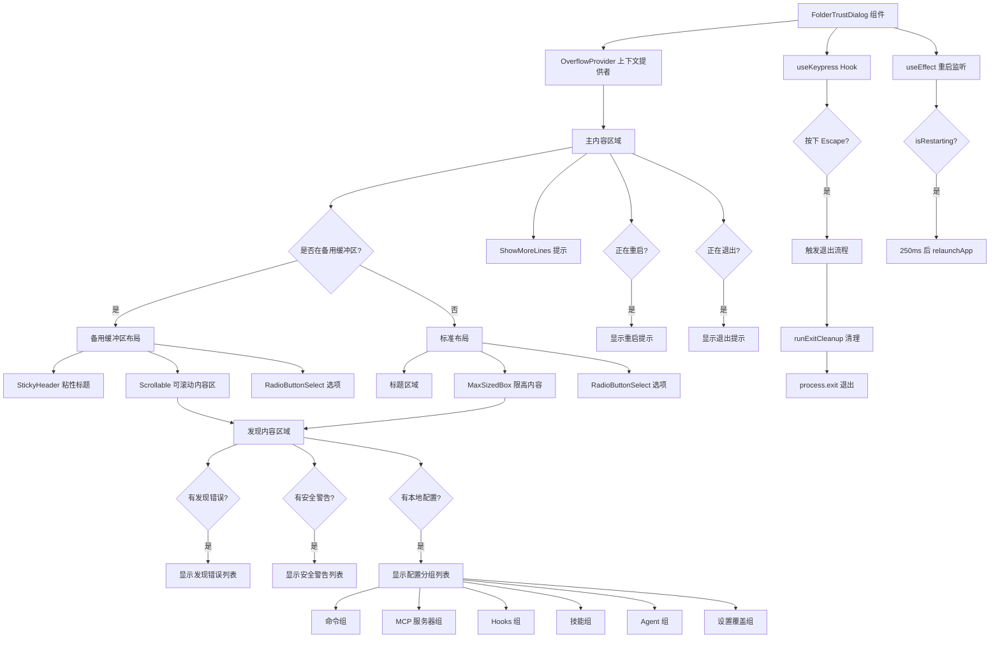

# FolderTrustDialog.tsx

## 概述

`FolderTrustDialog` 是 Gemini CLI 中的文件夹信任对话框组件。当用户在一个尚未建立信任关系的文件夹中启动 Gemini CLI 时，此对话框会弹出，要求用户选择是否信任该文件夹。信任某个文件夹意味着允许 Gemini CLI 加载其本地配置（包括自定义命令、Hooks、MCP 服务器、Agent 技能和设置覆盖），这些配置可能会在用户的系统上执行代码或改变 CLI 的行为。

该组件同时导出了 `FolderTrustChoice` 枚举，定义了三种信任选项：信任当前文件夹、信任父文件夹、不信任。

## 架构图（Mermaid）

## 核心组件

### FolderTrustChoice 枚举

| 枚举值 | 字符串值 | 含义 |
|--------|----------|------|
| `TRUST_FOLDER` | `'trust_folder'` | 信任当前文件夹 |
| `TRUST_PARENT` | `'trust_parent'` | 信任父文件夹 |
| `DO_NOT_TRUST` | `'do_not_trust'` | 不信任 |

### FolderTrustDialogProps 接口

| 属性 | 类型 | 必填 | 说明 |
|------|------|------|------|
| `onSelect` | `(choice: FolderTrustChoice) => void` | 是 | 用户选择信任级别后的回调函数 |
| `isRestarting` | `boolean` | 否 | 是否正在重启以应用信任变更 |
| `discoveryResults` | `FolderDiscoveryResults \| null` | 否 | 文件夹配置发现结果，包含命令、MCP、Hooks、技能、设置和安全警告等信息 |

### FolderTrustDialog（函数组件）

**内部状态：**

| 状态 | 类型 | 初始值 | 说明 |
|------|------|--------|------|
| `exiting` | `boolean` | `false` | 用户按下 Escape 键后标记为正在退出 |

**从 UIState 获取的状态：**

| 字段 | 用途 |
|------|------|
| `terminalHeight` | 终端高度，用于计算可滚动区域的高度 |
| `terminalWidth` | 终端宽度，用于计算对话框宽度 |
| `constrainHeight` | 是否约束高度，控制内容是否可展开 |

**选项配置：**

组件动态生成三个单选选项，其中前两个选项的标签会包含当前目录名和父目录名：
- `Trust folder (当前目录名)`
- `Trust parent folder (父目录名)`
- `Don't trust`

**发现内容分组：**

组件会将 `discoveryResults` 中的配置项按类型分组显示：

| 分组标签 | 数据来源 |
|----------|----------|
| Commands | `discoveryResults.commands` |
| MCP Servers | `discoveryResults.mcps` |
| Hooks | `discoveryResults.hooks` |
| Skills | `discoveryResults.skills` |
| Agents | `discoveryResults.agents` |
| Setting overrides | `discoveryResults.settings` |

只有包含至少一个配置项的分组才会被显示。

## 依赖关系

### 内部依赖

| 模块路径 | 导入内容 | 用途 |
|----------|----------|------|
| `../semantic-colors.js` | `theme` | 语义化主题颜色，用于文本着色和边框颜色 |
| `./shared/RadioButtonSelect.js` | `RadioButtonSelect`, `RadioSelectItem` | 单选按钮选择组件和类型定义 |
| `./shared/MaxSizedBox.js` | `MaxSizedBox` | 最大尺寸限制的容器组件 |
| `./shared/Scrollable.js` | `Scrollable` | 可滚动内容容器组件 |
| `../hooks/useKeypress.js` | `useKeypress` | 键盘按键监听 Hook |
| `../../utils/processUtils.js` | `relaunchApp` | 重新启动应用程序的工具函数 |
| `../../utils/cleanup.js` | `runExitCleanup` | 退出前的清理函数 |
| `../contexts/UIStateContext.js` | `useUIState` | 获取全局 UI 状态 |
| `../hooks/useAlternateBuffer.js` | `useAlternateBuffer` | 检测当前是否在备用终端缓冲区 |
| `../contexts/OverflowContext.js` | `OverflowProvider` | 溢出检测上下文提供者 |
| `./ShowMoreLines.js` | `ShowMoreLines` | "显示更多行"提示组件 |
| `./StickyHeader.js` | `StickyHeader` | 粘性标题头组件 |
| `@google/gemini-cli-core` | `ExitCodes`, `FolderDiscoveryResults` | 退出码常量和文件夹发现结果类型 |

### 外部依赖

| 包名 | 导入内容 | 用途 |
|------|----------|------|
| `ink` | `Box`, `Text` | Ink 终端 UI 框架的布局和文本组件 |
| `react` | `React`, `useEffect`, `useState`, `useCallback` | React 核心库和 Hooks |
| `strip-ansi` | `stripAnsi` | 移除字符串中的 ANSI 转义序列，确保文本渲染干净 |
| `node:process` | `process` | Node.js 进程模块，用于获取 cwd 和调用 exit |
| `node:path` | `path` | Node.js 路径模块，用于提取目录名 |

## 关键实现细节

1. **双缓冲区布局策略**：组件通过 `useAlternateBuffer()` 检测当前终端是否在备用缓冲区模式下运行。如果是，则使用 `StickyHeader` + `Scrollable` 的组合实现更好的滚动体验；否则使用 `MaxSizedBox` 限制内容高度，在标准终端模式下提供简化的布局。

2. **动态高度计算**：在备用缓冲区模式下，可滚动区域的高度通过公式 `Math.max(4, terminalHeight - overhead)` 计算，其中 `overhead` 包括标题（3行）、选项数量 + 边距（options.length + 2 行）、页脚（1行）和安全边距（2行）。这确保内容区域充分利用终端空间且不会溢出。

3. **Escape 键退出机制**：通过 `useKeypress` Hook 监听 Escape 键。按下后：
   - 立即将 `exiting` 状态设为 `true`，显示退出消息。
   - 延迟 100ms 后执行 `runExitCleanup()` 进行清理。
   - 最终以 `ExitCodes.FATAL_CANCELLATION_ERROR` 退出码调用 `process.exit()`。
   - 当 `isRestarting` 为 `true` 时，Escape 键监听被禁用。

4. **应用重启流程**：当 `isRestarting` prop 为 `true` 时，`useEffect` 会设置一个 250ms 的定时器，随后调用 `relaunchApp()` 重新启动应用程序。同时 UI 会显示 "Gemini CLI is restarting to apply the trust changes..." 提示信息。定时器在组件卸载时会被正确清理。

5. **ANSI 转义序列清理**：使用 `stripAnsi` 函数对 `discoveryResults` 中的错误信息、警告信息和配置项名称进行清理，移除可能存在的 ANSI 颜色代码，防止在重新着色时产生嵌套的 ANSI 序列，确保终端渲染的一致性。

6. **安全提示设计**：
   - 发现错误（Discovery Errors）使用红色 `theme.status.error` 显示。
   - 安全警告（Security Warnings）使用黄色 `theme.status.warning` 显示。
   - 对话框边框也使用 `theme.status.warning` 颜色，从视觉上提醒用户这是一个需要谨慎对待的安全决策。

7. **OverflowProvider 包裹**：整个组件内容被 `OverflowProvider` 包裹，为子组件（如 `MaxSizedBox`）提供溢出检测上下文，使得 `ShowMoreLines` 组件可以感知内容是否被截断并显示相应提示。
