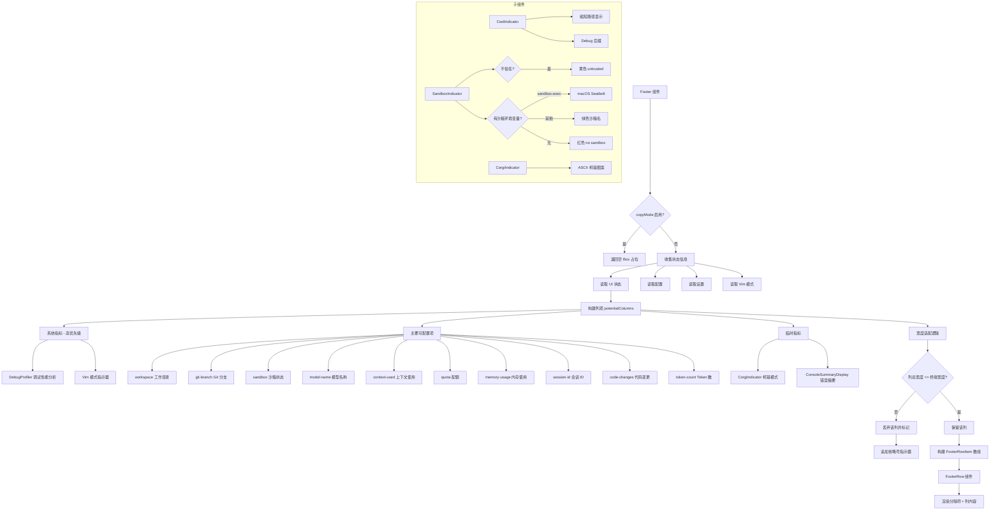

# Footer.tsx

## 概述

`Footer` 是 Gemini CLI 终端界面的底部状态栏组件，负责在终端底部展示一系列可配置的状态信息列。它是整个 CLI 界面中信息密度最高的区域之一，集成了工作目录、Git 分支、沙箱状态、模型名称、上下文使用量、配额、内存使用、会话 ID、代码变更统计、Token 统计等多种信息指标。

该文件还包含多个辅助子组件（`CwdIndicator`、`SandboxIndicator`、`CorgiIndicator`）和一个通用布局组件 `FooterRow`，共同构成了灵活且自适应的底栏渲染系统。

## 架构图（Mermaid）

## 核心组件

### CwdIndicator（内部组件）

当前工作目录指示器，显示经过缩短处理的路径。

| 属性 | 类型 | 必填 | 默认值 | 说明 |
|------|------|------|--------|------|
| `targetDir` | `string` | 是 | - | 目标目录完整路径 |
| `maxWidth` | `number` | 是 | - | 路径显示的最大字符宽度 |
| `debugMode` | `boolean` | 否 | - | 是否开启调试模式 |
| `debugMessage` | `string` | 否 | - | 调试模式下的自定义消息 |
| `color` | `string` | 否 | `theme.text.primary` | 文本颜色 |

**实现逻辑：**
1. 如果处于 debugMode，计算调试后缀（debugMessage 或默认的 `--debug`）。
2. 从 maxWidth 中减去调试后缀长度，得到路径可用宽度（最小为 10）。
3. 先通过 `tildeifyPath` 将 Home 目录替换为 `~`，再通过 `shortenPath` 截断路径以适配宽度。
4. 调试后缀以 `theme.status.error`（红色）显示。

### SandboxIndicator（内部组件）

沙箱状态指示器，根据环境变量和信任状态显示不同的沙箱信息。

| 属性 | 类型 | 必填 | 说明 |
|------|------|------|------|
| `isTrustedFolder` | `boolean \| undefined` | 是 | 文件夹是否受信任 |

**显示逻辑优先级：**
1. 如果 `isTrustedFolder === false` -> 黄色文本 `untrusted`
2. 如果 `SANDBOX` 环境变量存在且不是 `sandbox-exec` -> 绿色显示沙箱名称（移除 `gemini-`/`gemini-cli-` 前缀）
3. 如果 `SANDBOX === 'sandbox-exec'` -> 黄色显示 `macOS Seatbelt (profile名)`
4. 其他情况 -> 红色文本 `no sandbox`

### CorgiIndicator（内部组件）

一个纯装饰性组件，使用 ASCII 字符渲染一个柯基犬的脸部图案 `▼(´ᴥ`)▼`，在 `corgiMode` 彩蛋模式下显示。

### FooterRow（导出组件）

通用的底栏行布局组件，负责将多个列项按水平方向排列，列间添加分隔符。

| 属性 | 类型 | 必填 | 说明 |
|------|------|------|------|
| `items` | `FooterRowItem[]` | 是 | 要渲染的列项数组 |
| `showLabels` | `boolean` | 是 | 是否显示列标题标签 |

**FooterRowItem 接口：**

| 字段 | 类型 | 必填 | 说明 |
|------|------|------|------|
| `key` | `string` | 是 | 唯一标识 |
| `header` | `string` | 是 | 列标题文本 |
| `element` | `React.ReactNode` | 是 | 列内容的 React 元素 |
| `flexGrow` | `number` | 否 | Flex 增长因子 |
| `flexShrink` | `number` | 否 | Flex 收缩因子 |
| `isFocused` | `boolean` | 否 | 是否处于焦点状态 |
| `alignItems` | `'flex-start' \| 'center' \| 'flex-end'` | 否 | 对齐方式 |

**渲染逻辑：**
- 列与列之间插入分隔符：`showLabels` 模式下为空白间隔（最小宽度 `COLUMN_GAP=3`），非标签模式下显示 ` · ` 点分隔符。
- 如果 `showLabels` 为 `true`，每列上方会渲染一个标题行。
- 焦点列的背景色为 `theme.background.focus`，标题文本为 `theme.text.primary`。

### Footer（主导出组件）

| 属性 | 类型 | 必填 | 默认值 | 说明 |
|------|------|------|--------|------|
| `copyModeEnabled` | `boolean` | 否 | `false` | 是否启用复制模式（启用时底栏不显示内容） |

**列构建流程（三阶段）：**

1. **系统指标（高优先级）**：DebugProfiler 和 Vim 模式指示器，标记为 `isHighPriority`，不会被宽度适配逻辑丢弃。
2. **主要可配置项**：根据 `settings.merged.ui.footer.items` 配置（或从旧版设置派生）按顺序添加，支持 10 种列类型。
3. **临时指标**：Corgi 彩蛋模式和错误摘要，仅在特定条件下显示。

**宽度适配算法：**
- 从左到右遍历 `potentialColumns`，逐列累加宽度。
- 对于 `workspace` 列，预算宽度固定为 20（因为路径可以被缩短）。
- 如果列标记为 `isHighPriority`，则无条件保留。
- 如果当前累计宽度 + 间隔 + 列预算宽度 <= 终端宽度 - 2，则保留；否则丢弃。
- 如果有列被丢弃，在最右侧追加省略号 `…` 指示器。
- `workspace` 列的实际可用宽度在最终阶段重新计算，等于终端总宽度减去其他所有列和间隔的宽度。

## 依赖关系

### 内部依赖

| 模块路径 | 导入内容 | 用途 |
|----------|----------|------|
| `../semantic-colors.js` | `theme` | 语义化主题颜色 |
| `./ConsoleSummaryDisplay.js` | `ConsoleSummaryDisplay` | 控制台错误摘要显示组件 |
| `./MemoryUsageDisplay.js` | `MemoryUsageDisplay` | 内存使用量显示组件 |
| `./ContextUsageDisplay.js` | `ContextUsageDisplay` | 上下文（Token）使用量显示组件 |
| `./QuotaDisplay.js` | `QuotaDisplay` | API 配额显示组件 |
| `./DebugProfiler.js` | `DebugProfiler` | 调试性能分析器组件 |
| `../contexts/UIStateContext.js` | `useUIState` | 全局 UI 状态 |
| `../contexts/ConfigContext.js` | `useConfig` | 全局配置 |
| `../contexts/SettingsContext.js` | `useSettings` | 全局设置 |
| `../contexts/VimModeContext.js` | `useVimMode` | Vim 模式状态 |
| `../../config/footerItems.js` | `ALL_ITEMS`, `FooterItemId`, `deriveItemsFromLegacySettings` | 底栏项配置定义和旧版设置兼容 |
| `../../utils/installationInfo.js` | `isDevelopment` | 判断是否为开发环境 |
| `@google/gemini-cli-core` | `shortenPath`, `tildeifyPath`, `getDisplayString`, `checkExhaustive` | 路径处理和模型名称格式化工具函数 |

### 外部依赖

| 包名 | 导入内容 | 用途 |
|------|----------|------|
| `react` | `React`（类型导入） | React 类型定义 |
| `ink` | `Box`, `Text` | Ink 终端 UI 组件 |
| `node:process` | `process` | 读取环境变量（SANDBOX、SEATBELT_PROFILE） |

## 关键实现细节

1. **可配置的底栏项**：底栏显示的列项通过 `settings.merged.ui.footer.items` 数组配置，用户可以自定义底栏显示哪些信息以及显示顺序。如果没有新版配置，则通过 `deriveItemsFromLegacySettings` 从旧版设置中派生，实现向后兼容。

2. **自适应宽度裁剪**：底栏采用从左到右的贪心算法进行宽度适配。当终端宽度不足以显示所有列时，右侧低优先级的列会被依次丢弃，并在末尾显示省略号。高优先级列（调试分析器、Vim 模式指示器）永远不会被丢弃。`workspace` 列的路径文本会通过 `shortenPath` 进一步缩短以适配剩余空间。

3. **三类列的优先级**：
   - 系统指标（`isHighPriority = true`）：无条件显示。
   - 可配置项：按配置顺序依次尝试显示，空间不足时丢弃。
   - 临时指标：条件性显示，如错误摘要仅在 `errorCount > 0` 且调试/开发/全错误详情模式下显示。

4. **标签模式 vs 紧凑模式**：通过 `showLabels` 设置控制。标签模式下每列上方有灰色标题，列间用空白分隔；紧凑模式下没有标题，列间用 ` · ` 分隔符连接，文本颜色也从主色变为注释灰色。

5. **Workspace 列的弹性宽度**：`workspace` 是唯一设置 `flexShrink: 1` 的列，可以在 Flex 布局中收缩。同时其预算宽度固定为 20，但实际显示宽度通过精确计算（终端宽度减去其他所有列宽和间隔宽度）来确定，最大化利用剩余空间。

6. **Copy Mode 短路**：当 `copyModeEnabled` 为 `true` 时，直接返回一个高度为 1 的空 `Box`，不渲染任何状态信息，为复制模式腾出空间。

7. **穷尽性检查**：`switch` 语句最后通过 `checkExhaustive(id)` 调用确保所有 `FooterItemId` 枚举值都被处理。如果未来添加了新的 footer 项但忘记在 switch 中处理，TypeScript 编译器会报错。

8. **Corgi 彩蛋**：当 `corgiMode` 激活时，会在底栏末尾显示一个 ASCII 柯基犬图案，增添趣味性。
