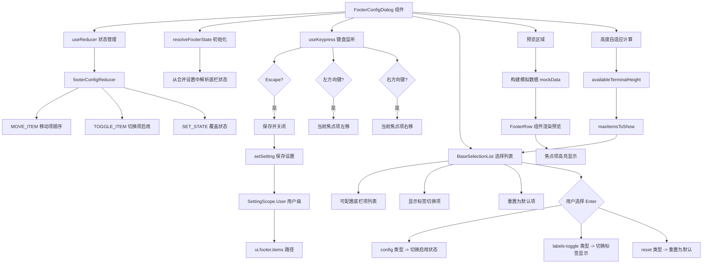

# FooterConfigDialog.tsx

## 概述

`FooterConfigDialog` 是一个交互式对话框组件，允许用户自定义 Gemini CLI 底部状态栏（Footer）的显示内容。用户可以通过该对话框：

- 勾选/取消勾选底栏中要显示的信息项（如工作目录、Git 分支、模型名称等）
- 使用左右方向键调整各信息项的显示顺序
- 切换是否显示底栏列标签
- 重置为默认底栏配置

对话框底部提供实时预览功能，使用模拟数据展示当前配置的底栏效果。所有配置变更在用户按 Escape 关闭对话框时自动保存到用户级设置中。

## 架构图（Mermaid）

## 核心组件

### FooterConfigDialogProps 接口

| 属性 | 类型 | 必填 | 说明 |
|------|------|------|------|
| `onClose` | `() => void` | 否 | 对话框关闭时的回调函数 |

### FooterConfigItem 接口

列表中每个配置项的数据模型。

| 字段 | 类型 | 说明 |
|------|------|------|
| `key` | `string` | 唯一标识 |
| `id` | `string` | 项 ID |
| `label` | `string` | 显示标签 |
| `description` | `string` (可选) | 描述文本 |
| `type` | `'config' \| 'labels-toggle' \| 'reset'` | 项类型：可配置项 / 标签切换 / 重置 |

### FooterConfigState 接口

Reducer 管理的状态结构。

| 字段 | 类型 | 说明 |
|------|------|------|
| `orderedIds` | `string[]` | 所有底栏项的有序 ID 列表（包括未启用的） |
| `selectedIds` | `Set<string>` | 当前启用的底栏项 ID 集合 |

### FooterConfigAction 联合类型

Reducer 支持的三种 Action：

| Action 类型 | 载荷 | 说明 |
|-------------|------|------|
| `MOVE_ITEM` | `{ id: string; direction: number }` | 将指定项在有序列表中向前(-1)或向后(+1)移动 |
| `TOGGLE_ITEM` | `{ id: string }` | 切换指定项的启用/禁用状态 |
| `SET_STATE` | `{ payload: Partial<FooterConfigState> }` | 直接覆盖部分状态（用于重置） |

### footerConfigReducer 函数

纯函数 Reducer，处理底栏配置的状态变更。

**MOVE_ITEM 逻辑：**
1. 查找目标项在 `orderedIds` 中的当前索引。
2. 计算新索引（当前索引 + direction）。
3. 如果新索引越界或目标项不存在，返回原状态。
4. 通过数组元素交换实现位置移动。

**TOGGLE_ITEM 逻辑：**
- 如果目标项已在 `selectedIds` 中，则移除；否则添加。

### FooterConfigDialog 函数组件

**列表项构建（listItems）：**

通过 `useMemo` 构建三类列表项：

1. **可配置底栏项**：从 `orderedIds` 映射，查找 `ALL_ITEMS` 中的配置定义，类型为 `'config'`。
2. **标签切换项**：固定项 `"Show footer labels"`，类型为 `'labels-toggle'`。
3. **重置项**：固定项 `"Reset to default footer"`，类型为 `'reset'`。

**键盘交互：**

| 按键 | 操作 |
|------|------|
| `Escape` | 保存当前配置并关闭对话框 |
| 左方向键 (`←`) | 将当前焦点的可配置项向左（前）移动一位 |
| 右方向键 (`→`) | 将当前焦点的可配置项向右（后）移动一位 |
| 上/下方向键 | 在列表项之间导航（由 BaseSelectionList 处理） |
| Enter | 选择当前项（切换启用/禁用、切换标签、或重置） |

**保存逻辑（handleSaveAndClose）：**

1. 从 `orderedIds` 中筛选出 `selectedIds` 包含的项，生成最终的 `finalItems` 数组。
2. 将 `finalItems` 与当前设置中的值进行 JSON 序列化比较。
3. 如果有变化，通过 `setSetting` 将新值保存到 `SettingScope.User` 作用域的 `ui.footer.items` 路径。
4. 调用 `onClose` 回调关闭对话框。

**重置逻辑（handleResetToDefaults）：**

1. 将 `ui.footer.items` 设置为 `undefined`（移除用户自定义值，回退到默认/旧版配置）。
2. 通过 `resolveFooterState` 重新计算状态。
3. 通过 `SET_STATE` action 更新 Reducer 状态。
4. 将焦点重置到第一个项。

**预览逻辑（previewContent）：**

- 如果焦点在"重置"项上，显示斜体灰色文本 `"Default footer (uses legacy settings)"`。
- 否则，使用模拟数据（mockData）为每个启用的项生成预览元素，通过 `FooterRow` 组件渲染。
- 当前焦点项在预览中以 `isFocused: true` 高亮显示。

模拟数据映射：

| 项 ID | 预览值 |
|-------|--------|
| `workspace` | `~/project/path` |
| `git-branch` | `main` |
| `sandbox` | `docker`（绿色） |
| `model-name` | `gemini-2.5-pro` |
| `context-used` | `85% used` |
| `quota` | `97%` |
| `memory-usage` | `260 MB` |
| `session-id` | `769992f9` |
| `code-changes` | `+12 -4`（绿/红色） |
| `token-count` | `1.5k tokens` |

**高度自适应逻辑：**

1. 计算可用终端高度：`constrainHeight ? terminalHeight - staticExtraHeight : MAX_SAFE_INTEGER`。
2. 如果可用高度不足以容纳边框 + 内边距 + 静态元素 + 最少 6 行列表，则取消内边距。
3. 计算列表可用空间：`availableTerminalHeight - BORDER_HEIGHT - effectivePaddingY - STATIC_ELEMENTS`。
4. 最大可显示项数：`min(listItems.length, floor(availableListSpace / 2))`（每项占 2 行）。

## 依赖关系

### 内部依赖

| 模块路径 | 导入内容 | 用途 |
|----------|----------|------|
| `../semantic-colors.js` | `theme` | 语义化主题颜色 |
| `../contexts/SettingsContext.js` | `useSettingsStore` | 获取和修改设置的 Hook |
| `../contexts/UIStateContext.js` | `useUIState` | 获取终端尺寸等 UI 状态 |
| `../hooks/useKeypress.js` | `useKeypress`, `Key` | 键盘按键监听 Hook 和按键类型 |
| `../key/keyMatchers.js` | `Command` | 按键命令枚举（ESCAPE、MOVE_LEFT、MOVE_RIGHT） |
| `./Footer.js` | `FooterRow`, `FooterRowItem` | 底栏行布局组件和项类型（用于预览渲染） |
| `../../config/footerItems.js` | `ALL_ITEMS`, `resolveFooterState` | 所有底栏项配置定义和状态解析函数 |
| `../../config/settings.js` | `SettingScope` | 设置作用域枚举（User） |
| `./shared/BaseSelectionList.js` | `BaseSelectionList` | 通用选择列表组件 |
| `../hooks/useSelectionList.js` | `SelectionListItem`（类型） | 选择列表项类型定义 |
| `./shared/DialogFooter.js` | `DialogFooter` | 对话框底部操作提示组件 |
| `../hooks/useKeyMatchers.js` | `useKeyMatchers` | 按键匹配器 Hook |

### 外部依赖

| 包名 | 导入内容 | 用途 |
|------|----------|------|
| `react` | `React`, `useCallback`, `useMemo`, `useReducer`, `useState` | React 核心库和 Hooks |
| `ink` | `Box`, `Text` | Ink 终端 UI 组件 |

## 关键实现细节

1. **useReducer 状态管理**：组件使用 `useReducer` 而非 `useState` 管理底栏配置状态，因为状态包含 `orderedIds`（有序数组）和 `selectedIds`（集合）两个相互关联的字段，且有多种复杂的状态变更操作（移动、切换、重置）。Reducer 模式使这些操作的逻辑集中且可测试。

2. **延迟保存策略**：配置变更不会立即写入设置存储。用户在对话框内的所有操作（勾选、排序）都只修改 Reducer 的本地状态。只有在按 Escape 关闭对话框时，才会通过 `handleSaveAndClose` 将最终结果一次性写入 `SettingScope.User` 设置。这避免了频繁的 IO 操作，也允许用户在关闭前"撤销"所有更改（虽然目前没有显式撤销功能，但重置功能可以达到类似效果）。

3. **标签切换的特殊处理**：`showLabels` 的切换与其他配置项不同，它通过 `handleToggleLabels` 直接写入 `ui.footer.showLabels` 设置，而不是通过 Reducer 管理。这是因为 `showLabels` 是一个独立的布尔设置，与项的顺序和启用状态无关，且需要立即反映在预览中。

4. **预览的模拟数据**：预览区域不使用真实数据（因为某些数据可能不可用或为空），而是使用一套固定的模拟数据（如 `~/project/path`、`main`、`gemini-2.5-pro` 等），让用户直观看到每个底栏项的视觉效果和排列方式。

5. **每项占 2 行的布局**：在 `maxItemsToShow` 的计算中，每个列表项被假定占用 2 行高度（1 行标签 + 1 行描述或间距），因此可显示项数为 `floor(availableListSpace / 2)`。

6. **方向键重排序**：左右方向键通过 `MOVE_ITEM` action 实现项的排序调整。这些按键通过 `useKeyMatchers` 进行匹配，支持 Vim 模式下的 `h`/`l` 键映射。按键监听设置了 `priority: true`，确保在列表导航之前优先处理排序操作。

7. **JSON 比较避免无效写入**：`handleSaveAndClose` 在保存前通过 `JSON.stringify` 比较新旧配置。如果用户没有实际修改任何内容就关闭了对话框，则不会触发设置写入操作，避免不必要的磁盘 IO。

8. **条件性内边距**：当终端高度极小时，组件会自动移除垂直内边距（`paddingY` 从 1 变为 0），以尽可能多地显示列表内容。这体现了 Gemini CLI 对各种终端尺寸的适配能力。
