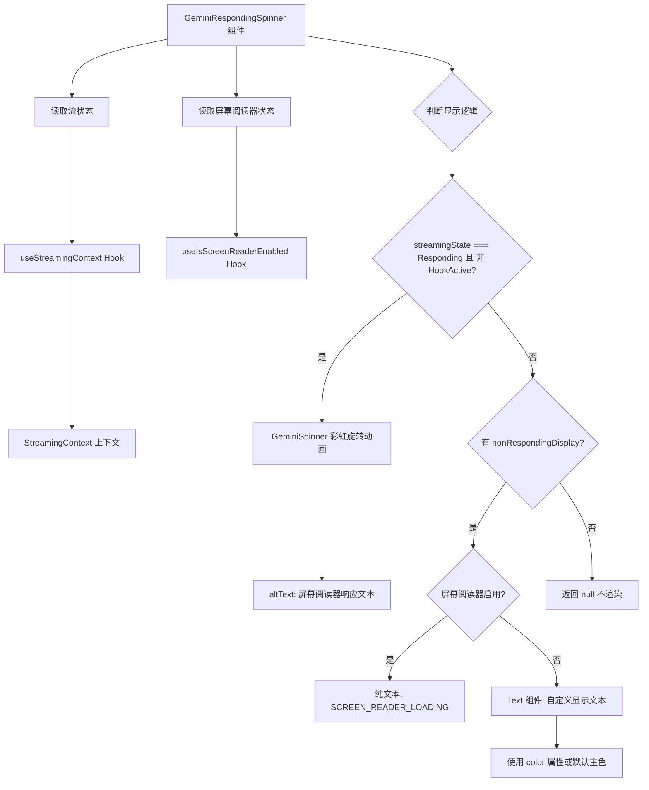

# GeminiRespondingSpinner.tsx

## 概述

`GeminiRespondingSpinner` 是一个条件性加载指示器组件，用于在 Gemini AI 正在响应时显示一个彩虹旋转动画（Rainbow Spinner），在非响应状态下显示自定义文本（如 Hook 图标），或者不显示任何内容。该组件同时支持屏幕阅读器的无障碍访问，在检测到屏幕阅读器启用时会用纯文本替代视觉动画。

该组件是 Gemini CLI 流式交互体验的重要组成部分，为用户提供关于 AI 处理状态的实时视觉反馈。

## 架构图（Mermaid）

## 核心组件

### GeminiRespondingSpinnerProps 接口

| 属性 | 类型 | 必填 | 默认值 | 说明 |
|------|------|------|--------|------|
| `nonRespondingDisplay` | `string` | 否 | `undefined` | 非响应状态下显示的文本（如 Hook 图标）。未提供则不渲染。 |
| `spinnerType` | `SpinnerName` | 否 | `'dots'` | 旋转动画类型，基于 `cli-spinners` 库的命名。 |
| `isHookActive` | `boolean` | 否 | `false` | 是否有 Hook 处于活跃状态。为 `true` 时，即使处于 Responding 状态也优先显示 `nonRespondingDisplay`。 |
| `color` | `string` | 否 | `theme.text.primary` | 非响应状态下文本的颜色。 |

### GeminiRespondingSpinner（函数组件）

**显示逻辑（三层判断）：**

1. **Gemini 正在响应且无活跃 Hook**（`streamingState === StreamingState.Responding && !isHookActive`）：
   - 渲染 `<GeminiSpinner>` 组件，显示旋转动画。
   - 传入 `spinnerType` 控制动画样式（默认为 `dots`）。
   - 传入 `altText` 为 `SCREEN_READER_RESPONDING`（无障碍替代文本）。

2. **非响应状态（或 Hook 活跃）且有 `nonRespondingDisplay`**：
   - 如果屏幕阅读器启用：显示 `SCREEN_READER_LOADING` 纯文本常量。
   - 如果屏幕阅读器未启用：以指定颜色（或默认 `theme.text.primary`）显示 `nonRespondingDisplay` 文本。

3. **其他情况**：返回 `null`，不渲染任何内容。

**Hook 活跃时的特殊行为：**

当 `isHookActive` 为 `true` 时，即使 Gemini 处于 Responding 状态，组件也不会显示彩虹旋转动画，而是走第二层判断逻辑，显示 `nonRespondingDisplay`（通常是一个 Hook 图标）。这是因为彩虹旋转动画在语义上代表"Gemini 正在说话"，而 Hook 活跃时实际上是 Hook 在执行，不应误导用户。

## 依赖关系

### 内部依赖

| 模块路径 | 导入内容 | 用途 |
|----------|----------|------|
| `../contexts/StreamingContext.js` | `useStreamingContext` | 获取当前的流式传输状态 |
| `../types.js` | `StreamingState` | 流状态枚举（包含 `Responding` 等值） |
| `../textConstants.js` | `SCREEN_READER_LOADING`, `SCREEN_READER_RESPONDING` | 屏幕阅读器的无障碍文本常量 |
| `../semantic-colors.js` | `theme` | 语义化主题颜色 |
| `./GeminiSpinner.js` | `GeminiSpinner` | Gemini 品牌旋转动画组件（彩虹色） |

### 外部依赖

| 包名 | 导入内容 | 用途 |
|------|----------|------|
| `react` | `React`（类型导入） | React 类型定义 |
| `ink` | `Text`, `useIsScreenReaderEnabled` | 文本渲染组件和屏幕阅读器检测 Hook |
| `cli-spinners` | `SpinnerName`（类型导入） | CLI 旋转动画名称的类型定义，如 `'dots'`、`'line'`、`'arc'` 等 |

## 关键实现细节

1. **三层渲染优先级**：组件采用严格的优先级判断：
   - 最高优先级：Gemini 响应中（且无活跃 Hook）-> 彩虹旋转动画。
   - 中等优先级：有自定义非响应显示文本 -> 显示该文本。
   - 最低优先级：返回 null（不渲染）。
   这种设计确保在不同状态切换时有清晰的视觉反馈。

2. **Hook 活跃时的语义一致性**：`isHookActive` 参数的引入解决了一个语义歧义问题。当外部 Hook（如代码执行 Hook）正在运行时，底层可能仍处于 Responding 状态，但此时显示"Gemini 正在说话"的彩虹动画是不准确的。通过此参数，调用方可以在 Hook 执行期间强制显示 Hook 图标而非 Gemini 旋转动画，保持 UI 反馈与实际操作的一致性。

3. **无障碍支持**：组件通过 Ink 的 `useIsScreenReaderEnabled` Hook 检测屏幕阅读器状态。在两个层级中都提供了无障碍支持：
   - Responding 状态：`GeminiSpinner` 组件接收 `altText` 属性，提供 `SCREEN_READER_RESPONDING` 文本。
   - 非 Responding 状态：如果屏幕阅读器启用，用 `SCREEN_READER_LOADING` 纯文本替代可能包含特殊字符或图标的 `nonRespondingDisplay`。

4. **默认 spinner 类型**：默认使用 `'dots'` 旋转动画类型（来自 `cli-spinners` 库），这是最常见和最小干扰的终端动画类型。调用方可以通过 `spinnerType` 属性自定义，`cli-spinners` 库提供了数十种不同的动画样式。

5. **组件职责单一**：`GeminiRespondingSpinner` 本身不管理任何状态，是一个纯粹的展示组件。所有状态信息（流状态、屏幕阅读器状态）都通过 Hook 从上下文中获取。旋转动画的实际实现委托给 `GeminiSpinner` 组件，本组件仅负责"何时显示什么"的决策逻辑。

6. **颜色回退机制**：非响应状态下的文本颜色支持通过 `color` prop 自定义，如果未提供则回退到 `theme.text.primary`（主题主色）。这种设计允许不同调用场景使用不同颜色以融入各自的 UI 环境。
