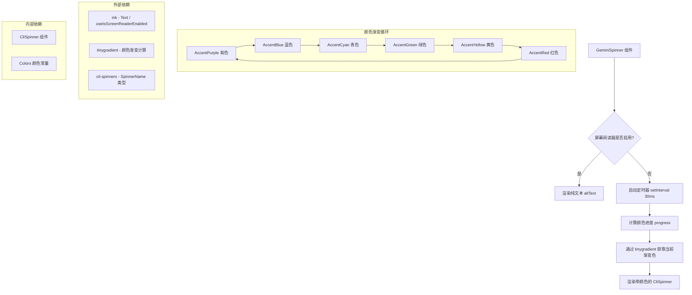

# GeminiSpinner.tsx

## 概述

`GeminiSpinner` 是一个 React (Ink) 组件，用于在终端 CLI 界面中展示一个带有 Google 品牌渐变色动画效果的加载旋转器（Spinner）。它通过 `tinygradient` 库在 Google 品牌六色（紫、蓝、青、绿、黄、红）之间进行平滑的颜色循环过渡，周期为 4 秒，帧率约 33fps。同时具备无障碍访问支持：当屏幕阅读器启用时，组件会退化为纯文本显示替代文本（`altText`），而非动画旋转器。

## 架构图（Mermaid）

## 核心组件

### GeminiSpinnerProps 接口

| 属性 | 类型 | 默认值 | 说明 |
|---|---|---|---|
| `spinnerType` | `SpinnerName` | `'dots'` | 旋转器样式类型，来自 `cli-spinners` 库的预定义样式名称 |
| `altText` | `string` | `undefined` | 屏幕阅读器启用时显示的替代文本 |

### GeminiSpinner 函数组件

这是该文件导出的唯一组件，是一个 React 函数组件（`React.FC<GeminiSpinnerProps>`）。

#### 内部状态与逻辑

1. **`isScreenReaderEnabled`**：通过 Ink 的 `useIsScreenReaderEnabled` Hook 检测屏幕阅读器状态，决定组件的渲染分支。

2. **`time` 状态**（`useState(0)`）：一个不断递增的时间计数器（毫秒），用于驱动颜色动画。每 30ms 递增 30，模拟时间流逝。

3. **`googleGradient`**（`useMemo`）：使用 `tinygradient` 库创建一个闭环渐变对象。渐变色依次为：
   - `Colors.AccentPurple`（紫色）
   - `Colors.AccentBlue`（蓝色）
   - `Colors.AccentCyan`（青色）
   - `Colors.AccentGreen`（绿色）
   - `Colors.AccentYellow`（黄色）
   - `Colors.AccentRed`（红色）
   - 回到 `Colors.AccentPurple`（形成闭环）

   该渐变对象通过 `useMemo` 缓存，避免每次渲染重复创建。

4. **定时器 `useEffect`**：当屏幕阅读器未启用时，创建一个 30ms 间隔的 `setInterval` 定时器，持续更新 `time` 状态。组件卸载或屏幕阅读器状态变化时清除定时器。

5. **颜色计算**：
   - `progress = (time % 4000) / 4000`：将时间映射到 `[0, 1)` 区间，实现 4 秒一个完整循环。
   - `currentColor = googleGradient.rgbAt(progress).toHexString()`：根据进度从渐变对象中获取当前颜色的十六进制值。

#### 渲染逻辑

- **屏幕阅读器启用**：渲染 `<Text>{altText}</Text>`，仅显示纯文本。
- **屏幕阅读器未启用**：渲染 `<Text color={currentColor}><CliSpinner type={spinnerType} /></Text>`，通过 Ink 的 `Text` 组件将当前渐变色应用到 `CliSpinner` 旋转器上。

## 依赖关系

### 内部依赖

| 模块 | 导入内容 | 说明 |
|---|---|---|
| `./CliSpinner.js` | `CliSpinner` | 底层 CLI 旋转器组件，负责渲染旋转动画帧 |
| `../colors.js` | `Colors` | 项目统一的颜色常量对象，包含 Google 品牌色 |

### 外部依赖

| 包名 | 导入内容 | 说明 |
|---|---|---|
| `react` | `React`, `useState`, `useEffect`, `useMemo` | React 核心库及 Hooks |
| `ink` | `Text`, `useIsScreenReaderEnabled` | Ink 终端 UI 框架，提供文本组件和屏幕阅读器检测 |
| `cli-spinners` | `SpinnerName`（类型） | CLI 旋转器样式类型定义 |
| `tinygradient` | `tinygradient` | 轻量级颜色渐变库，用于在多个颜色之间平滑插值 |

## 关键实现细节

1. **闭环渐变**：将品牌色数组的第一个元素追加到末尾（`[...brandColors, brandColors[0]]`），确保渐变在最后一个颜色（红色）和第一个颜色（紫色）之间也能平滑过渡，从而实现无缝循环。

2. **帧率控制**：定时器间隔设置为 30ms（约 33fps），在终端环境中提供流畅的颜色过渡效果，同时避免过高的 CPU 占用。

3. **无障碍访问**：通过 `useIsScreenReaderEnabled` 检测屏幕阅读器状态，当启用时：
   - 跳过定时器的创建（减少不必要的性能开销）
   - 直接渲染 `altText` 纯文本，确保屏幕阅读器用户获得可理解的内容

4. **颜色周期常量**：`COLOR_CYCLE_DURATION_MS = 4000`（4 秒），控制一次完整渐变循环的时长。通过模运算 `time % 4000` 使动画永远循环。

5. **性能优化**：`googleGradient` 使用 `useMemo` 缓存渐变对象，依赖数组为空，确保在组件生命周期内仅创建一次。
