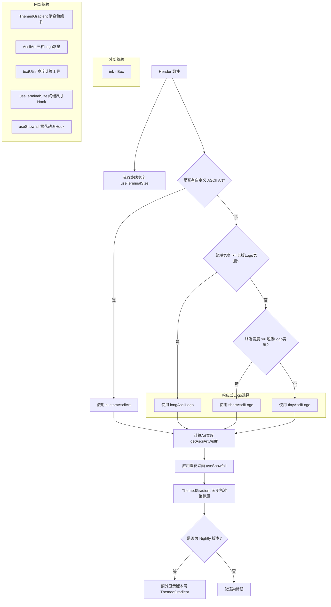

# Header.tsx

## 概述

`Header` 是一个 React (Ink) 组件，用于在 Gemini CLI 终端界面顶部渲染应用的 ASCII Art 标题 Logo。该组件具有**响应式布局能力**：根据终端窗口的宽度自动选择合适尺寸的 ASCII Art（长版、短版或迷你版），同时支持用户自定义 ASCII Art。标题文本通过 `ThemedGradient` 组件呈现品牌渐变色彩效果，并通过 `useSnowfall` Hook 添加雪花飘落动画效果。在 Nightly（夜间构建）版本中，还会额外显示版本号。

## 架构图（Mermaid）

## 核心组件

### HeaderProps 接口

| 属性 | 类型 | 必填 | 说明 |
|---|---|---|---|
| `customAsciiArt` | `string` | 否 | 用户自定义的 ASCII Art 文本，若提供则覆盖默认Logo |
| `version` | `string` | 是 | 当前 CLI 版本号字符串 |
| `nightly` | `boolean` | 是 | 是否为 Nightly（夜间构建）版本 |

### Header 函数组件

这是该文件导出的唯一组件，是一个 React 函数组件（`React.FC<HeaderProps>`）。

#### 内部逻辑流程

1. **获取终端宽度**：通过 `useTerminalSize()` Hook 获取当前终端的列数（`columns`），赋值给 `terminalWidth`。

2. **Logo 选择策略**（响应式适配）：
   - 首先计算 `longAsciiLogo` 和 `shortAsciiLogo` 的宽度。
   - 如果提供了 `customAsciiArt`，优先使用自定义内容。
   - 否则按照终端宽度从大到小依次匹配：
     - 终端宽度 >= 长版 Logo 宽度 -> 使用 `longAsciiLogo`
     - 终端宽度 >= 短版 Logo 宽度 -> 使用 `shortAsciiLogo`
     - 终端宽度不足 -> 使用 `tinyAsciiLogo`（最小版本）

3. **宽度计算**：使用 `getAsciiArtWidth()` 计算最终选定的 ASCII Art 的宽度，用于设置外层 `Box` 的 `width` 属性。

4. **雪花动画**：将选定的 `displayTitle` 传入 `useSnowfall` Hook，返回带有雪花飘落效果的标题文本。

5. **渲染结构**：
   - 外层 `<Box>` 设置为列方向布局（`flexDirection="column"`），宽度匹配 ASCII Art，不允许缩小（`flexShrink={0}`）。
   - 标题通过 `<ThemedGradient>` 渲染，呈现品牌渐变色。
   - 当 `nightly` 为 `true` 时，在标题下方右对齐显示版本号（`v{version}`），同样使用渐变色。

## 依赖关系

### 内部依赖

| 模块 | 导入内容 | 说明 |
|---|---|---|
| `./ThemedGradient.js` | `ThemedGradient` | 品牌渐变色文本渲染组件 |
| `./AsciiArt.js` | `shortAsciiLogo`, `longAsciiLogo`, `tinyAsciiLogo` | 三种不同尺寸的 ASCII Art Logo 常量 |
| `../utils/textUtils.js` | `getAsciiArtWidth` | 计算 ASCII Art 文本实际显示宽度的工具函数 |
| `../hooks/useTerminalSize.js` | `useTerminalSize` | 获取终端窗口尺寸的自定义 Hook |
| `../hooks/useSnowfall.js` | `useSnowfall` | 为文本添加雪花飘落动画效果的自定义 Hook |

### 外部依赖

| 包名 | 导入内容 | 说明 |
|---|---|---|
| `react` | `React`（类型） | React 核心库类型 |
| `ink` | `Box` | Ink 终端 UI 框架的布局容器组件 |

## 关键实现细节

1. **响应式 ASCII Art 选择**：组件实现了三级降级策略。通过 `getAsciiArtWidth` 精确计算每种 Logo 的字符宽度，与终端实际宽度对比，确保 Logo 不会超出终端边界导致换行或截断。这是终端 UI 中常见的响应式设计模式。

2. **自定义 ASCII Art 优先**：当用户通过配置提供了 `customAsciiArt` 时，该内容会覆盖所有默认 Logo，不受终端宽度限制。这为用户提供了个性化定制能力。

3. **Nightly 版本标识**：仅在 `nightly` 为 `true` 时才显示版本号，且版本号右对齐显示在标题下方。正式版本不显示此信息，保持界面简洁。

4. **flexShrink: 0**：外层 `Box` 设置了 `flexShrink={0}`，确保 Header 组件在父容器空间不足时不会被压缩，始终保持完整的 ASCII Art 显示。

5. **雪花动画集成**：`useSnowfall` Hook 接收原始 ASCII Art 文本，返回带有动画效果的文本。这是一个装饰性特效，在视觉上增添趣味性。
