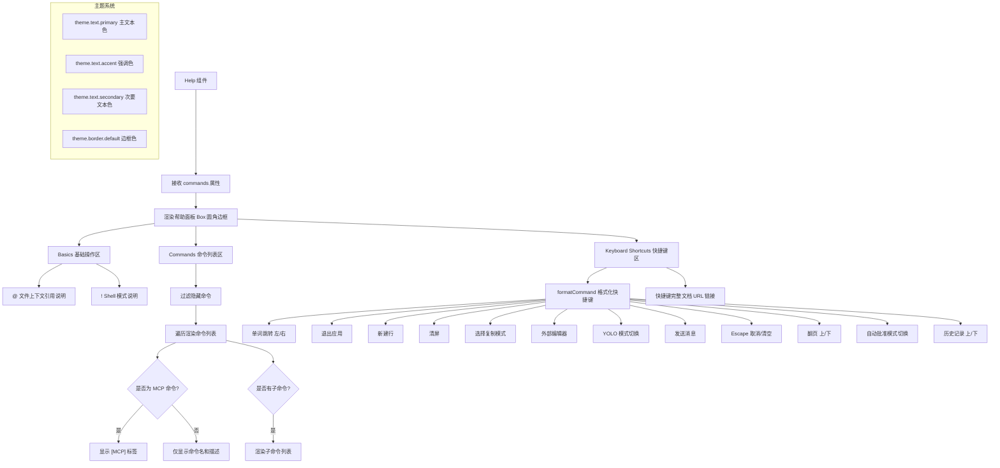

# Help.tsx

## 概述

`Help` 是一个 React (Ink) 组件，用于在 Gemini CLI 终端界面中渲染帮助面板。当用户执行 `/help` 命令时，该组件会显示一个带圆角边框的帮助信息面板，内容分为三大部分：

1. **Basics（基础操作）**：介绍 `@` 上下文引用和 `!` Shell 模式两个核心交互方式。
2. **Commands（斜杠命令列表）**：动态渲染所有可见的斜杠命令及其子命令，支持 MCP（Model Context Protocol）命令标识。
3. **Keyboard Shortcuts（键盘快捷键）**：列出所有可用的键盘快捷键及其功能说明，并提供完整快捷键文档的 URL 链接。

## 架构图（Mermaid）

## 核心组件

### Help 接口（Props）

| 属性 | 类型 | 必填 | 说明 |
|---|---|---|---|
| `commands` | `readonly SlashCommand[]` | 是 | 所有可用的斜杠命令数组，组件会过滤并渲染可见的命令 |

### Help 函数组件

这是该文件导出的唯一组件，是一个 React 函数组件（`React.FC<Help>`）。组件本身是一个纯展示组件，无内部状态。

#### 渲染结构详解

**1. 外层容器 `<Box>`**
- 列方向布局（`flexDirection="column"`）
- 圆角边框样式（`borderStyle="round"`）
- 边框颜色取自主题（`theme.border.default`）
- 内边距为 1（`padding={1}`）
- 下外边距为 1（`marginBottom={1}`）

**2. Basics 基础操作区**
- **`@` 上下文引用**：说明用户可以使用 `@` 符号指定文件或文件夹作为上下文（如 `@src/myFile.ts`）。
- **`!` Shell 模式**：说明用户可以通过 `!` 前缀直接执行 shell 命令（如 `!npm run start`），也可以使用自然语言描述。

**3. Commands 命令列表区**
- 过滤逻辑：`commands.filter(command => command.description && !command.hidden)` 排除没有描述或标记为隐藏的命令。
- 每个命令渲染：
  - 命令名（`/{command.name}`）以强调色高亮加粗显示。
  - 如果是 MCP 命令（`command.kind === CommandKind.MCP_PROMPT`），追加 `[MCP]` 标签，使用次要文本色。
  - 命令描述通过 `sanitizeForDisplay` 截断至 100 字符。
- 子命令：如果命令有 `subCommands`，过滤隐藏子命令后逐个渲染，缩进 3 个空格。
- 末尾追加 `!` 的说明（shell command）和 `[MCP]` 的说明。

**4. Keyboard Shortcuts 快捷键区**
通过 `formatCommand(Command.XXX)` 函数将内部命令枚举转换为可读的快捷键表示。列出以下快捷键：

| 命令 | 功能 |
|---|---|
| `MOVE_WORD_LEFT` / `MOVE_WORD_RIGHT` | 在输入中按单词跳转 |
| `QUIT` | 退出应用 |
| `NEWLINE` | 新建行 |
| `CLEAR_SCREEN` | 清屏 |
| `TOGGLE_COPY_MODE` | 进入选择模式以复制文本 |
| `OPEN_EXTERNAL_EDITOR` | 在外部编辑器中打开输入 |
| `TOGGLE_YOLO` | 切换 YOLO 模式 |
| `SUBMIT` | 发送消息 |
| `ESCAPE` | 取消操作 / 清空输入（双击） |
| `PAGE_UP` / `PAGE_DOWN` | 翻页 |
| `CYCLE_APPROVAL_MODE` | 切换自动批准编辑模式 |
| `HISTORY_UP` / `HISTORY_DOWN` | 浏览提示历史记录 |

最后提供 `KEYBOARD_SHORTCUTS_URL` 指向完整的快捷键文档。

## 依赖关系

### 内部依赖

| 模块 | 导入内容 | 说明 |
|---|---|---|
| `../semantic-colors.js` | `theme` | 语义化主题颜色对象，包含 `text.primary`、`text.accent`、`text.secondary`、`border.default` 等 |
| `../commands/types.js` | `SlashCommand`（类型）, `CommandKind` | 斜杠命令类型定义和命令种类枚举（如 `MCP_PROMPT`） |
| `../constants.js` | `KEYBOARD_SHORTCUTS_URL` | 键盘快捷键完整文档的 URL 常量 |
| `../utils/textUtils.js` | `sanitizeForDisplay` | 文本截断和清理工具函数，限制最大字符数 |
| `../key/keybindingUtils.js` | `formatCommand` | 将内部命令枚举格式化为可读的快捷键字符串 |
| `../key/keyBindings.js` | `Command` | 键盘命令枚举，定义所有可用的键盘操作 |

### 外部依赖

| 包名 | 导入内容 | 说明 |
|---|---|---|
| `react` | `React`（类型） | React 核心库类型 |
| `ink` | `Box`, `Text` | Ink 终端 UI 框架的布局容器和文本组件 |

## 关键实现细节

1. **命令过滤机制**：组件不会显示所有命令，而是通过双重过滤确保只展示用户可见的命令：
   - 一级命令：必须有 `description` 且 `hidden` 不为 `true`。
   - 子命令：必须 `hidden` 不为 `true`。

2. **MCP 命令标识**：来自 Model Context Protocol 外部服务器的命令会通过 `CommandKind.MCP_PROMPT` 标识，并在 UI 中以 `[MCP]` 标签区分，使用次要文本色（`theme.text.secondary`），帮助用户区分内置命令和外部命令。

3. **文本清理**：命令描述通过 `sanitizeForDisplay(description, 100)` 进行截断处理，防止过长的描述破坏终端布局。

4. **主题化颜色**：所有文本和边框颜色均来自 `theme` 语义化颜色系统，支持主题切换。组件使用三级文本色彩层次：
   - `theme.text.primary`：主要说明文本
   - `theme.text.accent`：命令名、快捷键等需要突出显示的内容
   - `theme.text.secondary`：次要标签（如 `[MCP]`）

5. **快捷键动态格式化**：快捷键不是硬编码字符串，而是通过 `formatCommand(Command.XXX)` 动态生成。这意味着如果用户自定义了键绑定，Help 面板会自动反映最新的快捷键配置。

6. **纯展示组件**：该组件没有内部状态或副作用，是一个纯函数组件。所有数据均通过 props 传入，渲染完全由输入决定。
