# HistoryItemDisplay.tsx

## 概述

`HistoryItemDisplay` 是 Gemini CLI 中最核心的消息路由/分发组件之一。它接收一个 `HistoryItem`（历史记录条目），根据其 `type` 字段将其路由到对应的专用消息渲染组件。该组件相当于一个**消息类型分发器**，支持多达 **22 种**不同的历史记录类型，覆盖了用户消息、AI 回复、工具调用、系统信息、错误、帮助、统计、MCP 状态等所有 CLI 交互场景。

组件在渲染前会通过 `escapeAnsiCtrlCodes` 对历史条目进行 ANSI 控制码转义处理，确保安全显示。同时支持内联思考模式（Inline Thinking），在思考消息和后续消息之间添加适当的视觉间距。

## 架构图（Mermaid）

```mermaid
graph TD
    A[HistoryItemDisplay 组件] --> B[escapeAnsiCtrlCodes 转义处理]
    B --> C[获取设置 useSettings]
    C --> D[获取内联思考模式 getInlineThinkingMode]
    D --> E{根据 item.type 分发}

    E --> |thinking| F[ThinkingMessage 思考消息]
    E --> |hint| G[HintMessage 提示消息]
    E --> |user| H[UserMessage 用户消息]
    E --> |user_shell| I[UserShellMessage 用户Shell命令]
    E --> |gemini| J[GeminiMessage AI回复]
    E --> |gemini_content| K[GeminiMessageContent AI内容]
    E --> |info| L[InfoMessage 信息消息]
    E --> |warning| M[WarningMessage 警告消息]
    E --> |error| N[ErrorMessage 错误消息]
    E --> |about| O[AboutBox 关于面板]
    E --> |help| P[Help 帮助面板]
    E --> |stats| Q[StatsDisplay 统计面板]
    E --> |model_stats| R[ModelStatsDisplay 模型统计]
    E --> |tool_stats| S[ToolStatsDisplay 工具统计]
    E --> |model| T[ModelMessage 模型信息]
    E --> |quit| U[SessionSummaryDisplay 会话摘要]
    E --> |tool_group| V[ToolGroupMessage 工具组消息]
    E --> |compression| W[CompressionMessage 压缩消息]
    E --> |extensions_list| X[ExtensionsList 扩展列表]
    E --> |tools_list| Y[ToolsList 工具列表]
    E --> |skills_list| Z[SkillsList 技能列表]
    E --> |agents_list| AA[AgentsStatus 代理状态]
    E --> |mcp_status| AB[McpStatus MCP状态]
    E --> |chat_list| AC[ChatList 聊天列表]

    subgraph 消息类组件
        F; G; H; I; J; K; L; M; N
    end

    subgraph 面板类组件
        O; P; Q; R; S; T; U
    end

    subgraph 视图类组件
        X; Y; Z; AA; AB; AC
    end

    subgraph 其他组件
        V; W
    end
```

## 核心组件

### HistoryItemDisplayProps 接口

| 属性 | 类型 | 必填 | 默认值 | 说明 |
|---|---|---|---|---|
| `item` | `HistoryItem` | 是 | - | 要渲染的历史记录条目，包含 `type` 字段和对应的数据 |
| `availableTerminalHeight` | `number` | 否 | `undefined` | 可用终端高度（行数），用于限制消息渲染区域 |
| `terminalWidth` | `number` | 是 | - | 终端宽度（列数），传递给子组件用于布局 |
| `isPending` | `boolean` | 是 | - | 消息是否处于待处理/流式传输状态 |
| `commands` | `readonly SlashCommand[]` | 否 | `undefined` | 斜杠命令列表，仅在 `help` 类型时需要 |
| `availableTerminalHeightGemini` | `number` | 否 | `undefined` | Gemini 消息专用的可用终端高度，优先级高于 `availableTerminalHeight` |
| `isExpandable` | `boolean` | 否 | `undefined` | 工具组消息是否可展开 |
| `isFirstThinking` | `boolean` | 否 | `false` | 是否是第一条思考消息 |
| `isFirstAfterThinking` | `boolean` | 否 | `false` | 是否是思考消息之后的第一条非思考消息 |

### HistoryItemDisplay 函数组件

#### 支持的历史记录类型（22 种）

| 类型 (`type`) | 渲染组件 | 说明 |
|---|---|---|
| `thinking` | `ThinkingMessage` | AI 的思考过程消息，受内联思考模式设置控制 |
| `hint` | `HintMessage` | 系统提示消息 |
| `user` | `UserMessage` | 用户输入的文本消息 |
| `user_shell` | `UserShellMessage` | 用户执行的 Shell 命令 |
| `gemini` | `GeminiMessage` | Gemini AI 的回复消息 |
| `gemini_content` | `GeminiMessageContent` | Gemini AI 的内容消息（与 gemini 类型有不同的渲染样式） |
| `info` | `InfoMessage` | 系统信息消息，支持图标、颜色、次要文本 |
| `warning` | `WarningMessage` | 警告消息 |
| `error` | `ErrorMessage` | 错误消息 |
| `about` | `AboutBox` | 关于面板，显示版本、系统、认证等信息 |
| `help` | `Help` | 帮助面板，需要 `commands` 属性 |
| `stats` | `StatsDisplay` | 会话统计面板，含配额信息 |
| `model_stats` | `ModelStatsDisplay` | 模型统计面板 |
| `tool_stats` | `ToolStatsDisplay` | 工具使用统计面板 |
| `model` | `ModelMessage` | 模型信息消息 |
| `quit` | `SessionSummaryDisplay` | 退出时的会话摘要 |
| `tool_group` | `ToolGroupMessage` | 工具调用组消息，包含多个工具调用 |
| `compression` | `CompressionMessage` | 上下文压缩消息 |
| `extensions_list` | `ExtensionsList` | 扩展列表视图 |
| `tools_list` | `ToolsList` | 工具列表视图 |
| `skills_list` | `SkillsList` | 技能列表视图 |
| `agents_list` | `AgentsStatus` | 代理状态视图 |
| `mcp_status` | `McpStatus` | MCP 服务器状态视图 |
| `chat_list` | `ChatList` | 聊天记录列表视图 |

## 依赖关系

### 内部依赖

| 模块 | 导入内容 | 说明 |
|---|---|---|
| `../utils/textUtils.js` | `escapeAnsiCtrlCodes` | ANSI 控制码转义工具函数 |
| `../types.js` | `HistoryItem`（类型） | 历史记录条目类型定义 |
| `./messages/UserMessage.js` | `UserMessage` | 用户消息渲染组件 |
| `./messages/UserShellMessage.js` | `UserShellMessage` | 用户 Shell 命令渲染组件 |
| `./messages/GeminiMessage.js` | `GeminiMessage` | Gemini AI 回复渲染组件 |
| `./messages/GeminiMessageContent.js` | `GeminiMessageContent` | Gemini AI 内容渲染组件 |
| `./messages/InfoMessage.js` | `InfoMessage` | 信息消息渲染组件 |
| `./messages/ErrorMessage.js` | `ErrorMessage` | 错误消息渲染组件 |
| `./messages/ToolGroupMessage.js` | `ToolGroupMessage` | 工具组消息渲染组件 |
| `./messages/CompressionMessage.js` | `CompressionMessage` | 压缩消息渲染组件 |
| `./messages/WarningMessage.js` | `WarningMessage` | 警告消息渲染组件 |
| `./messages/ModelMessage.js` | `ModelMessage` | 模型信息渲染组件 |
| `./messages/ThinkingMessage.js` | `ThinkingMessage` | 思考消息渲染组件 |
| `./messages/HintMessage.js` | `HintMessage` | 提示消息渲染组件 |
| `./AboutBox.js` | `AboutBox` | 关于面板组件 |
| `./StatsDisplay.js` | `StatsDisplay` | 统计面板组件 |
| `./ModelStatsDisplay.js` | `ModelStatsDisplay` | 模型统计面板组件 |
| `./ToolStatsDisplay.js` | `ToolStatsDisplay` | 工具统计面板组件 |
| `./SessionSummaryDisplay.js` | `SessionSummaryDisplay` | 会话摘要组件 |
| `./Help.js` | `Help` | 帮助面板组件 |
| `./views/ExtensionsList.js` | `ExtensionsList` | 扩展列表视图组件 |
| `./views/ToolsList.js` | `ToolsList` | 工具列表视图组件 |
| `./views/SkillsList.js` | `SkillsList` | 技能列表视图组件 |
| `./views/AgentsStatus.js` | `AgentsStatus` | 代理状态视图组件 |
| `./views/McpStatus.js` | `McpStatus` | MCP 状态视图组件 |
| `./views/ChatList.js` | `ChatList` | 聊天列表视图组件 |
| `../commands/types.js` | `SlashCommand`（类型） | 斜杠命令类型定义 |
| `../utils/inlineThinkingMode.js` | `getInlineThinkingMode` | 获取内联思考模式设置 |
| `../contexts/SettingsContext.js` | `useSettings` | 获取用户设置的 Context Hook |

### 外部依赖

| 包名 | 导入内容 | 说明 |
|---|---|---|
| `react` | `React`（类型）, `useMemo` | React 核心库及 Hooks |
| `ink` | `Box` | Ink 终端 UI 框架的布局容器组件 |
| `@google/gemini-cli-core` | `getMCPServerStatus` | 获取 MCP 服务器状态的核心库函数 |

## 关键实现细节

1. **ANSI 控制码转义**：在渲染前，通过 `useMemo(() => escapeAnsiCtrlCodes(item), [item])` 对历史条目进行 ANSI 控制码转义。这是一个安全措施，防止恶意或意外的 ANSI 转义序列影响终端显示。使用 `useMemo` 缓存结果，仅在 `item` 变化时重新计算。

2. **内联思考模式控制**：
   - 通过 `useSettings()` 和 `getInlineThinkingMode(settings)` 获取当前的内联思考模式设置。
   - `thinking` 类型消息仅在 `inlineThinkingMode !== 'off'` 时渲染。
   - `isFirstAfterThinking` 属性用于在思考消息和后续消息之间添加顶部外边距（`marginTop: 1`），视觉上分隔思考内容和正式回复。

3. **Gemini 消息高度优先级**：`gemini` 和 `gemini_content` 类型使用 `availableTerminalHeightGemini ?? availableTerminalHeight` 作为可用高度。`availableTerminalHeightGemini` 是专门为 Gemini 消息计算的可用高度，优先级更高，允许 Gemini 消息获得比其他消息类型更大的渲染空间。

4. **条件渲染模式**：组件使用 `{item.type === 'xxx' && <Component />}` 模式进行条件渲染，而非 `switch-case`。这是 React/JSX 中常见的模式，每个条件渲染互不干扰，同一时间只有一个分支会产生实际 DOM 输出。

5. **配额统计数据构造**：`stats` 和 `model_stats` 类型在传递配额数据时，会检查 `pooledRemaining`、`pooledLimit`、`pooledResetTime` 中是否有任何一个存在，存在则构造 `quotaStats` 对象，否则传 `undefined`。这种模式避免了传递空对象。

6. **MCP 状态集成**：`mcp_status` 类型使用展开运算符（`{...itemForDisplay}`）传递所有属性，并额外注入 `getMCPServerStatus` 函数（从 `@google/gemini-cli-core` 导入），使 `McpStatus` 组件能够动态查询 MCP 服务器状态。

7. **组件规模**：该组件导入了 **27 个**子组件/视图，是整个 UI 层中依赖最密集的组件之一，体现了其作为核心消息路由器的角色。
