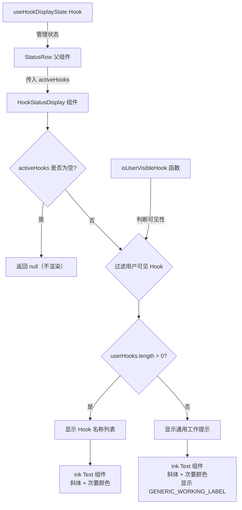

# HookStatusDisplay.tsx

## 概述

`HookStatusDisplay` 是一个 React 函数组件，用于在 CLI 终端界面中展示当前正在执行的 Hook（钩子）的状态信息。它负责根据活跃的 Hook 列表，向用户显示正在执行的 Hook 名称及其进度，或者在仅有系统/扩展 Hook 运行时显示一个通用的"工作中"提示。

该组件是 Gemini CLI 状态栏（`StatusRow`）的子组件之一，被嵌入到主 UI 的状态展示区域中，提供实时的 Hook 执行反馈。

**源文件路径**: `packages/cli/src/ui/components/HookStatusDisplay.tsx`

## 架构图（Mermaid）



## 核心组件

### HookStatusDisplayProps 接口

```typescript
interface HookStatusDisplayProps {
  activeHooks: ActiveHook[];
}
```

| 属性 | 类型 | 说明 |
|------|------|------|
| `activeHooks` | `ActiveHook[]` | 当前正在执行的所有活跃 Hook 列表 |

### ActiveHook 类型（来自 `../types.ts`）

```typescript
export interface ActiveHook {
  name: string;       // Hook 的名称
  eventName: string;  // 触发 Hook 的事件名
  source?: string;    // Hook 的来源（System / User / Extension 等）
  index?: number;     // 当前 Hook 在同名批次中的序号
  total?: number;     // 同名批次中 Hook 的总数
}
```

### HookStatusDisplay 组件

这是一个纯展示型的 React 函数组件（`React.FC`），没有内部状态，完全由 props 驱动渲染。

#### 渲染逻辑

1. **空列表判断**：如果 `activeHooks` 为空数组，直接返回 `null`，不渲染任何内容。
2. **过滤用户可见 Hook**：使用 `isUserVisibleHook(h.source)` 过滤出对用户可见的 Hook（排除系统 Hook）。
3. **用户可见 Hook 的展示**：
   - 根据数量选择标签文本：单个 Hook 显示 `"Executing Hook"`，多个显示 `"Executing Hooks"`。
   - 对每个 Hook 生成显示名称，如果存在批次信息（`index` 和 `total > 1`），则追加 `(index/total)` 后缀。
   - 将所有名称用逗号连接，组合成最终文本：`"Executing Hook: hookName"` 或 `"Executing Hooks: hook1, hook2 (1/3)"`。
4. **仅系统 Hook 运行时**：显示通用工作标签 `GENERIC_WORKING_LABEL`（值为 `"Working..."`）。

#### 样式

所有文本均使用 `ink` 的 `<Text>` 组件渲染，统一应用：
- `color={theme.text.secondary}`：次要文本颜色
- `italic={true}`：斜体样式

## 依赖关系

### 内部依赖

| 模块路径 | 导入内容 | 用途 |
|----------|----------|------|
| `../types.js` | `ActiveHook` (类型) | 定义 Hook 的数据结构 |
| `../textConstants.js` | `GENERIC_WORKING_LABEL` | 通用工作中提示文本常量（`"Working..."`） |
| `../semantic-colors.js` | `theme` | 语义化颜色主题，提供 `theme.text.secondary` |

### 外部依赖

| 包名 | 导入内容 | 用途 |
|------|----------|------|
| `react` | `React` (类型) | 提供 `React.FC` 类型定义 |
| `ink` | `Text` | 终端 UI 文本渲染组件 |
| `@google/gemini-cli-core` | `isUserVisibleHook` | 判断 Hook 来源是否对用户可见（排除 `ConfigSource.System`） |

## 关键实现细节

### 1. 用户可见性过滤机制

组件使用 `isUserVisibleHook` 函数来区分用户 Hook 和系统 Hook。该函数的逻辑如下：

```typescript
export function isUserVisibleHook(source?: string | ConfigSource): boolean {
  if (!source) return true; // 未知/旧版 Hook 视为用户可见
  return source !== ConfigSource.System;
}
```

- 来源为 `ConfigSource.System` 的 Hook 被视为系统内部 Hook，不直接展示给用户。
- 未指定来源的 Hook 默认视为用户可见，这是一种向后兼容的策略。

### 2. 批次进度显示

当同一个 Hook 有多个实例在执行时（`total > 1`），会在名称后追加序号信息，例如 `"myHook (2/5)"`，让用户了解整体进度。需要注意的是，只有当 `index` 和 `total` 都存在且 `total > 1` 时才会显示进度。

### 3. 两层降级显示策略

组件采用了两层降级策略：
1. **有用户可见 Hook**：精确显示每个 Hook 的名称和进度。
2. **仅有系统/扩展 Hook**：避免暴露内部实现细节，只显示 `"Working..."` 的通用提示。
3. **无 Hook 运行**：不渲染任何内容（返回 `null`）。

### 4. 纯展示组件特性

该组件是一个典型的"哑组件"（Dumb Component）：
- 无内部状态（`useState`）
- 无副作用（`useEffect`）
- 完全由 props 驱动
- 状态管理由上游的 `useHookDisplayState` 自定义 Hook 负责，通过 `UIStateContext` 传递到 `StatusRow`，再 props 传递给本组件。

### 5. 数据流

```
HookStart/End 事件 → useHookDisplayState → UIStateContext → StatusRow → HookStatusDisplay
```

`useHookDisplayState` 在接收到 `HookStart` 事件时将 Hook 添加到活跃列表，在 `HookEnd` 事件时移除。移除操作还会考虑最小显示时长（`WARNING_PROMPT_DURATION_MS`），避免 Hook 状态闪现。
