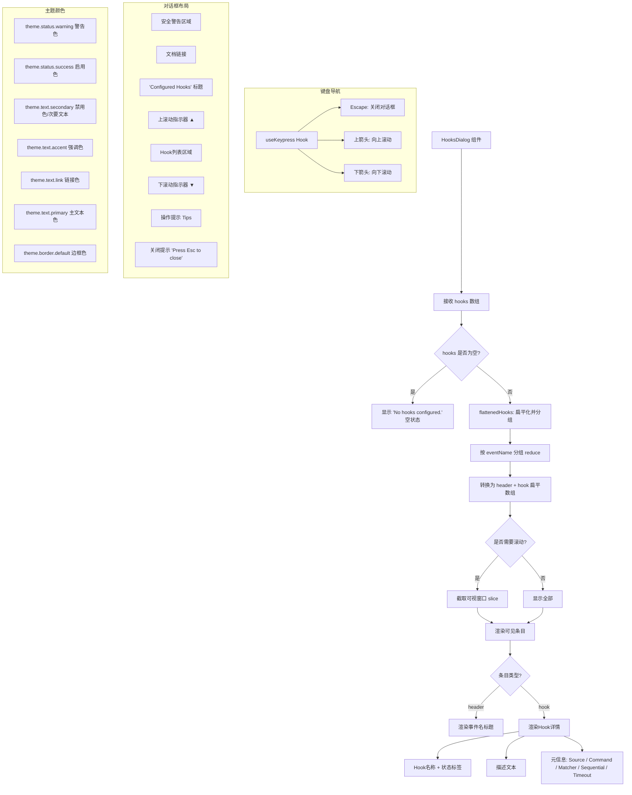

# HooksDialog.tsx

## 概述

`HooksDialog` 是一个模态对话框式的 React (Ink) 组件，用于在 Gemini CLI 终端界面中展示已配置的 Hooks（钩子）列表。Hooks 是 Gemini CLI 的扩展机制，允许在特定事件（如工具调用前后）触发自定义命令执行。

该组件具有以下核心特性：
- **分组显示**：将 Hooks 按事件名称（`eventName`）分组，每组显示标题和所属的 Hook 条目。
- **滚动支持**：当 Hook 数量超过可视区域限制（默认 8 条）时，支持上下箭头键滚动，并显示滚动方向指示器（上下三角箭头）。
- **安全警告**：面板顶部突出显示安全警告，提醒用户 Hooks 可以执行任意命令。
- **键盘导航**：支持 `Escape` 键关闭对话框，上下方向键滚动。
- **状态标识**：每个 Hook 显示启用/禁用状态，使用不同颜色区分。

## 架构图（Mermaid）

## 核心组件

### HookEntry 接口

导出的接口，描述单个 Hook 条目的数据结构，对应核心库中的 `HookRegistryEntry`。

| 属性 | 类型 | 说明 |
|---|---|---|
| `config` | `object` | Hook 配置对象 |
| `config.command` | `string?` | 要执行的命令 |
| `config.type` | `string` | Hook 类型 |
| `config.name` | `string?` | Hook 名称 |
| `config.description` | `string?` | Hook 描述 |
| `config.timeout` | `number?` | 超时时间（秒） |
| `source` | `string` | Hook 来源（如配置文件路径） |
| `eventName` | `string` | 触发事件名称（如 `preToolCall`、`postToolCall` 等） |
| `matcher` | `string?` | 匹配器表达式，用于过滤特定工具调用 |
| `sequential` | `boolean?` | 是否顺序执行（而非并行） |
| `enabled` | `boolean` | Hook 是否启用 |

### HooksDialogProps 接口

| 属性 | 类型 | 必填 | 默认值 | 说明 |
|---|---|---|---|---|
| `hooks` | `readonly HookEntry[]` | 是 | - | 要显示的 Hook 条目数组 |
| `onClose` | `() => void` | 是 | - | 关闭对话框的回调函数 |
| `maxVisibleHooks` | `number` | 否 | `8` | 最大可见 Hook 条目数，超出时启用滚动 |

### HooksDialog 函数组件

#### 内部状态

| 状态 | 类型 | 说明 |
|---|---|---|
| `scrollOffset` | `number` | 当前滚动偏移量，从 0 开始 |

#### 核心计算逻辑

**1. `flattenedHooks`（`useMemo`）**

将输入的 `hooks` 数组进行分组和扁平化处理：
- 首先使用 `reduce` 按 `eventName` 分组，生成 `Record<string, HookEntry[]>` 结构。
- 然后遍历分组结果，将每组转换为 `header`（事件名标题）+ 多个 `hook`（Hook 条目）的扁平数组。
- 结果数组中每个元素的类型为 `{ type: 'header' | 'hook'; eventName: string; hook?: HookEntry }`。

**2. 滚动计算**

- `totalItems`：扁平化后的总条目数（包含 header 和 hook）。
- `needsScrolling`：`totalItems > maxVisibleHooks` 时需要滚动。
- `maxScrollOffset`：最大可滚动偏移量，`Math.max(0, totalItems - maxVisibleHooks)`。
- `visibleItems`：通过 `slice(scrollOffset, scrollOffset + maxVisibleHooks)` 截取当前可见窗口。

**3. 键盘事件处理（`useKeypress`）**

- `Escape` 键：调用 `onClose()` 关闭对话框。
- 上方向键（`DIALOG_NAVIGATION_UP`）：`scrollOffset` 减 1（不低于 0）。
- 下方向键（`DIALOG_NAVIGATION_DOWN`）：`scrollOffset` 加 1（不超过 `maxScrollOffset`）。

#### 渲染结构

对话框从上到下的布局结构：

1. **安全警告区域**：黄色/橙色警告文本，提醒 Hooks 可以执行任意命令。
2. **文档链接**：指向 `https://geminicli.com/docs/hooks` 的学习链接。
3. **"Configured Hooks" 标题**：强调色加粗标题。
4. **上滚动指示器 `▲`**：仅在可向上滚动时显示。
5. **Hook 列表区域**：
   - **header 类型**：渲染事件名称，使用链接色加粗。
   - **hook 类型**：渲染 Hook 详情：
     - 第一行：Hook 名称（`config.name` || `config.command` || `'unknown'`）+ 状态标签（`[enabled]`/`[disabled]`）
     - 第二行（缩进）：描述文本（斜体）
     - 第三行（缩进）：元信息（Source、Command、Matcher、Sequential、Timeout）
6. **下滚动指示器 `▼`**：仅在可向下滚动时显示。
7. **操作提示 Tips**：提示 `/hooks enable`、`/hooks disable`、`/hooks enable-all`、`/hooks disable-all` 命令。
8. **关闭提示**：`(Press Esc to close)`。

## 依赖关系

### 内部依赖

| 模块 | 导入内容 | 说明 |
|---|---|---|
| `../semantic-colors.js` | `theme` | 语义化主题颜色对象 |
| `../hooks/useKeypress.js` | `useKeypress` | 键盘按键监听自定义 Hook |
| `../key/keyMatchers.js` | `Command` | 键盘命令枚举 |
| `../hooks/useKeyMatchers.js` | `useKeyMatchers` | 获取键盘匹配器的自定义 Hook |

### 外部依赖

| 包名 | 导入内容 | 说明 |
|---|---|---|
| `react` | `React`（类型）, `useState`, `useMemo` | React 核心库及 Hooks |
| `ink` | `Box`, `Text` | Ink 终端 UI 框架的布局容器和文本组件 |

## 关键实现细节

1. **扁平化分组策略**：组件没有使用嵌套渲染（先渲染事件组，再在组内渲染 Hooks），而是先将所有内容扁平化为一维数组，然后统一进行滚动裁剪。这种设计使滚动逻辑更简单——只需对一个一维数组做 `slice` 操作，而不需要处理跨组滚动的复杂边界情况。

2. **滚动窗口机制**：滚动实现采用了经典的"固定窗口 + 偏移量"模式：
   - 窗口大小固定为 `maxVisibleHooks`（默认 8）。
   - `scrollOffset` 控制窗口起始位置。
   - 通过 `slice(scrollOffset, scrollOffset + maxVisibleHooks)` 提取可见内容。
   - 上下方向指示器根据 `scrollOffset` 和 `maxScrollOffset` 的关系决定是否显示。

3. **安全第一的设计**：安全警告被放置在对话框最顶部，且使用加粗、下划线和警告色三重强调，确保用户第一眼看到安全提醒。这符合 Hooks 机制的安全敏感性——Hooks 可以执行任意系统命令。

4. **Hook 命名降级策略**：Hook 名称的获取优先级为 `config.name > config.command > 'unknown'`，确保即使配置不完整也能显示一个可辨识的名称。

5. **状态颜色语义**：启用的 Hook 使用 `theme.status.success`（成功/绿色），禁用的使用 `theme.text.secondary`（次要文本/灰色），颜色语义清晰直观。

6. **Key 的唯一性**：Hook 条目的 `key` 由 `${eventName}:${source}:${name}:${command}` 组合而成，确保在同一事件下不同来源、不同名称的 Hooks 拥有唯一标识，避免 React 渲染冲突。

7. **空状态处理**：当 `hooks` 数组为空时，显示 "No hooks configured." 提示文本，但仍保留对话框边框和关闭提示，保持一致的交互体验。

8. **`useKeypress` 的 `isActive: true`**：键盘监听始终激活，因为对话框一旦打开就应该响应键盘事件。返回 `true` 表示事件已处理（阻止冒泡），返回 `false` 表示未处理（允许其他处理器接手）。
