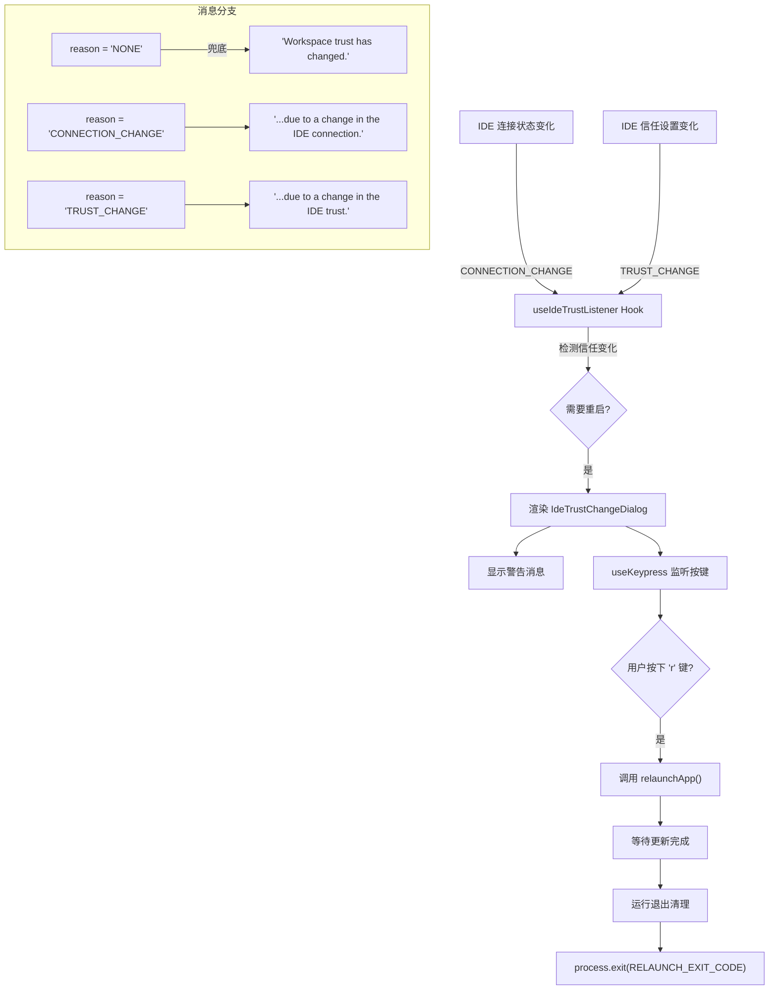

# IdeTrustChangeDialog.tsx

## 概述

`IdeTrustChangeDialog` 是一个 React 对话框组件，用于在 IDE（集成开发环境）的信任状态发生变化时，向用户显示警告提示并提供重启操作入口。当 Gemini CLI 检测到工作区的信任级别发生变更（例如 IDE 连接状态变化或信任设置变化）时，该组件会以带边框的警告样式显示提示信息，并监听用户按下 `r` 键来触发应用重启。

该组件是 Gemini CLI 与 IDE 伴侣扩展（IDE Companion Extension）信任体系交互的关键 UI 部分，确保用户在信任级别变更时能够及时感知并采取行动。

**源文件路径**: `packages/cli/src/ui/components/IdeTrustChangeDialog.tsx`

## 架构图（Mermaid）



## 核心组件

### IdeTrustChangeDialogProps 接口

```typescript
interface IdeTrustChangeDialogProps {
  reason: RestartReason;
}
```

| 属性 | 类型 | 说明 |
|------|------|------|
| `reason` | `RestartReason` | 导致需要重启的原因类型 |

### RestartReason 类型（来自 `useIdeTrustListener.ts`）

```typescript
export type RestartReason = 'NONE' | 'CONNECTION_CHANGE' | 'TRUST_CHANGE';
```

| 值 | 说明 |
|----|------|
| `'NONE'` | 默认值，理论上不应触发对话框渲染。若出现则记录警告日志。 |
| `'CONNECTION_CHANGE'` | IDE 连接状态发生变化（如断开或重新连接） |
| `'TRUST_CHANGE'` | IDE 的工作区信任设置发生变化 |

### IdeTrustChangeDialog 组件

#### 按键监听

组件使用 `useKeypress` 自定义 Hook 注册键盘事件监听器：

```typescript
useKeypress(
  (key) => {
    if (key.name === 'r' || key.name === 'R') {
      relaunchApp();
      return true;  // 表示事件已被消费
    }
    return false;    // 未消费，继续传播
  },
  { isActive: true },
);
```

- 监听 `r` 和 `R` 键（大小写均可）。
- 按键后调用 `relaunchApp()` 触发应用重启。
- `isActive: true` 表示监听始终激活（组件挂载时即开始监听）。
- 返回 `true` 表示该按键事件已被消费，不再向下传播。

#### 消息文本逻辑

根据 `reason` 属性动态生成提示消息：

| reason 值 | 显示消息 |
|-----------|---------|
| `'NONE'` | `"Workspace trust has changed."` (兜底默认值，同时输出 debug 警告日志) |
| `'CONNECTION_CHANGE'` | `"Workspace trust has changed due to a change in the IDE connection."` |
| `'TRUST_CHANGE'` | `"Workspace trust has changed due to a change in the IDE trust."` |

所有消息后面统一追加 `" Press 'r' to restart Gemini to apply the changes."`。

#### 渲染结构

```jsx
<Box borderStyle="round" borderColor={theme.status.warning} paddingX={1}>
  <Text color={theme.status.warning}>
    {message} Press 'r' to restart Gemini to apply the changes.
  </Text>
</Box>
```

- 使用 `ink` 的 `<Box>` 组件创建圆角边框容器。
- 边框颜色和文本颜色均使用 `theme.status.warning`（警告色）。
- 水平内边距为 1 字符。

## 依赖关系

### 内部依赖

| 模块路径 | 导入内容 | 用途 |
|----------|----------|------|
| `../semantic-colors.js` | `theme` | 语义化颜色主题，提供 `theme.status.warning` 警告色 |
| `../hooks/useKeypress.js` | `useKeypress` | 键盘事件监听 Hook，支持优先级和激活状态控制 |
| `../../utils/processUtils.js` | `relaunchApp` | 应用重启函数，执行清理后以特定退出码退出进程 |
| `../hooks/useIdeTrustListener.js` | `RestartReason` (类型) | 重启原因的类型定义 |

### 外部依赖

| 包名 | 导入内容 | 用途 |
|------|----------|------|
| `ink` | `Box`, `Text` | 终端 UI 布局容器和文本渲染组件 |
| `@google/gemini-cli-core` | `debugLogger` | 调试日志记录器，用于记录异常情况 |

## 关键实现细节

### 1. 重启流程（relaunchApp）

`relaunchApp` 函数的完整流程如下：

```typescript
export async function relaunchApp(): Promise<void> {
  if (isRelaunching) return;        // 防重入保护
  isRelaunching = true;
  await waitForUpdateCompletion();  // 等待自动更新完成
  await runExitCleanup();           // 运行退出清理逻辑
  process.exit(RELAUNCH_EXIT_CODE); // 以特定退出码退出
}
```

- **防重入保护**：使用模块级 `isRelaunching` 标志防止多次触发重启。
- **更新等待**：在退出前等待正在进行的自动更新完成。
- **清理**：运行退出清理逻辑（如保存状态、关闭连接等）。
- **特殊退出码**：使用 `RELAUNCH_EXIT_CODE` 退出，外层的 `relaunchOnExitCode` 函数会检测该退出码并自动以子进程方式重新启动应用。

### 2. 信任监听机制（useIdeTrustListener）

`useIdeTrustListener` Hook 是触发该对话框显示的上游逻辑：

- 监听 IDE 伴侣扩展的连接状态变化事件和信任变化事件。
- 当 IDE 连接状态变化时，设置 `restartReason` 为 `'CONNECTION_CHANGE'`。
- 当信任设置变化时，设置 `restartReason` 为 `'TRUST_CHANGE'`。
- 当 `needsRestart` 为 `true` 时，父组件渲染 `IdeTrustChangeDialog`。

### 3. 异常情况处理

当 `reason` 为 `'NONE'` 时（理论上不应发生），组件：
1. 通过 `debugLogger.warn` 记录警告日志，便于调试。
2. 仍然显示默认的兜底消息 `"Workspace trust has changed."`，而不是崩溃或不显示。
3. 用户仍然可以按 `r` 键重启，确保功能不受影响。

### 4. useKeypress 的事件消费机制

`useKeypress` Hook 支持优先级系统。当回调返回 `true` 时，表示该按键事件已被当前处理器消费，不会继续传播给其他监听器。这保证了在对话框显示期间，`r` 键不会被其他组件（如输入框）捕获。

### 5. 异步调用的 lint 抑制

代码中有一个 `eslint-disable-next-line @typescript-eslint/no-floating-promises` 注释，抑制了对 `relaunchApp()` 返回的 Promise 未被 await 的警告。这是有意为之的设计：因为 `relaunchApp` 最终会调用 `process.exit()`，不需要等待其完成，调用后进程即将终止。
