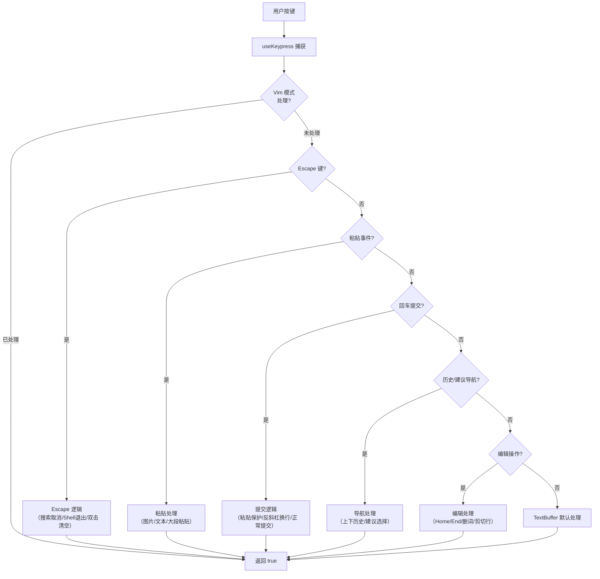

# InputPrompt.tsx

## 概述

`InputPrompt` 是 Gemini CLI 中最核心、最复杂的用户输入组件，承担了用户与 CLI 交互的主要入口职责。它是一个功能丰富的终端文本输入框，支持多行编辑、语法高亮、命令补全、历史记录导航、反向搜索、剪贴板粘贴（包括图片）、Shell 模式切换、鬼影文本（Ghost Text）提示、粘贴占位符展开/折叠等高级功能。

该组件集成了大量自定义 Hook 和子组件，是整个 CLI UI 系统的输入中心。

**源文件路径**: `packages/cli/src/ui/components/InputPrompt.tsx`

## 架构图（Mermaid）

```mermaid
graph TD
    subgraph 输入提示组件
        A["InputPrompt 组件"]
    end

    subgraph 核心 Hooks
        B["useKeypress<br/>键盘事件监听"]
        C["useCommandCompletion<br/>命令补全"]
        D["useReverseSearchCompletion<br/>反向搜索补全"]
        E["useInputHistory<br/>输入历史导航"]
        F["useShellHistory<br/>Shell 历史记录"]
        G["useMouseClick<br/>鼠标点击处理"]
        H["useKittyKeyboardProtocol<br/>Kitty 键盘协议"]
        I["useRepeatedKeyPress<br/>重复按键检测"]
        J["useKeyMatchers<br/>按键命令匹配"]
        K["useAlternateBuffer<br/>备用缓冲区检测"]
    end

    subgraph 上下文 Context
        L["useUIState<br/>全局 UI 状态"]
        M["useUIActions<br/>UI 操作"]
        N["useSettings<br/>设置"]
        O["useShellFocusState<br/>Shell 焦点"]
        P["useMouse<br/>鼠标上下文"]
    end

    subgraph 子组件
        Q["SuggestionsDisplay<br/>建议列表"]
        R["HalfLinePaddedBox<br/>半行内边距容器"]
    end

    subgraph 外部工具
        S["TextBuffer<br/>文本缓冲区"]
        T["clipboardy<br/>系统剪贴板"]
        U["clipboardUtils<br/>图片剪贴板"]
    end

    A --> B
    A --> C
    A --> D
    A --> E
    A --> F
    A --> G
    A --> H
    A --> I
    A --> J
    A --> K
    A --> L
    A --> M
    A --> N
    A --> O
    A --> P
    A --> Q
    A --> R
    A --> S
    A --> T
    A --> U
```





## 核心组件

### InputPromptProps 接口

```typescript
export interface InputPromptProps {
  buffer: TextBuffer;                    // 文本缓冲区对象
  onSubmit: (value: string) => void;     // 提交回调
  userMessages: readonly string[];       // 用户历史消息列表
  onClearScreen: () => void;             // 清屏回调
  config: Config;                        // 全局配置
  slashCommands: readonly SlashCommand[];// 斜杠命令列表
  commandContext: CommandContext;         // 命令上下文
  placeholder?: string;                  // 占位符文本
  focus?: boolean;                       // 是否聚焦
  inputWidth: number;                    // 输入区域宽度
  suggestionsWidth: number;              // 建议列表宽度
  shellModeActive: boolean;              // Shell 模式是否激活
  setShellModeActive: (v: boolean) => void; // 切换 Shell 模式
  approvalMode: ApprovalMode;           // 审批模式
  onEscapePromptChange?: (show: boolean) => void; // Escape 提示变化回调
  onSuggestionsVisibilityChange?: (visible: boolean) => void; // 建议可见性变化回调
  vimHandleInput?: (key: Key) => boolean; // Vim 模式输入处理器
  isEmbeddedShellFocused?: boolean;      // 嵌入式 Shell 是否聚焦
  setQueueErrorMessage: (msg: string | null) => void; // 队列错误消息设置
  streamingState: StreamingState;        // 流式响应状态
  popAllMessages?: () => string | undefined; // 弹出所有排队消息
  suggestionsPosition?: 'above' | 'below';  // 建议列表位置
  setBannerVisible: (visible: boolean) => void; // Banner 可见性控制
  copyModeEnabled?: boolean;             // 复制模式是否启用
}
```

### 导出的工具函数

#### `isTerminalPasteTrusted(kittyProtocolSupported: boolean): boolean`

判断终端是否可信任以原子方式处理粘贴事件。只有支持 Kitty 键盘协议的终端才被视为可信任的。不可信任的终端可能将多行粘贴拆分为多个事件，可能导致意外的命令执行。

#### `calculatePromptWidths(mainContentWidth: number)`

根据主内容宽度计算输入提示的各种宽度参数：

```typescript
{
  inputWidth: number;       // 实际输入区域宽度 = 主宽度 - 边框/内边距(4) - 提示符(2)
  containerWidth: number;   // 容器宽度 = 主宽度
  suggestionsWidth: number; // 建议列表宽度 = max(20, 主宽度)
  frameOverhead: number;    // 框架开销 = 6
}
```

#### `isLargePaste(text: string): boolean`

判断粘贴的文本是否为"大段粘贴"。当行数超过 `LARGE_PASTE_LINE_THRESHOLD` 或字符数超过 `LARGE_PASTE_CHAR_THRESHOLD` 时返回 `true`。大段粘贴会被折叠为占位符。

#### `tryTogglePasteExpansion(buffer: TextBuffer): boolean`

尝试展开或折叠粘贴占位符：
1. 如果光标在已折叠的占位符上，展开它。
2. 如果光标在已展开的粘贴区域内，折叠它。
3. 如果存在占位符但光标不在其上，显示提示消息。

### 主要内部状态

| 状态 | 类型 | 说明 |
|------|------|------|
| `suppressCompletion` | `boolean` | 是否抑制补全（历史导航时暂停补全） |
| `showEscapePrompt` | `boolean` | 是否显示 Escape 提示（双击 Esc 清空） |
| `recentUnsafePasteTime` | `number \| null` | 最近不安全粘贴的时间戳（防止意外提交） |
| `reverseSearchActive` | `boolean` | Shell 模式反向搜索是否激活 |
| `commandSearchActive` | `boolean` | 普通模式命令搜索是否激活 |
| `textBeforeReverseSearch` | `string` | 搜索前的文本（用于取消恢复） |
| `cursorPosition` | `[number, number]` | 搜索前的光标位置（用于取消恢复） |
| `expandedSuggestionIndex` | `number` | 当前展开的建议索引 |

## 依赖关系

### 内部依赖

| 模块路径 | 导入内容 | 用途 |
|----------|----------|------|
| `./SuggestionsDisplay.js` | `SuggestionsDisplay`, `MAX_WIDTH` | 建议列表展示组件及最大宽度常量 |
| `../semantic-colors.js` | `theme` | 语义化颜色主题 |
| `../hooks/useInputHistory.js` | `useInputHistory` | 输入历史导航 Hook |
| `../hooks/atCommandProcessor.js` | `escapeAtSymbols` | 转义 @ 符号 |
| `./shared/HalfLinePaddedBox.js` | `HalfLinePaddedBox` | 半行内边距布局容器 |
| `./shared/text-buffer.js` | `TextBuffer`, `logicalPosToOffset`, `expandPastePlaceholders`, `getTransformUnderCursor`, 阈值常量 | 文本缓冲区及工具函数 |
| `../utils/textUtils.js` | `cpSlice`, `cpLen`, `toCodePoints`, `cpIndexToOffset` | Unicode 码点级别的文本操作 |
| `../hooks/useShellHistory.js` | `useShellHistory` | Shell 历史记录 Hook |
| `../hooks/useReverseSearchCompletion.js` | `useReverseSearchCompletion` | 反向搜索补全 Hook |
| `../hooks/useCommandCompletion.js` | `useCommandCompletion`, `CompletionMode` | 命令补全 Hook |
| `../hooks/useKeypress.js` | `useKeypress`, `Key` | 键盘事件监听 Hook |
| `../key/keyMatchers.js` | `Command` | 键盘命令枚举 |
| `../key/keybindingUtils.js` | `formatCommand` | 命令格式化显示 |
| `../commands/types.js` | `CommandContext`, `SlashCommand` | 命令类型 |
| `../utils/highlight.js` | `parseInputForHighlighting`, `parseSegmentsFromTokens` | 输入语法高亮 |
| `../hooks/useKittyKeyboardProtocol.js` | `useKittyKeyboardProtocol` | Kitty 键盘协议支持 |
| `../utils/clipboardUtils.js` | `clipboardHasImage`, `saveClipboardImage`, `cleanupOldClipboardImages` | 剪贴板图片操作 |
| `../utils/commandUtils.js` | `isAutoExecutableCommand`, `isSlashCommand` | 命令判断工具 |
| `../../utils/commands.js` | `parseSlashCommand` | 斜杠命令解析 |
| `../textConstants.js` | `SCREEN_READER_USER_PREFIX` | 屏幕阅读器前缀常量 |
| `../themes/color-utils.js` | `getSafeLowColorBackground` | 低色深安全背景色 |
| `../utils/terminalUtils.js` | `isLowColorDepth` | 终端色深检测 |
| `../contexts/ShellFocusContext.js` | `useShellFocusState` | Shell 焦点状态 |
| `../contexts/UIStateContext.js` | `useUIState` | 全局 UI 状态 |
| `../../utils/events.js` | `appEvents`, `AppEvent`, `TransientMessageType` | 应用事件系统 |
| `../contexts/SettingsContext.js` | `useSettings` | 设置上下文 |
| `../types.js` | `StreamingState` | 流式状态枚举 |
| `../hooks/useMouseClick.js` | `useMouseClick` | 鼠标点击 Hook |
| `../contexts/MouseContext.js` | `useMouse`, `MouseEvent` | 鼠标上下文 |
| `../contexts/UIActionsContext.js` | `useUIActions` | UI 操作上下文 |
| `../hooks/useAlternateBuffer.js` | `useAlternateBuffer` | 备用缓冲区检测 |
| `../utils/shortcutsHelp.js` | `useIsHelpDismissKey` | 快捷键帮助关闭键判断 |
| `../hooks/useRepeatedKeyPress.js` | `useRepeatedKeyPress` | 重复按键检测 Hook |
| `../hooks/useKeyMatchers.js` | `useKeyMatchers` | 按键命令匹配器 |

### 外部依赖

| 包名 | 导入内容 | 用途 |
|------|----------|------|
| `react` | `useCallback`, `useEffect`, `useState`, `useRef`, `useMemo` | React 核心 Hooks |
| `clipboardy` | `clipboardy` | 系统剪贴板读取（文本） |
| `ink` | `Box`, `Text`, `useStdout`, `DOMElement` | 终端 UI 组件 |
| `chalk` | `chalk` | 终端文本样式（反色光标等） |
| `string-width` | `stringWidth` | 计算字符串在终端的显示宽度 |
| `node:path` | `path` | 路径处理 |
| `@google/gemini-cli-core` | `ApprovalMode`, `coreEvents`, `debugLogger`, `Config` | 核心库 |

## 关键实现细节

### 1. 多层补全系统

组件管理三套独立的补全系统，通过 `getActiveCompletion()` 动态选择当前激活的补全源：

| 补全系统 | Hook | 触发条件 | 数据源 |
|----------|------|----------|--------|
| 命令补全 | `useCommandCompletion` | 默认（非搜索模式） | 斜杠命令、@路径、Shell 命令 |
| Shell 反向搜索 | `useReverseSearchCompletion` | Shell 模式 + Ctrl+R | Shell 历史记录 |
| 命令反向搜索 | `useReverseSearchCompletion` | 普通模式 + Ctrl+R | 用户消息历史 |

### 2. 粘贴安全保护机制

针对不支持 Kitty 键盘协议的终端，组件实现了粘贴安全保护：

1. 粘贴事件发生时记录 `recentUnsafePasteTime` 时间戳。
2. 在 40ms 内（比人类最快打字速度还快），如果收到回车键事件，视为粘贴内容的一部分，插入换行而非提交。
3. 40ms 后自动清除保护状态。
4. 只有支持 Kitty 协议的终端才跳过此保护（因为它们能正确区分粘贴和键入）。

### 3. Escape 键双击逻辑

Escape 键使用 `useRepeatedKeyPress` 实现了三层行为：

| 按下次数 | 行为 |
|----------|------|
| 1 次 | 显示 Escape 提示（告知再按一次可清空/撤回） |
| 2 次 | 如果输入框有内容则清空；如果无内容且有历史记录则执行 `/rewind` |
| 超时重置 | 500ms 内未再次按下则重置计数 |

注意：Escape 在不同上下文中有不同的优先处理：
- 快捷键帮助面板打开时：关闭面板
- 反向搜索激活时：取消搜索并恢复搜索前的文本
- 建议列表显示时：关闭建议列表
- Shell 模式激活时：退出 Shell 模式
- 正在生成响应时：向上传播（由全局取消处理器处理）

### 4. Shell 模式切换

当用户在空输入框中输入 `!` 时，自动切换 Shell 模式：
- 进入 Shell 模式后，提示符从 `>` 变为 `!`。
- Shell 模式使用独立的 Shell 历史记录（`useShellHistory`）。
- Shell 模式下可使用 Ctrl+R 进行反向搜索 Shell 历史。
- 按 Escape 可退出 Shell 模式。

### 5. 鬼影文本渲染（Ghost Text）

当补全系统提供 `promptCompletion.text` 时，组件会在光标后显示半透明的建议文本：

1. 计算光标后剩余宽度。
2. 将鬼影文本按单词拆分，尽可能多地放在光标行。
3. 超出的内容换行显示（`additionalLines`）。
4. 支持 Unicode 宽字符的正确宽度计算。
5. 按 Tab 键可接受鬼影文本建议。

### 6. 语法高亮

输入文本通过 `parseInputForHighlighting` 进行标记化，然后通过 `parseSegmentsFromTokens` 生成渲染段。不同类型的文本使用不同颜色：

| 类型 | 颜色 | 示例 |
|------|------|------|
| `command` | `theme.text.accent` | `/help`、`/chat` |
| `file` | `theme.text.accent` | `@path/to/file` |
| `paste` | `theme.text.accent` | 粘贴占位符 |
| 普通文本 | `theme.text.primary` | 普通输入内容 |

### 7. 审批模式视觉指示

根据 `approvalMode` 的不同，输入框的提示符和边框颜色会变化：

| 模式 | 提示符 | 边框颜色 | 状态文本 |
|------|--------|----------|---------|
| 默认 | `>` | `theme.ui.focus` | 无 |
| Shell | `!` | `theme.ui.symbol` | `"Shell mode"` |
| YOLO | `*` | `theme.status.error` | `"YOLO mode"` |
| Plan | `>` | `theme.status.success` | `"Plan mode"` |
| Auto Edit | `>` | `theme.status.warning` | `"Accepting edits"` |

### 8. 双击 Tab 切换 Clean UI

在普通模式下（非 Shell 模式、无补全交互），连续快速按两次 Tab 键（350ms 窗口内）会触发 `toggleCleanUiDetailsVisible`，切换 Clean UI 的详情可见性。

### 9. 图片粘贴支持

Ctrl+V 粘贴时，组件会先检查剪贴板中是否有图片：
1. 使用 `clipboardHasImage()` 检测图片。
2. 使用 `saveClipboardImage()` 保存图片到工作目录。
3. 在输入框中插入 `@相对路径` 引用。
4. 自动在引用前后添加空格。
5. 异步清理旧的剪贴板图片文件。

### 10. 提交消息队列处理

当输入框为空且用户按上箭头时，组件会先检查是否有排队的消息（`popAllMessages`）。如果有，则加载排队消息到输入框而非导航历史记录。

### 11. 低色深终端兼容

组件检测终端色深，对于低色深终端：
- 如果无法获取安全的背景色，则回退到使用线条边框（`useLineFallback`）而非背景色块。
- 边框使用 `round` 样式，分为上下两部分包裹输入区域。

### 12. 鼠标交互

组件支持三种鼠标交互：
1. **单击**：移动光标到点击位置，如果之前焦点在嵌入式 Shell 则切回输入框。
2. **双击**（仅备用缓冲区）：展开/折叠点击位置的粘贴占位符。
3. **右键释放**：触发剪贴板粘贴。

### 13. OSC52 粘贴支持

当实验性设置 `useOSC52Paste` 启用时，组件通过写入 `\x1b]52;c;?\x07` 转义序列向终端请求剪贴板内容，而非使用 `clipboardy` 库。这对于远程 SSH 会话特别有用。
