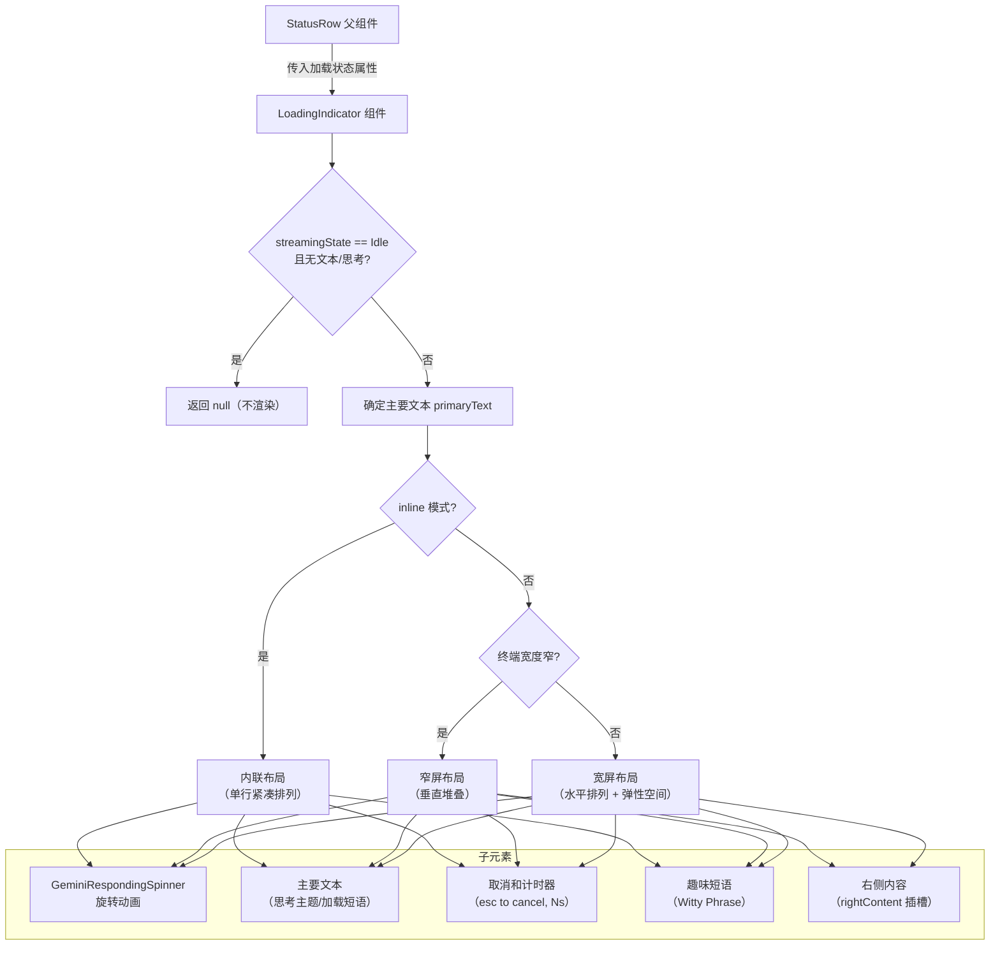
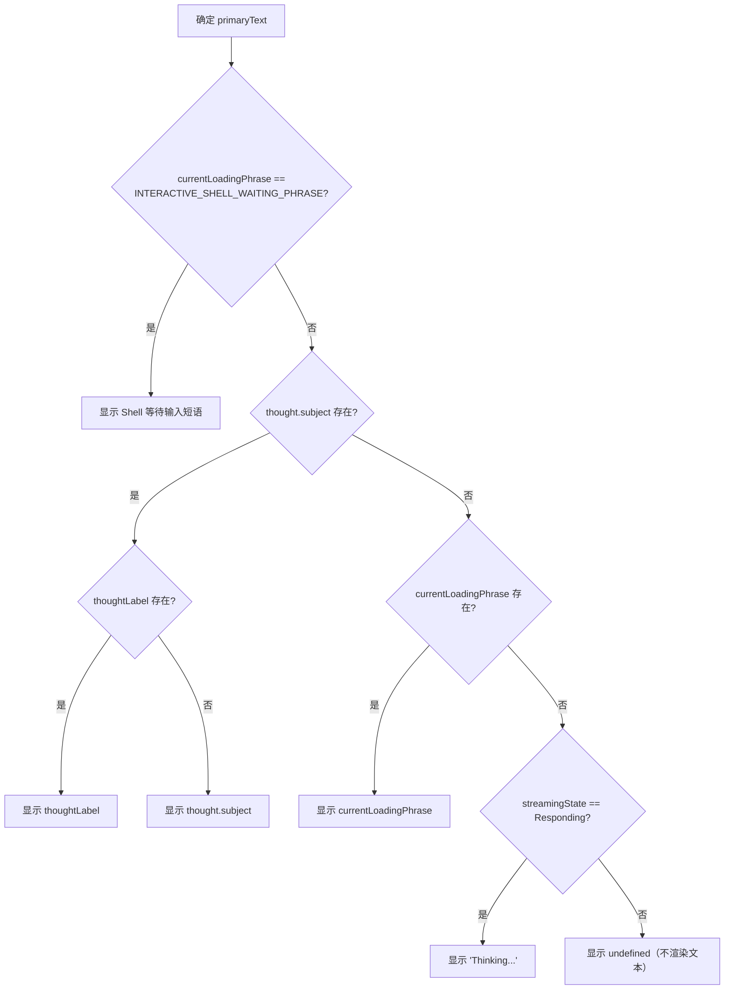

# LoadingIndicator.tsx

## 概述

`LoadingIndicator` 是一个 React 展示组件，用于在 Gemini CLI 的终端界面中显示加载/思考状态指示器。当 AI 模型正在处理用户请求时，该组件会显示一个动画旋转器（Spinner）、状态描述文本、已用时间、取消提示以及可选的趣味短语（Witty Phrase）。

该组件支持两种渲染模式：内联模式（`inline`）和多行模式，并能根据终端宽度自动在宽屏和窄屏布局之间切换。它是 `StatusRow` 组件的核心子组件之一，在模型响应期间持续向用户提供视觉反馈。

**源文件路径**: `packages/cli/src/ui/components/LoadingIndicator.tsx`

## 架构图（Mermaid）





## 核心组件

### LoadingIndicatorProps 接口

```typescript
interface LoadingIndicatorProps {
  currentLoadingPhrase?: string;      // 当前加载短语（如工具名称、操作描述）
  wittyPhrase?: string;               // 趣味/诙谐短语
  showWit?: boolean;                  // 是否显示趣味短语（默认 false）
  showTips?: boolean;                 // 是否显示提示（当前未使用）
  errorVerbosity?: 'low' | 'full';   // 错误详细程度（当前未使用）
  elapsedTime: number;               // 已用时间（秒）
  inline?: boolean;                  // 是否使用内联布局（默认 false）
  rightContent?: React.ReactNode;    // 右侧自定义内容插槽
  thought?: ThoughtSummary | null;   // 模型思考摘要
  thoughtLabel?: string;             // 自定义思考标签（覆盖 thought.subject）
  showCancelAndTimer?: boolean;      // 是否显示取消提示和计时器（默认 true）
  forceRealStatusOnly?: boolean;     // 是否强制只显示真实状态（禁用趣味短语，默认 false）
  spinnerIcon?: string;              // 自定义旋转器图标
  isHookActive?: boolean;            // 是否有 Hook 正在活跃（默认 false）
}
```

### LoadingIndicator 组件

#### 主要文本（primaryText）选取优先级

组件通过一套优先级规则确定要显示的主要文本：

| 优先级 | 条件 | 显示内容 |
|--------|------|---------|
| 1（最高） | `currentLoadingPhrase === INTERACTIVE_SHELL_WAITING_PHRASE` | Shell 等待输入短语：`"! Shell awaiting input (Tab to focus)"` |
| 2 | `thought?.subject` 存在 | `thoughtLabel`（如有）或 `thought.subject` |
| 3 | `currentLoadingPhrase` 存在 | 当前加载短语 |
| 4 | `streamingState === Responding` | `"Thinking..."` |
| 5（最低） | 以上均不满足 | `undefined`（不渲染文本） |

交互式 Shell 等待短语被赋予最高优先级，因为它传达了一个需要用户操作的状态。

#### 取消和计时器文本

当 `showCancelAndTimer` 为 `true` 且不处于 `WaitingForConfirmation` 状态时，显示格式如下：
- 不足 60 秒：`(esc to cancel, 5s)`
- 60 秒以上：`(esc to cancel, 1m 5s)`（使用 `formatDuration` 格式化）

#### 趣味短语显示条件

趣味短语仅在以下所有条件同时满足时显示：
1. `forceRealStatusOnly` 为 `false`
2. `showWit` 为 `true`
3. `wittyPhrase` 非空
4. `primaryText` 恰好为 `"Thinking..."`（即没有具体的加载短语或思考主题时）

#### 交互式 Shell 等待提示

当 `primaryText` 为 `INTERACTIVE_SHELL_WAITING_PHRASE` 时，在文本后追加一个高亮提示 `(press tab to focus)`，使用 `theme.ui.active` 颜色，引导用户按 Tab 切换焦点到 Shell 输入。

### 布局模式

#### 内联模式（inline = true）

所有元素在一行中水平排列：
```
[旋转器] [主要文本] [取消/计时器] [趣味短语]
```

- 没有右侧内容插槽（`rightContent`）。
- 适用于空间有限的场景（如嵌入在其他组件中）。

#### 多行模式 - 宽屏（inline = false, 终端宽度充足）

```
[旋转器] [主要文本] [取消/计时器] [趣味短语] [弹性空间] [右侧内容]
```

- 使用 `flexDirection: 'row'` 水平排列。
- 中间有弹性空间将右侧内容推到最右。
- 取消/计时器和趣味短语在主行内显示。

#### 多行模式 - 窄屏（inline = false, 终端宽度不足）

```
[旋转器] [主要文本]
[取消/计时器]
[趣味短语]
[右侧内容]
```

- 使用 `flexDirection: 'column'` 垂直堆叠。
- 各元素独占一行，避免内容被截断。
- 通过 `isNarrowWidth(terminalWidth)` 判断是否为窄屏。

## 依赖关系

### 内部依赖

| 模块路径 | 导入内容 | 用途 |
|----------|----------|------|
| `../semantic-colors.js` | `theme` | 语义化颜色主题（`text.primary`、`text.secondary`、`ui.active`） |
| `../contexts/StreamingContext.js` | `useStreamingContext` | 获取当前流式响应状态 |
| `../types.js` | `StreamingState` | 流式状态枚举（`Idle`、`Responding`、`WaitingForConfirmation`） |
| `./GeminiRespondingSpinner.js` | `GeminiRespondingSpinner` | Gemini 响应旋转动画组件 |
| `../utils/formatters.js` | `formatDuration` | 毫秒时长格式化为可读字符串（如 `"1m 5s"`） |
| `../hooks/useTerminalSize.js` | `useTerminalSize` | 获取终端尺寸（columns） |
| `../utils/isNarrowWidth.js` | `isNarrowWidth` | 判断终端宽度是否为窄屏 |
| `../hooks/usePhraseCycler.js` | `INTERACTIVE_SHELL_WAITING_PHRASE` | 交互式 Shell 等待短语常量 |

### 外部依赖

| 包名 | 导入内容 | 用途 |
|------|----------|------|
| `react` | `React` (类型) | 提供 `React.FC`、`React.ReactNode` 类型 |
| `ink` | `Box`, `Text` | 终端 UI 布局容器和文本渲染组件 |
| `@google/gemini-cli-core` | `ThoughtSummary` (类型) | 模型思考摘要类型定义 |

## 关键实现细节

### 1. 空闲状态短路返回

当 `streamingState` 为 `Idle` 且没有 `currentLoadingPhrase` 和 `thought` 时，组件直接返回 `null`，不渲染任何内容。这避免了在无需显示加载状态时产生不必要的 DOM 节点。

### 2. GeminiRespondingSpinner 配置

旋转器组件接收两个关键属性：
- `nonRespondingDisplay`：当模型不在响应状态时显示的静态图标。
  - 如果提供了 `spinnerIcon`，使用自定义图标。
  - 如果处于 `WaitingForConfirmation` 状态，显示 `'⠏'`（一个 Braille 字符，模拟暂停状态）。
  - 否则显示空字符串。
- `isHookActive`：告知旋转器是否有 Hook 正在活跃，可能影响动画样式。

### 3. 时间格式化策略

计时器使用两种格式化策略：
- 不足 60 秒：直接显示 `${elapsedTime}s`（如 `"5s"`），简洁直观。
- 60 秒以上：使用 `formatDuration(elapsedTime * 1000)` 进行完整格式化（如 `"1m 5s"`），因为长时间操作需要更精确的时间表示。

注意 `elapsedTime` 传入的是秒数，而 `formatDuration` 接收毫秒数，所以需要乘以 1000。

### 4. 确认等待状态的特殊处理

当 `streamingState` 为 `WaitingForConfirmation` 时，取消和计时器文本不显示。这是因为在等待用户确认（如工具执行审批）时，显示"esc to cancel"可能会误导用户——此时 Escape 键的行为可能与取消生成不同。

### 5. 响应式窄屏适配

组件通过 `useTerminalSize` 获取终端宽度，并使用 `isNarrowWidth` 判断是否需要切换到窄屏布局。在窄屏布局中：
- 主布局从 `row` 切换为 `column`。
- 取消/计时器、趣味短语、右侧内容各自独占一行。
- 使用 `alignItems: 'flex-start'` 确保内容左对齐。

### 6. 文本截断策略

主要文本使用 `wrap="truncate-end"` 属性，当文本超出可用宽度时从末尾截断，而非换行。这保证了加载指示器不会因为长文本而占用过多垂直空间。

### 7. 未使用的 Props

`showTips` 和 `errorVerbosity` 两个属性在当前实现中未被使用，但仍保留在接口定义中。这可能是为了未来扩展预留的，或者是在重构过程中遗留的。
