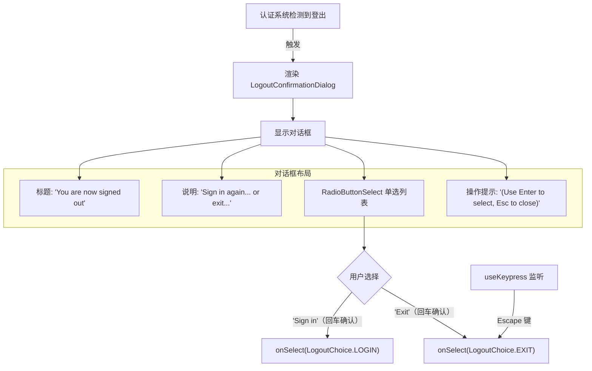
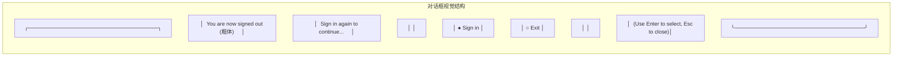

# LogoutConfirmationDialog.tsx

## 概述

`LogoutConfirmationDialog` 是一个 React 对话框组件，在用户登出 Gemini CLI 后显示，提供两个选项：重新登录或退出应用。它以圆角边框的卡片样式呈现，内含标题、说明文字和一个单选按钮列表，支持键盘导航和 Escape 快捷退出。

该组件是用户认证流程中的关键 UI 部分，确保用户在登出后有清晰的后续操作选择。

**源文件路径**: `packages/cli/src/ui/components/LogoutConfirmationDialog.tsx`

## 架构图（Mermaid）





## 核心组件

### LogoutChoice 枚举

```typescript
export enum LogoutChoice {
  LOGIN = 'login',   // 重新登录
  EXIT = 'exit',     // 退出应用
}
```

这是一个导出的枚举类型，供父组件判断用户的选择结果。

### LogoutConfirmationDialogProps 接口

```typescript
interface LogoutConfirmationDialogProps {
  onSelect: (choice: LogoutChoice) => void;
}
```

| 属性 | 类型 | 说明 |
|------|------|------|
| `onSelect` | `(choice: LogoutChoice) => void` | 用户做出选择后的回调函数 |

### LogoutConfirmationDialog 组件

#### 按键监听

组件使用 `useKeypress` 自定义 Hook 注册 Escape 键监听：

```typescript
useKeypress(
  (key) => {
    if (key.name === 'escape') {
      onSelect(LogoutChoice.EXIT);  // Escape 等同于选择"退出"
      return true;
    }
    return false;
  },
  { isActive: true },
);
```

- Escape 键等同于选择"Exit"选项，与其他对话框行为保持一致。
- `isActive: true` 表示只要组件挂载就始终监听。
- 返回 `true` 消费事件，阻止向其他处理器传播。

#### 选项列表

```typescript
const options: Array<RadioSelectItem<LogoutChoice>> = [
  { label: 'Sign in', value: LogoutChoice.LOGIN, key: 'login' },
  { label: 'Exit',    value: LogoutChoice.EXIT,  key: 'exit' },
];
```

| 选项 | 标签 | 值 | 说明 |
|------|------|----|------|
| Sign in | `"Sign in"` | `LogoutChoice.LOGIN` | 触发重新登录流程 |
| Exit | `"Exit"` | `LogoutChoice.EXIT` | 退出 Gemini CLI 应用 |

#### 渲染结构

组件的 JSX 结构（由外到内）：

1. **外层 Box**：`flexDirection="row"`, `width="100%"` -- 占满父容器宽度。
2. **卡片容器 Box**：
   - `flexDirection="column"` -- 内容垂直排列。
   - `borderStyle="round"` -- 圆角边框。
   - `borderColor={theme.ui.focus}` -- 焦点色边框。
   - `padding={1}` -- 上下左右各 1 字符内边距。
   - `flexGrow={1}` -- 填充可用空间。
   - `marginLeft={1}`, `marginRight={1}` -- 左右各 1 字符外边距。
3. **标题区域 Box**（`marginBottom={1}`）：
   - 粗体标题：`"You are now signed out"` -- 使用 `theme.text.primary` 颜色。
   - 说明文字：`"Sign in again to continue using Gemini CLI, or exit the application."` -- 使用 `theme.text.secondary` 颜色。
4. **单选列表**：`RadioButtonSelect` 组件，`isFocused` 确保接收键盘输入。
5. **操作提示**（`marginTop={1}`）：`"(Use Enter to select, Esc to close)"` -- 使用 `theme.text.secondary` 颜色。

## 依赖关系

### 内部依赖

| 模块路径 | 导入内容 | 用途 |
|----------|----------|------|
| `../semantic-colors.js` | `theme` | 语义化颜色主题（`ui.focus`、`text.primary`、`text.secondary`） |
| `./shared/RadioButtonSelect.js` | `RadioButtonSelect`, `RadioSelectItem` | 单选按钮列表组件及其选项类型 |
| `../hooks/useKeypress.js` | `useKeypress` | 键盘事件监听 Hook |

### 外部依赖

| 包名 | 导入内容 | 用途 |
|------|----------|------|
| `ink` | `Box`, `Text` | 终端 UI 布局容器和文本渲染组件 |
| `react` | `React` (类型) | 提供 `React.FC` 类型定义 |

## 关键实现细节

### 1. RadioButtonSelect 的复用

该对话框使用了项目中的通用 `RadioButtonSelect` 组件，这是一个基于 `BaseSelectionList` 的封装组件，提供：
- 上下箭头键导航高亮项。
- 回车键确认选择。
- 单选按钮视觉样式（`●` 选中 / `○` 未选中）。
- 支持滚动、数字快捷键等高级功能。

`isFocused` 属性确保组件挂载后立即接收键盘输入，无需用户额外操作。

### 2. Escape 键的双重退出路径

用户有两种方式退出：
1. **方向键导航到 "Exit" 选项 + 回车确认**：通过 `RadioButtonSelect` 的 `onSelect` 回调。
2. **直接按 Escape 键**：通过 `useKeypress` 直接调用 `onSelect(LogoutChoice.EXIT)`。

两种路径最终都调用相同的 `onSelect` 回调，确保父组件只需处理一个统一的接口。

### 3. 简洁的组件设计

该组件是一个典型的"受控对话框"模式：
- **无内部状态**：所有决策都通过 `onSelect` 回调传递给父组件。
- **纯展示 + 事件处理**：只负责渲染 UI 和捕获用户交互。
- **单次使用**：显示后用户做出选择即关闭，不需要重置或循环使用。

### 4. 一致的对话框设计规范

该组件遵循项目中对话框的通用设计模式：
- 使用 `round` 边框样式。
- 边框颜色使用 `theme.ui.focus`。
- 底部提供操作提示（Enter 选择 / Esc 关闭）。
- Escape 键作为快捷关闭/退出手段。
- 标题使用粗体主色，说明使用次要颜色。

### 5. LogoutChoice 枚举的导出

`LogoutChoice` 枚举被 `export` 导出，供父组件和其他模块使用。父组件通过检查 `onSelect` 回调的参数值来决定后续行为：
- `LogoutChoice.LOGIN`：触发重新认证流程（如打开浏览器进行 OAuth）。
- `LogoutChoice.EXIT`：调用 `process.exit()` 或类似机制退出 CLI。
