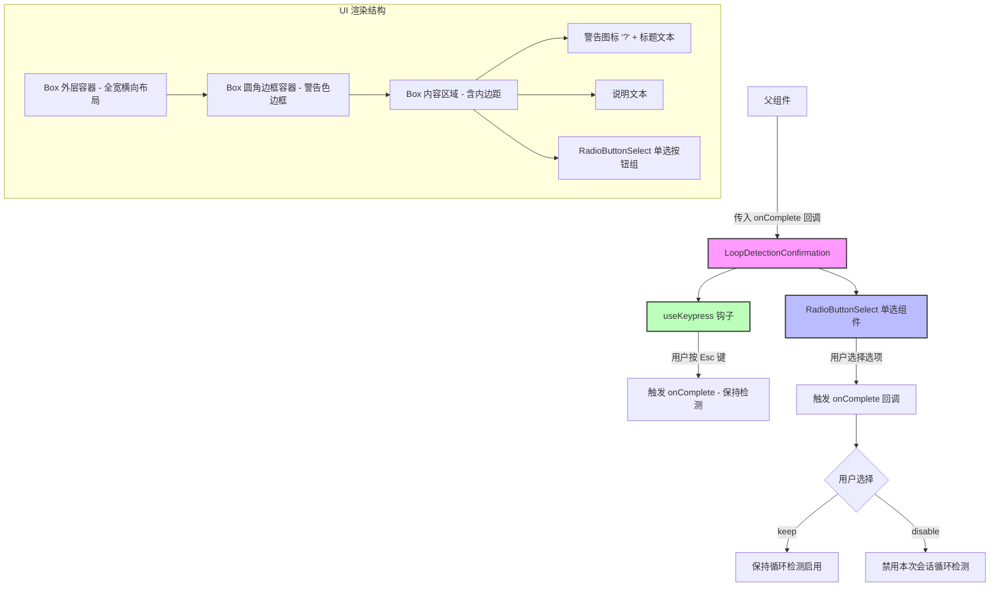

# LoopDetectionConfirmation.tsx

## 概述

`LoopDetectionConfirmation` 是一个基于 Ink（React 终端 UI 框架）的交互式确认组件，用于在 Gemini CLI 检测到潜在的循环行为（如重复的工具调用或其他模型重复行为）时，向用户展示警告提示并让用户选择是否继续保持循环检测功能。

该组件提供两个选项：
1. **保持循环检测启用**（默认，可通过 `Esc` 键快速选择）
2. **在当前会话中禁用循环检测**

组件位于 `packages/cli/src/ui/components/LoopDetectionConfirmation.tsx`，属于 CLI 的 UI 层，是用户交互确认流程的一部分。

## 架构图（Mermaid）



## 核心组件

### 1. 类型定义

#### `LoopDetectionConfirmationResult`
```typescript
export type LoopDetectionConfirmationResult = {
  userSelection: 'disable' | 'keep';
};
```
- 导出的结果类型，表示用户的选择结果。
- `'keep'`：保持循环检测启用。
- `'disable'`：在当前会话中禁用循环检测。

#### `LoopDetectionConfirmationProps`
```typescript
interface LoopDetectionConfirmationProps {
  onComplete: (result: LoopDetectionConfirmationResult) => void;
}
```
- 组件的属性接口，仅接收一个 `onComplete` 回调函数。
- 当用户做出选择后，该回调将被调用并传入用户选择的结果。

### 2. 主组件 `LoopDetectionConfirmation`

这是一个函数式 React 组件，主要功能包括：

- **键盘监听**：通过 `useKeypress` 钩子监听 `Escape` 键，按下时直接以 `'keep'` 结果调用 `onComplete`，提供快捷退出路径。
- **选项定义**：定义了一个包含两个选项的 `OPTIONS` 数组，类型为 `RadioSelectItem<LoopDetectionConfirmationResult>`。
- **UI 渲染**：
  - 外层 `Box` 使用 `flexDirection="row"` 横向布局，宽度占满。
  - 内层 `Box` 使用圆角边框（`borderStyle="round"`），边框颜色为主题中的警告色（`theme.status.warning`）。
  - 显示一个警告问号图标 `?`，加粗标题 "A potential loop was detected"。
  - 说明文本解释了循环检测触发的原因。
  - 底部嵌入 `RadioButtonSelect` 单选组件供用户选择。

### 3. 选项配置

```typescript
const OPTIONS: Array<RadioSelectItem<LoopDetectionConfirmationResult>> = [
  {
    label: 'Keep loop detection enabled (esc)',
    value: { userSelection: 'keep' },
    key: 'Keep loop detection enabled (esc)',
  },
  {
    label: 'Disable loop detection for this session',
    value: { userSelection: 'disable' },
    key: 'Disable loop detection for this session',
  },
];
```
- 第一个选项标签中包含 `(esc)` 提示，暗示用户可以直接按 Esc 键选择此项。
- 每个选项的 `value` 字段直接对应 `LoopDetectionConfirmationResult` 类型。

## 依赖关系

### 内部依赖

| 依赖模块 | 路径 | 用途 |
|---|---|---|
| `RadioButtonSelect` | `./shared/RadioButtonSelect.js` | 单选按钮组件，提供交互式选项选择 |
| `RadioSelectItem` | `./shared/RadioButtonSelect.js` | 单选选项的类型定义 |
| `useKeypress` | `../hooks/useKeypress.js` | 键盘按键监听钩子，用于捕获 Esc 键 |
| `theme` | `../semantic-colors.js` | 语义化颜色主题，用于统一 UI 风格 |

### 外部依赖

| 依赖包 | 版本 | 用途 |
|---|---|---|
| `ink` | - | 终端 React UI 框架，提供 `Box` 和 `Text` 基础组件 |

## 关键实现细节

1. **Esc 键快捷操作**：`useKeypress` 钩子设置为始终激活（`isActive: true`），当用户按下 `Escape` 键时立即以 `'keep'` 选择调用 `onComplete`，并返回 `true` 阻止事件继续传播。对于其他按键则返回 `false`，不拦截事件。

2. **主题颜色系统**：组件使用了 `theme.status.warning`（警告状态颜色）用于边框和问号图标，`theme.text.primary`（主要文本颜色）用于标题加粗文本，`theme.text.secondary`（次要文本颜色）用于说明文字。这确保了与整体 CLI 视觉风格的一致性。

3. **布局结构**：
   - 使用 `flexGrow={1}` 让内容容器自动填充可用空间。
   - `marginLeft={1}` 提供左侧缩进。
   - `paddingX={1}` 提供水平内边距。
   - `minHeight={1}` 和 `minWidth={3}` 确保图标区域有最小尺寸。
   - `wrap="truncate-end"` 对标题文本设置了截断策略，防止溢出。

4. **组件通信模式**：采用回调函数（callback）模式，父组件通过 `onComplete` 属性传入处理函数，子组件在用户交互完成后调用此回调传递结果。这是一种典型的 React 单向数据流模式。

5. **无状态设计**：组件本身没有使用 `useState`，所有状态管理交由父组件或 `RadioButtonSelect` 内部处理，保持了组件的简洁性。
