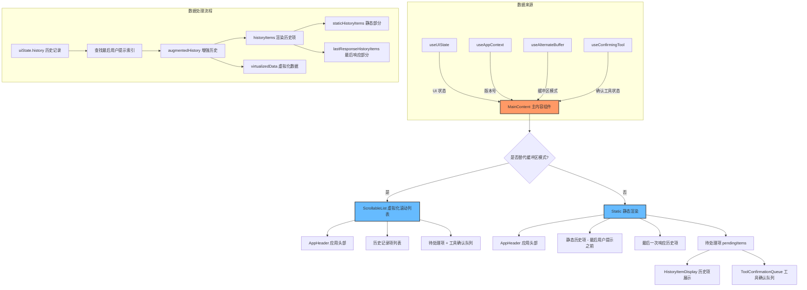

# MainContent.tsx

## 概述

`MainContent` 是 Gemini CLI 的核心 UI 组件，负责渲染整个主内容区域，包括应用头部、历史对话记录、待处理消息以及工具确认队列。它是 CLI 界面中最重要的布局组件之一，协调了静态历史内容与动态流式内容的展示。

该组件支持两种渲染模式：
1. **替代缓冲区模式（Alternate Buffer）**：使用虚拟化滚动列表 `ScrollableList` 实现高性能渲染，适用于终端支持替代缓冲区的场景。
2. **标准模式**：使用 Ink 的 `Static` 组件渲染已确定的历史内容，配合动态的待处理项目。

组件位于 `packages/cli/src/ui/components/MainContent.tsx`。

## 架构图（Mermaid）



## 核心组件

### 1. 组件导出

```typescript
export const MainContent = () => { ... }
```
- 以箭头函数形式导出的 React 函数组件。
- 无 props 输入，所有数据通过 Context hooks 获取。

### 2. 性能优化 - Memo 包装

```typescript
const MemoizedHistoryItemDisplay = memo(HistoryItemDisplay);
const MemoizedAppHeader = memo(AppHeader);
```
- 使用 `React.memo` 对 `HistoryItemDisplay` 和 `AppHeader` 进行记忆化包装，避免不必要的重渲染。
- 这是重要的性能优化手段，因为历史记录列表可能包含大量条目。

### 3. Hooks 使用

| Hook | 返回值 | 用途 |
|---|---|---|
| `useAppContext()` | `{ version }` | 获取应用版本号，传给 AppHeader |
| `useUIState()` | `uiState` | 获取完整 UI 状态（历史记录、宽度、高度等） |
| `useAlternateBuffer()` | `isAlternateBuffer` | 判断是否在替代缓冲区模式 |
| `useConfirmingTool()` | `confirmingTool` | 获取当前正在等待用户确认的工具 |

### 4. 关键计算逻辑

#### `lastUserPromptIndex`
```typescript
const lastUserPromptIndex = useMemo(() => {
  for (let i = uiState.history.length - 1; i >= 0; i--) {
    const type = uiState.history[i].type;
    if (type === 'user' || type === 'user_shell') {
      return i;
    }
  }
  return -1;
}, [uiState.history]);
```
- 从后向前遍历历史记录，找到最后一个用户提示（`user` 或 `user_shell` 类型）的索引。
- 这个索引用于将历史分割为"静态区"和"最后响应区"。

#### `augmentedHistory`
- 为每个历史项附加额外信息：
  - `isExpandable`：在最后一个用户提示之后的项可展开。
  - `isFirstThinking`：是否是连续 thinking 项中的第一个。
  - `isFirstAfterThinking`：是否是 thinking 项之后的第一个非 thinking 项。
- 这些标志用于控制 UI 中 thinking 块的分组和展示。

#### `staticHistoryItems` 与 `lastResponseHistoryItems`
- `staticHistoryItems`：最后用户提示（含）之前的所有历史项，已经"确定"不会变化。
- `lastResponseHistoryItems`：最后用户提示之后的所有历史项，属于当前轮次的响应。

### 5. 待处理项渲染 (`pendingItems`)

```typescript
const pendingItems = useMemo(() => (
  <Box flexDirection="column" key="pending-items-group">
    {pendingHistoryItems.map((item, i) => (
      <HistoryItemDisplay ... isPending={true} ... />
    ))}
    {showConfirmationQueue && confirmingTool && (
      <ToolConfirmationQueue ... />
    )}
  </Box>
), [...]);
```
- 渲染正在流式传入的消息（`pendingHistoryItems`），这些项目的 `isPending` 为 `true`。
- 如果有正在等待确认的工具调用，还会在底部渲染 `ToolConfirmationQueue`。
- 待处理项的 `id` 使用负数（`-(i + 1)`），与已确定的历史项区分。

### 6. 滚动到底部

```typescript
useEffect(() => {
  if (showConfirmationQueue) {
    scrollableListRef.current?.scrollToEnd();
  }
}, [showConfirmationQueue, confirmingToolCallId]);
```
- 当出现工具确认队列或确认工具 ID 变化时，自动滚动到列表底部，确保用户看到确认提示。

### 7. 替代缓冲区渲染模式

```typescript
if (isAlternateBuffer) {
  return (
    <ScrollableList
      ref={scrollableListRef}
      hasFocus={!uiState.isEditorDialogOpen && !uiState.embeddedShellFocused}
      width={uiState.terminalWidth}
      data={virtualizedData}
      renderItem={renderItem}
      estimatedItemHeight={() => 100}
      keyExtractor={...}
      initialScrollIndex={SCROLL_TO_ITEM_END}
      initialScrollOffsetInIndex={SCROLL_TO_ITEM_END}
    />
  );
}
```
- 使用 `ScrollableList`（基于 `VirtualizedList`）实现虚拟化渲染。
- `hasFocus` 在编辑器对话框打开或嵌入式 Shell 聚焦时为 `false`，避免滚动冲突。
- `estimatedItemHeight` 返回固定值 100，作为初始估算。
- 初始滚动位置设为列表末尾（`SCROLL_TO_ITEM_END`）。

### 8. 标准渲染模式

```typescript
return (
  <>
    <Static key={uiState.historyRemountKey} items={[...staticHistoryItems, ...lastResponseHistoryItems]}>
      {(item) => item}
    </Static>
    {pendingItems}
  </>
);
```
- 使用 Ink 的 `Static` 组件渲染已确定内容，`Static` 内的内容一旦渲染就不会重新渲染。
- `historyRemountKey` 变化时会强制重新挂载 `Static`，用于处理历史清除等场景。
- 待处理项在 `Static` 外部渲染，可以动态更新。

## 依赖关系

### 内部依赖

| 依赖模块 | 路径 | 用途 |
|---|---|---|
| `HistoryItemDisplay` | `./HistoryItemDisplay.js` | 单个历史项的展示组件 |
| `useUIState` | `../contexts/UIStateContext.js` | 获取 UI 状态上下文 |
| `useAppContext` | `../contexts/AppContext.js` | 获取应用级上下文（版本号等） |
| `AppHeader` | `./AppHeader.js` | 应用头部组件 |
| `useAlternateBuffer` | `../hooks/useAlternateBuffer.js` | 检测替代缓冲区模式 |
| `VirtualizedListRef`, `SCROLL_TO_ITEM_END` | `./shared/VirtualizedList.js` | 虚拟化列表的 ref 类型和滚动常量 |
| `ScrollableList` | `./shared/ScrollableList.js` | 可滚动虚拟化列表组件 |
| `MAX_GEMINI_MESSAGE_LINES` | `../constants.js` | Gemini 消息最大行数限制常量 |
| `useConfirmingTool` | `../hooks/useConfirmingTool.js` | 获取当前确认工具状态的钩子 |
| `ToolConfirmationQueue` | `./ToolConfirmationQueue.js` | 工具确认队列组件 |

### 外部依赖

| 依赖包 | 用途 |
|---|---|
| `ink` | 提供 `Box`、`Static` 基础布局组件 |
| `react` | 提供 `useMemo`、`memo`、`useCallback`、`useEffect`、`useRef` 等 React 核心 API |

## 关键实现细节

1. **双模式渲染架构**：组件根据 `isAlternateBuffer` 标志切换两种完全不同的渲染策略。替代缓冲区模式使用虚拟化列表实现高性能滚动，标准模式使用 Ink 的 `Static` 组件实现"只渲染一次"的优化。这种设计确保在不同终端环境下都能获得良好的性能。

2. **历史分区策略**：通过 `lastUserPromptIndex` 将历史记录分为三个区域：
   - **静态历史区**：最后用户提示之前的内容，已经不会再变化。
   - **最后响应区**：最后用户提示之后的模型响应，可能还在流式更新。
   - **待处理区**：尚未确认写入历史的流式内容。

3. **Thinking 块分组**：通过 `isFirstThinking` 和 `isFirstAfterThinking` 标志，支持对连续的 thinking 块进行视觉分组（如折叠显示），提升阅读体验。

4. **性能优化措施**：
   - `memo()` 包装子组件防止不必要的重渲染。
   - 大量使用 `useMemo` 缓存计算结果。
   - `useCallback` 缓存渲染函数。
   - `MAX_GEMINI_MESSAGE_LINES` 限制单条消息最大行数，防止超大响应导致性能问题。

5. **焦点管理**：`ScrollableList` 的 `hasFocus` 属性在编辑器对话框打开（`isEditorDialogOpen`）或嵌入式 Shell 聚焦（`embeddedShellFocused`）时被禁用，避免键盘事件冲突。

6. **工具确认流程集成**：当模型调用需要用户确认的工具时，`confirmingTool` 非空，组件会在待处理区域底部渲染 `ToolConfirmationQueue`，并自动滚动到底部确保用户看到确认提示。
