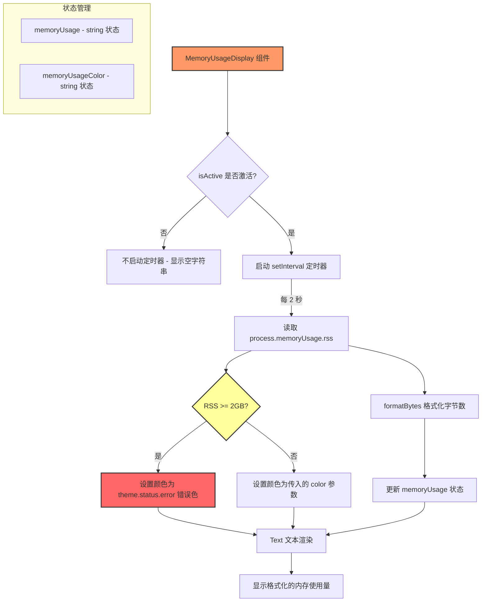

# MemoryUsageDisplay.tsx

## 概述

`MemoryUsageDisplay` 是一个轻量级的内存使用量实时显示组件，用于在 Gemini CLI 界面中展示当前 Node.js 进程的 RSS（Resident Set Size，常驻内存集）内存占用。组件每 2 秒自动更新一次内存数据，并在内存超过 2GB 阈值时将文本颜色变为错误色（红色），为用户提供直观的内存使用预警。

组件位于 `packages/cli/src/ui/components/MemoryUsageDisplay.tsx`，通常嵌入在 CLI 的状态栏或头部信息区域。

## 架构图（Mermaid）



## 核心组件

### 1. 组件签名与 Props

```typescript
export const MemoryUsageDisplay: React.FC<{
  color?: string;
  isActive?: boolean;
}> = ({ color = theme.text.primary, isActive = true }) => { ... }
```

| 属性 | 类型 | 默认值 | 说明 |
|---|---|---|---|
| `color` | `string` | `theme.text.primary` | 正常状态下文本的颜色 |
| `isActive` | `boolean` | `true` | 是否激活内存监控，为 `false` 时不启动定时器 |

### 2. 状态管理

```typescript
const [memoryUsage, setMemoryUsage] = useState<string>('');
const [memoryUsageColor, setMemoryUsageColor] = useState<string>(color);
```
- `memoryUsage`：格式化后的内存使用量字符串（如 `"128.5 MB"`），初始为空字符串。
- `memoryUsageColor`：当前文本颜色，初始值为传入的 `color` 属性。

### 3. 定时更新逻辑

```typescript
useEffect(() => {
  if (!isActive) return;

  const updateMemory = () => {
    const usage = process.memoryUsage().rss;
    setMemoryUsage(formatBytes(usage));
    setMemoryUsageColor(
      usage >= 2 * 1024 * 1024 * 1024 ? theme.status.error : color,
    );
  };

  const intervalId = setInterval(updateMemory, 2000);
  updateMemory(); // 首次立即更新
  return () => clearInterval(intervalId);
}, [color, isActive]);
```

核心逻辑：
- **条件激活**：仅在 `isActive` 为 `true` 时启动定时器。
- **读取 RSS**：使用 `process.memoryUsage().rss` 获取 Node.js 进程的常驻内存集大小（字节）。
- **格式化**：通过 `formatBytes` 工具函数将字节数转为人类可读的格式。
- **颜色阈值**：当 RSS >= 2GB（`2 * 1024 * 1024 * 1024` 字节）时，文本颜色切换为 `theme.status.error`（通常为红色）。
- **清理函数**：返回 `clearInterval` 清理函数，在组件卸载或依赖变化时清除定时器。
- **首次执行**：设置定时器后立即执行一次 `updateMemory()`，避免用户等待 2 秒才看到数据。

### 4. 渲染

```typescript
return (
  <Box>
    <Text color={memoryUsageColor}>{memoryUsage}</Text>
  </Box>
);
```
- 简洁的渲染结构，使用 `Box` 包裹 `Text`，显示格式化的内存使用量。
- 文本颜色随 `memoryUsageColor` 状态动态变化。

## 依赖关系

### 内部依赖

| 依赖模块 | 路径 | 用途 |
|---|---|---|
| `theme` | `../semantic-colors.js` | 语义化颜色主题，提供 `text.primary` 和 `status.error` 颜色 |
| `formatBytes` | `../utils/formatters.js` | 字节数格式化工具函数，将字节转为可读字符串 |

### 外部依赖

| 依赖包 | 用途 |
|---|---|
| `react` | 提供 `useEffect`、`useState` 等 React 核心 hooks 以及 `React.FC` 类型 |
| `ink` | 提供 `Text` 和 `Box` 终端 UI 基础组件 |
| `node:process` | Node.js 内置模块，用于获取进程内存使用信息 |

## 关键实现细节

1. **RSS 指标选择**：组件使用 `process.memoryUsage().rss` 而非 `heapUsed` 或 `heapTotal`。RSS（Resident Set Size）是操作系统分配给进程的实际物理内存量，比 V8 堆内存更能反映进程的真实内存占用，包含了代码段、栈、堆以及共享库等。

2. **2GB 告警阈值**：选择 2GB 作为内存告警阈值（`2 * 1024 * 1024 * 1024` = 2,147,483,648 字节）。超过此阈值时文本变为错误色，提示用户关注可能的内存泄漏或异常内存消耗。这一阈值对于 CLI 工具来说是一个合理的上限。

3. **2 秒刷新间隔**：定时器间隔为 2000 毫秒。这是一个平衡点 -- 既能提供足够频繁的更新以反映内存变化趋势，又不会因过于频繁的状态更新导致 UI 性能问题。

4. **条件激活设计**：通过 `isActive` 属性可以在不卸载组件的情况下暂停内存监控。当 `isActive` 为 `false` 时，`useEffect` 直接返回，不会设置任何定时器，节省系统资源。

5. **副作用清理**：严格遵循 React 的副作用清理模式，在 `useEffect` 的返回函数中调用 `clearInterval`，确保组件卸载或 `color`/`isActive` 变化时不会遗留定时器。

6. **颜色响应性**：`useEffect` 的依赖数组包含 `color`，当父组件传入的颜色属性变化时，会重新创建定时器并立即使用新颜色进行更新。
