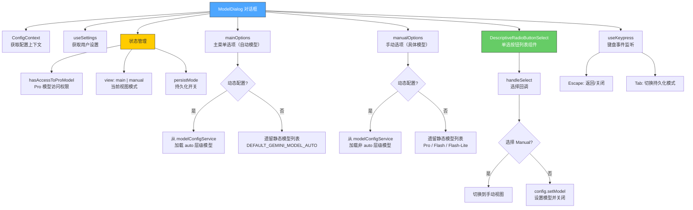

# ModelDialog.tsx

## 概述

`ModelDialog` 是一个功能丰富的 React 对话框组件，用于在 Gemini CLI 终端中为用户提供模型选择界面。该组件支持两种视图模式——"主菜单"（自动模型）和"手动选择"（具体模型），并具备动态模型配置和遗留静态配置两套路径。用户可以通过键盘交互选择模型、切换持久化模式（是否在未来会话中记住所选模型），以及通过 Escape 键关闭对话框或返回上级菜单。组件内部处理了 Pro 模型访问权限检查、预览模型可见性控制、Gemini 3.1 版本特性标志等复杂逻辑。

## 架构图（Mermaid）

## 核心组件

### ModelDialogProps 接口

| 属性 | 类型 | 必填 | 说明 |
|------|------|------|------|
| `onClose` | `() => void` | 是 | 对话框关闭时的回调函数 |

### 状态变量

| 状态 | 类型 | 初始值 | 说明 |
|------|------|--------|------|
| `hasAccessToProModel` | `boolean` | `!(config?.getProModelNoAccessSync() ?? false)` | 当前用户是否有 Pro 模型访问权限 |
| `view` | `'main' \| 'manual'` | 根据 Pro 权限决定 | 当前显示的视图：主菜单或手动选择 |
| `persistMode` | `boolean` | `false` | 是否将模型选择持久化到未来会话 |

### 计算属性（useMemo）

| 属性 | 说明 |
|------|------|
| `manualModelSelected` | 判断当前偏好模型是否为手动选择的具体模型（非 auto 类型） |
| `mainOptions` | 主菜单选项列表，包含自动模型和 "Manual" 入口 |
| `manualOptions` | 手动选择视图的模型列表，根据权限和特性标志过滤 |
| `initialIndex` | 根据当前偏好模型计算列表的初始选中索引 |

### 关键函数

#### `checkAccess()`（useEffect 内部）
异步检查用户是否有 Pro 模型访问权限。如果没有权限，自动切换到手动视图（因为主菜单中的自动模型可能包含 Pro 模型）。

#### `handleSelect(model: string)`
处理用户选择的回调。如果选择 "Manual" 则切换到手动视图；否则通过 `config.setModel()` 设置模型，记录 `ModelSlashCommandEvent` 事件日志，然后关闭对话框。`persistMode` 控制是否将选择持久化（`false` 表示仅当前会话，`true` 表示持久化）。

### 渲染结构

1. **外层容器** — 圆角边框 `Box`，全宽，内边距 1
2. **标题** — 粗体 "Select Model"
3. **单选列表** — `DescriptiveRadioButtonSelect` 组件，传入 `options`、`handleSelect`、`initialIndex`
4. **持久化提示** — 显示当前持久化状态（true/false），提示按 Tab 切换
5. **启动参数提示** — 提示用户可用 `--model` 标志在启动时指定模型
6. **关闭提示** — 提示按 Esc 关闭

## 依赖关系

### 内部依赖

| 模块路径 | 导入内容 | 用途 |
|----------|----------|------|
| `@google/gemini-cli-core` | `PREVIEW_GEMINI_MODEL`, `PREVIEW_GEMINI_3_1_MODEL`, `PREVIEW_GEMINI_FLASH_MODEL`, `PREVIEW_GEMINI_3_1_FLASH_LITE_MODEL`, `PREVIEW_GEMINI_MODEL_AUTO`, `DEFAULT_GEMINI_MODEL`, `DEFAULT_GEMINI_FLASH_MODEL`, `DEFAULT_GEMINI_FLASH_LITE_MODEL`, `DEFAULT_GEMINI_MODEL_AUTO`, `ModelSlashCommandEvent`, `logModelSlashCommand`, `getDisplayString`, `AuthType`, `PREVIEW_GEMINI_3_1_CUSTOM_TOOLS_MODEL`, `isProModel`, `UserTierId` | 模型常量、事件类、工具函数、类型定义 |
| `../hooks/useKeypress.js` | `useKeypress` | 自定义键盘事件 Hook，用于监听 Escape 和 Tab 键 |
| `../semantic-colors.js` | `theme` | 语义化颜色主题 |
| `./shared/DescriptiveRadioButtonSelect.js` | `DescriptiveRadioButtonSelect` | 带描述文字的单选按钮列表组件 |
| `../contexts/ConfigContext.js` | `ConfigContext` | 应用配置上下文，提供模型配置、权限检查等功能 |
| `../contexts/SettingsContext.js` | `useSettings` | 用户设置 Hook，用于获取认证类型等设置 |

### 外部依赖

| 包名 | 导入内容 | 用途 |
|------|----------|------|
| `react` | `React`（类型导入）, `useCallback`, `useContext`, `useMemo`, `useState`, `useEffect` | React 核心 Hooks 和类型 |
| `ink` | `Box`, `Text` | 终端 UI 布局和文本组件 |

## 关键实现细节

1. **双路径架构（动态 vs 遗留）**：组件内部同时维护"动态模型配置"和"遗留静态配置"两套逻辑路径。当 `config.getExperimentalDynamicModelConfiguration()` 返回 `true` 且 `modelConfigService` 存在时走动态路径，从 `modelConfigService.getModelDefinitions()` 动态加载模型列表；否则使用硬编码的模型常量构建列表。这种设计保证了向后兼容性。

2. **两级菜单导航**：主菜单（`view === 'main'`）显示自动模型选项和 "Manual" 入口；选择 "Manual" 后切换到手动视图（`view === 'manual'`）显示具体模型列表。在手动视图按 Escape 返回主菜单，在主菜单按 Escape 关闭对话框。

3. **Pro 模型访问控制**：通过异步 `config.getProModelNoAccess()` 检查用户是否有 Pro 模型权限。无权限的用户会被自动导航到手动视图，且手动选项列表中会过滤掉所有 Pro 层级模型（`isProModel()` 或 `m.tier === 'pro'`）。

4. **预览模型可见性**：通过 `config.getHasAccessToPreviewModel()` 判断是否显示预览（Preview）模型。预览模型仅对有权限的用户可见。

5. **Gemini 3.1 特性标志**：`useGemini31` 和 `useGemini31FlashLite` 标志控制是否使用 Gemini 3.1 系列模型替换 3.0 模型。当 `useGemini31` 为 `true` 时，预览 Pro 模型从 `PREVIEW_GEMINI_MODEL` 切换为 `PREVIEW_GEMINI_3_1_MODEL`，描述文本也相应更新。

6. **自定义工具模型**：当同时满足 `useGemini31` 为 `true` 且认证类型为 `AuthType.USE_GEMINI` 时，Pro 模型会使用 `PREVIEW_GEMINI_3_1_CUSTOM_TOOLS_MODEL` 变体，支持自定义工具功能。

7. **模型去重**：在动态路径的手动选项中，由于 3.0 和 3.1 模型可能解析为相同的实际模型 ID，组件使用 `Set` 进行去重，避免出现重复的选项。

8. **持久化模式**：通过 Tab 键切换 `persistMode`，控制 `config.setModel()` 的第二个参数。当 `persistMode` 为 `false` 时传入 `true`（表示临时），为 `true` 时传入 `false`（表示持久化）。注意参数语义是反转的。

9. **事件日志记录**：每次模型选择都会创建 `ModelSlashCommandEvent` 并通过 `logModelSlashCommand` 记录，用于遥测和使用分析。

10. **Free Tier 特殊处理**：免费用户（`UserTierId.FREE`）可以看到 Flash-Lite 预览模型，但付费用户不会看到该选项（因为付费用户有更好的模型可用）。
