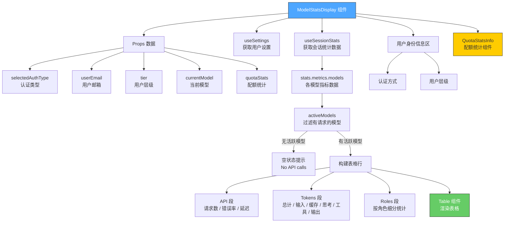

# ModelStatsDisplay.tsx

## 概述

`ModelStatsDisplay` 是一个 React 函数组件，用于在 Gemini CLI 终端中以表格形式展示当前会话的模型使用统计信息。该组件通常被称为 "Stats For Nerds"（极客统计面板），展示内容涵盖 API 请求统计（请求数、错误率、平均延迟）、Token 使用详情（输入、输出、缓存、思考、工具）、角色（Role）级别的细分统计，以及用户身份信息和配额信息。组件支持多模型并列对比显示，自动适应终端宽度，并根据实际数据动态决定显示哪些行。

## 架构图（Mermaid）

## 核心组件

### StatRowData 接口

表格每一行的数据结构：

| 属性 | 类型 | 说明 |
|------|------|------|
| `metric` | `string` | 指标名称（如 "Requests"、"Errors"） |
| `isSection` | `boolean?` | 是否为分区标题行（粗体显示） |
| `isSubtle` | `boolean?` | 是否为子项行（带缩进 `↳` 前缀） |
| `[key: string]` | `string \| ReactNode \| boolean \| undefined \| number` | 动态键，以模型名为键，存放该模型对应的指标值 |

### RoleMetrics 类型

从 `ModelMetrics['roles']` 中提取的单个角色的指标类型，使用 `NonNullable` 工具类型确保非空。

### ModelStatsDisplayProps 接口

| 属性 | 类型 | 必填 | 说明 |
|------|------|------|------|
| `selectedAuthType` | `string?` | 否 | 当前使用的认证方式 |
| `userEmail` | `string?` | 否 | 用户邮箱地址 |
| `tier` | `string?` | 否 | 用户层级（如 Free、Pro） |
| `currentModel` | `string?` | 否 | 当前选择的模型名称 |
| `quotaStats` | `QuotaStats?` | 否 | 配额统计数据 |

### 核心辅助函数

#### `createRow(metric, getValue, options?)`

工厂函数，用于创建一行表格数据。遍历所有活跃模型，调用 `getValue` 获取每个模型对应的指标值并存入行对象中。

| 参数 | 类型 | 说明 |
|------|------|------|
| `metric` | `string` | 指标名称 |
| `getValue` | `(metrics) => string \| ReactNode` | 从模型指标中提取显示值的函数 |
| `options` | `{ isSection?, isSubtle? }` | 行样式选项 |

### 表格数据构建逻辑

表格行按以下顺序构建：

1. **API 段**
   - 分区标题行 "API"
   - `Requests` — 总请求数
   - `Errors` — 错误数及错误率百分比（错误数 > 0 时显示红色）
   - `Avg Latency` — 平均延迟（格式化为人类可读时间）

2. **空行分隔**

3. **Tokens 段**
   - 分区标题行 "Tokens"
   - `Total` — Token 总计（浅色）
   - `Input` — 输入 Token（子项缩进）
   - `Cache Reads` — 缓存命中 Token 及命中率百分比（条件显示：任一模型有缓存数据）
   - `Thoughts` — 思考 Token（条件显示：任一模型有思考数据）
   - `Tool` — 工具调用 Token（条件显示：任一模型有工具数据）
   - `Output` — 输出 Token（子项缩进）

4. **空行分隔**

5. **Roles 段**（条件显示：存在角色数据）
   - 分区标题行 "Roles"
   - 按角色分组（`MAIN` 排在最前），每个角色包含：
     - 角色标题行
     - `Requests` — 该角色的请求数
     - `Input` — 该角色的输入 Token
     - `Output` — 该角色的输出 Token
     - `Cache Reads` — 该角色的缓存读取 Token

### 表格列定义

| 列 | 键 | 宽度 | 说明 |
|----|----|------|------|
| Metric | `metric` | 固定 28 字符 | 指标名称列；分区标题粗体显示，子项带 `↳` 缩进 |
| 各模型列 | 模型名 | `flexGrow: 1` | 动态生成，每个活跃模型一列；分区标题行不渲染值 |

### 渲染结构

1. **外层容器** — 圆角边框 `Box`，内边距
2. **标题** — "Auto Stats For Nerds"（自动模型）或 "Model Stats For Nerds"
3. **用户身份信息**（条件显示）— 认证方式、用户层级
4. **配额信息**（条件显示）— 通过 `QuotaStatsInfo` 组件展示剩余/总配额及重置时间
5. **统计表格** — `Table` 组件渲染

## 依赖关系

### 内部依赖

| 模块路径 | 导入内容 | 用途 |
|----------|----------|------|
| `../semantic-colors.js` | `theme` | 语义化颜色主题 |
| `../utils/formatters.js` | `formatDuration` | 将毫秒数格式化为人类可读的时间字符串 |
| `../utils/computeStats.js` | `calculateAverageLatency`, `calculateCacheHitRate`, `calculateErrorRate` | 统计计算工具函数 |
| `../contexts/SessionContext.js` | `useSessionStats`, `ModelMetrics`（类型） | 会话统计数据 Hook 和模型指标类型定义 |
| `./Table.js` | `Table`, `Column`（类型） | 通用表格渲染组件 |
| `../contexts/SettingsContext.js` | `useSettings` | 用户设置 Hook |
| `@google/gemini-cli-core` | `getDisplayString`, `isAutoModel`, `LlmRole` | 模型显示名生成、自动模型判断、LLM 角色枚举 |
| `../types.js` | `QuotaStats`（类型） | 配额统计数据类型定义 |
| `./QuotaStatsInfo.js` | `QuotaStatsInfo` | 配额统计信息展示组件 |

### 外部依赖

| 包名 | 导入内容 | 用途 |
|------|----------|------|
| `react` | `React`（类型导入） | React 类型定义 |
| `ink` | `Box`, `Text` | 终端 UI 布局和文本组件 |

## 关键实现细节

1. **空状态处理**：当没有活跃模型（`activeModels.length === 0`）时，显示友好的 "No API calls have been made in this session." 提示，而非空表格。

2. **动态条件行**：Token 段中的 `Cache Reads`、`Thoughts`、`Tool` 行仅在至少一个模型有相应数据时才显示，通过 `hasCached`、`hasThoughts`、`hasTool` 布尔值控制，避免无意义的零值行。

3. **多模型并列对比**：表格列根据活跃模型动态生成，每个模型一列，支持跨模型横向对比。这使得在 Auto 模式下使用多个模型时可以清晰地看到各模型的使用差异。

4. **角色排序策略**：角色列表通过自定义排序确保 `LlmRole.MAIN`（主角色）始终排在最前面，其余角色按字母顺序排列，保证主要信息优先展示。

5. **角色去重**：使用 `Set` 对所有模型的角色进行去重，确保即使多个模型有相同角色也只显示一个角色分区。

6. **错误率视觉反馈**：错误数大于 0 时使用 `theme.status.error`（红色）高亮显示，零错误时使用普通文本色，通过颜色直觉传达系统健康状态。

7. **子项缩进设计**：`isSubtle` 为 `true` 的行会添加 `↳` 前缀和两个空格的缩进，形成视觉层次结构，区分分区标题和具体指标。

8. **分区标题行不渲染值**：在模型列的 `renderCell` 中，当 `row.isSection` 为 `true` 时返回 `null`，确保分区标题行仅在 Metric 列显示文本。

9. **配额信息条件展示**：仅当模型是自动模型（`isAutoModel`）且配额数据有效（`pooledLimit > 0`）时才显示 `QuotaStatsInfo`，避免对手动选择模型或无配额数据时的冗余显示。

10. **标题动态生成**：根据当前模型是否为自动模型动态生成标题。自动模型显示其 displayString（如 "Auto"），手动模型直接显示 "Model Stats For Nerds"。

11. **用户身份信息隐私控制**：通过 `settings.merged.ui.showUserIdentity` 设置项控制是否显示用户认证方式和层级信息，尊重用户隐私偏好。

12. **OAuth 认证显示逻辑**：当认证类型以 `'oauth'` 开头时，显示 "Signed in with Google (email)"（如果有邮箱）或仅 "Signed in with Google"；其他认证类型直接显示类型名。
