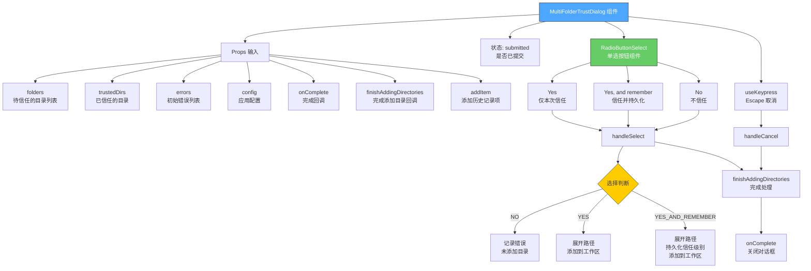

# MultiFolderTrustDialog.tsx

## 概述

`MultiFolderTrustDialog` 是一个 React 函数组件，用于在 Gemini CLI 终端中显示多文件夹信任确认对话框。当用户尝试将新目录添加到工作区时，该对话框会弹出，要求用户确认是否信任这些目录。这是一个安全功能，旨在防止在自动审批模式下对不受信任的目录执行意外的读取和自动编辑操作。用户有三种选择：仅本次信任、信任并记住、不信任。组件还支持通过 Escape 键取消操作。

## 架构图（Mermaid）

## 核心组件

### MultiFolderTrustChoice 枚举

用户在信任对话框中可做的选择：

| 枚举值 | 名称 | 说明 |
|--------|------|------|
| `YES` | 仅本次信任 | 本次会话信任这些目录，但不持久化 |
| `YES_AND_REMEMBER` | 信任并记住 | 信任并将目录持久化存储为受信任目录 |
| `NO` | 不信任 | 拒绝信任，不添加这些目录 |

### MultiFolderTrustDialogProps 接口

| 属性 | 类型 | 必填 | 说明 |
|------|------|------|------|
| `folders` | `string[]` | 是 | 待确认信任的目录路径列表 |
| `onComplete` | `() => void` | 是 | 对话框操作完成后的回调函数 |
| `trustedDirs` | `string[]` | 是 | 已经受信任的目录列表 |
| `errors` | `string[]` | 是 | 初始错误信息列表（之前步骤中可能已产生的错误） |
| `finishAddingDirectories` | `(config, addItem, added, errors) => Promise<void>` | 是 | 完成添加目录操作的回调函数，负责最终处理 |
| `config` | `Config` | 是 | 应用配置对象，用于获取工作区上下文等 |
| `addItem` | `(itemData, baseTimestamp?) => number` | 是 | 向会话历史记录中添加项目的函数 |

### 状态变量

| 状态 | 类型 | 初始值 | 说明 |
|------|------|--------|------|
| `submitted` | `boolean` | `false` | 是否已提交选择，用于禁用交互和显示加载提示 |

### 关键函数

#### `handleCancel()`

异步取消处理函数，当用户按 Escape 键时触发：
1. 设置 `submitted` 为 `true` 禁用交互
2. 在错误列表中添加取消信息，列出所有未添加的目录
3. 调用 `finishAddingDirectories` 完成处理
4. 调用 `onComplete` 关闭对话框

#### `handleSelect(choice: MultiFolderTrustChoice)`

异步选择处理函数，当用户通过单选按钮选择后触发：
1. 设置 `submitted` 为 `true` 禁用交互
2. 检查 `config` 是否可用，不可用则添加错误信息并退出
3. 获取工作区上下文和已信任文件夹配置
4. 根据选择执行不同逻辑：
   - **NO**：将所有目录添加到错误信息中，说明因不信任而未添加
   - **YES / YES_AND_REMEMBER**：遍历每个目录，展开路径（`expandHomeDir` + `path.resolve`），添加到工作区上下文。如果选择了 `YES_AND_REMEMBER`，还会将目录持久化写入信任配置（`TrustLevel.TRUST_FOLDER`）
5. 调用 `finishAddingDirectories` 完成处理
6. 调用 `onComplete` 关闭对话框

### 渲染结构

1. **外层容器** — 垂直布局 `Box`，全宽
2. **对话框主体** — 圆角边框，警告色边框（`theme.status.warning`），内边距 1，左右外边距 1
   - **提示文本区域** — 底部间距 1
     - 粗体标题："Do you trust the following folders being added to this workspace?"
     - 目录列表（每个目录前缀 `- `）
     - 安全说明文本
   - **RadioButtonSelect** — 三个选项的单选按钮组件，`submitted` 后禁用焦点
3. **加载提示**（条件显示）— `submitted` 为 `true` 时显示 "Applying trust settings..."

## 依赖关系

### 内部依赖

| 模块路径 | 导入内容 | 用途 |
|----------|----------|------|
| `../semantic-colors.js` | `theme` | 语义化颜色主题，这里使用 `status.warning` 作为边框色 |
| `./shared/RadioButtonSelect.js` | `RadioButtonSelect`, `RadioSelectItem`（类型） | 单选按钮列表组件 |
| `../hooks/useKeypress.js` | `useKeypress` | 键盘事件监听 Hook，用于 Escape 键取消 |
| `../../config/trustedFolders.js` | `loadTrustedFolders`, `TrustLevel` | 加载和管理受信任目录配置 |
| `../utils/directoryUtils.js` | `expandHomeDir` | 展开路径中的 `~` 为用户主目录 |
| `../types.js` | `MessageType`, `HistoryItem`（类型） | 消息类型枚举和历史记录项类型 |
| `@google/gemini-cli-core` | `Config`（类型） | 应用配置类型定义 |

### 外部依赖

| 包名 | 导入内容 | 用途 |
|------|----------|------|
| `ink` | `Box`, `Text` | 终端 UI 布局和文本组件 |
| `react` | `React`（类型导入）, `useState` | React 类型和状态 Hook |
| `node:path` | `path` | Node.js 路径处理模块，用于 `path.resolve` 解析绝对路径 |

## 关键实现细节

1. **安全设计理念**：该组件是 Gemini CLI 安全模型的关键部分。信任机制防止了在自动审批模式下对用户未明确信任的目录执行读取和自动编辑操作。边框使用警告色（黄色）以引起用户注意。

2. **三级信任策略**：
   - **临时信任**（YES）：目录仅在当前会话中被信任，通过 `workspaceContext.addDirectory()` 添加但不持久化
   - **永久信任**（YES_AND_REMEMBER）：除了添加到工作区外，还通过 `trustedFolders.setValue()` 将目录以 `TrustLevel.TRUST_FOLDER` 级别持久化存储
   - **拒绝**（NO）：目录不被添加，错误信息中记录被拒绝的目录

3. **路径规范化**：对用户提供的目录路径执行两步规范化——先通过 `expandHomeDir()` 展开 `~` 符号，再通过 `path.resolve()` 转换为绝对路径，确保路径的一致性和准确性。

4. **错误累积模式**：组件使用错误累积策略，不会因单个目录的添加失败而中断整个操作。每个目录独立处理，失败的目录会被记录到 `errors` 数组中，最终一并交给 `finishAddingDirectories` 处理。

5. **提交后禁用交互**：`submitted` 状态用于双重保护——既禁用 `useKeypress` 的键盘监听（`isActive: !submitted`），也禁用 `RadioButtonSelect` 的焦点（`isFocused: !submitted`），防止用户在异步操作进行中重复提交。

6. **加载状态反馈**：当 `submitted` 为 `true` 时显示 "Applying trust settings..." 文本，为用户提供操作正在进行的视觉反馈。

7. **取消操作等同于拒绝**：按 Escape 键取消操作会将所有待信任目录标记为未添加，效果类似于选择 "No"，但错误信息中会明确标注为 "Operation cancelled"。

8. **eslint 忽略注释**：`handleCancel` 的调用处有 `@typescript-eslint/no-floating-promises` 忽略注释，因为 `useKeypress` 的回调返回 `boolean` 而非 `Promise`，但 `handleCancel` 是异步的。在 `handleSelect` 中的 catch 块也有 `@typescript-eslint/no-unsafe-type-assertion` 忽略注释，用于将未知错误类型断言为 `Error`。
