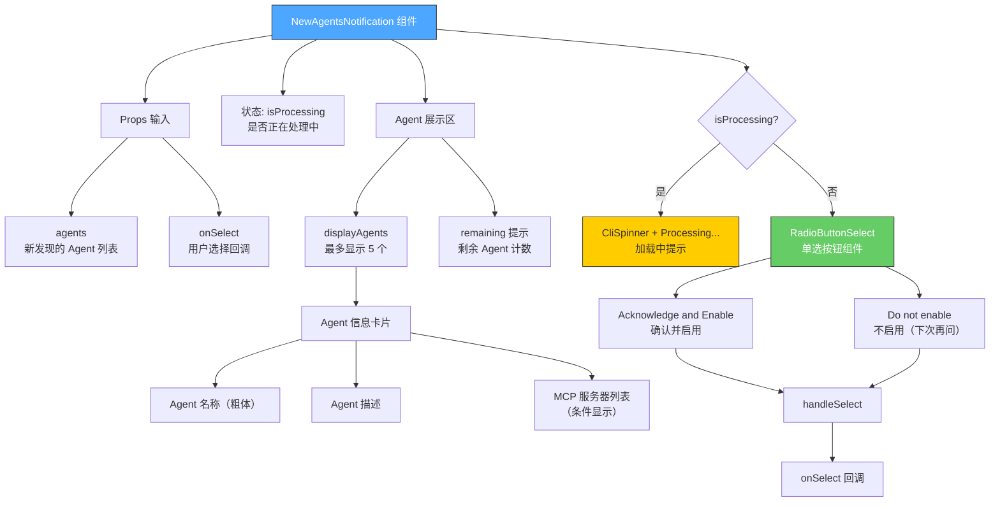

# NewAgentsNotification.tsx

## 概述

`NewAgentsNotification` 是一个 React 函数组件，用于在 Gemini CLI 终端中显示新发现的 Agent（代理）通知对话框。当项目中检测到新的 Agent 定义时，该组件会弹出，让用户审查这些 Agent 的名称、描述以及可能附带的 MCP 服务器信息，然后决定是启用还是忽略它们。组件限制最多显示 5 个 Agent 以防止界面溢出，超出部分以计数形式提示。

## 架构图（Mermaid）

## 核心组件

### NewAgentsChoice 枚举

用户对新发现 Agent 的选择：

| 枚举值 | 字符串值 | 说明 |
|--------|----------|------|
| `ACKNOWLEDGE` | `'acknowledge'` | 确认并启用这些 Agent |
| `IGNORE` | `'ignore'` | 不启用，下次再询问 |

### NewAgentsNotificationProps 接口

| 属性 | 类型 | 必填 | 说明 |
|------|------|------|------|
| `agents` | `AgentDefinition[]` | 是 | 新发现的 Agent 定义列表 |
| `onSelect` | `(choice: NewAgentsChoice) => void \| Promise<void>` | 是 | 用户做出选择后的回调函数，支持同步或异步 |

### 状态变量

| 状态 | 类型 | 初始值 | 说明 |
|------|------|--------|------|
| `isProcessing` | `boolean` | `false` | 是否正在处理用户的选择，控制 UI 切换为加载状态 |

### 核心常量

| 常量 | 值 | 说明 |
|------|-----|------|
| `MAX_DISPLAYED_AGENTS` | `5` | 最多显示的 Agent 数量，超出部分以 "... and N more." 提示 |
| `displayAgents` | `agents.slice(0, 5)` | 实际要渲染的 Agent 子集 |
| `remaining` | `agents.length - 5` | 未显示的 Agent 数量 |

### 关键函数

#### `handleSelect(choice: NewAgentsChoice)`

异步选择处理函数：
1. 设置 `isProcessing` 为 `true`，UI 切换为加载状态（显示 Spinner）
2. 调用 `onSelect(choice)` 并等待其完成
3. 无论成功与否，在 `finally` 块中将 `isProcessing` 恢复为 `false`

### 选项定义

| 选项 | 标签 | 枚举值 | 唯一键 |
|------|------|--------|--------|
| 确认并启用 | "Acknowledge and Enable" | `ACKNOWLEDGE` | `'acknowledge'` |
| 不启用 | "Do not enable (Ask again next time)" | `IGNORE` | `'ignore'` |

### 渲染结构

1. **外层容器** — 垂直布局 `Box`，全宽
2. **对话框主体** — 圆角边框，警告色边框（`theme.status.warning`），内边距 1，左右外边距 1
   - **信息展示区** — 底部间距 1
     - 粗体标题 "New Agents Discovered"
     - 说明文本 "The following agents were found in this project. Please review them:"
     - **Agent 列表框** — 单线边框（`borderStyle="single"`），内边距 1，顶部间距 1
       - 每个 Agent 显示：
         - 名称（粗体） + 描述
         - MCP 服务器列表（如果有，缩进显示）
       - 超出 5 个时显示 "... and N more."
   - **交互区** — 根据 `isProcessing` 状态切换：
     - 处理中：`CliSpinner` 加载动画 + "Processing..." 文字
     - 未处理：`RadioButtonSelect` 单选按钮组件

## 依赖关系

### 内部依赖

| 模块路径 | 导入内容 | 用途 |
|----------|----------|------|
| `../semantic-colors.js` | `theme` | 语义化颜色主题，边框使用 `status.warning` |
| `./shared/RadioButtonSelect.js` | `RadioButtonSelect`, `RadioSelectItem`（类型） | 单选按钮列表组件 |
| `./CliSpinner.js` | `CliSpinner` | CLI 加载动画组件 |
| `@google/gemini-cli-core` | `AgentDefinition`（类型） | Agent 定义类型 |

### 外部依赖

| 包名 | 导入内容 | 用途 |
|------|----------|------|
| `react` | `useState` | React 状态管理 Hook |
| `ink` | `Box`, `Text` | 终端 UI 布局和文本组件 |

## 关键实现细节

1. **Agent 显示数量限制**：通过 `MAX_DISPLAYED_AGENTS = 5` 硬编码限制最多显示 5 个 Agent。超出部分以 "... and N more." 文本提示，防止在 Agent 数量很多时导致终端界面溢出或难以阅读。

2. **MCP 服务器条件展示**：仅当 Agent 的 `kind` 为 `'local'` 且 `mcpServers` 对象包含至少一个键时，才会显示 MCP 服务器信息。这提供了重要的安全信息——让用户知道该 Agent 会启动哪些 MCP 服务器。

3. **加载状态切换**：处理选择时，整个交互区从 `RadioButtonSelect` 切换为 `CliSpinner` + "Processing..." 文字，提供清晰的视觉反馈，同时防止用户在处理期间重复操作。

4. **异步安全处理**：`handleSelect` 使用 `try/finally` 模式确保无论 `onSelect` 是否成功，`isProcessing` 都会被重置为 `false`，避免 UI 永久卡在加载状态。

5. **支持同步和异步回调**：`onSelect` 的类型定义为 `(choice) => void | Promise<void>`，同时支持同步和异步回调。`handleSelect` 内部使用 `await` 统一处理两种情况。

6. **非破坏性忽略选项**：选择 "Do not enable (Ask again next time)" 不会永久阻止 Agent，仅在本次跳过，下次启动时会再次提示。这种设计给予用户充分的考虑时间，避免因误操作永久禁用 Agent。

7. **Agent 信息布局设计**：每个 Agent 的名称使用 `flexShrink={0}` 防止在窄终端中被压缩，确保名称始终完整显示。描述文本则自然换行。MCP 服务器信息以 `marginLeft={2}` 缩进显示，形成视觉层次。

8. **警告色边框**：与 `MultiFolderTrustDialog` 类似，使用 `theme.status.warning` 作为边框颜色，强调这是一个需要用户注意和审查的安全相关通知。

9. **RadioButtonSelect 焦点固定**：`isFocused` 始终为 `true`（在非处理状态下组件可见时），确保键盘焦点始终在单选按钮上，用户可以直接通过键盘操作。
