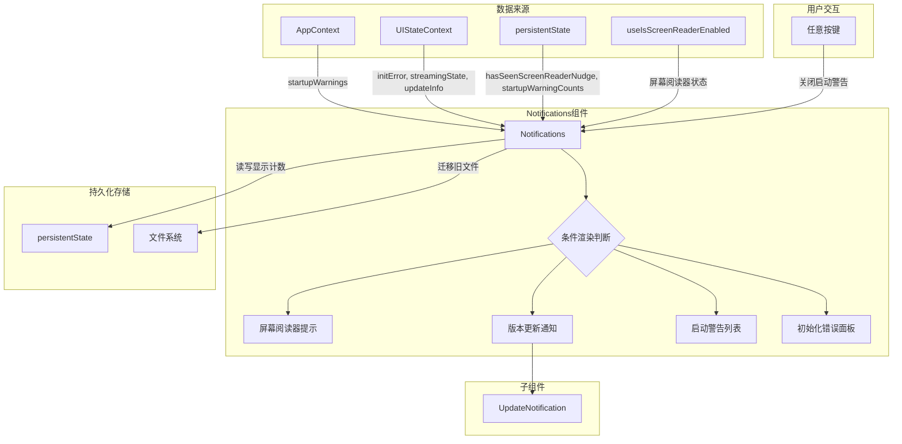

# Notifications.tsx

## 概述

`Notifications.tsx` 是 Gemini CLI 的通知中心组件，负责在终端界面中集中展示各类通知信息。它整合了四种不同类型的通知：屏幕阅读器提示、版本更新提醒、启动警告以及初始化错误。组件内部实现了基于优先级的警告过滤机制和持久化的显示计数管理，确保低优先级警告不会无限次地打扰用户（最多显示 3 次）。同时支持通过任意按键关闭启动警告，并能自动检测和迁移旧版屏幕阅读器提示文件。

## 架构图（Mermaid）

## 核心组件

### 1. Notifications（主组件）

函数式 React 组件，作为通知中心统一管理所有通知的展示逻辑。

**状态管理：**

| 状态 | 类型 | 说明 |
|------|------|------|
| `hasSeenScreenReaderNudge` | `boolean \| undefined` | 用户是否已看过屏幕阅读器提示 |
| `dismissed` | `boolean` | 启动警告是否被用户关闭 |
| `hasIncrementedRef` | `React.MutableRefObject<boolean>` | 当前会话是否已增加了显示计数（防止重复计数） |

**渲染优先级（从上到下）：**

1. **屏幕阅读器提示** - 仅在启用屏幕阅读器且未曾看过时显示，告知用户如何退出屏幕阅读器模式
2. **版本更新通知** - 当存在 `updateInfo` 时渲染 `UpdateNotification` 子组件
3. **启动警告列表** - 以黄色警告图标 `⚠` 前缀展示每条警告信息，外层有上下边距
4. **初始化错误面板** - 圆角边框的红色错误面板，显示错误详情和排查提示

**早期返回条件：**
当以上四种通知都不需要显示时，组件返回 `null`，不渲染任何内容。

### 2. 警告过滤机制（visibleWarnings）

通过 `useMemo` 计算可见警告列表：
- 如果用户已关闭（`dismissed === true`），返回空数组
- 对于低优先级（`WarningPriority.Low`）警告，检查持久化存储中的显示计数，超过 `MAX_STARTUP_WARNING_SHOW_COUNT`（3 次）则过滤掉
- 高优先级警告始终显示

### 3. 显示计数递增（useEffect）

当有可见警告且当前会话尚未递增计数时：
- 复制现有计数对象
- 对每个低优先级警告的计数 +1
- 写入持久化存储
- 设置 `hasIncrementedRef.current = true` 防止重复递增

### 4. 按键关闭处理（useKeypress）

使用 `useKeypress` hook 监听按键事件：
- 仅在有启动警告时激活（`isActive: showStartupWarnings`）
- 优先级为 `KeypressPriority.Critical`，确保优先处理
- 按下任意键后设置 `dismissed = true`，关闭警告显示
- 返回 `false` 表示事件不被消费，允许继续传播

### 5. 屏幕阅读器旧文件迁移（useEffect）

检测旧版屏幕阅读器提示文件并迁移到新的持久化存储：
- 如果 `hasSeenScreenReaderNudge` 已有值则跳过
- 检查旧文件 `seen_screen_reader_nudge.json` 是否存在
- 存在则迁移到 `persistentState` 并删除旧文件
- 不存在则设置为 `false`

## 依赖关系

### 内部依赖

| 模块路径 | 导入内容 | 用途 |
|----------|----------|------|
| `../contexts/AppContext.js` | `useAppContext` | 获取启动警告数据 |
| `../contexts/UIStateContext.js` | `useUIState` | 获取初始化错误、流式状态、更新信息 |
| `../semantic-colors.js` | `theme` | 获取主题色配置（警告色、错误色） |
| `../types.js` | `StreamingState` | 流式响应状态枚举 |
| `./UpdateNotification.js` | `UpdateNotification` | 版本更新通知子组件 |
| `../../utils/persistentState.js` | `persistentState` | 持久化状态管理工具 |
| `../hooks/useKeypress.js` | `useKeypress` | 按键监听 hook |
| `../contexts/KeypressContext.js` | `KeypressPriority` | 按键优先级枚举 |
| `@google/gemini-cli-core` | `GEMINI_DIR, Storage, homedir, WarningPriority` | 核心包：目录常量、存储工具、主目录、警告优先级枚举 |

### 外部依赖

| 包名 | 导入内容 | 用途 |
|------|----------|------|
| `ink` | `Box, Text, useIsScreenReaderEnabled` | 终端 UI 渲染框架，布局组件和屏幕阅读器检测 |
| `react` | `useEffect, useState, useMemo, useRef, useCallback` | React Hooks |
| `node:fs/promises` | `fs` | 异步文件系统操作（检查和删除旧文件） |
| `node:path` | `path` | 路径拼接工具 |

## 关键实现细节

1. **显示计数防重复机制**：使用 `useRef` 而非 `useState` 来跟踪是否已递增计数。这样做的好处是修改 ref 不会触发重新渲染，避免了在 `useEffect` 中因状态更新导致的无限循环。

2. **低优先级警告的展示策略**：低优先级警告最多显示 `MAX_STARTUP_WARNING_SHOW_COUNT = 3` 次。计数存储在 `persistentState` 中的 `startupWarningCounts` 字段，以警告的 `id` 为键。这使得每个警告有独立的计数。

3. **初始化错误的条件显示**：初始化错误仅在非响应状态（`streamingState !== StreamingState.Responding`）时显示，避免在模型正在生成回复时展示错误信息干扰用户。

4. **屏幕阅读器提示的迁移策略**：组件实现了从旧版文件（`seen_screen_reader_nudge.json`，位于全局临时目录）到新版 `persistentState` 的无缝迁移。迁移完成后以 best-effort 方式删除旧文件（`.catch(() => {})` 忽略删除失败）。

5. **按键事件处理**：使用 `KeypressPriority.Critical` 优先级注册按键处理，确保在所有其他按键处理器之前执行。处理函数返回 `false`，允许按键事件继续向下传播到其他处理器。

6. **设置文件路径**：屏幕阅读器提示中引用的设置文件路径为 `~/.gemini/settings.json`（由 `homedir()` + `GEMINI_DIR` + `settings.json` 拼接）。

7. **渲染结构**：组件使用 React Fragment (`<>...</>`) 包裹所有通知，没有额外的包装层。启动警告列表使用 `Box` 组件实现纵向排列，每条警告内部使用横向排列（固定宽度的图标区 + 自动扩展的消息区）。
