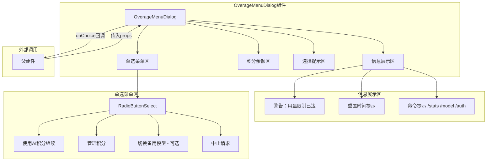

# OverageMenuDialog.tsx

## 概述

`OverageMenuDialog.tsx` 是 Gemini CLI 的用量超限菜单对话框组件。当用户使用的模型达到配额上限时，该组件会弹出一个交互式菜单，为用户提供多种处理选项：使用 AI Credits 继续、管理余额和购买更多积分、切换到备用模型，或中止当前请求。组件通过单选按钮列表（RadioButtonSelect）实现用户选择交互，并在顶部展示当前的配额状态信息和可用命令提示。

## 架构图（Mermaid）

## 核心组件

### 1. OverageMenuChoice（类型定义）

联合字符串类型，定义了用户在超限菜单中可做的选择：

| 值 | 含义 |
|---|------|
| `'use_credits'` | 使用 AI Credits 继续当前请求（超额使用） |
| `'use_fallback'` | 切换到备用模型继续 |
| `'manage'` | 查看余额并购买更多积分 |
| `'stop'` | 中止当前请求 |

### 2. OverageMenuDialogProps（接口定义）

| 属性 | 类型 | 必填 | 说明 |
|------|------|------|------|
| `failedModel` | `string` | 是 | 触发配额限制的模型名称 |
| `fallbackModel` | `string` | 否 | 可切换的备用模型名称，省略则不显示切换选项 |
| `resetTime` | `string` | 否 | 配额重置的时间（人类可读格式），省略则不显示重置时间 |
| `creditBalance` | `number` | 是 | 当前可用的 G1 AI Credit 余额 |
| `onChoice` | `(choice: OverageMenuChoice) => void` | 是 | 用户做出选择后的回调函数 |

### 3. OverageMenuDialog（主组件）

函数式 React 组件，渲染超限处理对话框。

**菜单项构建逻辑：**
- 固定包含"使用 AI Credits"和"管理积分"两个选项
- 仅当传入了 `fallbackModel` 时，动态添加"切换到 {fallbackModel}"选项
- 固定以"中止请求"作为最后一个选项

**渲染结构（从上到下）：**

1. **警告标题区** (`marginBottom={1}`)
   - 黄色警告文本：`Usage limit reached for {failedModel}.`
   - 条件渲染重置时间：`Access resets at {resetTime}.`
   - 三条命令提示，使用加粗高亮的斜杠命令：
     - `/stats` - 查看使用详情
     - `/model` - 切换模型
     - `/auth` - 切换到 API Key 认证

2. **积分余额区** (`marginBottom={1}`)
   - 显示可用积分数量，数字以绿色加粗高亮

3. **选择提示区** (`marginBottom={1}`)
   - 文本提示："How would you like to proceed?"

4. **单选菜单区** (`marginTop={1} marginBottom={1}`)
   - 使用 `RadioButtonSelect` 组件渲染选项列表
   - 用户选择后通过 `onSelect` 回调触发 `onChoice`

## 依赖关系

### 内部依赖

| 模块路径 | 导入内容 | 用途 |
|----------|----------|------|
| `./shared/RadioButtonSelect.js` | `RadioButtonSelect` | 单选按钮选择列表组件 |
| `../semantic-colors.js` | `theme` | 主题色配置（警告色、成功色、强调色） |

### 外部依赖

| 包名 | 导入内容 | 用途 |
|------|----------|------|
| `react` | `React`（类型导入） | JSX 类型定义 |
| `ink` | `Box, Text` | 终端 UI 渲染框架，布局和文本组件 |

## 关键实现细节

1. **动态菜单项构建**：菜单项列表以数组方式构建，先添加固定的"使用积分"和"管理"选项，然后条件性地添加"切换备用模型"选项，最后追加"中止"选项。这确保了"中止"始终是最后一个选项，提供一致的用户体验。

2. **纯展示型组件**：该组件不管理任何内部状态，所有数据通过 props 传入，选择结果通过 `onChoice` 回调传出。这是一个典型的受控组件模式。

3. **主题色彩使用**：
   - `theme.status.warning`（黄色）：用于配额达限的警告文本
   - `theme.status.success`（绿色）：用于积分余额数字的高亮
   - `theme.text.accent`（强调色）：用于斜杠命令的高亮显示

4. **圆角边框容器**：整个对话框使用 `borderStyle="round"` 的 `Box` 包裹，并设置 `padding={1}` 内边距，在终端中呈现为一个视觉上独立的对话框区域。

5. **每个菜单项都有唯一的 `key` 属性**：与 `value` 值相同，用于 React 的列表渲染优化。`RadioButtonSelect` 组件接收 `items` 数组和 `onSelect` 回调，内部处理键盘导航和选择逻辑。
