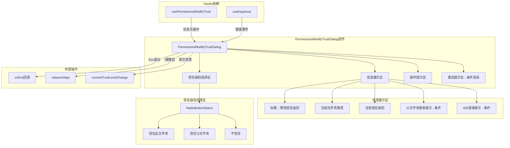

# PermissionsModifyTrustDialog.tsx

## 概述

`PermissionsModifyTrustDialog.tsx` 是 Gemini CLI 的信任级别修改对话框组件。它允许用户通过交互式界面修改当前工作目录（或指定目录）的信任级别。信任级别决定了 Gemini CLI 在该目录下执行操作时的权限范围。组件提供三个选项：信任当前文件夹、信任父文件夹、不信任。修改信任级别后可能需要重启 CLI 才能生效，组件会自动检测并提示用户按 `r` 键重启。

## 架构图（Mermaid）

## 核心组件

### 1. PermissionsDialogProps（接口）

基础属性接口，被其他权限对话框复用。

| 属性 | 类型 | 必填 | 说明 |
|------|------|------|------|
| `targetDirectory` | `string` | 否 | 目标目录路径，默认使用 `process.cwd()` |

### 2. PermissionsModifyTrustDialogProps（接口）

继承自 `PermissionsDialogProps`，扩展了以下属性：

| 属性 | 类型 | 必填 | 说明 |
|------|------|------|------|
| `onExit` | `() => void` | 是 | 退出对话框的回调函数 |
| `addItem` | `UseHistoryManagerReturn['addItem']` | 是 | 历史记录管理器的添加条目方法 |
| `targetDirectory` | `string` | 否 | 继承自父接口 |

### 3. PermissionsModifyTrustDialog（主组件）

函数式 React 组件，渲染信任级别修改对话框。

**目录信息计算：**
- `currentDirectory`：优先使用 `targetDirectory`，否则使用 `process.cwd()`
- `dirName`：当前目录的基本名称（`path.basename`），用于选项标签展示
- `parentFolder`：父目录的基本名称，用于"信任父文件夹"选项标签

**信任级别选项（TRUST_LEVEL_ITEMS）：**

| 标签 | 值 | 说明 |
|------|----|------|
| `Trust this folder ({dirName})` | `TrustLevel.TRUST_FOLDER` | 仅信任当前目录 |
| `Trust parent folder ({parentFolder})` | `TrustLevel.TRUST_PARENT` | 信任父目录（当前目录也会被包含） |
| `Don't trust` | `TrustLevel.DO_NOT_TRUST` | 不信任该目录 |

**从 usePermissionsModifyTrust hook 获取的状态与方法：**

| 名称 | 类型 | 说明 |
|------|------|------|
| `cwd` | `string` | 当前工作目录的完整路径 |
| `currentTrustLevel` | `string` | 当前信任级别 |
| `isInheritedTrustFromParent` | `boolean` | 信任是否从父文件夹继承 |
| `isInheritedTrustFromIde` | `boolean` | 信任是否从 IDE 工作区继承 |
| `needsRestart` | `boolean` | 更改后是否需要重启 |
| `updateTrustLevel` | `function` | 更新信任级别的方法 |
| `commitTrustLevelChange` | `function` | 提交信任级别变更的方法 |

**键盘事件处理（useKeypress）：**
- **Esc 键**：调用 `onExit()` 关闭对话框，返回 `true` 消费事件
- **r 键**（仅在 `needsRestart` 为 true 时）：
  1. 异步调用 `commitTrustLevelChange()` 提交变更
  2. 成功则调用 `relaunchApp()` 重启应用
  3. 失败则调用 `onExit()` 退出对话框
  4. 返回 `true` 消费事件

**渲染结构：**

1. **圆角边框容器**（`borderStyle="round"`）
   - 标题区：加粗文本 `> Modify Trust Level`
   - 目录信息：显示文件夹路径和当前信任级别
   - 条件提示（父文件夹继承）：灰色文本提示该目录因父文件夹被信任而自动信任
   - 条件提示（IDE 继承）：灰色文本提示该目录因 IDE 工作区被信任而自动信任
   - 单选按钮列表：`RadioButtonSelect` 组件，初始选中当前信任级别
   - 操作提示：`(Use Enter to select, Esc to close)`

2. **重启提示**（条件渲染，仅当 `needsRestart` 为 true）
   - 黄色警告文本提示需要重启，并告知按 `r` 键重启

## 依赖关系

### 内部依赖

| 模块路径 | 导入内容 | 用途 |
|----------|----------|------|
| `../../config/trustedFolders.js` | `TrustLevel` | 信任级别枚举 |
| `../hooks/useKeypress.js` | `useKeypress` | 按键监听 hook |
| `../hooks/usePermissionsModifyTrust.js` | `usePermissionsModifyTrust` | 信任级别修改逻辑 hook |
| `../semantic-colors.js` | `theme` | 主题色配置 |
| `./shared/RadioButtonSelect.js` | `RadioButtonSelect` | 单选按钮选择列表组件 |
| `../../utils/processUtils.js` | `relaunchApp` | 重启应用的工具函数 |
| `../hooks/useHistoryManager.js` | `UseHistoryManagerReturn`（类型） | 历史管理器返回类型 |

### 外部依赖

| 包名 | 导入内容 | 用途 |
|------|----------|------|
| `ink` | `Box, Text` | 终端 UI 渲染框架 |
| `react` | `React`（类型导入） | JSX 类型定义 |
| `node:process` | `process` | 获取当前工作目录 |
| `node:path` | `path` | 路径操作工具 |

## 关键实现细节

1. **信任继承提示机制**：组件能检测两种信任继承场景：
   - **父文件夹继承**：当父文件夹被设为信任时，子文件夹自动获得信任。此时即使在此修改子文件夹的信任级别也不会改变实际行为，需要去修改父文件夹的设置。
   - **IDE 继承**：当连接的 IDE 工作区被设为信任时，该文件夹也会自动信任。同样，在此修改不会改变实际行为。

2. **初始选中项计算**：通过 `findIndex` 在 `TRUST_LEVEL_ITEMS` 中查找匹配当前信任级别的项。如果找不到（返回 -1），默认选中第一项（index = 0）。

3. **重启流程**：信任级别的修改可能需要重启才能生效。流程为：
   - `usePermissionsModifyTrust` hook 检测到需要重启时设置 `needsRestart = true`
   - 用户按 `r` 键触发异步流程
   - 先调用 `commitTrustLevelChange()` 持久化变更
   - 成功后调用 `relaunchApp()` 重启整个 CLI
   - 失败则静默退出对话框

4. **异步按键处理**：`r` 键的处理涉及异步操作（`commitTrustLevelChange` 返回 Promise），使用立即执行的异步箭头函数（IIFE）包裹，并通过 `void` 操作符忽略返回的 Promise（避免 TypeScript 的 floating promise 警告）。

5. **导出的 PermissionsDialogProps**：基础接口 `PermissionsDialogProps` 被导出为 `export interface`，暗示它在其他权限相关对话框中也被复用。
