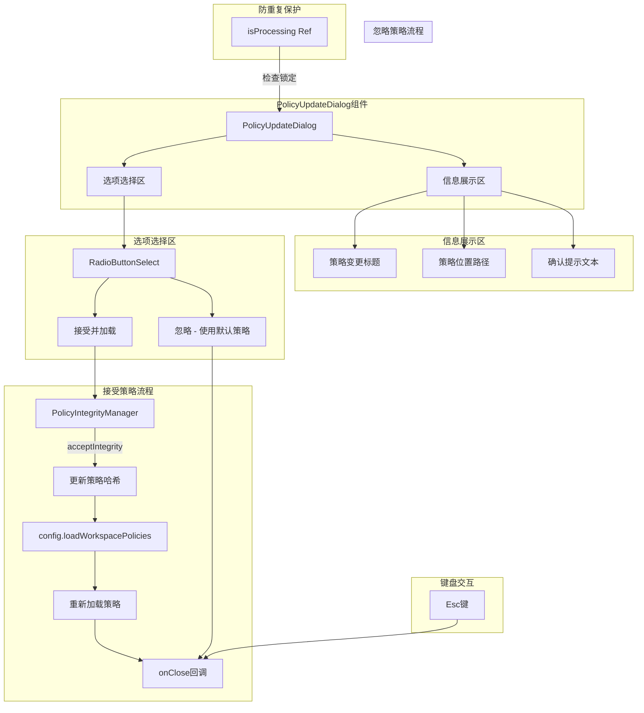

# PolicyUpdateDialog.tsx

## 概述

`PolicyUpdateDialog.tsx` 是 Gemini CLI 的策略更新确认对话框组件。当检测到新的或已修改的工作区策略（policies）时，该组件会弹出一个确认对话框，要求用户决定是否接受并加载这些策略变更。用户可以选择"接受并加载"或"忽略（使用默认策略）"。接受策略时，组件会通过 `PolicyIntegrityManager` 更新策略完整性哈希，并重新加载工作区策略。组件内置了防重复提交保护和 Esc 键退出支持。

## 架构图（Mermaid）

## 核心组件

### 1. PolicyUpdateChoice（枚举）

定义用户在策略更新对话框中的可选操作：

| 枚举值 | 字符串值 | 含义 |
|--------|---------|------|
| `ACCEPT` | `'accept'` | 接受策略变更并加载 |
| `IGNORE` | `'ignore'` | 忽略变更，使用默认策略 |

### 2. PolicyUpdateDialogProps（接口）

| 属性 | 类型 | 说明 |
|------|------|------|
| `config` | `Config` | 配置对象，用于重新加载工作区策略 |
| `request` | `PolicyUpdateConfirmationRequest` | 策略更新确认请求对象，包含 scope、identifier、newHash、policyDir 等信息 |
| `onClose` | `() => void` | 关闭对话框的回调函数 |

### 3. PolicyUpdateDialog（主组件）

函数式 React 组件（`React.FC`），渲染策略更新确认对话框。

**内部状态：**

| 名称 | 类型 | 说明 |
|------|------|------|
| `isProcessing` | `React.MutableRefObject<boolean>` | 防重复提交锁，使用 `useRef` 管理 |

**核心方法：**

**handleSelect(choice)**：
异步选择处理函数，使用 `useCallback` 缓存：
1. 检查 `isProcessing.current`，如果正在处理则直接返回（防重复提交）
2. 设置 `isProcessing.current = true` 加锁
3. 如果选择 `ACCEPT`：
   - 创建 `PolicyIntegrityManager` 实例
   - 调用 `acceptIntegrity(scope, identifier, newHash)` 更新策略完整性记录
   - 调用 `config.loadWorkspacePolicies(policyDir)` 重新加载工作区策略
4. 调用 `onClose()` 关闭对话框（无论选择 ACCEPT 还是 IGNORE）
5. 在 `finally` 块中重置 `isProcessing.current = false` 解锁

**键盘事件处理（useKeypress）：**
- 匹配 `Command.ESCAPE` 命令时调用 `onClose()` 关闭对话框
- 使用 `useKeyMatchers` hook 进行键盘命令匹配

**渲染结构：**

1. **外层容器**（`flexDirection="column" width="100%"`）
   - **圆角边框容器**（`borderStyle="round" borderColor={theme.status.warning}`）
     - **信息展示区**（`marginBottom={1}`）：
       - 加粗标题：`New or changed {scope} policies detected`
       - 策略位置：`Location: {identifier}`
       - 确认提示：`Do you want to accept and load these policies?`
     - **单选按钮列表**：`RadioButtonSelect`，`isFocused={true}` 表示自动获得焦点

## 依赖关系

### 内部依赖

| 模块路径 | 导入内容 | 用途 |
|----------|----------|------|
| `@google/gemini-cli-core` | `PolicyIntegrityManager, Config（类型）, PolicyUpdateConfirmationRequest（类型）` | 策略完整性管理器和相关类型 |
| `../semantic-colors.js` | `theme` | 主题色配置 |
| `./shared/RadioButtonSelect.js` | `RadioButtonSelect, RadioSelectItem（类型）` | 单选按钮选择列表组件和选项类型 |
| `../hooks/useKeypress.js` | `useKeypress` | 按键监听 hook |
| `../key/keyMatchers.js` | `Command` | 键盘命令枚举 |
| `../hooks/useKeyMatchers.js` | `useKeyMatchers` | 键盘命令匹配器 hook |

### 外部依赖

| 包名 | 导入内容 | 用途 |
|------|----------|------|
| `ink` | `Box, Text` | 终端 UI 渲染框架 |
| `react` | `React（类型）, useCallback, useRef` | React Hooks 和类型 |

## 关键实现细节

1. **防重复提交机制**：使用 `useRef(false)` 创建 `isProcessing` 标志位。在 `handleSelect` 入口处检查，如果正在处理则直接 `return`。在 `try/finally` 结构中确保无论成功还是失败都会重置标志位。使用 `useRef` 而非 `useState` 是因为不需要触发重新渲染。

2. **策略完整性更新流程**：当用户选择接受时，组件会：
   - 实例化 `PolicyIntegrityManager`
   - 调用 `acceptIntegrity(scope, identifier, newHash)` 将新的策略哈希值持久化到完整性记录中
   - 调用 `config.loadWorkspacePolicies(policyDir)` 触发策略的重新加载
   这确保了策略变更被正式记录且立即生效。

3. **选择"忽略"的行为**：当用户选择 `IGNORE` 时，`handleSelect` 中的 `if` 条件不匹配，直接调用 `onClose()` 关闭对话框。不会更新策略哈希，也不会重新加载策略，意味着下次启动时仍会检测到相同的策略变更并再次提示。

4. **键盘命令匹配模式**：使用 `useKeyMatchers` hook 获取命令匹配器对象，然后通过 `keyMatchers[Command.ESCAPE](key)` 的方式进行匹配。这种模式将具体的按键映射抽象为语义化的命令，便于统一管理和修改快捷键绑定。

5. **警告色边框**：对话框使用 `theme.status.warning` 作为边框颜色，在视觉上突出此对话框需要用户注意和决策，与普通信息面板区分。

6. **组件定义方式**：使用 `React.FC<PolicyUpdateDialogProps>` 定义组件类型，这是 React 函数组件的标准类型标注方式。与其他文件中直接使用函数声明返回 `React.JSX.Element` 的方式略有不同。
