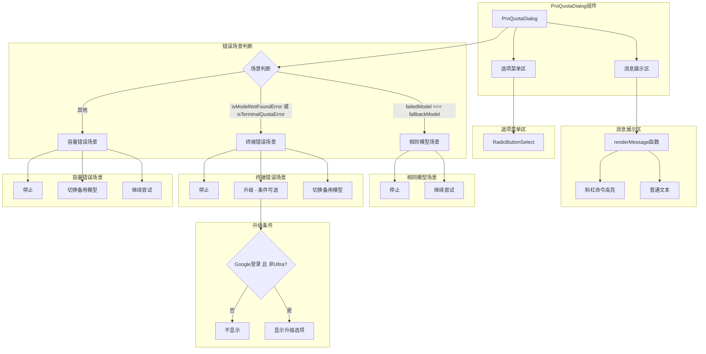

# ProQuotaDialog.tsx

## 概述

`ProQuotaDialog.tsx` 是 Gemini CLI 的 Pro 配额限制对话框组件。当用户在使用过程中遇到模型配额限制、容量错误或模型未找到错误时，该组件会展示错误信息并提供多种处理选项。组件根据三种不同的错误场景（相同模型回退、终端配额/模型未找到错误、容量错误）动态构建不同的选项菜单。对于通过 Google 登录且非 Ultra 层级的用户，还会提供升级选项。组件内置了斜杠命令（`/command`）的语法高亮渲染功能。

## 架构图（Mermaid）

## 核心组件

### 1. ProQuotaDialogProps（接口）

| 属性 | 类型 | 必填 | 说明 |
|------|------|------|------|
| `failedModel` | `string` | 是 | 触发错误的模型名称 |
| `fallbackModel` | `string` | 是 | 可切换的备用模型名称 |
| `message` | `string` | 是 | 要展示的错误/提示消息 |
| `isTerminalQuotaError` | `boolean` | 是 | 是否为终端配额错误（不可恢复的配额耗尽） |
| `isModelNotFoundError` | `boolean` | 否 | 是否为模型未找到错误 |
| `authType` | `AuthType` | 否 | 用户的认证类型（Google 登录、API Key 等） |
| `tierName` | `string` | 否 | 用户所在的订阅层级名称 |
| `onChoice` | `(choice: 'retry_later' \| 'retry_once' \| 'retry_always' \| 'upgrade') => void` | 是 | 用户做出选择后的回调函数 |

### 2. 选择值含义

| 值 | 含义 |
|----|------|
| `'retry_once'` | 继续尝试当前模型（单次重试） |
| `'retry_always'` | 切换到备用模型（持续使用） |
| `'retry_later'` | 停止/中止当前请求 |
| `'upgrade'` | 引导用户升级订阅以获取更高配额 |

### 3. ProQuotaDialog（主组件）

函数式 React 组件，根据错误场景渲染不同的配额限制对话框。

**三种错误场景及对应菜单：**

#### 场景一：相同模型回退（`failedModel === fallbackModel`）
当失败模型和备用模型相同时，无法提供切换选项：
- **继续尝试**（`retry_once`）
- **停止**（`retry_later`）

#### 场景二：终端配额错误 / 模型未找到（`isModelNotFoundError || isTerminalQuotaError`）
不可恢复的错误，不提供"继续尝试"选项：
- **切换到 {fallbackModel}**（`retry_always`）
- **升级以获取更高限额**（`upgrade`）-- 仅当 `authType === AuthType.LOGIN_WITH_GOOGLE` 且非 Ultra 层级时显示
- **停止**（`retry_later`）

#### 场景三：容量错误（默认场景）
临时性错误，提供所有基础选项：
- **继续尝试**（`retry_once`）
- **切换到 {fallbackModel}**（`retry_always`）
- **停止**（`retry_later`）

### 4. renderMessage（辅助函数）

消息渲染函数，实现斜杠命令的语法高亮：
- 将消息文本按空白字符分割为 token 数组
- 遍历每个 token，检查是否以 `/` 开头
- 以 `/` 开头的 token 使用 `theme.text.accent` 颜色和加粗样式渲染
- 其他 token 以普通样式渲染
- 返回包含所有 token 的 `<Text>` 组件

**渲染结构：**

1. **圆角边框容器**（`borderStyle="round" padding={1}`）
   - **消息展示区**（`marginBottom={1}`）：通过 `renderMessage` 渲染带高亮的消息
   - **选项菜单区**（`marginTop={1} marginBottom={1}`）：`RadioButtonSelect` 选项列表

## 依赖关系

### 内部依赖

| 模块路径 | 导入内容 | 用途 |
|----------|----------|------|
| `./shared/RadioButtonSelect.js` | `RadioButtonSelect` | 单选按钮选择列表组件 |
| `../semantic-colors.js` | `theme` | 主题色配置 |
| `@google/gemini-cli-core` | `AuthType` | 认证类型枚举 |
| `../../utils/tierUtils.js` | `isUltraTier` | 判断是否为 Ultra 订阅层级 |

### 外部依赖

| 包名 | 导入内容 | 用途 |
|------|----------|------|
| `react` | `React`（类型导入） | JSX 类型定义 |
| `ink` | `Box, Text` | 终端 UI 渲染框架 |

## 关键实现细节

1. **三层条件分支策略**：组件使用 `if-else if-else` 三层分支来决定菜单项组合。优先级为：
   - 最高：相同模型检查（`failedModel === fallbackModel`），此时切换模型无意义
   - 其次：终端错误检查（`isModelNotFoundError || isTerminalQuotaError`），不可恢复的错误不提供重试
   - 最低：默认作为容量错误处理，提供最完整的选项

2. **升级选项的条件显示**：升级选项仅在满足以下两个条件时显示：
   - `authType === AuthType.LOGIN_WITH_GOOGLE`：用户通过 Google 账号登录（API Key 用户无法通过此途径升级）
   - `!isUltraTier(tierName)`：用户不在 Ultra 层级（已是最高级别则无需升级）
   使用展开运算符 `...` 和条件数组实现动态插入。

3. **`as const` 类型断言**：每个选项的 `value` 使用 `as const` 断言为字面量类型（如 `'retry_once' as const`），确保 TypeScript 能正确推断出联合字符串类型而非宽泛的 `string` 类型。

4. **斜杠命令高亮实现**：`renderMessage` 函数通过正则 `/(\s+)/` 按空白字符分割文本。使用捕获组确保分隔符（空白）也被保留在结果数组中，保证渲染后的文本间距与原始消息一致。然后对每个 part 检查是否以 `/` 开头来判定为斜杠命令。

5. **简单的事件委托**：`handleSelect` 函数直接将选择值传递给 `onChoice` 回调，没有额外的逻辑处理。这使得所有的业务逻辑（如实际的模型切换、重试、升级跳转）都由父组件处理，保持了该组件的纯展示职责。

6. **没有 Esc 键处理**：与其他对话框组件（如 `OverageMenuDialog`、`PolicyUpdateDialog`）不同，此组件没有注册 Esc 键退出的处理逻辑。用户必须从提供的选项中做出选择才能关闭对话框，这可能是因为配额限制必须被明确处理，不允许简单地忽略。
