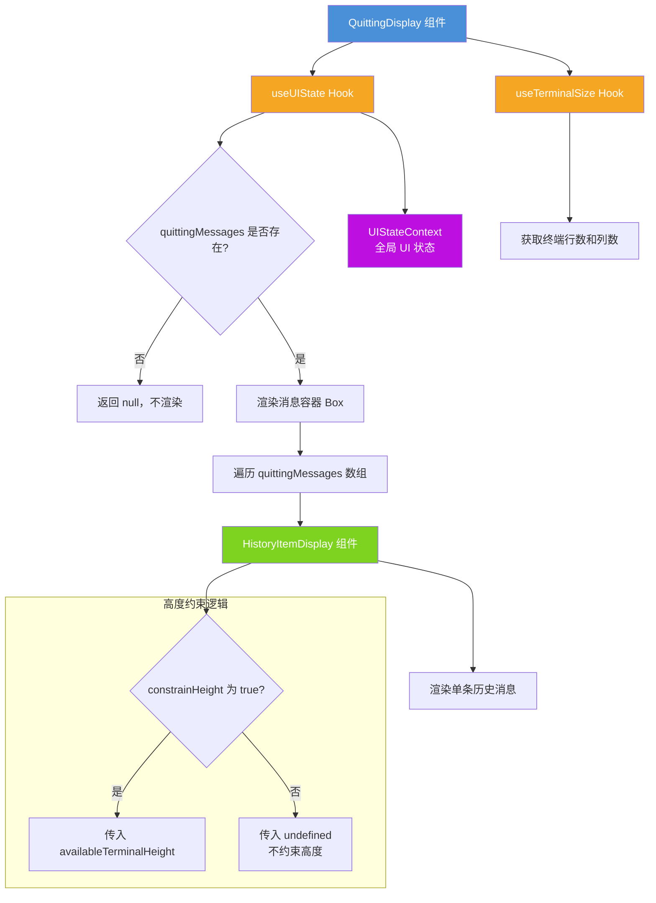

# QuittingDisplay.tsx

## 概述

`QuittingDisplay` 是一个 React (Ink) 组件，用于在用户退出 CLI 应用时展示退出相关的消息内容。当用户触发退出操作时，应用可能需要显示一些最终的历史消息或告别信息，此组件负责渲染这些"退出消息"。

该组件的核心行为：
- 从全局 UI 状态上下文中读取 `quittingMessages`（退出消息列表）
- 如果没有退出消息，则不渲染任何内容
- 将每条退出消息通过 `HistoryItemDisplay` 组件逐一渲染
- 根据终端尺寸和 UI 配置决定是否约束显示高度

## 架构图（Mermaid）

## 核心组件

### QuittingDisplay 组件

**类型**: React 函数组件 (`FC`)

**入参**: 无 Props（所有数据从 Context 和 Hook 获取）

**内部状态获取**:

| 来源 | 变量 | 说明 |
|------|------|------|
| `useUIState()` | `uiState` | 全局 UI 状态对象，包含 `quittingMessages` 和 `constrainHeight` |
| `useTerminalSize()` | `rows` (别名 `terminalHeight`) | 终端窗口的行数 |
| `useTerminalSize()` | `columns` (别名 `terminalWidth`) | 终端窗口的列数 |

**渲染逻辑**:

1. **空消息守卫**: 如果 `uiState.quittingMessages` 为 falsy（`null`、`undefined` 或空），直接返回 `null`。

2. **容器布局**: 使用 `<Box flexDirection="column" marginBottom={1}>` 作为纵向排列容器，底部留一行间距。

3. **消息列表渲染**: 遍历 `quittingMessages` 数组，为每条消息创建一个 `HistoryItemDisplay` 组件实例，传入以下 Props:
   - `key`: 使用消息项的 `item.id` 作为唯一标识
   - `availableTerminalHeight`: 当 `constrainHeight` 为 `true` 时传入终端高度，否则传入 `undefined`
   - `terminalWidth`: 终端宽度
   - `item`: 消息数据对象
   - `isPending`: 固定为 `false`，表示退出消息不处于"等待中"状态

## 依赖关系

### 内部依赖

| 模块路径 | 导入项 | 用途 |
|----------|--------|------|
| `../contexts/UIStateContext.js` | `useUIState` | React Context Hook，用于获取全局 UI 状态（包括退出消息列表和高度约束配置） |
| `./HistoryItemDisplay.js` | `HistoryItemDisplay` | 历史消息展示组件，负责渲染单条消息的完整内容（支持多种消息类型） |
| `../hooks/useTerminalSize.js` | `useTerminalSize` | 自定义 Hook，用于获取当前终端窗口的行数和列数 |

### 外部依赖

| 依赖包 | 导入项 | 用途 |
|--------|--------|------|
| `ink` | `Box` | Ink 框架的布局容器组件，提供 Flexbox 布局能力 |

## 关键实现细节

1. **退出消息机制**: `quittingMessages` 是从 `UIStateContext` 中获取的一个消息数组。当用户执行退出操作（如按 `Ctrl+C` 或输入退出命令）时，应用会将需要在退出前展示的消息存入此字段。这些消息可能包括 AI 的最后一次回复、会话摘要等。

2. **高度约束的条件传递**: 组件通过 `uiState.constrainHeight` 判断是否需要限制内容高度。当约束开启时，`availableTerminalHeight` 被传递给子组件以控制内容不超出终端可视区域；当约束关闭时传入 `undefined`，允许内容自由扩展。这个设计确保在退出场景下，用户可以看到完整的退出信息。

3. **`availableTerminalHeight` 的赋值**: 代码中 `const availableTerminalHeight = terminalHeight;` 直接将终端高度赋值给可用高度，未做任何减法操作。这是因为在退出显示模式下，不需要为输入框、状态栏等 UI 元素预留空间——退出时这些元素不再显示。

4. **`isPending` 固定为 `false`**: 所有退出消息的 `isPending` 属性都设为 `false`，这意味着退出消息都是已完成的、确定性的内容，不存在"正在生成中"的流式状态。

5. **Key 策略**: 使用 `item.id` 作为 React key，比使用数组索引更稳定可靠，确保在消息列表变化时 React 能正确执行 DOM diff。
