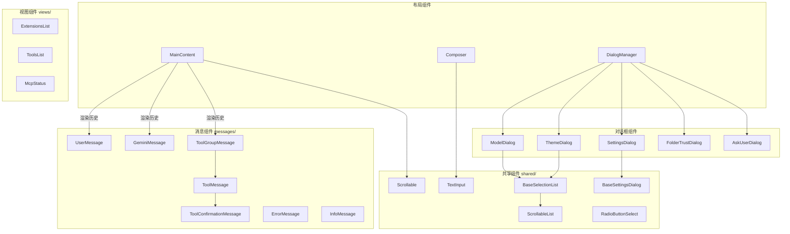

# components

## 概述

`components` 目录包含 Gemini CLI 终端界面的所有 React 组件。组件按职责分为顶层组件（直接放在 components/ 下）和子目录组件（按功能分组）。顶层组件主要负责页面布局、对话框、输入控件等，子目录组件分别负责消息渲染、共享 UI 原语、视图展示、会话浏览等。

## 目录结构

```
components/
├── messages/            # 消息渲染组件（用户消息、Gemini 回复、工具调用等）
├── shared/              # 共享 UI 原语（选择列表、滚动容器、文本输入等）
├── views/               # 视图组件（扩展列表、MCP 状态、工具列表等）
├── triage/              # 问题分类组件（Issue 查重）
├── SessionBrowser/      # 会话浏览器组件
│
├── MainContent.tsx      # 主内容区域，渲染历史消息列表
├── Composer.tsx         # 输入编辑器组件（提示符 + 文本输入 + 补全）
├── DialogManager.tsx    # 对话框管理器，根据状态显示对应对话框
├── InputPrompt.tsx      # 输入提示符组件
│
├── Header.tsx           # 头部标题栏
├── AppHeader.tsx        # 应用头部（Logo + 状态信息）
├── Footer.tsx           # 底部状态栏
├── Banner.tsx           # 横幅通知
├── Notifications.tsx    # 通知组件集合
│
├── AboutBox.tsx         # 关于信息对话框
├── Help.tsx             # 帮助信息组件
├── ModelDialog.tsx      # 模型选择对话框
├── ThemeDialog.tsx      # 主题选择对话框
├── SettingsDialog.tsx   # 设置对话框
├── EditorSettingsDialog.tsx  # 编辑器设置对话框
│
├── FolderTrustDialog.tsx    # 文件夹信任对话框
├── ConsentPrompt.tsx        # 同意提示
├── PermissionsModifyTrustDialog.tsx  # 权限修改信任对话框
├── LoopDetectionConfirmation.tsx     # 循环检测确认
│
├── CliSpinner.tsx       # CLI 加载旋转器
├── GeminiSpinner.tsx    # Gemini 品牌旋转器
├── GeminiRespondingSpinner.tsx  # Gemini 响应中旋转器
├── LoadingIndicator.tsx # 加载指示器
│
├── Checklist.tsx        # 清单组件
├── ChecklistItem.tsx    # 清单项组件
├── ColorsDisplay.tsx    # 颜色展示组件
├── ContextUsageDisplay.tsx  # 上下文使用量展示
├── ContextSummaryDisplay.tsx # 上下文摘要展示
├── MemoryUsageDisplay.tsx   # 内存使用量展示
├── ModelStatsDisplay.tsx    # 模型统计展示
│
├── ExitWarning.tsx      # 退出警告
├── CopyModeWarning.tsx  # 复制模式警告
├── QuittingDisplay.tsx  # 退出中显示
├── AlternateBufferQuittingDisplay.tsx  # 备用缓冲区退出显示
│
├── HooksDialog.tsx      # Hooks 配置对话框
├── HookStatusDisplay.tsx # Hook 状态展示
├── BackgroundShellDisplay.tsx  # 后台 Shell 展示
├── AsciiArt.ts          # ASCII 艺术字
└── ... (其他 30+ 组件)
```

## 架构图



## 核心组件

### 布局核心

| 组件 | 职责 |
|------|------|
| `MainContent` | 主内容区域，包含可滚动的历史消息列表和头部信息 |
| `Composer` | 输入编辑器，集成文本输入、@补全、斜杠命令补全、Shell 补全 |
| `DialogManager` | 对话框协调器，根据 UIState 中的标志位显示对应的对话框 |
| `InputPrompt` | 输入提示符渲染（显示 `>` 或 Shell 标记 `!` 或计划模式标记） |

### 对话框系列

| 组件 | 职责 |
|------|------|
| `ModelDialog` | 模型切换选择 |
| `ThemeDialog` | 主题浏览和选择 |
| `SettingsDialog` | 全局设置调整 |
| `EditorSettingsDialog` | 外部编辑器配置 |
| `FolderTrustDialog` | 文件夹信任授权 |
| `AskUserDialog` | AI 向用户提问的对话框 |
| `ConsentPrompt` | 扩展同意提示 |
| `EmptyWalletDialog` | 余额不足提示 |

### 信息展示

| 组件 | 职责 |
|------|------|
| `AboutBox` | 显示版本、系统、认证等信息 |
| `Help` | 显示快捷键帮助 |
| `ContextUsageDisplay` | 显示上下文 token 使用进度条 |
| `ModelStatsDisplay` | 显示模型 API 调用统计 |
| `LoadingIndicator` | 显示带动画的加载指示 |

## 依赖关系

### 内部依赖
- `../contexts/`: UIStateContext、UIActionsContext、ConfigContext 等
- `../hooks/`: useKeypress、useAlternateBuffer、useFocus 等
- `../utils/`: MarkdownDisplay、CodeColorizer、borderStyles 等
- `../themes/`: 主题颜色
- `../key/`: 键盘绑定匹配

### 外部依赖
- `ink`: Box、Text 等终端渲染原语
- `react`: 组件框架

## 数据流

### 消息渲染流程
1. `AppContainer` 通过 `useHistory` hook 管理 `HistoryItem[]` 列表
2. `UIStateContext` 将历史记录暴露给组件树
3. `MainContent` 组件消费历史记录，遍历渲染
4. 根据 `HistoryItem.type` 分派到对应的消息组件（UserMessage、GeminiMessage 等）
5. 工具调用以 `ToolGroupMessage` 分组渲染，内含多个 `ToolMessage`

### 对话框管理流程
1. `AppContainer` 通过状态标志（如 `isModelDialogOpen`）控制对话框显隐
2. `DialogManager` 读取 UIState，按优先级渲染第一个激活的对话框
3. 对话框通过 `UIActions` 回调通知 `AppContainer` 用户选择结果
4. `AppContainer` 更新状态并关闭对话框
